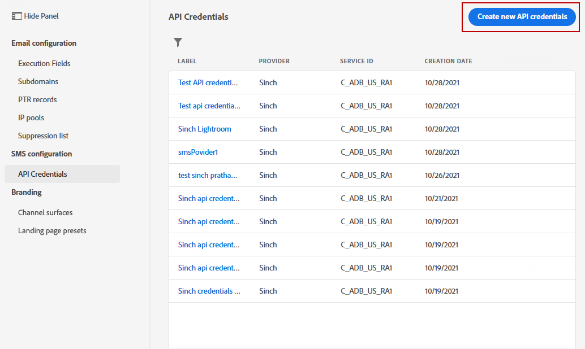
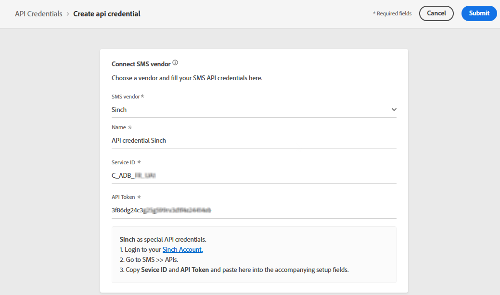

# Konfigurera SMS-kanal {#sms-configuration}

[!DNL Journey Optimizer] kan ni skapa resor och skicka meddelanden till riktade målgrupper.

Konfigurera instansen innan du skickar SMS. Du måste [integrera providerinställningarna](#create-api) med Journey Optimizer och [skapa en SMS-yta](#message-preset-sms) (t.ex. SMS-förinställning). Dessa steg måste utföras av en [Adobe Journey Optimizer systemadministratör](../start/path/administrator.md).

>[!IMPORTANT]
>
>Adobe Journey Optimizer är för närvarande integrerat med tredjepartsleverantörer som Sinch och Twilio, som erbjuder SMS-tjänster oberoende av Adobe Journey Optimizer.  Innan du konfigurerar SMS måste du skapa ett konto hos någon av dessa SMS-leverantörer för att ta emot API-token och tjänst-ID, vilket gör att du kan upprätta en anslutning mellan Adobe Journey Optimizer och den tillämpliga SMS-providern. Din användning av SMS-tjänster regleras av ytterligare villkor från den gällande SMS-leverantören. Eftersom Sinch och Twilio är tredjepartsprodukter som är tillgängliga för Adobe Journey Optimizer-användare via en integrering måste användare av Sinch eller Twilio kontakta den tillämpliga SMS-leverantören för att få hjälp med eventuella problem eller frågor som rör SMS-tjänsterna. Adobe kontrollerar inte och ansvarar inte för tredjepartsprodukter.

## Skapa nya API-autentiseringsuppgifter {#create-api}

>[!CONTEXTUALHELP]
>id="ajo_admin_sms_api_header"
>title="Konfigurera SMS-leverantören med Journey Optimizer"
>abstract="Välj leverantör och fyll i dina SMS API-autentiseringsuppgifter."

>[!CONTEXTUALHELP]
>id="ajo_admin_sms_api"
>title="Konfigurera SMS-leverantören med Journey Optimizer"
>abstract="Välj leverantör och fyll i dina SMS API-autentiseringsuppgifter."

<!--New contextual help content for September release: >abstract="Before sending SMS, you must integrate the provider settings with Journey Optimizer. Once done, you will need to create an SMS surface. These steps must be performed by an Adobe Journey Optimizer system administrator."
>additional-url="https://experienceleague.adobe.com/docs/journey-optimizer/using/configuration/configuration-message/sms-configuration.html#message-preset-sms" text="Create an SMS channel surface"-->

>[!CONTEXTUALHELP]
>id="ajo_admin_sms_configuration"
>title="Välj SMS-leverantörskonfiguration"
>abstract="Välj API-autentiseringsuppgifter som konfigurerats för din SMS-leverantör."

Så här konfigurerar du din SMS-leverantör med Journey Optimizer:

1. Öppna **[!UICONTROL Administration]** > **[!UICONTROL Channels]** > **[!UICONTROL API Credentials]** menyn och klicka sedan på **[!UICONTROL Create API credential]**.

   

1. Välj **[!UICONTROL SMS vendor]**:

   * [!DNL Sinch]. För att hitta **[!UICONTROL Service ID]** och **[!UICONTROL API Token]**&#x200B;öppnar du SMS > API:er-menyn från ditt Sinch-konto.
   * [!DNL Twilio]. För att hitta **[!UICONTROL Service ID]** och **[!UICONTROL API Token]**&#x200B;öppnar du panelen Kontoinformation på sidan Konsolinstrumentpanel.

1. Ange **[!UICONTROL Name]** för dina API-autentiseringsuppgifter.

1. Ange **[!UICONTROL Service ID]** och **[!UICONTROL API Token]**.

   

1. Klicka **[!UICONTROL Submit]** när du är klar med konfigurationen av dina API-autentiseringsuppgifter.

När du har skapat och konfigurerat API-autentiseringsuppgifterna måste du nu skapa en kanalyta (t.ex. meddelandeförinställning) för SMS-meddelanden.

## Skapa en kanalyta för SMS-meddelanden {#message-preset-sms}

>[!CONTEXTUALHELP]
>id="ajo_admin_surface_sms_type"
>title="Definiera SMS-kategorin"
>abstract="Välj den typ av SMS-meddelanden som ska skickas när den här ytan används: Marknadsföring för SMS-kampanjmeddelanden, som kräver användarens samtycke, eller Transactional för icke-kommersiella SMS-meddelanden, som också kan skickas till avabonnerade profiler i specifika sammanhang."
>additional-url="https://experienceleague.adobe.com/docs/journey-optimizer/using/messages/create-sms.html#sms-opt-in-out" text="Avanmäl dig i SMS-marknadsföringsmeddelanden"

När SMS-kanalen har konfigurerats måste du skapa en kanalyta för att kunna skicka SMS-meddelanden från **[!DNL Journey Optimizer]**.

Så här skapar du en kanalyta:

1. Öppna **[!UICONTROL Channels]** > **[!UICONTROL Branding]** > **[!UICONTROL Channel surfaces]** menyn och klicka sedan på **[!UICONTROL Create channel surface]**.

   

1. Ange ett namn och en beskrivning (valfritt) för ytan och välj sedan SMS-kanalen.

   

   >[!NOTE]
   >
   > Namn måste börja med en bokstav (A-Z). Det får bara innehålla alfanumeriska tecken. Du kan också använda understreck `_`, punkt`.` och bindestreck `-` tecken.

1. Konfigurera **SMS** inställningar.

   

   * Välj **[!UICONTROL SMS Type]** som ska skickas med ytan: **[!UICONTROL Transactional]** eller **[!UICONTROL Marketing]**.

   * Välj **[!UICONTROL SMS configuration]** för att associera med ytan.

      Mer information om hur du konfigurerar miljön för att skicka SMS-meddelanden finns i [det här avsnittet](#create-api).

   * Ange **[!UICONTROL Sender number]** &#x200B; som du vill använda för din kommunikation.

   * Välj **[!UICONTROL SMS Execution Field]** för att välja **[!UICONTROL Profile attribute]** som är kopplade till profilens telefonnummer.

1. När alla parametrar har konfigurerats klickar du på **[!UICONTROL Submit]** för att bekräfta. Du kan också spara kanalytan som ett utkast och återuppta konfigurationen senare.

   

1. När kanalytan har skapats visas den i listan med **[!UICONTROL Processing]** status.

   >[!NOTE]
   >
   >Om kontrollerna inte lyckas kan du läsa mer om orsakerna till eventuella fel i [det här avsnittet](#monitor-channel-surfaces).

1. När kontrollerna är klara får kanalytan **[!UICONTROL Active]** status. Den är klar att användas för att leverera meddelanden.

   

Du kan nu skicka SMS-meddelanden med Journey Optimizer.

**Relaterade ämnen**

* [Skapa ett SMS-meddelande](../messages/create-sms.md)
* [Lägg till ett meddelande i en resa](../building-journeys/journeys-message.md)
