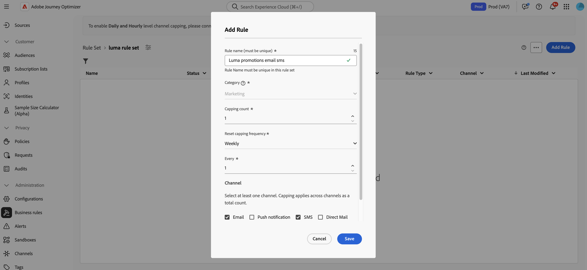

# Frekvensbegränsning per kanal och kommunikationstyp {#rule-sets}

**Kanal**-regeluppsättningar tillämpar regler för appning på kommunikationskanaler. Skicka till exempel inte mer än 1 e-post eller SMS-kommunikation per dag.

Genom att utnyttja kanalregeluppsättningar kan ni ange frekvensbegränsning efter kommunikationstyp för att förhindra att kunder med liknande meddelanden överbelastas. Du kan till exempel skapa en regeluppsättning som begränsar antalet **kampanjmeddelanden** som skickas till dina kunder och en annan regeluppsättning som begränsar antalet **nyhetsbrev** som skickas till dem. Beroende på vilken typ av kampanj du skapar kan du sedan välja att använda antingen kampanjkommunikationen eller regeluppsättningen för nyhetsbrev.

>[!IMPORTANT]
>
>Se till att du väljer namnutrymmet med högst prioritet när du skapar en kampanj eller resa, så att du kan vara säker på att kanalnivåappningen fungerar som den ska. Läs mer om namnområdesprioritet i [Handboken för Platform Identity Service](https://experienceleague.adobe.com/en/docs/experience-platform/identity/features/identity-graph-linking-rules/namespace-priority){target="_blank"}

## Skapa en regel för kanalbegränsning

>[!CONTEXTUALHELP]
>id="ajo_rule_sets_channel"
>title="Definiera de kanaler som regeln gäller för"
>abstract="Välj minst en kanal. Taket tillämpas över alla kanaler som ett totalt antal."

Så här skapar du en kanalregeluppsättning:

>[!NOTE]
>
>Du kan skapa upp till 10 aktiva lokala regeluppsättningar för varje kanaldomän och för resedomänen.

1. Öppna listan **[!UICONTROL Rules sets]** och klicka sedan på **[!UICONTROL Create rule set]**.

   

1. Välj den regeluppsättning där du vill lägga till begränsningsregeln eller skapa en ny regeluppsättning:

   * Om du vill använda en befintlig regeluppsättning markerar du den i listan. Regler för kanalbegränsning kan bara läggas till i regeluppsättningar med domänen &quot;channel&quot;. Du kan kontrollera den här informationen i regeluppsättningslistorna i kolumnen **[!UICONTROL Domain]**.

     

   * Om du vill skapa begränsningsregeln i en ny regeluppsättning klickar du på **[!UICONTROL Create rule set]**, anger ett unikt namn för regeluppsättningen och väljer Kanal i listrutan **[!UICONTROL Rule Set Domain]** och klickar sedan på **[!UICONTROL Save]**.

     

1. Klicka på knappen **[!UICONTROL Add Rule]** på skärmen för regeluppsättningen och definiera ett unikt namn för regeln.

1. Fältet **Kategori** anger vilken meddelandekategori regeln gäller för. För tillfället är det här fältet skrivskyddat eftersom endast kategorin **[!UICONTROL Marketing]** är tillgänglig.

   

1. I fältet **[!UICONTROL Capping count]** anger du begränsningen för din regel, vilket innebär det maximala antalet meddelanden som kan skickas till en enskild användarprofil varje månad, vecka eller dag eller timme enligt ditt val i följande fält.

1. I listrutan **[!UICONTROL Reset capping frequency]** väljer du om du vill att appningen ska användas varje timme, dag, vecka eller månad. Frekvensgränsen baseras på den valda kalenderperioden. Den återställs i början av motsvarande tidsram.

   Räknaren för varje period har följande förfallodatum:

   * **[!UICONTROL Hourly]** - Frekvensgränsen är giltig för det valda antalet timmar. Räknaren återställs automatiskt i början av varje tidsfönster. För en timmes frekvensbegränsning återställs den varje timme, vilket sammanfaller med slutet av en UTC-timme.
   * **[!UICONTROL Daily]** - Den dagliga frekvensen är giltig för dagen till 23:59:59 UTC och återställs till 0 i början av nästa dag.
   * **[!UICONTROL Weekly]** - Frekvensbegränsningen gäller till lördag 23:59:59 UTC den veckan. Utgångsdatumet gäller oavsett när regeln skapades. Om regeln till exempel skapas på torsdag gäller den till lördag den 23:59:59.
   * **[!UICONTROL Monthly]** - Frekvensbegränsningen gäller till den sista dagen i månaden vid 23:59:59 UTC. Månadsförfallodatumet för januari är till exempel 01-31 23:59:59 UTC.

   >[!IMPORTANT]
   >
   >* För att vara säker på att du väljer det namnutrymme som har högst prioritet när du skapar en kampanj eller resa. Läs mer om namnområdesprioritet i handboken [Platform Identity Service](https://experienceleague.adobe.com/en/docs/experience-platform/identity/features/identity-graph-linking-rules/namespace-priority){target="_blank"} 
   >
   >* Profilräknarens värde uppdateras när kommunikationen har levererats. Tänk på det här när du skickar stora mängder kommunikation eftersom dataflödet kan resultera i att mottagaren får e-postminuterna eller till och med timmar efter att kommunikationen har startats (om du skickar miljontals meddelanden samtidigt). Detta gäller om en mottagare får två kommunikationer nära ihop. Vi föreslår att kommunikationen ska hållas isär med minst två timmar om det är möjligt, så att mottagaren får tillräckligt med tid för att kunna ta emot kommunikationen och räkningsvärdet för att kunna uppdatera den.

1. I fältet **[!UICONTROL Every]** kan du upprepa reglerna för frekvensbegränsning för flera timmar, dagar, veckor eller månader, beroende på den angivna varaktigheten. Exempel: använd regeln för frekvensbegränsning i 2 veckor.

   Se till att du anger ett värde som matchar den valda varaktighetstypen: 1-23 för timme, 1-30 för dag, 1-4 för vecka och 1-3 för månad.

   Räknaren återställs automatiskt till 0 när ett nytt tidsfönster börjar. För en 2 dagars frekvensbegränsning sker denna återställning varannan dag vid midnatt UTC.

1. Markera kanalen som du vill använda för den här regeln: **[!UICONTROL Email]**, **[!UICONTROL SMS]**, **[!UICONTROL Push notification]** eller **[!UICONTROL Direct mail]**.

1. Markera flera kanaler om du vill tillämpa begränsning för alla markerade kanaler som ett totalt antal.

   Ange till exempel 5 som capping och markera både e-postkanalen och sms-kanalen. Om en profil redan har fått 3 marknadsföringsmeddelanden och 2 marknadsföringsmeddelanden för den valda perioden, kommer profilen att uteslutas från nästa leverans av marknadsföringsmeddelanden eller sms.

1. Klicka på **[!UICONTROL Save]** för att bekräfta att regeln har skapats. Meddelandet läggs till i regeluppsättningen med statusen **[!UICONTROL Draft]**.

   

1. Upprepa stegen ovan om du vill lägga till så många regler som behövs i regeluppsättningen.

1. När begränsningsregeln är klar att användas för meddelanden aktiverar du regeluppsättningen och regeln där den har lagts till. [Lär dig aktivera regeluppsättningar](../conflict-prioritization/rule-sets.md#Create)

## Använda regeluppsättningar i ett meddelande {#apply-frequency-rule}

Så här använder du en regeluppsättning i ett meddelande:

1. När du skapar en resa eller ett kampanjmeddelande väljer du en av de kanaler som du har definierat för din regeluppsättning och redigerar innehållet i meddelandet

1. Klicka på knappen **[!UICONTROL Add Business Rule]** på skärmen för innehållsutgåva.

1. Markera den regeluppsättning som du skapade.

   

   >[!NOTE]
   >
   >Endast [aktiverade](#activate-rule) regeluppsättningar visas i listan.

   <!--Messages where the category selected is **[!UICONTROL Transactional]** will not be evaluated against business rules.-->

1. Innan du aktiverar din resa eller kampanj måste du schemalägga körningen minst 10 minuter framåt.

   Detta ger tillräckligt med tid för att fylla i räknarvärdena för profilen för affärsregeln som du har valt. Om du aktiverar kampanjen direkt fylls inte regeluppsättningens räknarvärden i mottagarnas profiler och meddelandet räknas inte mot deras regler för frekvensbegränsning för anpassade regeluppsättningar. Dessutom fungerar inte begränsningen korrekt för resor och kampanjer som aktiveras omedelbart och API-utlösta kampanjer.

   

1. Du kan visa antalet profiler som har uteslutits från leverans i [Customer Journey Analytics-rapporten](../reports/report-gs-cja.md) och i [Live-rapporten](../reports/live-report.md), där frekvensreglerna listas som en möjlig orsak för användare som har uteslutits från leverans.

>[!NOTE]
>
>Flera regler kan gälla för samma kanal, men när den nedre gränsen har nåtts utesluts profilen från nästa leverans.

När du testar frekvensregler rekommenderar vi att du använder en ny [testprofil](../audience/creating-test-profiles.md) eftersom det inte finns något sätt att återställa räknaren förrän nästa period när en profils frekvensgräns har nåtts. Om du inaktiverar en regel kan mappade profiler ta emot meddelanden, men inga räknarsteg tas bort eller tas bort.

>[!CAUTION]
>
>Regler för frekvensbegränsning gäller också när [korrektur](../content-management/proofs.md) skickas. Om en testprofil redan har nått gränsvärdet för frekvens visas korrektur som färdigt, men inget e-postmeddelande skickas.

<!--add a new section for default priority namespace.-->

<!--
## Example: combine several rules {#frequency-rule-example}

You can combine several message frequency rules, such as described in the example below.

1. [Create a rule](#create-new-rule) called *Overall Marketing Capping*:

   * Select all channels.
   * Set capping to 12 monthly.

   

1. To further restrict the number of marketing-based push notifications that a user is sent, create a second rule called *Push Marketing Cap*:

   * Select Push channel.
   * Set capping to 4 monthly.

   

1. Save and [activate](#activate-rule) the rule.

1. [Create a message](../building-journeys/journeys-message.md) for every channel you want to communicate through and select the **[!UICONTROL Marketing]** category for each message. [Learn how to apply a frequency rule](#apply-frequency-rule)

   

In this scenario, an individual profile:
* can receive up to 12 marketing messages per month;
* but will be excluded from marketing push notifications after they have received 4 push notifications.-->

## Instruktionsvideo {#video}

>[!VIDEO](https://video.tv.adobe.com/v/3435531?quality=12)
