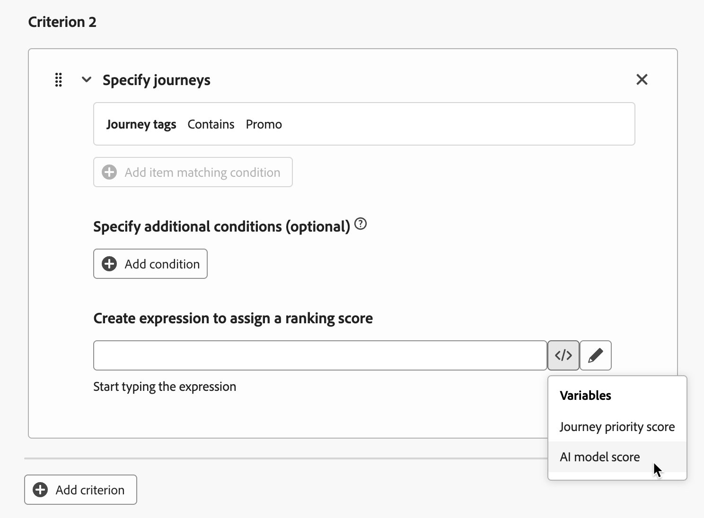

# Använd AI-modeller för att rangordna resor {#journey-ai-models}

>[!AVAILABILITY]
>
>Den här funktionen är för närvarande begränsad. Kontakta din Adobe-representant för att få åtkomst.

[!DNL Adobe Journey Optimizer] hjälper dig att kontrollera vilka resor en profil kan registrera när de kvalificerar sig för mer än vad systemet tillåter. Om du vill göra det kan du använda [regeluppsättningar](rule-sets.md) för att definiera ändpunkter för resepost eller samtidighet. När en profil är berättigad till fler resor än vad som är tillåtet enligt begränsningen, avgör prioriteringen för varje resa vilka resor som väljs.

I stället för att använda prioritet kan du använda **AI-modeller** i dina rankningsformler för att dynamiskt rangordna resor baserat på tränade modellpoäng.

## Skapa en AI-modell {#create-ai-model}

<!--Do you need specific permissions to create AI models?
>[!CAUTION]
>
>To create, edit, or delete AI models, you must have the **Manage Ranking Strategies** permission. [Learn more](../administration/high-low-permissions.md#manage-ranking-strategies)-->

Följ stegen nedan för att skapa en AI-modell för rankning av resor.

1. Skapa en datauppsättning där konverteringshändelser samlas in. [Lär dig hur](../experience-decisioning/data-collection/create-dataset.md)

1. Gå till avsnittet **[!UICONTROL Orchestration ranking]** och välj sedan fliken **[!UICONTROL AI models]**. Listan med tidigare skapade AI-modeller visas.

1. Klicka på **[!UICONTROL Create AI model]**.

1. Ange ett unikt namn och, om det behövs, en beskrivning av AI-modellen.

   {width="85%"}

   >[!NOTE]
   >
   >Rankningsobjektet är den enhet som rankningsformeln gäller för. Som standard är rankningsobjektet inställt på **[!UICONTROL Journey]**.

<!--
1. Select the type of AI model you want to create:

    * **[!UICONTROL Auto-optimization]** optimizes based on past performance. [Learn more](../experience-decisioning/ranking/auto-optimization-model.md)
    * **[!UICONTROL Personalized optimization]** optimizes and personalizes based on audiences and performance. [Learn more](../experience-decisioning/ranking/personalized-optimization-model.md)-->

1. I avsnittet **[!UICONTROL Optimization metric]** visas alla mätvärden från din standarddatavy [!DNL Customer Journey Analytics] [&#128279;](https://experienceleague.adobe.com/sv/docs/analytics-platform/using/cja-dataviews/data-views){target="_blank"} i listan. Välj det mätvärde som du vill optimera modellen på.

   {width="70%"}

   [!DNL Journey Optimizer] rangordnas baserat på **konverteringsgrad** (konverteringsgrad = totalt antal konverteringshändelser/totalt antal inställningshändelser). Konverteringsgraden beräknas med hjälp av:

   * **Impression-händelser** (objekt som visas)
   * **Konverteringshändelser** (objekt som resulterar i klick eller konverteringar)

   Dessa händelser spelas in automatiskt med Web SDK eller Mobile SDK. Läs mer i översikten för [Adobe Experience Platform Web SDK](https://experienceleague.adobe.com/docs/experience-platform/edge/home.html?lang=sv-SE).

1. Välj den eller de datauppsättningar där konverterings- och inställningshändelser samlas in. Lär dig hur du skapar sådana datauppsättningar i [det här avsnittet](../experience-decisioning/data-collection/create-dataset.md).

   {width="85%"}

   >[!CAUTION]
   >
   >Endast datauppsättningar som skapats från scheman som är kopplade till fältgruppen **[!UICONTROL Experience Event - Proposition Interactions]** visas i listrutan. Du kan välja upp till fem datauppsättningar.

1. &#x200B;<!--If you are creating a **[!UICONTROL Personalized optimization]** AI model, -->Välj det eller de segment som ska användas för att utbilda AI-modellen.

   >[!NOTE]
   >
   >Du kan välja upp till 50 målgrupper.

1. Spara och aktivera AI-modellen.

AI-modellen kan nu väljas när du skapar en rankningsformel.

## Referera till AI-modellen i en formel för att rangordna resor {#reference-ai-model}

Nu kan du ange AI-modellen som referens för att skapa en rankningsformel, sedan tilldela formeln till en regeluppsättning och tillämpa regeluppsättningen på dina resor. Följ stegen nedan för att göra det.

1. Skapa en rankningsformel. [Lär dig hur](journey-ranking-formulas.md#create-journey-ranking-formula)

1. Använd knappen **[!UICONTROL Select AI model]** för att välja den AI-modell som du vill använda i formeln.

   {width="80%"}

1. Definiera ett villkor i minst ett av **[!UICONTROL Criterion]**-avsnitten och välj **[!UICONTROL AI model score]** som rangordningsmetod. Om resan till exempel har taggen&quot;Promo&quot; är rankningspoängen AI-modellpoängen.

   {width="60%"}

1. Klicka på **[!UICONTROL Create]** för att slutföra din rankningsformel.

1. Skapa nu en regeluppsättning och välj den formel som du skapade som rankningsmetod. [Lär dig hur](journey-ranking-formulas.md#assign-formula-to-ruleset)

1. Skapa regler för capping för resan och spara regeluppsättningen.

1. Använd regeluppsättningen på de önskade resorna och spara dem. [Lär dig hur](journey-ranking-formulas.md#assign-rule-set-to-journey)

   >[!NOTE]
   >
   >Endast en regeluppsättning i taget kan användas på en resa.

Alla resor som använder den här regeluppsättningen rangordnas med formeln som refererar till den valda AI-modellen när maximumvärdet används.
