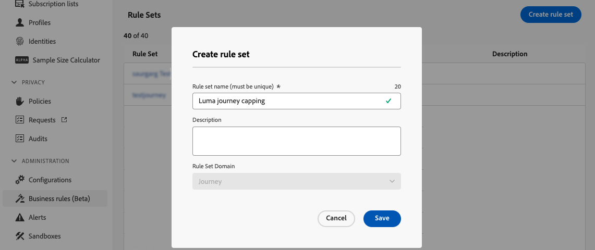

# Resebegränsning och skiljeförfarande {#journey-capping}

>[!AVAILABILITY]
>
>Konflikter och prioriteringsfunktioner är för närvarande tillgängliga i begränsad tillgänglighet för en viss kundgrupp. Observera att dessa funktioner gradvis kommer att lanseras för fler användare i framtiden. Kontakta ditt kontoteam om du vill bli tillagd i väntelistan för dessa funktioner.

Färttappning hjälper dig att begränsa antalet resor som en profil kan registreras på, vilket förhindrar att kommunikationen överbelastas. I Journey Optimizer kan du ange två typer av regler för begränsning:

* **Ankomstbegränsning** begränsar antalet reseposter under en viss period för en profil.
* **Samtidighetsbegränsning** begränsar hur många resor en profil kan registreras samtidigt.

Båda typerna av resefackning använder prioritetspoäng till godtyckliga poster.

>[!AVAILABILITY]
>
>Domänregeluppsättningarna **Resurs** är bara tillgängliga för en begränsad uppsättning användare (begränsad tillgänglighet). Kontakta din Adobe-representant för att få åtkomst.

➡️ [Upptäck den här funktionen i en video](#video)

## Skapa en regel för spärrning av resan {#create-rule}

>[!CONTEXTUALHELP]
>id="ajo_rule_set_concurrency_prioritization"
>title="Prioriteringstidens försprång"
>abstract=" Om en resa med högre prioritet schemaläggs inom den tidsperiod som anges här, kommer kunden inte att kunna delta i den här resan. För situationer där du vill att resor ska påbörjas, kan vi först och främst tjäna på att välja perioden för daglig look ahead och se till att prioriteringspoängen för andra resor den dagen är mindre än prioriteringspoängen för resan. Att ge 100 poäng för en resa är också en garanti för att den görs."

>[!CONTEXTUALHELP]
>id="ajo_rule_set_rule_type"
>title="Regeltyp"
>abstract="Ange typ av begränsning för regeln. **[!UICONTROL Journey Entry Cap]** begränsar antalet poster i resan under en viss period för en profil, medan **[!UICONTROL Journey Concurrency Cap]** begränsar hur många resor en profil kan registreras samtidigt."

Följ de här stegen för att skapa en regel för begränsning av kundresor:

1. Gå till menyn **[!UICONTROL Business rules]** för att komma åt lagret för regeluppsättningar.

1. Välj den regeluppsättning där du vill lägga till begränsningsregeln eller skapa en ny regeluppsättning:

   * Om du vill använda en befintlig regeluppsättning markerar du den i listan. Det går bara att lägga till regler för resefackning i regeluppsättningar med domänen&quot;resa&quot;. Du kan kontrollera den här informationen i regeluppsättningslistorna i kolumnen **[!UICONTROL Domain]**.

     

   * Om du vill skapa begränsningsregeln i en ny regeluppsättning klickar du på **[!UICONTROL Create rule set]**, anger ett unikt namn för regeluppsättningen och väljer&quot;Resa&quot; i listrutan **[!UICONTROL Rule Set Domain]** och klickar sedan på **[!UICONTROL Save]**.

     

1. Klicka på knappen **[!UICONTROL Add Rule]** på skärmen för regeluppsättningen och konfigurera regeln så att den passar dina behov:

   

   * Ange ett unikt namn för regeln.

   * Ange regelns typ av begränsning i listrutan **[!UICONTROL Rule Type]**.

      * **[!UICONTROL Journey Entry Cap]**: Begränsar antalet poster i resan under en viss period för en profil.
      * **[!UICONTROL Journey Concurrency Cap]**: Begränsar hur många resor en profil kan registreras samtidigt.

   * Expandera avsnitten nedan för att lära dig hur du konfigurerar olika typer av fästning:

     +++Konfigurera en regel för bockning av resepost

      1. I fältet **[!UICONTROL Capping]** anger du det maximala antalet resor som en profil kan ange.
      1. I fältet **[!UICONTROL Duration]** definierar du tidsperioden som ska beaktas. Observera att längden baseras på UTC-tidszonen. Till exempel återställs daglig ändpunkt vid midnatt UTC.

     >[!AVAILABILITY]
     >
     >Varaktigheten&quot;Daglig&quot; är endast tillgänglig för en uppsättning organisationer (begränsad tillgänglighet). Kontakta din Adobe-representant för att få åtkomst.

     I det här exemplet vill vi begränsa profiler från att ange fler än fem resor per månad.

     

     >[!NOTE]
     >
     >Systemet kommer att beakta prioriteringen av kommande schemalagda resor som har samma regel tillämpad på det.
     >
     >I det här exemplet, om marknadsföraren redan har gått in i fyra resor och det finns en annan schemalagd resa den här månaden med högre prioritet, kommer kunderna inte att kunna delta i den resa som har lägre prioritet.

+++

     +++Konfigurera en regel för samtidighetsbegränsning för resa

      1. I fältet **[!UICONTROL Capping]** anger du det maximala antalet resor som en profil kan registreras i samtidigt.

      1. Använd fältet **[!UICONTROL Prioritization look ahead]** för att dela upp reseposter baserat på prioritetspoäng under en vald period (t.ex. 1 dag, 7 dagar, 30 dagar). Detta gör det lättare att prioritera inträde på större kundresor om en profil är berättigad till flera kundresor.

     I det här exemplet vill vi hindra profiler från att komma in på resan om de redan är inskrivna i en annan resa som innehåller samma regeluppsättning. Om en annan resa inom de kommande 7 dagarna har ett högre prioritetspoäng kommer profilen inte att gå in på den här resan.

     {width="50%" zommable="yes"}

+++

1. När begränsningsregeln är klar att användas på resor aktiverar du den genom att klicka på ellipsknappen bredvid dess namn.

   

1. Aktivera hela regeluppsättningen genom att klicka på ellipsknappen bredvid knappen Lägg till regel i skärmens övre högra hörn.

   

## Tillämpa regler för begränsning av resor {#apply-capping}

>[!CONTEXTUALHELP]
>id="ajo_journey_capping_rule"
>title="Använd regeluppsättning för resor"
>abstract="Använd en regeluppsättning för att exkludera den här resan till en del av målgruppen baserat på regler för frekvensbegränsning."

Om du vill tillämpa en begränsningsregel på en resa får du åtkomst till resan och öppnar dess egenskaper. Välj den relevanta regeluppsättningen i listrutan **[!UICONTROL Capping rules]**. När resan har aktiverats gäller de regler som definieras i regeluppsättningen.

>[!IMPORTANT]
>
>Om en resa aktiveras omedelbart kan det ta upp till 20 minuter för systemet att börja inaktivera kunder. Du kan schemalägga din resa så att den börjar minst 20 minuter framåt för att förhindra den här möjligheten.

När resan är live kan du checka in reserapporten om regeluppsättningen har lett till någon uteslutning från resan, i tabellen **[!UICONTROL Journey Exclusions]**. [Lär dig hur du arbetar med reserapporter](../reports/journey-global-report-cja.md)

## Instruktionsvideo {#video}

>[!VIDEO](https://video.tv.adobe.com/v/3435530?quality=12)
