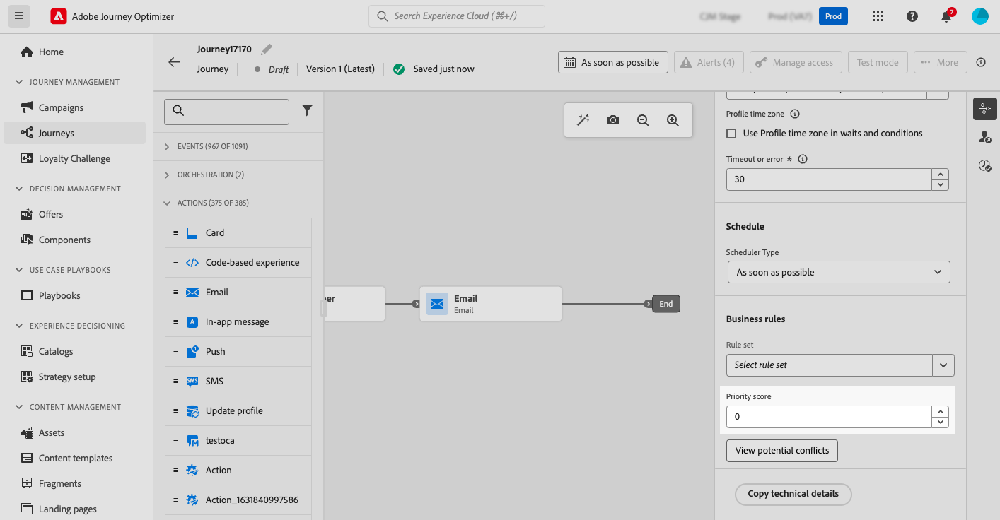
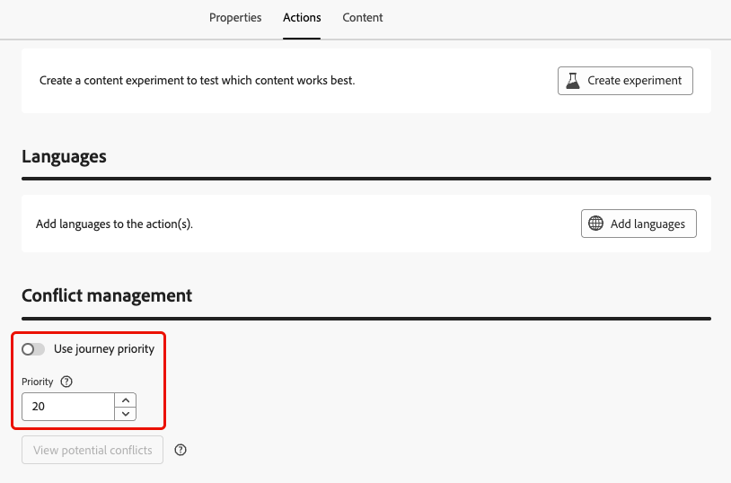

# Tilldela prioritetspoäng {#priority}

Med Journey Optimizer kan du tilldela en prioritetspoäng till en resa, en kampanj eller till en inkommande kanalåtgärd inom aktiviteten **[!UICONTROL Action]** för resan.

Prioritet är viktigt för att prioritera en resa, kampanj eller åtgärd när det finns en begränsning (t.ex. ett frekvenstak).

I situationer där en kund är berättigad till många resor, kampanjer eller kommunikationer och du vill vara selektiv vad de ska delta i och ta emot, bör du använda det här fältet.

## Tilldela prioritetspoäng till resor och kampanjer {#priority-journey-campaign}

>[!CONTEXTUALHELP]
>id="ajo_campaigns_campaign_priority"
>title="Prioritet"
>abstract="Tilldela kampanjens prioritetspoäng. Prioritet är viktigt för att prioritera en kampanj när det finns en begränsning, till exempel ett frekvenstak. Ange ett numeriskt värde (från 0-100). Observera att ju högre tal desto högre prioritet. I situationer där två kampanjer har samma prioritetspoäng visas den kampanj som aktiverades först."

>[!CONTEXTUALHELP]
>id="ajo_journey_priority"
>title="Prioritet"
>abstract="Tilldela en prioritetspoäng till resan. Prioritet är viktigt för att prioritera en resa när det finns en begränsning, t.ex. ett frekvenstak. Ange ett numeriskt värde (från 0-100). Observera att ju högre tal desto högre prioritet. I situationer där två resor har samma prioriteringspoäng visas den resa som först aktiverades."

➡️ [Upptäck den här funktionen i en video](#video)

Det är viktigt att du tilldelar en prioritetspoäng för inkommande kommunikation, som webben, mobiler och appar. Om du har flera kampanjer med samma kanalkonfiguration (t.ex. en banderoll högst upp på webbsidan) kan det vara problematiskt eftersom bara innehåll från en kampanj kan visas. Prioritetspoängen är den plats där du infogar din inställning för vilken kampanj ska visas när mottagaren kan kvalificera sig för mer än en kampanj.

>[!NOTE]
>
>I kampanjer är prioritetspoäng endast tillgängligt för webben, appar och kodbaserade inkommande kanaler.

Om du vill tilldela en prioritetspoäng till en resa eller kampanj anger du ett numeriskt värde (från 0-100) i fältet **[!UICONTROL Priority score]** som finns i resans eller kampanjens egenskaper. Ju högre tal, desto högre prioritet.

Om ni redigerade den här kampanjen och ville se till att kampanjinnehållet visas ger ni den 100 poäng.

>[!IMPORTANT]
>
>Om två resor eller kampanjer har samma prioritetspoäng har systemet ingen tidsbesparande funktion. Se till att prioritetspoängen är unika för att undvika konflikter.

## Tilldela prioritetspoäng till inkommande kanalåtgärder {#priority-action}

>[!CONTEXTUALHELP]
>id="ajo_journey_action_priority"
>title="Prioritet"
>abstract="Tilldela ett prioritetspoäng till reseåtgärden. Prioritet är viktigt för att prioritera en inkommande åtgärd när det finns flera reseåtgärder eller kampanjer som använder samma kanalkonfiguration. Ange ett numeriskt värde (från 0-100). Observera att ju högre tal desto högre prioritet. Som standard ärvs prioritetspoängen för åtgärden från den övergripande prioritetspoängen för resan."

I Journey Optimizer kan du även tilldela en prioritetspoäng till inkommande kanalåtgärder inom [åtgärden](../building-journeys/journey-action.md).

På så sätt kan ni prioritera en inkommande åtgärd när det finns flera reseåtgärder eller kampanjer som använder samma kanalkonfiguration.

>[!NOTE]
>
>I aktiviteten **[!UICONTROL Action]** är prioritetspoäng endast tillgänglig för webben, i appen och kodbaserade inkommande kanaler.

I avsnittet **[!UICONTROL Conflict management]** är alternativet **[!UICONTROL Use journey priority]** markerat som standard, vilket innebär att prioritetspoängen för åtgärden ärvs från den övergripande prioritetspoängen för resan.

Om du vill tilldela en prioritetspoäng till de inkommande åtgärder som definieras i aktiviteten **[!UICONTROL Action]** avmarkerar du alternativet **[!UICONTROL Use journey priority]** och anger ett numeriskt värde (från 0 till 100) i fältet **[!UICONTROL Priority]**. Ju högre tal, desto högre prioritet.

{width=70%}

## Instruktionsvideo {#video}

>[!VIDEO](https://video.tv.adobe.com/v/3435529?quality=12)
