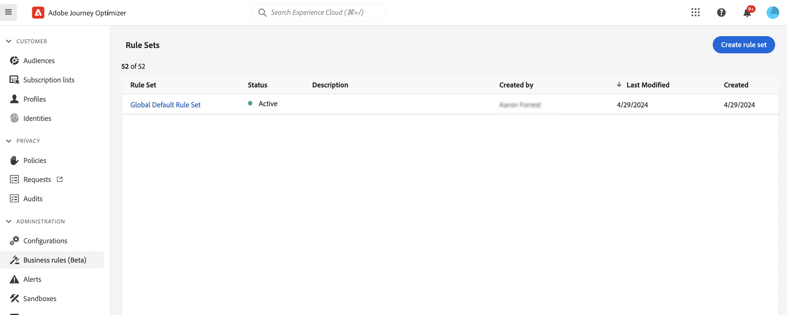
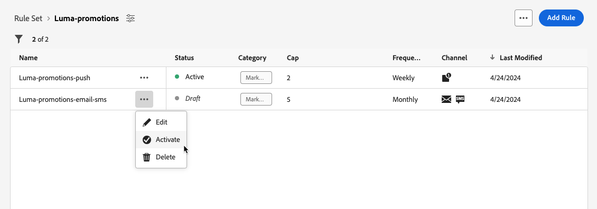
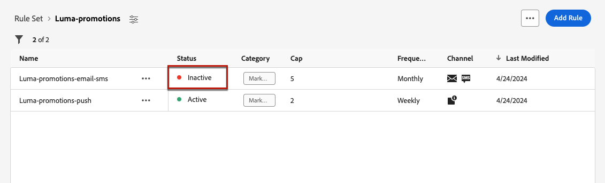

# Arbeta med regeluppsättningar {#rule-sets}

>[!CONTEXTUALHELP]
>id="ajo_business_rules_rule_sets"
>title="Regeluppsättningar"
>abstract="Använd regeluppsättningar för att tillämpa regler för frekvensbegränsning eller tystnadstid på olika typer av marknadsföringskommunikation. Du kan också skapa regeluppsättningar för att exkludera resor till en del av målgruppen baserat på regler för frekvensbegränsning."

## Kom igång med regeluppsättningar {#gs}

### Vad är regeluppsättningar? {#what}

Med regeluppsättningar kan du **gruppera flera regler i regeluppsättningar** och använda dem på de resor och kampanjer du vill använda. Detta ger förbättrad detaljrikedom för att begränsa hur ofta och hur många resor en kund kan gå in på inom en viss tidsram eller styra hur ofta användaren får ett meddelande beroende på kommunikationstypen.

Du kan skapa två typer av regeluppsättningar:

* Regeluppsättningar för **Kanal** tillämpar regler på kommunikationskanaler. De gör att du kan ange:

   * **Regler för frekvensbegränsning** - *Skicka inte fler än 1 e-post eller SMS-kommunikation per dag.*
   * **Regler för tysta timmar** (begränsad tillgänglighet) - *Skicka inte e-postmeddelanden utanför 8:00-9:00-tiden.*

* Regeluppsättningar för **resor** tillämpar regler för antal inmatningar och samtidighet på en resa. Ange till exempel inte profiler i mer än en resa samtidigt.

➡️ [Upptäck den här funktionen i en video](#video)

### Behörigheter {#permissions-frequency-rules}

Om du vill arbeta med affärsregler behöver du följande behörigheter:

* **[!UICONTROL View Frequency Rules]**: Få åtkomst till och visa affärsregler.
* **[!UICONTROL Manage Frequency Rules]**: Skapa, redigera eller ta bort affärsregler.

Läs mer om behörigheter i [det här avsnittet](../administration/high-low-permissions.md).

### Globala och anpassade regeluppsättningar {#global-custom}

När du använder regeluppsättningar för första gången från menyn **[!UICONTROL Administration]** > **[!UICONTROL Business rules]** skapas en standardregeluppsättning och är aktiv: **Global standardregeluppsättning**.

Den här regeluppsättningen innehåller globala regler som du kan använda för att styra hur ofta användare tar emot meddelanden i en eller flera kanaler. Alla regler som definieras i den här regeluppsättningen gäller för alla valda kanaler, oavsett om kommunikationen skickas från en resa eller en kampanj.

Utöver den här regeluppsättningen för global standardregeluppsättning kan du skapa **regeluppsättningar** som du kan tillämpa på alla resor eller kampanjer för att tillämpa särskilda begränsningsregler. [Lär dig skapa anpassade regeluppsättningar](#create)

## Skapa och aktivera regeluppsättningar {#Create}

>[!CONTEXTUALHELP]
>id="ajo_rule_set_domain"
>title="Regeluppsättningsdomän"
>abstract="När du skapar en regeluppsättning måste du ange om reglerna i regeluppsättningen ska tillämpa regler för appning som är specifika för kommunikationskanaler eller för resor."

>[!CONTEXTUALHELP]
>id="ajo_rule_sets_category"
>title="Välj meddelanderegelkategori"
>abstract="När det aktiveras och används för ett meddelande, kommer alla frekvensregler som matchar den valda kategorin automatiskt att tillämpas på det här meddelandet. För närvarande är endast marknadsföringskategorin tillgänglig."

<!--NOT USED?
[!CONTEXTUALHELP]
>id="ajo_rule_sets_capping"
>title="Set the capping for your rule"
>abstract="Specify the maximum number of messages sent to a customer profile within the chosen time frame. The frequency cap will be based on the selected calendar period and will be reset at the beginning of the corresponding time frame."-->

>[!CONTEXTUALHELP]
>id="ajo_rule_type"
>title="Regeltyp"
>abstract="Välj önskad regeltyp för kanalregeluppsättningen: Använd typen **Frekvensbegränsning** för att tillämpa regler för appning på kommunikationskanaler. Skicka till exempel inte mer än 1 e-post eller SMS-kommunikation per dag. Välj **Tysta timmar** (tillgängligt i begränsad tillgänglighet) om du vill definiera tidsbaserade undantag för att säkerställa att inga meddelanden skickas under specifika tidsperioder."

>[!CONTEXTUALHELP]
>id="ajo_rule_sets_duration"
>title="Välj meddelanderegelkategori"
>abstract="När det aktiveras och används för ett meddelande, kommer alla frekvensregler som matchar den valda kategorin automatiskt att tillämpas på det här meddelandet. För närvarande är endast marknadsföringskategorin tillgänglig."

>[!CONTEXTUALHELP]
>id="ajo_rule_set_rule_capping"
>title="Regelfästning"
>abstract="Ange begränsning för din regel. Beroende på regeluppsättningsdomänen och valet i fältet Regeltyp kan det här fältet definiera det maximala antalet meddelanden som kan skickas till en profil, eller det maximala antalet resor som profilen kan ange eller registreras samtidigt."

>[!CONTEXTUALHELP]
>id="ajo_journey_business_rules"
>title="Regeluppsättning"
>abstract="Välj den regeluppsättning som ska användas för din anpassade åtgärd."

Följ stegen nedan för att skapa en regeluppsättning.

>[!NOTE]
>
>Du kan skapa upp till 10 regeluppsättningar för kanaldomänen och 10 regeluppsättningar för resedomänen, för totalt 20 regeluppsättningar.

1. Öppna listan **[!UICONTROL Rules sets]** och klicka sedan på **[!UICONTROL Create rule set]**.

   

1. Definiera ett unikt namn för regeluppsättningen och lägg till en beskrivning.

1. Markera regeluppsättningens domän och klicka på **[!UICONTROL Save]**.

   * **Kanal**-domän: tillämpa regler för appning eller regler för tysta timmar på kommunikationskanaler.
   * **Resa**-domän: Använd regler för start och begränsning av samtidighet på en resa.

   

1. Definiera reglerna som du vill lägga till i den här regeluppsättningen. Du får åtkomst till regeluppsättningen och klickar på **[!UICONTROL Add rule]**.

1. Konfigurera regelparametrarna så att de passar dina behov. Vilka parametrar som är tillgängliga för regeln beror på vilken regeluppsättningsdomän som valdes när regeln skapades.

   Detaljerad information om hur du konfigurerar rese- och kanalregler finns i följande avsnitt:

   * [Resekurser](../conflict-prioritization/journey-capping.md)
   * [Frekvensbegränsning per kanal och kommunikationstyp](../conflict-prioritization/channel-capping.md)
   * [Tysta timmar](../conflict-prioritization/quiet-hours.md) (tillgängligt i begränsad tillgänglighet)

1. Klicka på **[!UICONTROL Save]** för att bekräfta att regeln har skapats. Meddelandet läggs till i regeluppsättningen med statusen **[!UICONTROL Draft]**.

   

1. Upprepa stegen ovan om du vill lägga till så många regler som behövs i regeluppsättningen.

1. När en regel skapas har den statusen **[!UICONTROL Draft]** och påverkar ännu inte något meddelande. Om du vill aktivera den klickar du på knappen **[!UICONTROL More actions]** bredvid regeln och väljer **[!UICONTROL Activate]**.

   

1. Aktivera regeluppsättningen för att kunna tillämpa den på dina resor och meddelanden.

   

   >[!NOTE]
   >
   >Det kan ta upp till 10 minuter för en regel eller regeluppsättning att aktiveras fullständigt. Du behöver inte ändra meddelanden eller publicera om resor för att en regel ska börja gälla.

<!--Currently, once a rule set is activated, no more rules can be added to that rule set.-->

1. Du kan tillämpa en regeluppsättning på ett meddelande eller en resa, beroende på vilken domän som valts när regeluppsättningen skapades.

   Detaljerad information om hur du använder regeluppsättningen finns i följande avsnitt:

   * [Tillämpa en regeluppsättning på en resa](../conflict-prioritization/journey-capping.md#apply-capping)
   * [Använd regler för begränsning av rese- och kampanjaktiviteter](../conflict-prioritization/channel-capping.md#apply-frequency-rule)
   * [Använd regler för tysta timmar för resa och kampanj](../conflict-prioritization/quiet-hours.md#apply)

## Få åtkomst till och hantera regeluppsättningar {#access-rule-sets}

Alla skapade regeluppsättningar visas på menyn **[!UICONTROL Administration]** > **[!UICONTROL Business rules]**. De sorteras efter senaste ändringsdatum.

Klicka på ett regeluppsättningsnamn om du vill visa och redigera innehållet. Alla regler i den regeluppsättningen visas. Med snabbmenyn uppe till höger kan du redigera regeluppsättningens namn och beskrivning, aktivera den och ta bort den.

För varje regel i regeluppsättningen kan du med knappen **[!UICONTROL More actions]** redigera regeln, aktivera den och ta bort den.

Om du vill inaktivera en regel eller en regeluppsättning klickar du på knappen **[!UICONTROL More actions]** bredvid det önskade objektet och väljer **[!UICONTROL Deactivate]**.

Dess status ändras till **[!UICONTROL Inactive]** och regeln gäller inte för framtida meddelandekörningar. Meddelanden som körs just nu påverkas inte.

>[!NOTE]
>
>När du inaktiverar en regel eller regeluppsättning påverkas eller återställs inte antalet enskilda profiler.

## Instruktionsvideo {#video}

>[!VIDEO](https://video.tv.adobe.com/v/3444730?captions=swe&quality=12)
