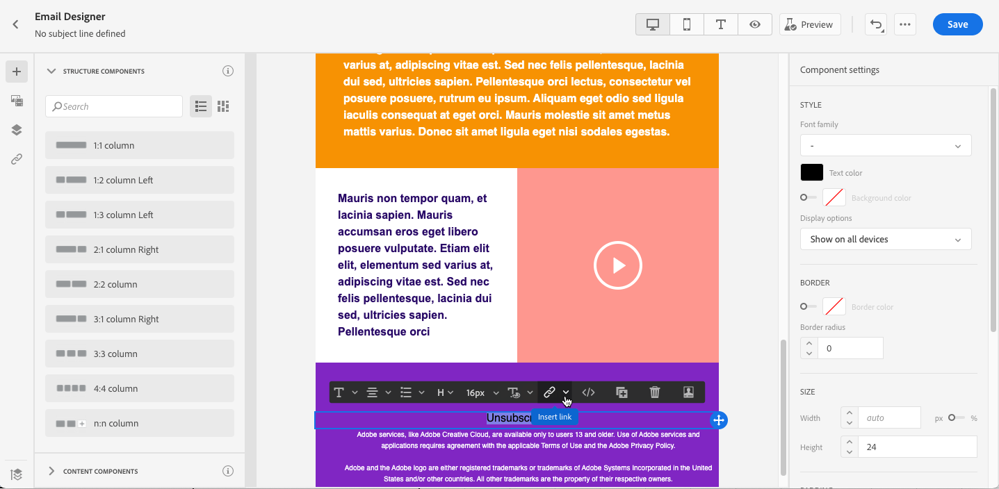
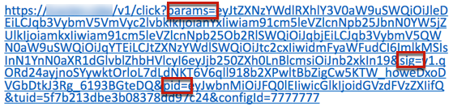

# Hantera avanmälan {#consent}

Använd [!DNL Journey Optimizer] för att spåra mottagarnas samtycke till kommunikation och förstå hur de vill interagera med ert varumärke genom att hantera sina preferenser och prenumerationer. <!--Their preferences and subscriptions are handled through Consent management.-->

I bestämmelser som GDPR anges att du måste uppfylla specifika krav innan du kan använda information från registrerade. Dessutom bör registrerade kunna ändra sitt samtycke när som helst.

**Varför är det viktigt?**

* Om ni inte följer dessa regler medför detta juridiska risker för ert varumärke.
* Det hjälper er att undvika att skicka oombedda meddelanden till era mottagare, vilket kan få dem att märka era meddelanden som skräppost och skada ert rykte.

Läs mer om hur du hanterar sekretess och tillämpliga regler i [Experience Platform-dokumentationen](https://experienceleague.adobe.com/docs/experience-platform/privacy/home.html?lang=sv).

<!--* Recipients should be able to opt-in/opt-out from receiving electronic communication through one or more channel
* Recipients expect the brand to offer preference centre capability that controls how brand should engage with them (example: channel of communication, invasive and non-invasive tracking etc). This helps to fulfil regulatory obligations and also facilitates quality engagement with recipient. 
* The third category is the capability to offer subscription to recipients (newsletter, etc)-->

## Hantering av avanmälan {#opt-out-management}

Att ge mottagarna möjlighet att avbryta prenumerationen på information från ett varumärke är ett juridiskt krav. Läs mer om gällande lagstiftning i [dokumentationen för Experience Platform](https://experienceleague.adobe.com/docs/experience-platform/privacy/regulations/overview.html?lang=en#regulations).

Därför måste du alltid inkludera en **länk för att avbryta prenumerationen** i alla e-postmeddelanden som skickas till mottagarna:
* När du klickar på den här länken dirigeras mottagarna till en landningssida med en knapp som bekräftar att de avanmäler sig.
* När du klickar på avanmälningsknappen kommer ett Adobe I/O-anrop att göras för att uppdatera profildata med den här informationen. [Läs mer om detta](#consent-service-api).

Följ stegen nedan om du vill lägga till en länk för att avbryta prenumerationen:

1. Bygg en startsida för din prenumeration.
1. Lägg landningssidan på valfritt tredjepartssystem.
1. [Skapa ett ](../../help/using/create-message.md) meddelande i  [!DNL Journey Optimizer].

   <!--The link to your landing page should contain a static URL and the profile ID.-->

1. Markera text i innehållet och infoga en länk med hjälp av det sammanhangsberoende verktygsfältet.

   

1. Välj **[!UICONTROL Unsubscription link]** i listrutan **[!UICONTROL Link type]**.

   

1. I **[!UICONTROL Unsubscription page URL]**-bildrutan kopierar du länken till din landningssida.

   

1. Klicka på **[!UICONTROL Save]**.

1. Spara ditt innehåll och [publicera ditt meddelande](../../help/using/publish-manage-message.md).

   >[!NOTE]
   >
   >URL:en till din startsida från tredje part kommer att innehålla tre parametrar som kommer att användas för att uppdatera profilernas inställningar via ett Adobe I/O-samtal. &#x200B; [Läs mer i det här avsnittet](#consent-service-api).

1. Skicka ditt meddelande med länken till din landningssida via en [resa](building-journeys/journey.md).

1. Om mottagaren klickar på länken för att avbryta prenumerationen visas din startsida när meddelandet har tagits emot.

   

1. Om mottagaren klickar på avanmälningsknappen på landningssidan (här **Avbeställ**) uppdateras profildata via ett [Adobe I/O-anrop](#opt-out-api).

   Mottagaren omdirigeras sedan till ett bekräftelsemeddelande som anger att avanmälan lyckades.

   

   Därför får den här användaren inte information från ert varumärke om han eller hon inte prenumererar igen.

Om du vill kontrollera att den aktuella profilens val har uppdaterats går du till Experience Platform och öppnar profilen genom att markera ett identitetsnamnutrymme och ett motsvarande identitetsvärde. Läs mer i [Experience Platform-dokumentationen](https://experienceleague.adobe.com/docs/experience-platform/profile/ui/user-guide.html?lang=en#getting-started).


På fliken **[!UICONTROL Attributes]** ser du att värdet för **[!UICONTROL choice]** har ändrats till **[!UICONTROL no]**.

<!--The opt-out URL is resolved upon each recipient receiving the message. It is then personalized with the relevant encrypted parameters (profile ID, profile name, journey ID, sandbox ID, and message execution ID).-->

## Avanmäl API-anrop {#opt-out-api}

När mottagaren har avanmält sig genom att klicka på länken för att avbryta prenumerationen anropas ett Adobe I/O-API <!--Consent service API to capture the encrypted data and-->för att uppdatera motsvarande profils inställning.

Detta samtal till POSTEN i Adobe I/O är följande:

Slutpunkt: cjm.adobe.io/imp/consent/preferences

Frågeparametrar:
* **parametrar**: innehåller den krypterade nyttolasten
* **sig**: signatur  <!--which signature?-->
* **pid**: krypterat profil-ID

De här parametrarna finns på den länk för att avbryta prenumerationen som skickas till mottagaren, dvs. den URL som öppnar din tredjepartsstartsida för en viss mottagare:



<!--QUESTION: How do you get the URL built for each recipient? Do you have to wait until each targeted recipient receives the unsubscribe link or can you deduce it in advance? Is it done automatically upon the API call or do you have to do something manually for each profile? In other words will the LP automatically include the 3 parameters or do you have to insert something manually? Still not completely clear-->

Huvudkrav:
* x-api-key
* x-gw-ims-org-id
* x-sandbox-name
* behörighet (användartoken från ditt tekniska konto) <!--How do you find this information? And other header elements?-->

Begärandetext:

```
{
   "marketing": [
       {
            "type": "email",           
            "choice": "no",          
            "scope": "channel"       
        }
    ],
 
}
```

<!--The Consent service /-->[!DNL Journey Optimizer] will <!--decrypt and-->use these parameters to update the corresponding profile's choice. <!--and provide an answer back to the landing page.-->

## Avbeställ länk i rubriken {#unsubscribe-email}

Om mottagarnas e-postklientprogram har stöd för att visa en länk för att avbryta prenumerationen i e-posthuvudet, kommer e-postmeddelanden som skickas med [!DNL Journey Optimizer] automatiskt att innehålla den här länken.

Länken för att avbryta prenumerationen visas så här i Gmail:


Om en mottagare klickar på den här länken väljs motsvarande profil omedelbart och det här alternativet uppdateras i Experience Platform.

Om du klickar på länken för att avbryta prenumerationen i rubriken får det samma effekt som om du klickar på länken för att avbryta prenumerationen i e-postinnehållet. Läs mer om hantering av avanmälan i [det här avsnittet](#opt-out-management).

## Hantering av avanmälan {#push-opt-out-management}

Push-mottagare kan avbeställa prenumerationen via sina enheter själva.

När du till exempel hämtar eller använder programmet kan de välja att stoppa meddelanden. På samma sätt kan de ändra meddelandeinställningarna via det mobila operativsystemet.
