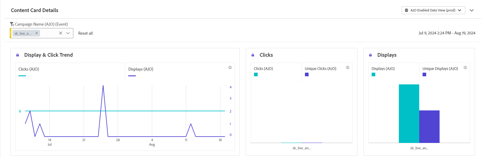

# Rapport om innehållskort {#content-card-report}

>[!BEGINSHADEBOX]

**Innehållsförteckning**

* [Kom igång med innehållskort](../../rp_landing_pages/content-card-landing-page.md)
* [Krav för innehållskort](content-card-configuration-prereq.md)
* [Konfigurera innehållskortskanal i Journey Optimizer](content-card-configuration.md)
* [Skapa innehållskort](create-content-card.md)
* [Utforma innehållskort](design-content-card.md)
* **Innehållskortsrapport**

>[!ENDSHADEBOX]

**Kampanjrapporten** fungerar som en omfattande kontrollpanel, som ger en detaljerad analys av nyckeltal som är kopplade till kampanjen. Den innehåller data som klickräkning, levererade meddelanden, profilnummer och vidtagna åtgärder. Genom att erbjuda en fullständig översikt över kampanjens effektivitet och engagemangsnivåer säkerställer rapporten en grundlig förståelse för kampanjens övergripande resultat.

Du kan komma åt innehållskortsrapporten direkt från din kampanj med knappen **[!UICONTROL Reports]**.

## Visa och klicka på trend {#display-click}

<!--

-->

Diagrammen **[!UICONTROL Display & click trend]** hjälper dig att förstå både meddelandets övergripande räckvidd och antalet unika profiler som är kopplade till det.

+++ Läs mer om mått för visning och klickning

* **[!UICONTROL Clicks]**: Antal gånger som ett innehåll klickades på på i innehållskortet.

* **[!UICONTROL Displays]**: Antal gånger som meddelandet öppnades.

* **[!UICONTROL Unique displays]**: Det antal gånger som meddelandet öppnades tas ingen hänsyn till flera interaktioner för en profil.

+++

## Spårningsdata {#tracking-data}

<!--

-->

Tabellen **[!UICONTROL Tracking data]** innehåller en detaljerad ögonblicksbild av profilaktiviteten som är kopplad till dina innehållskort, vilket ger viktiga insikter i engagemanget och innehållskortets effektivitet.

+++ Läs mer om att spåra datamått

* **[!UICONTROL People]**: Antal användarprofiler som kvalificerar som målprofiler för dina innehållskort.

* **[!UICONTROL Click through rate (CTR)]**: Procentandel användare som interagerade med innehållskortet.

* **[!UICONTROL Clicks]**: Antal gånger som ett innehåll har klickats på på ditt innehållskort.

* **[!UICONTROL Unique Clicks]**: Antal profiler som klickat på ett innehåll på ditt innehållskort.

* **[!UICONTROL Displays]**: Antal gånger som meddelandet öppnades.

* **[!UICONTROL Unique displays]**: Det antal gånger som meddelandet öppnades tas ingen hänsyn till flera interaktioner för en profil.

+++

## Spårade etiketter {#tracked-labels}

Tabellen **[!UICONTROL Tracked labels]** innehåller en omfattande översikt över länketiketterna på dina innehållskort, som visar de som genererar den högsta besökstrafiken. Med den här funktionen kan du identifiera och prioritera de mest populära länkarna.

+++ Läs mer om mätvärden för spårade etiketter

* **[!UICONTROL Unique Clicks]**: Antal profiler som klickat på ett innehåll i dina innehållskort.

* **[!UICONTROL Clicks]**: Antal gånger som ett innehåll klickades på i dina innehållskort.

* **[!UICONTROL Displays]**: Antal gånger som meddelandet öppnades.

* **[!UICONTROL Unique displays]**: Det antal gånger som meddelandet öppnades tas ingen hänsyn till flera interaktioner för en profil.

+++

## URL för spårad länk {#tracked-link-url}

Tabellen **[!UICONTROL Tracked link URLs]** innehåller en omfattande översikt över de URL:er på dina innehållskort som lockar till sig den högsta besökstrafiken. På så sätt kan ni identifiera och prioritera de populäraste länkarna och öka er förståelse för hur proffsen interagerar med specifikt innehåll på era innehållskort.

+++ Läs mer om URL-mått för spårad länk

* **[!UICONTROL Unique Clicks]**: Antal profiler som klickat på ett innehåll i dina innehållskort.

* **[!UICONTROL Clicks]**: Antal gånger som ett innehåll klickades på i dina innehållskort.

+++
