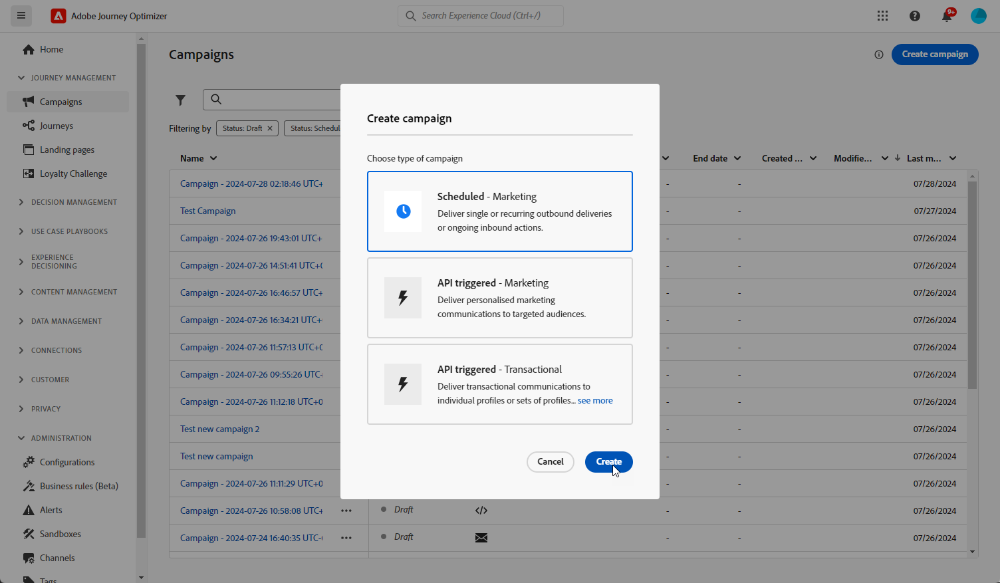
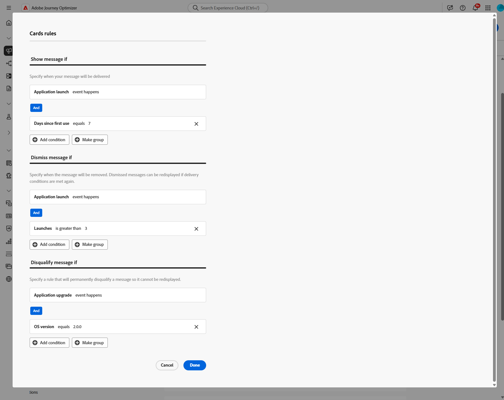

# Skapa innehållskort {#create-content-card}

>[!IMPORTANT]
>
>Som standard döljs kortet av stängningsknappen. Om du vill lägga till fler funktioner kan du definiera regler för avvisning eller avvisning manuellt.

>[!BEGINTABS]

>[!TAB Lägg till innehållskort på en resa]

Så här lägger du till ett innehållskort till en resa:

1. Öppna din resa och dra och släpp en **[!UICONTROL Card]**-aktivitet från **[!UICONTROL Actions]**-delen av paletten.

   

1. Ange **[!UICONTROL Label]** och **[!UICONTROL Description]** för meddelandet.

1. Välj den [innehållskortskonfiguration](content-card-configuration.md) som du vill använda.

   

1. Nu kan du börja designa ditt innehåll med knappen **[!UICONTROL Edit content]**. [Läs mer](design-content-card.md)

1. Aktivera alternativet **[!UICONTROL Enable additional delivery rules]** och välj sedan **[!UICONTROL Edit rules]** för att definiera när meddelandet ska visas, stängas eller döljas permanent.

   

   1. Klicka på **[!UICONTROL Add condition]** för att välja din aktivitet.

      +++Se tillgänglig händelse.

      | Paket | Utlösare | Definition |
      |---|---|---|
      | Skicka data till plattformen | Skickade data till plattformen | Utlöses när mobilappen utfärdar en edge experience-händelse för att skicka data till Adobe Experience Platform. Vanligtvis API-anropet [sendEvent](https://developer.adobe.com/client-sdks/documentation/edge-network/api-reference/#sendevent) från AEP Edge-tillägget. |
      | Core tracking | Spåra åtgärd | Utlöses när den äldre funktionaliteten som erbjuds i API:t [trackAction](https://developer.adobe.com/client-sdks/documentation/mobile-core/api-reference/#trackaction) för mobilkod anropas. |
      | Core tracking | Spåra läge | Utlöses när den äldre funktionaliteten som erbjuds i API:t [trackState](https://developer.adobe.com/client-sdks/documentation/mobile-core/api-reference/#trackstate) för mobilkod anropas. |
      | Core tracking | Samla in PII | Utlöses när den äldre funktionaliteten som erbjuds i API:t [collectPII](https://developer.adobe.com/client-sdks/documentation/mobile-core/api-reference/#collectpii) för mobilkod anropas. |
      | Programmets livscykel | Programstart | Utlöses vid varje körning, inklusive krascher och installationer. Utlöses också vid ett återköp från bakgrunden när tidsgränsen för livscykelsessionen har överskridits. |
      | Programmets livscykel | Programinstallation | Utlöses vid första körningen efter installation eller ominstallation. |
      | Programmets livscykel | Programuppdatering | Utlöses vid första körningen efter en uppgradering eller när versionsnumret ändras. |
      | Programmets livscykel | Programmet stängs | Utlöses när programmet stängs. |
      | Programmets livscykel | Programkrasch | Utlöses när programmet inte är bakgrundsbelagt innan det stängs. Händelsen skickas när programmet startas efter kraschen. Kraschrapportering för Adobe Mobile implementerar inte en global hanterare för ej infångade undantag. |

      +++

   1. Välj villkoret **[!UICONTROL Or]** om du vill lägga till fler **[!UICONTROL Triggers]** för att utöka regeln ytterligare.

   1. Välj villkoret **[!UICONTROL And]** om du vill lägga till **[!UICONTROL Traits]** och finjustera regeln bättre.

      +++Se tillgängliga egenskaper.

      | Paket | Traits | Definition |
      |---|---|---|
      | Enhetsinformation | Transportföretagets namn | Utlöses när ett av transportföretagsnamnen i listan uppfylls. |
      | Enhetsinformation | Enhetsnamn | Utlöses när ett av enhetsnamnen uppfylls. |
      | Enhetsinformation | Språk | Utlöses när något av språken i listan uppfylls. |
      | Enhetsinformation | OS-version | Utlöses när en av de angivna operativsystemsversionerna uppfylls. |
      | Enhetsinformation | Tidigare OS-version | Utlöses när någon av de angivna versionerna av föregående operativsystem uppfylls. |
      | Enhetsinformation | Körningsläge | Utlöses om körningsläget är antingen program eller tillägg. |
      | Programmets livscykel | Program-ID | Utlöses när angivet program-ID uppfylls. |
      | Programmets livscykel | Veckodag | Utlöses när den angivna veckodagen har uppnåtts. |
      | Programmets livscykel | Dag sedan första användningen | Utlöses när det angivna antalet dagar sedan första användningen uppfylls. |
      | Programmets livscykel | Dag sedan senaste användning | Utlöses när det angivna antalet dagar sedan den senaste användningen uppfylls. |
      | Programmets livscykel | Dag sedan uppgraderingen | Utlöses när det angivna antalet dagar sedan den senaste uppgraderingen har uppnåtts. |
      | Programmets livscykel | Installationsdatum | Utlöses när det angivna installationsdatumet är uppfyllt. |
      | Programmets livscykel | Startar | Utlöses när det angivna antalet starter uppfylls. |
      | Programmets livscykel | Tid på dagen | Utlöses när den angivna tidpunkten på dagen uppfylls. |

      +++

   1. Klicka på **[!UICONTROL Make group]** för att gruppera utlösare.

1. Slutför vid behov kundresan genom att dra och släppa ytterligare åtgärder eller händelser. [Läs mer](../building-journeys/about-journey-activities.md)

1. När ditt innehållskort är klart slutför du konfigurationen och publicerar din resa för att aktivera den.

Mer information om hur du konfigurerar en resa finns på [den här sidan](../building-journeys/journey-gs.md).

>[!TAB Lägg till innehållskort i en kampanj]

Följ stegen nedan för att börja skapa ditt innehållskort med en kampanj.

1. Skapa en kampanj. [Läs mer](../campaigns/create-campaign.md)

1. Välj den typ av kampanj som du vill köra

   * **[!UICONTROL Scheduled - Marketing]**: Kör kampanjen direkt eller på ett angivet datum. Schemalagda kampanjer syftar till att skicka **marknadsföringsmeddelanden**. De konfigureras och körs från användargränssnittet.

   * **[!UICONTROL API-triggered - Marketing/Transactional]**: Kör kampanjen med ett API-anrop. API-utlösta kampanjer syftar till att skicka antingen **marketing** - eller **transactional** -meddelanden, d.v.s. meddelanden som skickas ut efter en åtgärd som utförts av en individ: lösenordsåterställning, kundvagn osv. [Lär dig hur du utlöser en kampanj med API:er](../campaigns/api-triggered-campaigns.md)

   

1. I avsnittet **[!UICONTROL Properties]** anger du ett namn och en beskrivning för kampanjen.

1. Klicka på knappen **i avsnittet** Målgrupp **[!UICONTROL Select audience]** för att visa en lista över tillgängliga Adobe Experience Platform-målgrupper. [Läs mer om målgrupper](../audience/about-audiences.md)

1. I fältet **[!UICONTROL Identity namespace]** väljer du det namnutrymme som ska användas för att identifiera individerna från det valda segmentet. [Läs mer om namnutrymmen](../event/about-creating.md#select-the-namespace)

1. Välj åtgärden **[!UICONTROL Content card]**.

   

1. Välj eller skapa en ny [konfiguration för innehållskort](content-card-configuration.md).

1. Klicka på **[!UICONTROL Create experiment]** om du vill testa innehållet i meddelandet. På så sätt kan ni testa flera variabler för en leverans på provpopulationer för att avgöra vilken behandling som har störst effekt på den avsedda målgruppen. [Läs mer om innehållsexperiment](../content-management/content-experiment.md).

1. Aktivera alternativet **[!UICONTROL Enable additional delivery rules]** och välj sedan **[!UICONTROL Edit rules]** för att definiera när meddelandet ska visas, stängas eller döljas permanent.

   Använd regelbyggare för att ange specifika villkor som utlöser dessa åtgärder.

   1. Klicka på **[!UICONTROL Add condition]** för att välja din aktivitet.

      +++Se tillgänglig händelse.

      | Paket | Utlösare | Definition |
      |---|---|---|
      | Skicka data till plattformen | Skickade data till plattformen | Utlöses när mobilappen utfärdar en edge experience-händelse för att skicka data till Adobe Experience Platform. Vanligtvis API-anropet [sendEvent](https://developer.adobe.com/client-sdks/documentation/edge-network/api-reference/#sendevent) från AEP Edge-tillägget. |
      | Core tracking | Spåra åtgärd | Utlöses när den äldre funktionaliteten som erbjuds i API:t [trackAction](https://developer.adobe.com/client-sdks/documentation/mobile-core/api-reference/#trackaction) för mobilkod anropas. |
      | Core tracking | Spåra läge | Utlöses när den äldre funktionaliteten som erbjuds i API:t [trackState](https://developer.adobe.com/client-sdks/documentation/mobile-core/api-reference/#trackstate) för mobilkod anropas. |
      | Core tracking | Samla in PII | Utlöses när den äldre funktionaliteten som erbjuds i API:t [collectPII](https://developer.adobe.com/client-sdks/documentation/mobile-core/api-reference/#collectpii) för mobilkod anropas. |
      | Programmets livscykel | Programstart | Utlöses vid varje körning, inklusive krascher och installationer. Utlöses också vid ett återköp från bakgrunden när tidsgränsen för livscykelsessionen har överskridits. |
      | Programmets livscykel | Programinstallation | Utlöses vid första körningen efter installation eller ominstallation. |
      | Programmets livscykel | Programuppdatering | Utlöses vid första körningen efter en uppgradering eller när versionsnumret ändras. |
      | Programmets livscykel | Programmet stängs | Utlöses när programmet stängs. |
      | Programmets livscykel | Programkrasch | Utlöses när programmet inte är bakgrundsbelagt innan det stängs. Händelsen skickas när programmet startas efter kraschen. Kraschrapportering för Adobe Mobile implementerar inte en global hanterare för ej infångade undantag. |

      +++

   1. Välj villkoret **[!UICONTROL Or]** om du vill lägga till fler **[!UICONTROL Triggers]** för att utöka regeln ytterligare.

   1. Välj villkoret **[!UICONTROL And]** om du vill lägga till **[!UICONTROL Traits]** och finjustera regeln bättre.

      +++Se tillgängliga egenskaper.

      | Paket | Traits | Definition |
      |---|---|---|
      | Enhetsinformation | Transportföretagets namn | Utlöses när ett av transportföretagsnamnen i listan uppfylls. |
      | Enhetsinformation | Enhetsnamn | Utlöses när ett av enhetsnamnen uppfylls. |
      | Enhetsinformation | Språk | Utlöses när något av språken i listan uppfylls. |
      | Enhetsinformation | OS-version | Utlöses när en av de angivna operativsystemsversionerna uppfylls. |
      | Enhetsinformation | Tidigare OS-version | Utlöses när någon av de angivna versionerna av föregående operativsystem uppfylls. |
      | Enhetsinformation | Körningsläge | Utlöses om körningsläget är antingen program eller tillägg. |
      | Programmets livscykel | Program-ID | Utlöses när angivet program-ID uppfylls. |
      | Programmets livscykel | Veckodag | Utlöses när den angivna veckodagen har uppnåtts. |
      | Programmets livscykel | Dag sedan första användningen | Utlöses när det angivna antalet dagar sedan första användningen uppfylls. |
      | Programmets livscykel | Dag sedan senaste användning | Utlöses när det angivna antalet dagar sedan den senaste användningen uppfylls. |
      | Programmets livscykel | Dag sedan uppgraderingen | Utlöses när det angivna antalet dagar sedan den senaste uppgraderingen har uppnåtts. |
      | Programmets livscykel | Installationsdatum | Utlöses när det angivna installationsdatumet är uppfyllt. |
      | Programmets livscykel | Startar | Utlöses när det angivna antalet starter uppfylls. |
      | Programmets livscykel | Tid på dagen | Utlöses när den angivna tidpunkten på dagen uppfylls. |

      +++

   1. Klicka på **[!UICONTROL Make group]** för att gruppera utlösare.

   

1. Du kan schemalägga din kampanj till ett visst datum eller ange att den ska upprepas med regelbundna intervall. [Läs mer](../campaigns/create-campaign.md#schedule)

1. Nu kan du börja designa ditt innehåll med **[!UICONTROL Edit content]**. [Läs mer](design-content-card.md)

   

>[!ENDTABS]
