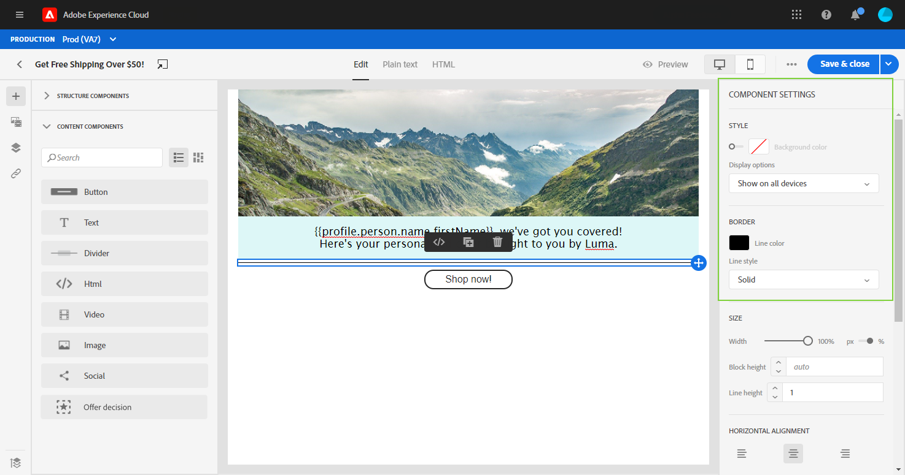
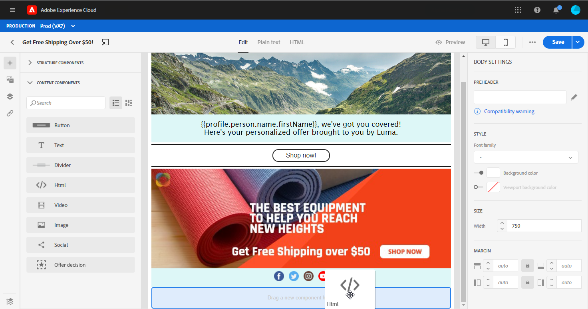
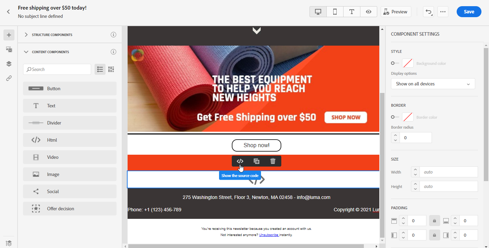

# Använd e-postdesignerns innehållskomponenter {#content-components}

>[!CONTEXTUALHELP]
>id="ac_content_components"
>title="Om innehållskomponenter"
>abstract="Innehållskomponenterna är tomma platshållare för innehåll som du kan använda för att skapa layouten för ett e-postmeddelande."

När du skapar ditt e-postinnehåll från grunden kan du med **[!UICONTROL Content components]** anpassa din e-post ytterligare med råa, tomma komponenter som du kan använda en gång i ett e-postmeddelande.
Du kan lägga till så många **[!UICONTROL Content components]** som du behöver i en **[!UICONTROL Structure component]** som definierar layouten för ditt e-postmeddelande.

## Knapp {#buttons}

Använd **[!UICONTROL Button]**-komponenten för att infoga flera knappar i e-postmeddelandet och dirigera om din e-postmålgrupp till en annan sida.

1. Dra och släpp **[!UICONTROL Button]** i en **[!UICONTROL Structure component]** från **[!UICONTROL Content components]**.

   

1. Klicka på knappen som du har lagt till för att anpassa texten och få tillgång till **[!UICONTROL Components Settings]** i den högra rutan i e-postdesignern.

   

1. I fältet **[!UICONTROL Link]** i **[!UICONTROL Components Settings]** lägger du till den URL som du vill att målgruppen ska omdirigeras till när du klickar på knappen.

1. Välj hur målgruppen ska omdirigeras med listrutan **[!UICONTROL Target]**:

   * **[!UICONTROL None]**: öppnar länken i samma ram som den klickades på (standard).
   * **[!UICONTROL Blank]**: öppnar länken i ett nytt fönster eller på en ny flik.
   * **[!UICONTROL Self]**: öppnar länken i samma ram som den klickades på.
   * **[!UICONTROL Parent]**: öppnar länken i den överordnade ramen.
   * **[!UICONTROL Top]**: öppnar länken i hela fönstret.

   

1. Du kan nu anpassa knappen ytterligare genom att ändra exempelvis **[!UICONTROL Style]**, **[!UICONTROL Margin]** och **[!UICONTROL Border]**.

## Text {#text}

Använd **[!UICONTROL Text]**-komponenten för att infoga text i e-postmeddelandet. Du kan justera färg, stil och storlek på texten i **[!UICONTROL Component Settings]**.

1. I **[!UICONTROL Content Components]** drar och släpper du **[!UICONTROL Text]** i en **[!UICONTROL Structure component]**.

   

1. Klicka på den nya komponenten som du har lagt till för att anpassa texten och få tillgång till **[!UICONTROL Components Settings]** i den högra rutan i e-postdesignern.

1. Ändra texten med följande alternativ i verktygsfältet:

   

   * **[!UICONTROL Change text style]**: använda fet, kursiv, understrykning eller genomstrykning i texten.
   * **Ändra justering**: Välj mellan vänster, höger, centrerad eller marginaljusterad justering för texten.
   * **[!UICONTROL Create list]**: lägg till punkt- eller nummerlista i texten.
   * **[!UICONTROL Set heading]**: kan du lägga till upp till sex rubriknivåer i texten.
   * **Teckenstorlek**: markera teckensnittsstorleken för texten i pixlar.
   * **[!UICONTROL Edit image]**: lägga till en bild eller en resurs i textkomponenten. [Läs mer om resurshantering](assets-essentials.md).
   * **[!UICONTROL Show the source code]**: visa textens källkod. Den kan inte ändras.
   * **[!UICONTROL Duplicate]**: lägga till en kopia av textkomponenten.
   * **[!UICONTROL Delete]**: ta bort den markerade textkomponenten från e-postmeddelandet.
   * **[!UICONTROL Add personalization]**: lägga till anpassningsfält för att anpassa innehållet utifrån dina profildata. [Läs mer om innehållspersonalisering](personalization/personalize.md).

1. För en bättre användarupplevelse kan ni lägga till anpassningsfält för att rikta in er målgrupp. Mer information om detta hittar du i det här [avsnittet](personalization/personalize.md).

1. Justera **[!UICONTROL Text color]**, **[!UICONTROL Font family]** och **[!UICONTROL Size]** i **[!UICONTROL Components Settings]**.

   

## Delare {#divider}

Använd **[!UICONTROL Divider]**-komponenten för att infoga en delningslinje för att ordna layouten och innehållet i e-postmeddelandet.
Du kan välja färg, format och storlek för brytningsraden i **[!UICONTROL Component Settings]**.

## HTML {#HTML}

Använd **[!UICONTROL HTML]** för att kopiera och klistra in de olika delarna av din befintliga HTML. På så sätt kan du skapa kostnadsfria modulära HTML-komponenter.

Adobe rekommenderar att du skapar ett meddelande från grunden och kopierar innehållet från ditt befintliga e-postmeddelande till komponenter, så att det externa innehållet helt enkelt blir kompatibelt med e-postdesignern.

1. I **[!UICONTROL Content Components]** drar och släpper du **[!UICONTROL HTML]** i en **[!UICONTROL Structure component]**.

   

1. Klicka på den nya komponenten och **[!UICONTROL Show the source code]** för att lägga till din HTML.

   

1. Kopiera och klistra in den HTML-kod som du vill lägga till i e-postmeddelandet och klicka på **[!UICONTROL Save]**.

   

1. Nu kan du anpassa din HTML ytterligare genom att ändra till exempel **[!UICONTROL Style]**, **[!UICONTROL Margin]** och **[!UICONTROL Border]** eller lägga till en länk för att dirigera om publiken till ett annat innehåll.

## Bild {#image}

Använd komponenten **[!UICONTROL Image]** för att infoga en bildfil från datorn i e-postmeddelandet.

1. I **[!UICONTROL Content Components]** drar och släpper du **[!UICONTROL Image]** i en **[!UICONTROL Structure component]**.

   

1. Klicka på **[!UICONTROL Browse]** för att välja en bildfil på datorn.

   Du kan också klicka på **[!UICONTROL Asset Picker]** om du vill lägga till en resurs i e-postmeddelandet. Mer information om Assets finns i [avsnittet](assets-essentials.md).

1. Klicka på den nyligen tillagda komponenten för att börja konfigurera **[!UICONTROL Content Components]** och få åtkomst till **[!UICONTROL Components Settings]** i den högra rutan i e-postdesignern.

1. Ange bildegenskaper:

   * **[!UICONTROL Image Title]** I kan du definiera en titel för bilden.
   * **[!UICONTROL Alt text]** I kan du definiera den bildtext som är länkad till bilden. Detta motsvarar alt HTML-attributet.

   

1. Du kan nu anpassa din bild ytterligare genom att ändra exempelvis **[!UICONTROL Style]**, **[!UICONTROL Margin]** och **[!UICONTROL Border]** eller lägga till en länk för att dirigera om målgruppen till ett annat innehåll.

## Video {#Video}

>[!CONTEXTUALHELP]
>id="ac_edition_video"
>title="Videoinställningar"
>abstract="Använd den här komponenten för att infoga en video i e-postmeddelandet. Observera att videoklipp inte fungerar på alla e-postklienter. Vi rekommenderar att du ställer in en reservbild."
>additional-url="https://www.emailonacid.com/blog/article/email-development/a_how_to_guide_to_embedding_html5_video_in_email/" text="Ytterligare information"

Använd komponenten **[!UICONTROL Video]** för att infoga en video i e-postmeddelandet via en URL-länk.

1. I **[!UICONTROL Content Components]** drar och släpper du **[!UICONTROL Video]** i en **[!UICONTROL Structure component]**.

   

1. Klicka på den nyligen tillagda komponenten för att börja konfigurera **[!UICONTROL Content Components]** och få åtkomst till **[!UICONTROL Components Settings]** i den högra rutan i e-postdesignern.

1. Lägg till din video-URL i fältet **[!UICONTROL Video link]** i **[!UICONTROL Components Settings]**.

   

1. Du kan lägga till en **[!UICONTROL Poster image]** i videon för att ange en bild som ska visas tills publiken klickar på uppspelningsknappen.

1. Du kan nu anpassa din bild ytterligare genom att till exempel ändra **[!UICONTROL Style]**, **[!UICONTROL Margin]** och **[!UICONTROL Border]**.

## Social {#social}

Använd **[!UICONTROL Social]**-komponenten för att infoga länkar till sidor för sociala medier i ditt e-postmeddelande.

1. I **[!UICONTROL Content Components]** drar och släpper du **[!UICONTROL Social]** i en **[!UICONTROL Structure component]**.

   

1. Klicka på den nyligen tillagda komponenten för att börja konfigurera **[!UICONTROL Content Components]** och få åtkomst till **[!UICONTROL Components Settings]** i den högra rutan i e-postdesignern.

1. I fältet **[!UICONTROL Social]** i **[!UICONTROL Components Settings]** väljer du vilka sociala medier du vill lägga till eller ta bort.

   

1. Välj storleken på ikonerna i fältet **[!UICONTROL Size of images]**.

1. Klicka på var och en av dina ikoner för sociala medier för att konfigurera **[!UICONTROL URL]** som din målgrupp ska omdirigeras till.

   

1. Du kan också ändra ikonerna för vart och ett av dina sociala medier om det behövs i fältet **[!UICONTROL Image]**.

1. Du kan nu anpassa dina ikoner för sociala medier ytterligare genom att ändra **[!UICONTROL Style]**, **[!UICONTROL Margin]** och **[!UICONTROL Border]**.

## Erbjudandebeslut {#offer-decision}

Använd **[!UICONTROL Offer decision]**-komponenten för att infoga beslut (som tidigare kallats erbjudandeaktiviteter) i dina meddelanden. Besluten kommer att dra nytta av Beslutshantering för att välja det bästa erbjudandet att leverera till era kunder.

Relaterade ämnen:

* [Kom igång med Beslutshantering](offers/get-started/starting-offer-decisioning.md).
* [Lägg in personaliserade erbjudanden i meddelandena](deliver-personalized-offers.md).

