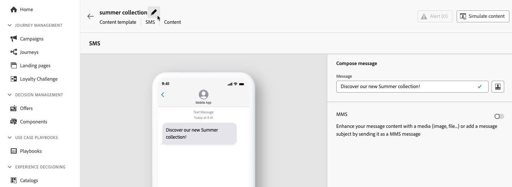

# Få åtkomst till och hantera innehållsmallar {#access-manage-templates}

## Åtkomst till innehållsmallar {#access}

Om du vill komma åt innehållsmalllistan väljer du **[!UICONTROL Content Management]** > **[!UICONTROL Content Templates]** från den vänstra menyn.

Alla mallar som skapades i den aktuella sandlådan - antingen från en resa eller en kampanj med **[!UICONTROL Save as template]** alternativ, antingen från **[!UICONTROL Content Templates]** -menyn visas. [Lär dig hur du skapar mallar](#create-content-templates)

Du kan sortera innehållsmallar efter:
* Typ
* Kanal
* Skapad eller ändrad den
* Taggar - [Läs mer om taggar](../start/search-filter-categorize.md#tags)

Du kan också välja att bara visa de objekt som du själv har skapat eller ändrat.

## Redigera och ta bort innehållsmallar {#edit}

* Om du vill redigera ett mallinnehåll klickar du på önskat objekt i listan och gör önskade ändringar. Du kan också redigera egenskaperna för innehållsmallen genom att klicka på redigeringsknappen bredvid mallens namn.

  

* Om du vill ta bort en mall väljer du **[!UICONTROL More actions]** intill önskad mall och välj **[!UICONTROL Delete]**.

  

>[!NOTE]
>
>När en mall redigeras eller tas bort påverkas inte kampanjer eller resor inklusive innehåll som skapats med den här mallen.

## Visa mallar som miniatyrbilder {#template-thumbnails}

Välj **[!UICONTROL Grid view]** om du vill visa varje mall som en miniatyrbild.

>[!AVAILABILITY]
>
>Den här funktionen lanseras i begränsad tillgänglighet (LA) för en liten grupp kunder.

>[!NOTE]
>
>För närvarande kan riktiga miniatyrbilder bara skapas för e-postinnehållsmallar av HTML-typ.

När du uppdaterar ett innehåll kan du behöva vänta några sekunder innan ändringarna visas i miniatyrbilden.
