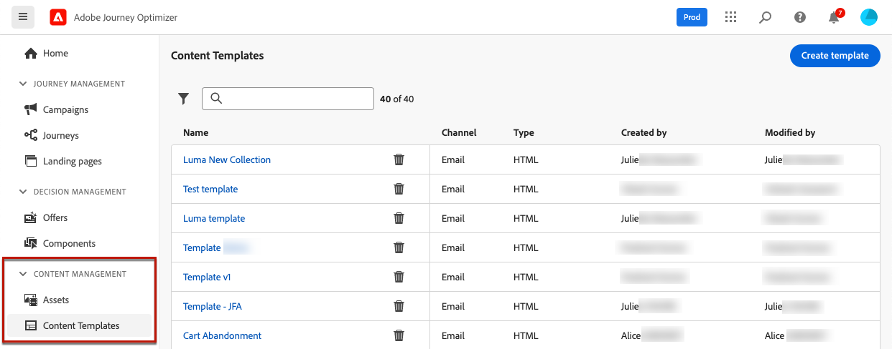
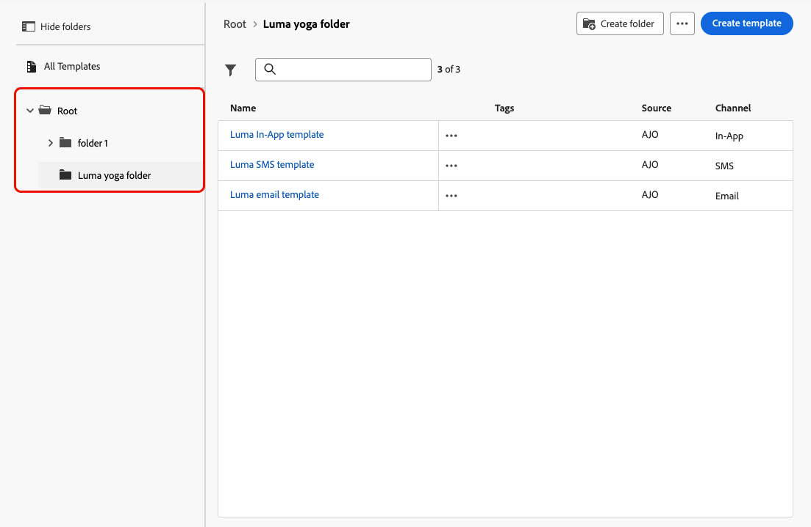

# Få åtkomst till och hantera innehållsmallar {#access-manage-templates}

## Åtkomst till innehållsmallar {#access}

Om du vill komma åt innehållsmalllistan väljer du **[!UICONTROL Content Management]** > **[!UICONTROL Content Templates]** på den vänstra menyn.

Alla mallar som skapades i den aktuella sandlådan, antingen från en resa eller en kampanj med alternativet **[!UICONTROL Save as template]**, antingen från menyn **[!UICONTROL Content Templates]**, visas. [Lär dig skapa mallar](#create-content-templates)

I rutan till vänster kan du ordna innehållsmallar i mappar. Som standard visas alla mallar. När du väljer en mapp visas endast de mallar och mappar som finns i den valda mappen. [Läs mer](#folders)

>[!NOTE]
>
>Mappar med innehållsmallar är bara tillgängliga för en uppsättning organisationer (begränsad tillgänglighet) och kommer gradvis att lanseras för fler användare.

Om du vill söka efter ett visst objekt börjar du skriva ett namn i sökfältet. När en [mapp](#folders) är markerad gäller sökningen alla innehållsmallar eller mappar på den första nivån i hierarkin i mappen<!--(not nested items)-->.

Du kan sortera innehållsmallar efter:
* Typ
* Kanal
* Skapad eller ändrad den
* Taggar - [Läs mer om taggar](../start/search-filter-categorize.md#tags)

Du kan också välja att bara visa de objekt som du själv har skapat eller ändrat.

## Använda mappar för att hantera innehållsmallar {#folders}

>[!AVAILABILITY]
>
>Mappar med innehållsmallar är bara tillgängliga för en uppsättning organisationer (begränsad tillgänglighet) och kommer gradvis att lanseras för fler användare.

Om du enkelt vill navigera bland dina innehållsmallar kan du använda mappar för att ordna dem mer effektivt i en strukturerad hierarki. På så sätt kan du kategorisera och hantera objekten efter organisationens behov.

1. Klicka på knappen **[!UICONTROL All content templates]** om du vill visa alla objekt som tidigare skapats utan mappgruppering.

1. Klicka på mappen **[!UICONTROL Root]** för att visa alla mappar som skapats.

   >[!NOTE]
   >
   >Om du inte har skapat mappar än visas alla innehållsmallar.

1. Klicka på en mapp i mappen **[!UICONTROL Root]** för att visa dess innehåll.

1. När du klickar på mappen **[!UICONTROL Root]** eller någon annan mapp visas knappen **[!DNL Create folder]** . Markera den.

   

1. Ange ett namn för den nya mappen och klicka på **[!UICONTROL Save]**. Den nya mappen visas ovanpå listan med innehållsmallar i mappen **[!UICONTROL Root]**, eller inuti den markerade mappen.

1. Du kan klicka på knappen **[!UICONTROL More actions]** om du vill byta namn på eller ta bort mappen.

   

1. Med knappen **[!UICONTROL More actions]** kan du också flytta innehållsmallen till en annan befintlig mapp.

   

1. Nu kan du navigera till mappen som du nyss skapade. Varje ny innehållsmall som du [skapar](create-content-templates.md) från här sparas i den aktuella mappen.

   

## Redigera och ta bort innehållsmallar {#edit}

* Om du vill redigera ett mallinnehåll klickar du på önskat objekt i listan och gör önskade ändringar. Du kan också redigera egenskaperna för innehållsmallen genom att klicka på redigeringsknappen bredvid mallens namn.

  

* Om du vill ta bort en mall markerar du knappen **[!UICONTROL More actions]** bredvid önskad mall och väljer **[!UICONTROL Delete]**.

  

>[!NOTE]
>
>När en mall redigeras eller tas bort påverkas inte kampanjer eller resor inklusive innehåll som skapats med den här mallen.

## [!BADGE Begränsad tillgänglighet]{type=Informative} Visa mallar som miniatyrbilder {#template-thumbnails}

Välj läget **[!UICONTROL Grid view]** om du vill visa varje mall som en miniatyrbild.

>[!AVAILABILITY]
>
Den här funktionen lanseras i begränsad tillgänglighet (LA) för en liten grupp kunder.

>[!NOTE]
>
För närvarande kan riktiga miniatyrbilder bara skapas för HTML-typer email innehållsmallar.

När du uppdaterar ett innehåll kan du behöva vänta några sekunder innan ändringarna visas i miniatyrbilden.

## Exportera innehållsmallar till en annan sandlåda {#export}

Med Journey Optimizer kan du kopiera en innehållsmall från en sandlåda till en annan. Du kan till exempel kopiera en mall från sandlådemiljön på scenen till produktionssandlådan.

Kopieringsprocessen utförs via en **paketexport och import** mellan käll- och målsandlådorna. Detaljerad information om hur du exporterar objekt och importerar dem till en målsandlåda finns i det här avsnittet: [Kopiera objekt till en annan sandlåda](../configuration/copy-objects-to-sandbox.md)
