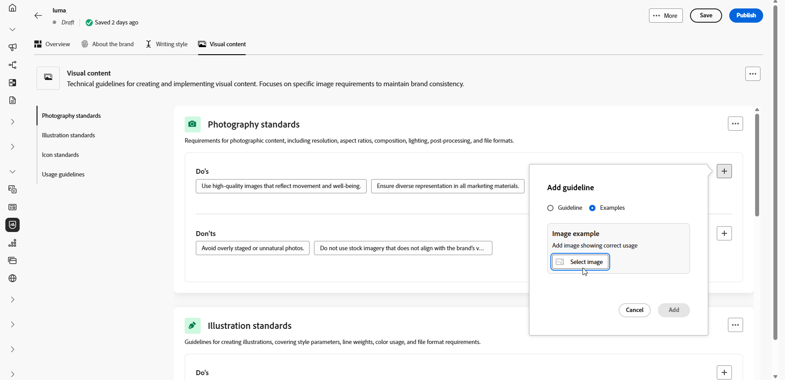

# Anpassa ert varumärke {#brands-personalize}

## Om varumärket {#about-brand}

Använd fliken **[!UICONTROL About the brand]** för att etablera varumärkets kärnidentitet, som visar dess syfte, personlighet, tagline och andra definitionsattribut.

1. Börja med att fylla i den grundläggande informationen för ditt varumärke i kategorin **[!UICONTROL Key details]**:

   * **[!UICONTROL Brand Kit Name]**: Ange namnet på varumärkespaketet.

   * **[!UICONTROL When to Use]**: Ange scenarier eller kontexter där varumärkespaketet ska användas.

   * **[!UICONTROL Brand Name]**: Ange varumärkets officiella namn.

   * **[!UICONTROL Brand Description]**: Ge en översikt över vad det här varumärket representerar.

   * **[!UICONTROL Default Tagline]**: Lägg till den primära tagline som är associerad med varumärket.

     

1. I kategorin **[!UICONTROL Guiding principles]** klargör du varumärkets huvudriktning och filosofi:

   * **[!UICONTROL Mission]**: Ange varumärkets syfte.

   * **[!UICONTROL Vision]**: Beskriv ditt långsiktiga mål eller önskat framtida tillstånd.

   * **[!UICONTROL Market Positioning]**: Förklara hur ert varumärke är positionerat på marknaden.

     

1. Klicka på **[!UICONTROL Core brand values]** Dive image alt text om du vill lägga till varumärkets kärnvärden och fylla i informationen:

   * **[!UICONTROL Value]**: Namnge ett kärnvarumärke.

   * **[!UICONTROL Description]**: Förklara vad det här värdet betyder för ditt varumärke.

   * **[!UICONTROL Behaviors]**: Skapa en kontur för de åtgärder eller attityder som återspeglar det här värdet i praktiken.

   * **[!UICONTROL Manifestations]**: Ge exempel på hur det här värdet uttrycks i varumärken.

     

1. Om det behövs klickar du på ikonen för att uppdatera eller ta bort ett av ert varumärke.

   

Du kan nu anpassa ditt varumärke ytterligare eller [publicera ditt varumärke](brands.md#create-brand-kit).

## Skrivstil {#writing-style}

>[!CONTEXTUALHELP]
>id="ajo_brand_writing_style"
>title="Skriva justeringsmusik"
>abstract="I avsnittet Skrivstil definieras standarder för språk, formatering och struktur för att säkerställa tydligt och enhetligt innehåll. Justeringspoängen, som har klassificerats från hög till låg, visar hur väl innehållet följer dessa riktlinjer och markerar områden som kan förbättras."

Avsnittet **[!UICONTROL Writing style]** beskriver standarderna för att skriva innehåll, med information om hur språk, formatering och struktur ska användas för att bibehålla tydlighet, konsekvens och konsekvens i alla material.

+++ Tillgänglig kategori och exempel

<table>
  <thead>
    <tr>
      <th>Kategori</th>
      <th>Underkategori</th>
      <th>Riktlinjer, exempel</th>
      <th>Exempel på undantag</th>
    </tr>
  </thead>
  <tbody>
    <tr>
      <td rowspan="4">Standarder för att skapa innehåll</td>
      <td>Varumärkesmeddelandestandarder</td>
      <td>Lyft fram innovation och budskap som sätter kunden i första rummet.</td>
      <td>Övertyga inte produktfunktionerna.</td>
    </tr>
    <tr>
      <td>Användning med tagline</td>
      <td>Placera tagline under logotypen på alla digitala marknadsföringsresurser.</td>
      <td>Ändra eller översätt inte tagline.</td>
    </tr>
    <tr>
      <td>Core Messaging</td>
      <td>Viktigt om de viktigaste fördelarna - till exempel ökad produktivitet.</td>
      <td>Använd inte orelaterade värdeförslag.</td>
    </tr>
    <tr>
      <td>Namngivningsstandarder</td>
      <td>Använd enkla, beskrivande namn som "ProScheduler".</td>
      <td>Använd inte komplexa termer eller specialtecken.</td>
    </tr>
    <tr>
      <td rowspan="5">Format för varumärkeskommunikation</td>
      <td>Varumärkespersonalitet</td>
      <td>Lätt och lättåtkomligt.</td>
      <td>Var inte besegrad.</td>
    </tr>
    <tr>
      <td>Skrivmekanism</td>
      <td>Håll meningarna korta och slagkraftiga.</td>
      <td>Använd inte för mycket jargon.</td>
    </tr>
    <tr>
      <td>Situationen - ton</td>
      <td>Bibehåll en professionell ton inom kriskommunikation.</td>
      <td>Avvisa inte supportkommunikation.</td>
    </tr>
    <tr>
      <td>Riktlinjer för Word-val</td>
      <td>Använd ord som"innovativ" och"smart".</td>
      <td>Undvik ord som "billig" eller "hack".</td>
    </tr>
    <tr>
      <td>Språkstandarder</td>
      <td>Följ amerikansk engelska konventioner.</td>
      <td>Blanda inte engelska och amerikanska stavningar.</td>
    </tr>
    <tr>
      <td rowspan="3">Regler för regelefterlevnad</td>
      <td>Varumärkesstandarder</td>
      <td>Använd alltid symbolen ™ eller ®.</td>
      <td>Utelämna inte giltiga symboler vid behov.</td>
    </tr>
    <tr>
      <td>Copyrightstandarder</td>
      <td>Inkludera copyrightmeddelanden i marknadsföringsmaterial.</td>
      <td>Använd inte innehåll från tredje part utan tillstånd.</td>
    </tr>
    <tr>
      <td>Friskrivningsstandarder</td>
      <td>Visa ansvarsfriskrivningar på ett läsligt sätt om digitala resurser.</td>
      <td>Dölj inte ansvarsfriskrivningar i områden som inte är synliga.</td>
    </tr>
</table>

+++

 

Så här anpassar du din **[!UICONTROL Writing Style]**:

1. Klicka på **[!UICONTROL Writing Style]** på fliken  för att lägga till en stödlinje, ett undantag eller ett undantag.

1. Ange riktlinjer, undantag eller undantag. Du kan även inkludera **[!UICONTROL Examples]** för att bättre illustrera hur det ska användas.

   

1. Ange **Användningskontext** för din riktlinje, undantag eller undantag:

   * **[!UICONTROL Channel type]**: Välj var den här riktlinjen, undantaget eller undantaget ska gälla. Du kanske vill att ett specifikt textformat endast ska visas i e-post, mobil, utskrift eller andra kommunikationskanaler.

   * **[!UICONTROL Element type]**: Ange vilket innehållselement regeln gäller för. Detta kan omfatta element som rubriker, knappar, länkar eller andra komponenter i innehållet.

     

1. Klicka på **[!UICONTROL Add]** när du har ställt in din riktlinje, undantag eller undantag.

1. Om det behövs kan du välja en av stödlinjerna eller uteslutningen som du vill uppdatera eller ta bort.

1. Klicka på  om du vill redigera ditt exempel eller på ikonen om du vill ta bort den.

   

Du kan nu anpassa ditt varumärke ytterligare eller [publicera ditt varumärke](#create-brand-kit).

## Visual content {#visual-content}

>[!CONTEXTUALHELP]
>id="ajo_brand_imagery"
>title="Poäng för visuell innehållsjustering"
>abstract="Visuell innehållsanpassning visar hur väl innehållet matchar de konfigurerade varumärkesriktlinjerna. Om du väljer en justering från hög till låg blir det enklare att snabbt bedöma justeringen. Utforska de olika kategorierna för att identifiera områden som kan förbättras och hitta element som inte är varumärkesskyddade."

Avsnittet **[!UICONTROL Visual Content]** definierar standarderna för bilder och design och anger de specifikationer som behövs för att upprätthålla en enhetlig och enhetlig varumärkeslook.

+++ Tillgängliga kategorier och exempel

<table>
  <thead>
    <tr>
      <th>Kategori</th>
      <th>Riktlinjer, exempel</th>
      <th>Exempel på undantag</th>
    </tr>
  </thead>
  <tbody>
    <tr>
      <td>Fotografistandarder</td>
      <td>Använd naturligt ljus för bilder utomhus.</td>
      <td>Undvik överredigerade och pixelerade bilder.</td>
    </tr>
    <tr>
      <td>Illustrationsstandarder</td>
      <td>Använd rena, minimalistiska stilar.</td>
      <td>Undvik alltför komplex användning.</td>
    </tr>
    <tr>
      <td>Ikonstandarder</td>
      <td>Använd ett enhetligt rutnätssystem med 24 pixlar.</td>
      <td>Blanda inte ikondimensioner, använd inkonsekventa linjebredder eller avvika från stödrasterreglerna.</td>
    </tr>
    <tr>
      <td>Riktlinjer för användning</td>
      <td>Välj livsstilsbilder som återspeglar verkliga kunder som använder produkten i professionella miljöer.</td>
      <td>Använd inte bilder som står i strid med varumärkestonen eller som inte är i sitt sammanhang.</td>
    </tr>
</table>

+++

 

Så här anpassar du din **[!UICONTROL Visual content]**:

1. Klicka på **[!UICONTROL Visual content]** på fliken  för att lägga till en stödlinje, ett undantag eller ett exempel.

1. Ange stödlinje, undantag eller exempel.

   

1. Ange **Användningskontext** för stödlinjen eller undantaget:

   * **[!UICONTROL Channel type]**: Välj var den här riktlinjen, undantaget eller undantaget ska gälla. Du kanske vill att ett specifikt textformat endast ska visas i e-post, mobil, utskrift eller andra kommunikationskanaler.

   * **[!UICONTROL Element type]**: Ange vilket innehållselement regeln gäller för. Detta kan omfatta element som rubriker, knappar, länkar eller andra komponenter i innehållet.

     

1. Klicka på **[!UICONTROL Add]** när du har ställt in din riktlinje, undantag eller undantag.

1. Om du vill lägga till en bild som visar korrekt användning väljer du **[!UICONTROL Example]** och klickar på **[!UICONTROL Select image]**. Du kan också lägga till en bild som visar felaktig användning som ett exkluderingsexempel.

   

1. Om det behövs kan du välja en av stödlinjerna eller uteslutningen som du vill uppdatera eller ta bort.

1. Markera ett av dina exempel om du vill uppdatera det, ersätta bilden eller klicka på ikonen för att ta bort det.

   

Du kan nu anpassa ditt varumärke ytterligare eller [publicera ditt varumärke](brands.md#create-brand-kit).

<!--
## Colors {#colors}

The **[!UICONTROL Colors]** section the standards for your brand's color system, outlining how colors are selected, organized, and applied across experiences. It ensures consistent use of primary, secondary, accent, and neutral colors to maintain a cohesive, accessible, and recognizable brand identity.

+++ Available categories and examples

<table>
  <thead>
    <tr>
      <th>Category</th>
      <th>Guidelines Example</th>
      <th>Exclusions Example</th>
    </tr>
  </thead>
  <tbody>
    <tr>
      <td>Primary colors</td>
      <td>Use primary brand colors for logos, headers, and main call-to-action elements.</td>
      <td>Do not substitute or modify primary brand colors.</td>
    </tr>
    <tr>
      <td>Secondary colors</td>
      <td>Use secondary colors to support layouts, illustrations, and UI components.</td>
      <td>Do not let secondary colors overpower primary brand colors.</td>
    </tr>
    <tr>
      <td>Accent colors</td>
      <td>Use accent colors sparingly for buttons, links, and alerts.</td>
      <td>Do not use accent colors for large background areas.</td>
    </tr>
    <tr>
      <td>Neutral colors</td>
      <td>Use neutral colors for text, dividers, borders, and subtle UI elements.</td>
      <td>Avoid using neutrals with poor contrast or heavy color casts.</td>
    </tr>
    <tr>
      <td>Background colors</td>
      <td>Use light or neutral backgrounds to ensure readability and visual clarity.</td>
      <td>Do not place text or logos on low-contrast backgrounds.</td>
    </tr>
    <tr>
      <td>Additional colors</td>
      <td>Use additional colors only for data visualization or approved campaigns.</td>
      <td>Do not introduce unapproved or off-brand colors.</td>
    </tr>
    <tr>
      <td>Color scales</td>
      <td>Use approved tints and shades for UI states such as hover, active, and disabled.</td>
      <td>Do not create unofficial shades or gradients.</td>
    </tr>
    <tr>
      <td>Usage guidelines</td>
      <td>Maintain consistent color usage and accessible contrast across all assets.</td>
      <td>Do not mix conflicting palettes or apply colors inconsistently.</td>
    </tr>
</table>

+++

 

To personalize your **[!UICONTROL Colors]**:

1. From the **[!UICONTROL Colors]** tab, click  to add a color, guideline or exclusion. 

1. Enter your color information to define it accurately:

    * **Color name**: Provide a clear, descriptive name to identify the color within your brand system.

    * **Color value**: Choose your color using the hue picker or enter precise values using RGB, HEX, or Pantone name/code to ensure consistency across digital and print assets.

    

1. Review your selection to confirm accuracy and visual consistency and click **[!UICONTROL Add]** to save your color.

1. Then, enter your guideline or exclusion.

1. Specify the Usage context for your guideline or exclusion:

    * **[!UICONTROL Channel type]**: Choose where this guideline, exception, or exclusion should apply. For example, you may want a specific writing style to appear only in Email, Mobile, Prints, or other communication channels.

    * **[!UICONTROL Element type]**: Specify which content element the rule applies to. This could include elements such as Headings, Buttons, Links, or other components within your content.

      
  
1. Once your guideline, exception, or exclusion is set up, click **[!UICONTROL Add]**. 

1. If needed, select one of your guideline or exclusion to update or delete.

1. Select one your guideline or exclusion to update it. Click the icon to delete it. 

    

1. Click **[!UICONTROL Add group]** to define additional colors for your brand or to add a color scale group.

You can now further personalize your brand or [publish your brand](brands.md#create-brand-kit).

-->