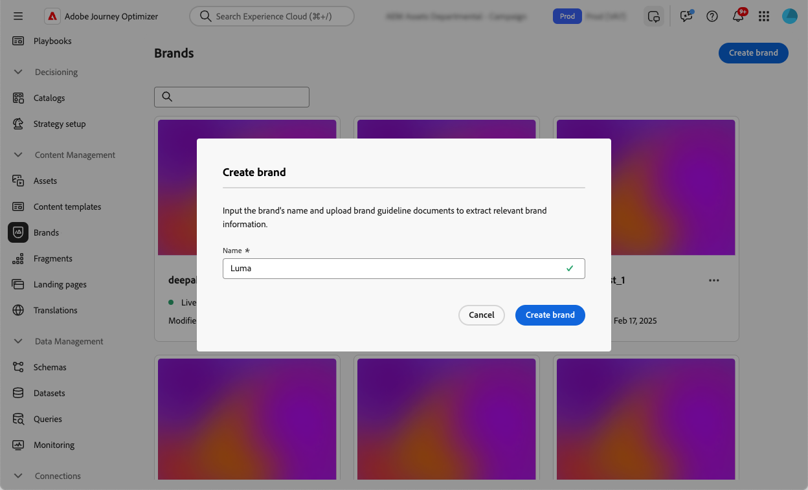

# Skapa och hantera varumärken {#brands}

>[!AVAILABILITY]
>
>Den här funktionen är en privat betaversion. Den kommer att finnas tillgänglig successivt för alla kunder i framtida versioner.

Varumärkesriktlinjerna är en detaljerad uppsättning regler och standarder som bygger upp ett varumärkes visuella och verbala identitet. De fungerar som referenser för att upprätthålla en enhetlig varumärkesrepresentation på alla marknadsförings- och kommunikationsplattformar.

I [!DNL Journey Optimizer] har du nu möjlighet att ange och ordna din varumärkesinformation manuellt eller överföra varumärkesriktlinjer för automatisk informationshämtning.

## Åtkomstvarumärken {#generative-access}

För att få åtkomst till menyn **[!UICONTROL Brands]** i [!DNL Adobe Journey Optimizer] måste användarna beviljas behörigheterna **[!UICONTROL Managed brand kit]** eller **[!UICONTROL Enable AI assistant]**. [Läs mer](../administration/permissions.md)

+++  Lär dig hur du tilldelar varumärkesrelaterade behörigheter

1. Gå till fliken **Roller** i produkten **Behörigheter** och välj önskad **roll**.

1. Klicka på **Redigera** om du vill ändra behörigheterna.

1. Lägg till resursen **AI Assistant** och välj sedan **Hanterat varumärkespaket** eller **[!UICONTROL Enable Ai assistant]** i listrutan.

   Observera att behörigheten **[!UICONTROL Enable Ai assistant]** endast ger skrivskyddad åtkomst till menyn Varumärke.

   {zoomable="yes"}

1. Klicka på **Spara** om du vill använda ändringarna.

   Alla användare som redan har tilldelats den här rollen får sina behörigheter automatiskt uppdaterade.

1. Om du vill tilldela den här rollen till nya användare går du till fliken **Användare** på kontrollpanelen **Roller** och klickar på **Lägg till användare**.

1. Ange användarens namn, e-postadress eller välj i listan och klicka sedan på **Spara**.

1. Om användaren inte har skapats tidigare, se [den här dokumentationen](https://experienceleague.adobe.com/en/docs/experience-platform/access-control/abac/permissions-ui/users).

+++

## Skapa ditt varumärke {#create-brand-kit}

Om du vill skapa och hantera din varumärkesriktlinje kan du antingen ange detaljerna själv eller överföra ditt varumärkesriktlinjer så att informationen extraheras automatiskt:

1. Klicka på **[!UICONTROL Create brand]** på menyn **[!UICONTROL Brands]**.

   

1. Ange en **[!UICONTROL Name]** för ditt varumärke <!--and a **[!UICONTROL Description]** to your brand guideline-->.

   

<!--

[Upload feature currently behind feature flag so hidden from doc - should be available again by EOM (Feb)]

1. Drag and drop or select your file to upload your brand guidelines and extract automatically relevant brand information. Click **[!UICONTROL Create brand]**.

    The information extraction process now begins. Note that it may take several minutes to complete.

    

1. Your Content and visual creation standards are now automatically populated. Browse through the different tabs to adapt the information as needed.

-->

1. Klicka på  på fliken **[!UICONTROL Writing Style]** för att lägga till en stödlinje eller ett undantag. Du kan också lägga till exempel.

   

1. Klicka på  på fliken **[!UICONTROL Visual content]** om du vill lägga till ytterligare en stödlinje eller ett undantag.

1. Klicka på **[!UICONTROL Select image]** om du vill lägga till ett bildexempel. Du kan också lägga till en bild som visar felaktig användning som ett exkluderingsexempel.

   

1. Klicka på **[!UICONTROL Save]** och sedan **[!UICONTROL Publish]** för att göra dina varumärkesriktlinjer tillgängliga i AI-assistenten.

1. Klicka på **[!UICONTROL Edit brand]** om du vill ändra det publicerade varumärket. Observera att detta skapar en temporär kopia i redigeringsläge och ersätter den publicerade versionen.

   

1. Öppna den avancerade menyn på din **[!UICONTROL Brands]**-kontrollpanel genom att klicka på ikonen  för att:

   * Visa varumärke
   * Redigera
   * Duplicera
   * Publicera
   * Avpublicera
   * Ta bort

   

Riktlinjerna för varumärken finns nu i listrutan Varumärken i AI-assistentmenyn, vilket gör att du kan generera innehåll och resurser som är anpassade efter dina specifikationer. [Läs mer om AI-assistenten](gs-generative.md)

