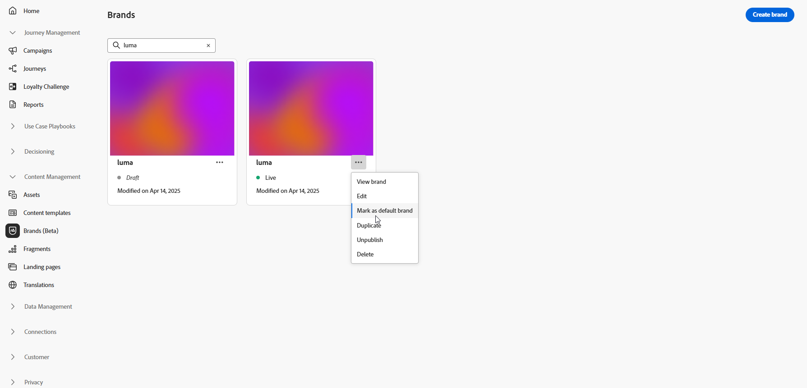

# Skapa och hantera varumärken {#brands}

>[!CONTEXTUALHELP]
>id="ajo_brand_overview"
>title="Kom igång med varumärken"
>abstract="Skapa och anpassa egna varumärken för att definiera din unika visuella och verbala identitet samtidigt som det blir enklare att generera innehåll som matchar varumärkets stil och röst."

>[!CONTEXTUALHELP]
>id="ajo_brand_ai_menu"
>title="Välj ditt varumärke"
>abstract="Välj ert varumärke för att se till att allt AI-genererat innehåll är anpassat efter varumärkets specifikationer och riktlinjer."

>[!CONTEXTUALHELP]
>id="ajo_brand_score_overview"
>title="Märkesmarkering"
>abstract="Välj ert varumärke för att säkerställa att ert innehåll utformas i enlighet med dess specifika riktlinjer, standarder och identitet, samtidigt som ni upprätthåller enhetlighet och varumärkesintegritet."

Varumärkesriktlinjerna är en detaljerad uppsättning regler och standarder som bygger upp ett varumärkes visuella och verbala identitet. De fungerar som referenser för att upprätthålla en enhetlig varumärkesrepresentation på alla marknadsförings- och kommunikationsplattformar.

I [!DNL Journey Optimizer] har du nu möjlighet att ange och ordna din varumärkesinformation manuellt eller överföra varumärkesriktlinjer för automatisk informationshämtning.

>[!AVAILABILITY]
>
>Du måste godkänna [användaravtalet](https://www.adobe.com/legal/licenses-terms/adobe-dx-gen-ai-user-guidelines.html){target="_blank"} innan du kan använda AI-assistenten i Adobe Journey Optimizer. Kontakta din Adobe-representant om du vill veta mer.

## Få tillgång till varumärken {#generative-access}

För att få åtkomst till menyn **[!UICONTROL Brands]** i [!DNL Adobe Journey Optimizer] måste användarna beviljas behörigheterna **[!UICONTROL Manage brand kit]** eller **[!UICONTROL Enable AI assistant]**. [Läs mer](../administration/permissions.md)

+++  Lär dig hur du tilldelar varumärkesrelaterade behörigheter

Så här tilldelar du behörigheter för varumärken:

1. Gå till fliken **Roller** i produkten **Behörigheter** och välj önskad **roll**.

1. Klicka på **Redigera** om du vill ändra behörigheterna.

1. Lägg till resursen **AI Assistant** och välj sedan **Hantera varumärkespaket** eller **[!UICONTROL Enable Ai assistant]** i listrutan.

   Observera att behörigheten **[!UICONTROL Enable Ai assistant]** endast ger skrivskyddad åtkomst till menyn **[!UICONTROL Brands]**.

   {zoomable="yes"}

1. Klicka på **Spara** om du vill använda ändringarna.

   Alla användare som redan har tilldelats den här rollen får sina behörigheter automatiskt uppdaterade.

1. Om du vill tilldela den här rollen till nya användare går du till fliken **Användare** på kontrollpanelen **Roller** och klickar på **Lägg till användare**.

1. Ange användarens namn, e-postadress eller välj i listan och klicka sedan på **Spara**.

1. Om användaren inte har skapats tidigare, se [den här dokumentationen](https://experienceleague.adobe.com/sv/docs/experience-platform/access-control/abac/permissions-ui/users).

+++

## Skapa och hantera ert varumärke {#create-brand-kit}

>[!CONTEXTUALHELP]
>id="ajo_brands_create"
>title="Skapa ert varumärke"
>abstract="Ange ditt varumärkesnamn och överför din varumärkesstödfil. Verktyget extraherar automatiskt nyckeldetaljer, vilket gör det enklare att behålla varumärkets identitet."

Om du vill skapa och hantera varumärkesriktlinjerna kan du antingen ange detaljerna själv eller överföra dokumentet med varumärkesriktlinjer så att informationen extraheras automatiskt:

1. Klicka på **[!UICONTROL Brands]** på menyn **[!UICONTROL Create brand]**.

   

1. Ange en **[!UICONTROL Name]** för ditt varumärke.

1. Dra och släpp eller markera filen för att ladda upp varumärkesriktlinjerna och extrahera automatiskt relevant varumärkesinformation. Klicka på **[!UICONTROL Create brand]**.

   Processen för informationsextrahering börjar nu. Observera att det kan ta flera minuter att slutföra.

   

1. Standarderna för att skapa innehåll och visuellt innehåll är nu automatiskt ifyllda. Bläddra bland de olika flikarna för att anpassa informationen efter behov. [Läs mer](#personalize)

1. På den avancerade menyn i varje avsnitt eller kategori kan du lägga till referenser för att automatiskt extrahera relevant varumärkesinformation eller köra extraheringen på nytt för att uppdatera befintliga riktlinjer.

   Använd alternativen **[!UICONTROL Clear section]** eller **[!UICONTROL Clear category]** om du vill ta bort befintligt innehåll.

   

1. Klicka på **[!UICONTROL Filter]** om du vill filtrera riktlinjer efter kanal- eller elementtyp.

   

1. När konfigurationen är klar klickar du på **[!UICONTROL Save]** och sedan på **[!UICONTROL Publish]** för att göra din varumärkesriktlinje tillgänglig i AI Assistant.

1. Klicka på **[!UICONTROL Edit brand]** om du vill ändra det publicerade varumärket.

   >[!NOTE]
   >
   >Detta skapar en temporär kopia i redigeringsläge och ersätter den publicerade versionen.

   

1. Öppna den avancerade menyn på din **[!UICONTROL Brands]**-kontrollpanel genom att klicka på ikonen  för att:

   * Visa varumärke
   * Öppna på ny flik
   * Redigera
   * Markera som standardmärke
   * Duplicera
   * Publicera
   * Avpublicera
   * Ta bort

   

Riktlinjerna för ditt varumärke finns nu i listrutan **[!UICONTROL Brand]** i AI Assistant-menyn, vilket gör det möjligt att generera innehåll och resurser som är anpassade till dina specifikationer. [Läs mer om AI Assistant](gs-generative.md)

### Ange ett standardmärke {#default-brand}

Du kan ange att ett standardvarumärke ska tillämpas automatiskt när du genererar innehåll och beräknar justeringspoäng när kampanjer skapas.

Om du vill ange ett standardmärke går du till **[!UICONTROL Brands]**-instrumentpanelen. Öppna den avancerade menyn genom att klicka på ikonen  och välja **[!UICONTROL Mark as default brand]**.

