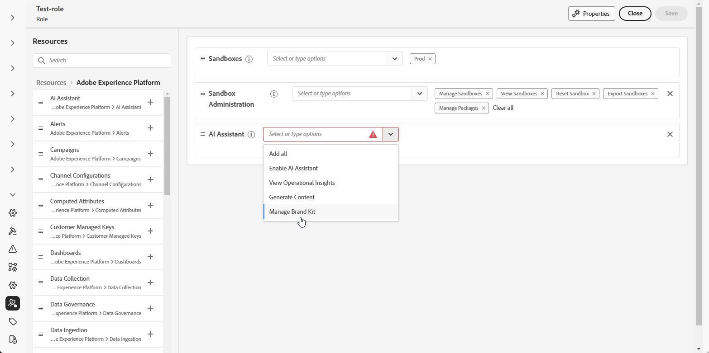
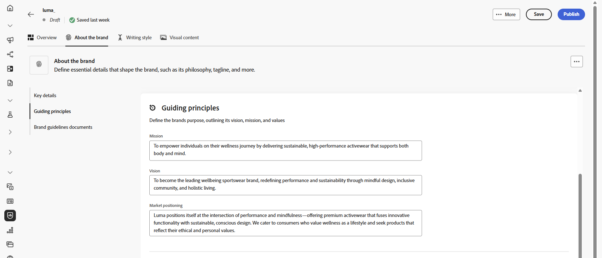
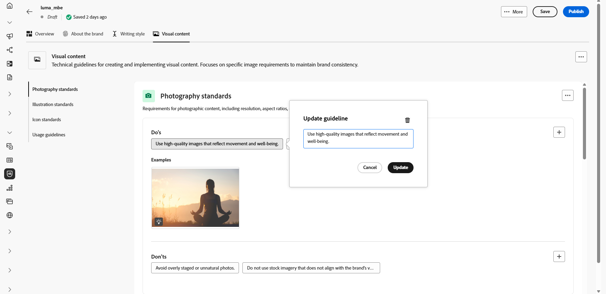

# Skapa och hantera varumärken {#brands}

>[!CONTEXTUALHELP]
>id="ajo_brand_overview"
>title="Kom igång med varumärken"
>abstract="Skapa och anpassa egna varumärken för att definiera din unika visuella och verbala identitet samtidigt som det blir enklare att generera innehåll som matchar varumärkets stil och röst."

>[!CONTEXTUALHELP]
>id="ajo_brand_ai_menu"
>title="Välj ditt varumärke"
>abstract="Välj ert varumärke för att se till att allt AI-genererat innehåll är anpassat efter varumärkets specifikationer och riktlinjer."

>[!CONTEXTUALHELP]
>id="ajo_brand_score_overview"
>title="Märkesmarkering"
>abstract="Välj ert varumärke för att säkerställa att ert innehåll utformas i enlighet med dess specifika riktlinjer, standarder och identitet, samtidigt som ni upprätthåller enhetlighet och varumärkesintegritet."

Varumärkesriktlinjerna är en detaljerad uppsättning regler och standarder som bygger upp ett varumärkes visuella och verbala identitet. De fungerar som referenser för att upprätthålla en enhetlig varumärkesrepresentation på alla marknadsförings- och kommunikationsplattformar.

I [!DNL Journey Optimizer] har du nu möjlighet att ange och ordna din varumärkesinformation manuellt eller överföra varumärkesriktlinjer för automatisk informationshämtning.

>[!AVAILABILITY]
>
>Du måste godkänna [användaravtalet](https://www.adobe.com/legal/licenses-terms/adobe-dx-gen-ai-user-guidelines.html){target="_blank"} innan du kan använda AI-assistenten i Adobe Journey Optimizer. Kontakta din Adobe-representant om du vill veta mer.

## Få tillgång till varumärken {#generative-access}

För att få åtkomst till menyn **[!UICONTROL Brands]** i [!DNL Adobe Journey Optimizer] måste användarna beviljas behörigheterna **[!UICONTROL Manage brand kit]** eller **[!UICONTROL Enable AI assistant]**. [Läs mer](../administration/permissions.md)

+++  Lär dig hur du tilldelar varumärkesrelaterade behörigheter

Så här tilldelar du behörigheter för varumärken:

1. Gå till fliken **Roller** i produkten **Behörigheter** och välj önskad **roll**.

1. Klicka på **Redigera** om du vill ändra behörigheterna.

1. Lägg till resursen **AI Assistant** och välj sedan **Hantera varumärkespaket** eller **[!UICONTROL Enable Ai assistant]** i listrutan.

   Observera att behörigheten **[!UICONTROL Enable Ai assistant]** endast ger skrivskyddad åtkomst till menyn **[!UICONTROL Brands]**.

   {zoomable="yes"}

1. Klicka på **Spara** om du vill använda ändringarna.

   Alla användare som redan har tilldelats den här rollen får sina behörigheter automatiskt uppdaterade.

1. Om du vill tilldela den här rollen till nya användare går du till fliken **Användare** på kontrollpanelen **Roller** och klickar på **Lägg till användare**.

1. Ange användarens namn, e-postadress eller välj i listan och klicka sedan på **Spara**.

1. Om användaren inte har skapats tidigare, se [den här dokumentationen](https://experienceleague.adobe.com/sv/docs/experience-platform/access-control/abac/permissions-ui/users).

+++

## Skapa och hantera ert varumärke {#create-brand-kit}

>[!CONTEXTUALHELP]
>id="ajo_brands_create"
>title="Skapa ert varumärke"
>abstract="Ange ditt varumärkesnamn och överför din varumärkesstödfil. Verktyget extraherar automatiskt nyckeldetaljer, vilket gör det enklare att behålla varumärkets identitet."

Om du vill skapa och hantera varumärkesriktlinjerna kan du antingen ange detaljerna själv eller överföra dokumentet med varumärkesriktlinjer så att informationen extraheras automatiskt:

1. Klicka på **[!UICONTROL Brands]** på menyn **[!UICONTROL Create brand]**.

   

1. Ange en **[!UICONTROL Name]** för ditt varumärke.

1. Dra och släpp eller markera filen för att ladda upp varumärkesriktlinjerna och extrahera automatiskt relevant varumärkesinformation. Klicka på **[!UICONTROL Create brand]**.

   Processen för informationsextrahering börjar nu. Observera att det kan ta flera minuter att slutföra.

   

1. Standarderna för att skapa innehåll och visuellt innehåll är nu automatiskt ifyllda. Bläddra bland de olika flikarna för att anpassa informationen efter behov. [Läs mer](#personalize)

1. På den avancerade menyn i varje avsnitt eller kategori kan du lägga till referenser för att extrahera relevant varumärkesinformation automatiskt.

   Använd alternativen **[!UICONTROL Clear section]** eller **[!UICONTROL Clear category]** om du vill ta bort befintligt innehåll.

   

1. När konfigurationen är klar klickar du på **[!UICONTROL Save]** och sedan på **[!UICONTROL Publish]** för att göra din varumärkesriktlinje tillgänglig i AI Assistant.

1. Klicka på **[!UICONTROL Edit brand]** om du vill ändra det publicerade varumärket.

   >[!NOTE]
   >
   >Detta skapar en temporär kopia i redigeringsläge och ersätter den publicerade versionen.

   

1. Öppna den avancerade menyn på din **[!UICONTROL Brands]**-kontrollpanel genom att klicka på ikonen  för att:

   * Visa varumärke
   * Redigera
   * Duplicera
   * Publicera
   * Avpublicera
   * Ta bort

   

Riktlinjerna för ditt varumärke finns nu i listrutan **[!UICONTROL Brand]** i AI Assistant-menyn, vilket gör det möjligt att generera innehåll och resurser som är anpassade till dina specifikationer. [Läs mer om AI Assistant](gs-generative.md)

### Ange ett standardmärke {#default-brand}

Du kan ange att ett standardvarumärke ska tillämpas automatiskt när du genererar innehåll och beräknar justeringspoäng när kampanjer skapas.

Om du vill ange ett standardmärke går du till **[!UICONTROL Brands]**-instrumentpanelen. Öppna den avancerade menyn genom att klicka på ikonen  och välja **[!UICONTROL Mark as default brand]**.

## Anpassa ert varumärke {#personalize}

### Om varumärket {#about-brand}

Använd fliken **[!UICONTROL About the brand]** för att etablera varumärkets kärnidentitet, som visar dess syfte, personlighet, tagline och andra definitionsattribut.

1. Börja med att fylla i den grundläggande informationen för ditt varumärke i kategorin **[!UICONTROL Key details]**:

   * **[!UICONTROL Brand Kit Name]**: Ange namnet på varumärkespaketet.

   * **[!UICONTROL When to Use]**: Ange scenarier eller kontexter där varumärkespaketet ska användas.

   * **[!UICONTROL Brand Name]**: Ange varumärkets officiella namn.

   * **[!UICONTROL Brand Description]**: Ge en översikt över vad det här varumärket representerar.

   * **[!UICONTROL Default Tagline]**: Lägg till den primära tagline som är associerad med varumärket.

     

1. I kategorin **[!UICONTROL Guiding principles]** klargör du varumärkets huvudriktning och filosofi:

   * **[!UICONTROL Mission]**: Ange varumärkets syfte.

   * **[!UICONTROL Vision]**: Beskriv ditt långsiktiga mål eller önskat framtida tillstånd.

   * **[!UICONTROL Market Positioning]**: Förklara hur ert varumärke är positionerat på marknaden.

     

1. Klicka på **[!UICONTROL Core brand values]** Dive image alt text om du vill lägga till varumärkets kärnvärden och fylla i informationen:

   * **[!UICONTROL Value]**: Namnge ett kärnvarumärke.

   * **[!UICONTROL Description]**: Förklara vad det här värdet betyder för ditt varumärke.

   * **[!UICONTROL Behaviors]**: Skapa en kontur för de åtgärder eller attityder som återspeglar det här värdet i praktiken.

   * **[!UICONTROL Manifestations]**: Ge exempel på hur det här värdet uttrycks i varumärken.

     

1. Om det behövs klickar du på ikonen för att uppdatera eller ta bort ett av ert varumärke.

   

Du kan nu anpassa ditt varumärke ytterligare eller [publicera ditt varumärke](#create-brand-kit).

### Skrivstil {#writing-style}

>[!CONTEXTUALHELP]
>id="ajo_brand_writing_style"
>title="Skriva justeringsmusik"
>abstract="I avsnittet Skrivstil definieras standarder för språk, formatering och struktur för att säkerställa tydligt och enhetligt innehåll. Justeringspoängen, som har klassificerats från hög till låg, visar hur väl innehållet följer dessa riktlinjer och markerar områden som kan förbättras."

Avsnittet **[!UICONTROL Writing style]** beskriver standarderna för att skriva innehåll, med information om hur språk, formatering och struktur ska användas för att bibehålla tydlighet, konsekvens och konsekvens i alla material.

+++ Tillgänglig kategori och exempel

<table>
  <thead>
    <tr>
      <th>Kategori</th>
      <th>Underkategori</th>
      <th>Riktlinjer, exempel</th>
      <th>Exempel på undantag</th>
    </tr>
  </thead>
  <tbody>
    <tr>
      <td rowspan="4">Standarder för att skapa innehåll</td>
      <td>Varumärkesmeddelandestandarder</td>
      <td>Lyft fram innovation och budskap som sätter kunden i första rummet.</td>
      <td>Övertyga inte produktfunktionerna.</td>
    </tr>
    <tr>
      <td>Användning med tagline</td>
      <td>Placera tagline under logotypen på alla digitala marknadsföringsresurser.</td>
      <td>Ändra eller översätt inte tagline.</td>
    </tr>
    <tr>
      <td>Core Messaging</td>
      <td>Viktigt om de viktigaste fördelarna - till exempel ökad produktivitet.</td>
      <td>Använd inte orelaterade värdeförslag.</td>
    </tr>
    <tr>
      <td>Namngivningsstandarder</td>
      <td>Använd enkla, beskrivande namn som "ProScheduler".</td>
      <td>Använd inte komplexa termer eller specialtecken.</td>
    </tr>
    <tr>
      <td rowspan="5">Format för varumärkeskommunikation</td>
      <td>Varumärkespersonalitet</td>
      <td>Lätt och lättåtkomligt.</td>
      <td>Var inte besegrad.</td>
    </tr>
    <tr>
      <td>Skrivmekanism</td>
      <td>Håll meningarna korta och slagkraftiga.</td>
      <td>Använd inte för mycket jargon.</td>
    </tr>
    <tr>
      <td>Situationen - ton</td>
      <td>Bibehåll en professionell ton inom kriskommunikation.</td>
      <td>Avvisa inte supportkommunikation.</td>
    </tr>
    <tr>
      <td>Riktlinjer för Word-val</td>
      <td>Använd ord som"innovativ" och"smart".</td>
      <td>Undvik ord som "billig" eller "hack".</td>
    </tr>
    <tr>
      <td>Språkstandarder</td>
      <td>Följ amerikansk engelska konventioner.</td>
      <td>Blanda inte engelska och amerikanska stavningar.</td>
    </tr>
    <tr>
      <td rowspan="3">Regler för regelefterlevnad</td>
      <td>Varumärkesstandarder</td>
      <td>Använd alltid symbolen ™ eller ®.</td>
      <td>Utelämna inte giltiga symboler vid behov.</td>
    </tr>
    <tr>
      <td>Copyrightstandarder</td>
      <td>Inkludera copyrightmeddelanden i marknadsföringsmaterial.</td>
      <td>Använd inte innehåll från tredje part utan tillstånd.</td>
    </tr>
    <tr>
      <td>Friskrivningsstandarder</td>
      <td>Visa ansvarsfriskrivningar på ett läsligt sätt om digitala resurser.</td>
      <td>Dölj inte ansvarsfriskrivningar i områden som inte är synliga.</td>
    </tr>
</table>

+++

 

Så här anpassar du din **[!UICONTROL Writing Style]**:

1. Klicka på **[!UICONTROL Writing Style]** på fliken  för att lägga till en stödlinje, ett undantag eller ett undantag.

1. Ange riktlinjer, undantag eller undantag. Du kan även inkludera **[!UICONTROL Examples]** för att bättre illustrera hur det ska användas.

   

1. Ange användningssammanhanget för din riktlinje, undantag eller undantag:

   * **[!UICONTROL Channel type]**: Välj var den här riktlinjen, undantaget eller undantaget ska gälla. Du kanske vill att ett specifikt textformat endast ska visas i e-post, mobil, utskrift eller andra kommunikationskanaler.

   * **[!UICONTROL Element type]**: Ange vilket innehållselement regeln gäller för. Detta kan omfatta element som rubriker, knappar, länkar eller andra komponenter i innehållet.

     

1. Klicka på **[!UICONTROL Add]** när du har ställt in din riktlinje, undantag eller undantag.

1. Om det behövs kan du välja en av stödlinjerna eller uteslutningen som du vill uppdatera eller ta bort.

1. Klicka på  om du vill redigera ditt exempel eller på ikonen om du vill ta bort den.

   

Du kan nu anpassa ditt varumärke ytterligare eller [publicera ditt varumärke](#create-brand-kit).

### Visual content {#visual-content}

>[!CONTEXTUALHELP]
>id="ajo_brand_imagery"
>title="Poäng för visuell innehållsjustering"
>abstract="Visuell innehållsanpassning visar hur väl innehållet matchar de konfigurerade varumärkesriktlinjerna. Om du väljer en justering från hög till låg blir det enklare att snabbt bedöma justeringen. Utforska de olika kategorierna för att identifiera områden som kan förbättras och hitta element som inte är varumärkesskyddade."

Avsnittet **[!UICONTROL Visual Content]** definierar standarderna för bilder och design och anger de specifikationer som behövs för att upprätthålla en enhetlig och enhetlig varumärkeslook.

+++ Tillgängliga kategorier och exempel

<table>
  <thead>
    <tr>
      <th>Kategori</th>
      <th>Riktlinjer, exempel</th>
      <th>Exempel på undantag</th>
    </tr>
  </thead>
  <tbody>
    <tr>
      <td>Fotografistandarder</td>
      <td>Använd naturligt ljus för bilder utomhus.</td>
      <td>Undvik överredigerade och pixelerade bilder.</td>
    </tr>
    <tr>
      <td>Illustrationsstandarder</td>
      <td>Använd rena, minimalistiska stilar.</td>
      <td>Undvik alltför komplex användning.</td>
    </tr>
    <tr>
      <td>Ikonstandarder</td>
      <td>Använd ett enhetligt rutnätssystem med 24 pixlar.</td>
      <td>Blanda inte ikondimensioner, använd inkonsekventa linjebredder eller avvika från stödrasterreglerna.</td>
    </tr>
    <tr>
      <td>Riktlinjer för användning</td>
      <td>Välj livsstilsbilder som återspeglar verkliga kunder som använder produkten i professionella miljöer.</td>
      <td>Använd inte bilder som står i strid med varumärkestonen eller som inte är i sitt sammanhang.</td>
    </tr>
</table>

+++

 

Så här anpassar du din **[!UICONTROL Visual content]**:

1. Klicka på **[!UICONTROL Visual content]** på fliken  för att lägga till en stödlinje, ett undantag eller ett exempel.

1. Ange stödlinje, undantag eller exempel.

   

1. Ange användningssammanhanget för din riktlinje eller exkludering:

   * **[!UICONTROL Channel type]**: Välj var den här riktlinjen, undantaget eller undantaget ska gälla. Du kanske vill att ett specifikt textformat endast ska visas i e-post, mobil, utskrift eller andra kommunikationskanaler.

   * **[!UICONTROL Element type]**: Ange vilket innehållselement regeln gäller för. Detta kan omfatta element som rubriker, knappar, länkar eller andra komponenter i innehållet.

     

1. Klicka på **[!UICONTROL Add]** när du har ställt in din riktlinje, undantag eller undantag.

1. Om du vill lägga till en bild som visar korrekt användning väljer du **[!UICONTROL Example]** och klickar på **[!UICONTROL Select image]**. Du kan också lägga till en bild som visar felaktig användning som ett exkluderingsexempel.

   

1. Om det behövs kan du välja en av stödlinjerna eller uteslutningen som du vill uppdatera eller ta bort.

1. Välj en stödlinje eller uteslutning för att uppdatera den. Klicka på ikonen för att ta bort den.

   

Du kan nu anpassa ditt varumärke ytterligare eller [publicera ditt varumärke](#create-brand-kit).

