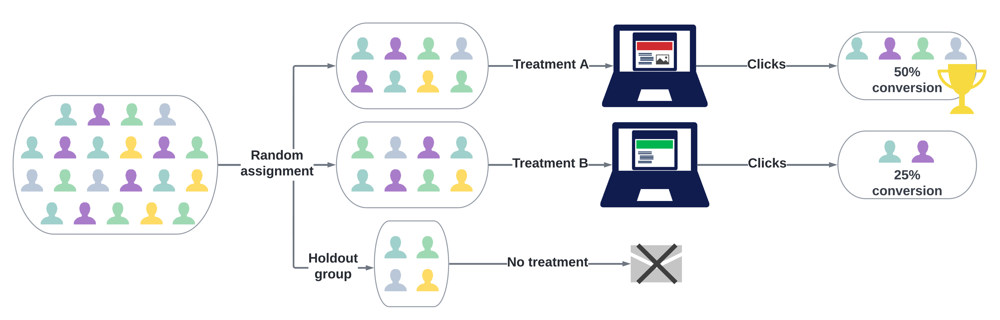

# Skapa ett innehållsexperiment {#content-experiment}

>[!CONTEXTUALHELP]
>id="ajo_campaigns_content_experiment"
>title="Innehållsexperiment"
>abstract="Du kan välja att ändra meddelandets innehåll eller ämne för att definiera flera behandlingar och avgöra den bästa kombinationen för era målgrupper."

>[!NOTE]
>
>Innan du börjar med Content Experiment bör du kontrollera att rapportkonfigurationen är inställd för dina anpassade datauppsättningar. Läs mer i [det här avsnittet](../reports/reporting-configuration.md).

Med Journey Optimizer Content Experiment kan ni definiera flera olika leveranssätt för att mäta vilken som fungerar bäst för er målgrupp. Du kan välja att variera leveransinnehållet eller ämnet. Intressemålgruppen fördelas slumpmässigt till varje behandling för att avgöra vilken som fungerar bäst med det angivna mätvärdet.

I exemplet nedan har leveransmålet delats upp i två grupper, som var och en representerar 45 % av målpopulationen, och en slutgruppsgrupp på 10 % som inte får leveransen.

Varje person i målgruppen får en version av ett e-postmeddelande med en ämnesrad som är en av följande två:

* en som direkt marknadsför ett 10-procentigt erbjudande på den nya samlingen och en bild.
* den andra bara ger ut ett specialerbjudande utan att ange 10 % rabatt utan någon bild.

Målet här är att se om mottagarna kommer att interagera med e-postmeddelandet beroende på det mottagna experimentet. Därför kommer vi att välja **[!UICONTROL Email Opens]** som det primära målmåttet i den här innehållsexperimenten.

➡️ Lär dig hur du använder innehållsexperiment för att jämföra beslut med den kodbaserade upplevelsekanalen i [det här användningsexemplet](../experience-decisioning/experience-decisioning-uc.md).

## Skapa innehåll {#campaign-experiment}

1. Börja med att skapa och konfigurera din [kampanj](../campaigns/create-campaign.md) eller [resa](../building-journeys/journeys-message.md) enligt dina krav.

1. Börja personalisera behandling A från fönstret **[!UICONTROL Edit content]**.

   För den här behandlingen ska vi specificera specialerbjudandet direkt i ämnesraden och lägga till personalisering.

   

1. Skapa eller importera ditt ursprungliga innehåll och anpassa det efter behov.

## Konfigurera ditt innehållsexperiment {#configure-experiment}

>[!CONTEXTUALHELP]
>id="ajo_campaigns_content_experiment_dimension"
>title="Dimension"
>abstract="Välj vilken dimension du vill spåra för din experiment, till exempel specifika klick eller vyer med specifika sidor."

>[!CONTEXTUALHELP]
>id="ajo_campaigns_content_experiment_success_metric"
>title="Resultatmått"
>abstract="Resultatmått används för att spåra och utvärdera den bästa behandlingen i ett experiment. Var noga med att konfigurera datauppsättningen för vissa mätvärden innan du använder den."

>[!AVAILABILITY]
>
>Direct Mail har stöd för funktionen Holdout, men för närvarande saknar stöd för Beställningar.

Du kan välja mellan tre olika typer av experiment:

* **[!UICONTROL A/B experiment]**: Definiera trafikuppdelningen mellan behandlingar i början av testet. Prestanda utvärderas baserat på det primära mätresultat du valt, Experimentation Accelerator, och rapporterar sedan den observerade lyften mellan behandlingarna.

* **[!UICONTROL Multi-armed bandit]**: trafikdelning mellan behandlingar hanteras automatiskt. Var 7:e dag granskas resultatet för det primära mätvärdet och vikterna justeras därefter. Rapporteringen i Experimentation Accelerator fortsätter att visa Lyft som A/B-tester.

* **[!UICONTROL Bring your own Multi-armed bandit]**: trafikdelning mellan behandlingar hanteras automatiskt. Du kan bestämma när och hur den ska ändras med Experiment API:er för att justera allokeringar i realtid.

➡️ [Läs mer om skillnaden mellan A/B-experiment och multiväpnade bandit-experiment](mab-vs-ab.md)

>[!BEGINTABS]

>[!TAB A/B-experiment]

1. När ditt meddelande har anpassats klickar du på **[!UICONTROL Actions]** på fliken **[!UICONTROL Create experiment]** för att börja konfigurera ditt innehållsexperiment.

   

1. Välj den **[!UICONTROL Success metric]** som du vill ange för ditt experiment.

   I det här exemplet väljer du **[!UICONTROL Email open]** om du vill testa om profilerna öppnar sina e-postmeddelanden om kampanjkoden finns på ämnesraden.

   

1. När du konfigurerar ett experiment med hjälp av InApp- eller webbkanalen och väljer **[!UICONTROL Inbound Clicks]**, **[!UICONTROL Unique Inbound Clicks]**, **[!UICONTROL Page Views]** eller **[!UICONTROL Unique Page Views metrics]** kan du med hjälp av fältet **[!UICONTROL Dimensions]** spåra och övervaka klick och vyer på specifika sidor.

   

1. Om du har skapat en API-utlöst kampanj väljer du **[!UICONTROL A/B Experiment]** i listrutan **[!UICONTROL Experiment type]**.

1. Klicka på **[!UICONTROL Add treatment]** för att skapa så många nya behandlingar som behövs.

   

   >[!CAUTION]
   >
   >Observera följande begränsningar när du skapar ett kodbaserat experiment:
   >* **Behandlingsantal**: Om du skapar fler än 3-5 behandlingar kan prestanda- och gränssnittsproblem uppstå. Om du råkar ut för fel när du lägger till behandlingar kan du försöka minska antalet behandlingar eller lägga till dem stegvis tills problemet är löst.
   >* **Reserverade nyckelord**: Undvik att använda reserverade nyckelord som &quot;holdout&quot; i dina behandlingsnamn, eftersom detta kan orsaka mappningsfel för beslutsnoder och förhindra att experimentet fungerar korrekt.

1. Ändra **[!UICONTROL Title]** för din behandling så att du bättre kan skilja dem åt.

1. Välj att lägga till en **[!UICONTROL Holdout]**-grupp i leveransen. Den här gruppen kommer inte att få något innehåll från den här kampanjen.

   Om du aktiverar alternativfältet tar det automatiskt 10 % av din befolkning. Du kan justera procentandelen om det behövs.

   >[!IMPORTANT]
   >
   >När en utelämningsgrupp används i en åtgärd för innehållsexperimenterande gäller grupptilldelningen endast den specifika åtgärden. När åtgärden är slutförd kommer profilerna i den utelåsta gruppen att fortsätta längs vägen och kan ta emot meddelanden från andra åtgärder. Se därför till att efterföljande meddelanden inte är beroende av att ett meddelande tas emot av en profil som kan finnas i en utskicksgrupp. Om de gör det kan du behöva ta bort grupptilldelningen.

   

1. Du kan sedan välja att tilldela en exakt procentsats till varje **[!UICONTROL Treatment]** eller bara växla till **[!UICONTROL Distribute evenly]**-växlingsfältet.

   

1. Gör det möjligt för det automatiska skalningsförsöket att automatiskt ta fram den vinnande variationen av ditt experiment. [Läs mer om hur du kan skala vinnaren](#scale-winner)

   

1. Klicka på **[!UICONTROL Create]** när konfigurationen är inställd.

>[!TAB Flerarmad bandit]

Observera att multiväpnat bandit-experiment endast är tillgängligt med följande:

* Inkommande kanaler
* Unitary Journeys
* API-utlösta kampanjer (både transaktionella och operativa)
* Utgående kanaler om schemat återkommer

1. När ditt meddelande har anpassats klickar du på **[!UICONTROL Actions]** på fliken **[!UICONTROL Create experiment]** för att börja konfigurera ditt innehållsexperiment.

   

1. Välj den **[!UICONTROL Success metric]** som du vill ange för ditt experiment.

   I det här exemplet väljer du **[!UICONTROL Email open]** om du vill testa om profilerna öppnar sina e-postmeddelanden om kampanjkoden finns på ämnesraden.

   

1. Om du har skapat en API-utlöst kampanj väljer du **[!UICONTROL Multi-armed bandit]** i listrutan **[!UICONTROL Experiment type]**.

   

1. Klicka på **[!UICONTROL Add treatment]** för att skapa så många nya behandlingar som behövs.

   

1. Ändra **[!UICONTROL Title]** för din behandling så att du bättre kan skilja dem åt.

1. Välj att lägga till en **[!UICONTROL Holdout]**-grupp i leveransen. Den här gruppen kommer inte att få något innehåll från den här kampanjen.

   Om du aktiverar alternativfältet tar det automatiskt 10 % av din befolkning. Du kan justera procentandelen om det behövs.

   >[!IMPORTANT]
   >
   >När en utelämningsgrupp används i en åtgärd för innehållsexperimenterande gäller grupptilldelningen endast den specifika åtgärden. När åtgärden är slutförd kommer profilerna i den utelåsta gruppen att fortsätta längs vägen och kan ta emot meddelanden från andra åtgärder. Se därför till att efterföljande meddelanden inte är beroende av att ett meddelande tas emot av en profil som kan finnas i en utskicksgrupp. Om de gör det kan du behöva ta bort grupptilldelningen.

   

>[!TAB Ta med din egen beväpnade bandit]

Observera att ett eget multiväpnat bandit-experiment bara är tillgängligt med följande:

* Inkommande kanaler
* Unitary Journeys
* API-utlösta kampanjer (både transaktionella och operativa)
* Utgående kanaler om schemat återkommer

1. När ditt meddelande har anpassats klickar du på **[!UICONTROL Actions]** på fliken **[!UICONTROL Create experiment]** för att börja konfigurera ditt innehållsexperiment.

   

1. Välj den **[!UICONTROL Success metric]** som du vill ange för ditt experiment.

   I det här exemplet väljer du **[!UICONTROL Email open]** om du vill testa om profilerna öppnar sina e-postmeddelanden om kampanjkoden finns på ämnesraden.

   

1. Om du har skapat en API-utlöst kampanj väljer du **[!UICONTROL Bring your own Multi-armed bandit]** i listrutan **[!UICONTROL Experiment type]**.

   

1. Klicka på **[!UICONTROL Add treatment]** för att skapa så många nya behandlingar som behövs.

   

1. Ändra **[!UICONTROL Title]** för din behandling så att du bättre kan skilja dem åt.

1. Välj att lägga till en **[!UICONTROL Holdout]**-grupp i leveransen. Den här gruppen kommer inte att få något innehåll från den här kampanjen.

   Om du aktiverar alternativfältet tar det automatiskt 10 % av din befolkning. Du kan justera procentandelen om det behövs.

   >[!IMPORTANT]
   >
   >När en utelämningsgrupp används i en åtgärd för innehållsexperimenterande gäller grupptilldelningen endast den specifika åtgärden. När åtgärden är slutförd kommer profilerna i den utelåsta gruppen att fortsätta längs vägen och kan ta emot meddelanden från andra åtgärder. Se därför till att efterföljande meddelanden inte är beroende av att ett meddelande tas emot av en profil som kan finnas i en utskicksgrupp. Om de gör det kan du behöva ta bort grupptilldelningen.

   

>[!ENDTABS]

## Utforma dina behandlingar {#treatment-experiment}

1. I fönstret **[!UICONTROL Edit content]** väljer du din behandling B för att ändra innehållet.

   Här väljer vi att inte ange erbjudandet i **[!UICONTROL Subject line]**.

   

1. Klicka på **[!UICONTROL Edit email body]** om du vill anpassa din behandling ytterligare B.

   

1. När du har utformat dina behandlingar klickar du på **[!UICONTROL More actions]** för att komma åt alternativ som är relaterade till dina behandlingar: **[!UICONTROL Rename]**, **[!UICONTROL Duplicate]** och **[!UICONTROL Delete]**.

   

1. Om det behövs kan du gå till **[!UICONTROL Experiment settings]**-menyn och ändra din behandlingskonfiguration.

   

1. När meddelandeinnehållet har definierats klickar du på knappen **[!UICONTROL Simulate content]** för att kontrollera återgivningen av leveransen och kontrollera personaliseringsinställningarna med testprofiler. [Läs mer](../content-management/preview-test.md)

När du har konfigurerat dina experiment kan du följa resultatet av leveransen med din rapport. [Läs mer](../reports/campaign-global-report-cja-experimentation.md)

## Skala vinnaren {#scale-winner}

>[!AVAILABILITY]
>
>The Scale the Winner feature is supported for the following channel:
>
>* Inkommande kanaler (t.ex. webb, meddelande i appen, kodbaserad upplevelse) under alla resor och kampanjer.
>* Utgående kanaler (t.ex. e-post, push-meddelanden, SMS) i API-utlösta transaktionskampanjer.

Skala vinnaren så att ni automatiskt eller manuellt kan lansera den vinnande varianten av ett experiment till er fulla publik. Den här funktionen ser till att du när en vinnare väl har fastställts kan utöka dess räckvidd och effektivitet utan att hela tiden övervaka experimentet.

Du kan välja mellan två lägen:

* **Automatisk skalning**: Konfigurera inställningar för automatisk skalförändring när du skapar ditt experiment genom att välja tid och villkor för skalning av den vinnande behandlingen eller ett reservalternativ om ingen vinnare kommer.

* **Manuell skalning**: Granska experimentresultat manuellt och initiera utrullningen av den vinnande behandlingen, med bibehållen fullständig kontroll över tid och beslut.

### Automatisk skalning {#autoscaling}

Med automatisk skalförändring kan du ange fördefinierade regler för när den vinnande behandlingen eller en reservbehandling ska börja, baserat på resultatet av experimentet.

Observera att när automatisk skalförändring har inträffat är manuell skalförändring inte längre tillgängligt.

Så här aktiverar du automatisk skalförändring i dina experiment:

1. Ställ in kampanjen eller resan och konfigurera ditt experiment efter behov. [Läs mer](#configure-experiment)

1. Aktivera alternativet för automatisk skalförändring när du ställer in ditt experiment.

   

1. Välj när vinnaren ska skalas:

   * Så snart vinnaren hittas.
   * Efter att experimentet är live för den valda tiden.

   Tiden för automatisk skalförändring måste schemaläggas före experimentets slutdatum. Om det är inställt för en tid efter slutdatumet visas en valideringsvarning och kampanjen eller resan publiceras inte.

   

1. Välj reservbeteendet om ingen vinnare hittas efter skaltid:

   * Fortsätt experimentera tills det är slut enligt schema.
   * Skala den alternativa behandlingen efter en viss tid.

När alla parametrar är uppfyllda skickas din vinnande eller alternativa behandling till din målgrupp.

### Manuell skalning {#manual-scaling}

Manuell skalförändring ger dig möjlighet att granska experimentresultat och bestämma när den vinnande behandlingen ska lanseras enligt ditt eget schema.

Observera att om du skalförändrar vinnaren manuellt före den schemalagda tiden för automatisk skalförändring avbryts den automatiska skalförändringen.

Så här skalar du vinnaren av dina experiment manuellt:

1. Ställ in kampanjen eller resan och konfigurera ditt experiment efter behov. [Läs mer](#configure-experiment)

1. Låt experimentet löpa tills en vinnare identifieras eller statistisk signifikans uppnås.

1. Öppna din kampanjinstrumentpanel eller välj kanalaktivitet under din resa.

   Granska resultaten på **[!UICONTROL Content Experiment]**-menyn för att identifiera den bästa behandlingen.

   

1. Klicka på **[!UICONTROL Scale treatment]** om du vill skicka den vinnande behandlingen till resten av publiken.

   

1. Välj den behandling som du vill skala i listrutan och klicka på **[!UICONTROL Scale]**.

   

Observera att det kan ta upp till en timme innan behandlingen skalas. Du får ett meddelande när den manuella skalförändringsprocessen är klar.

