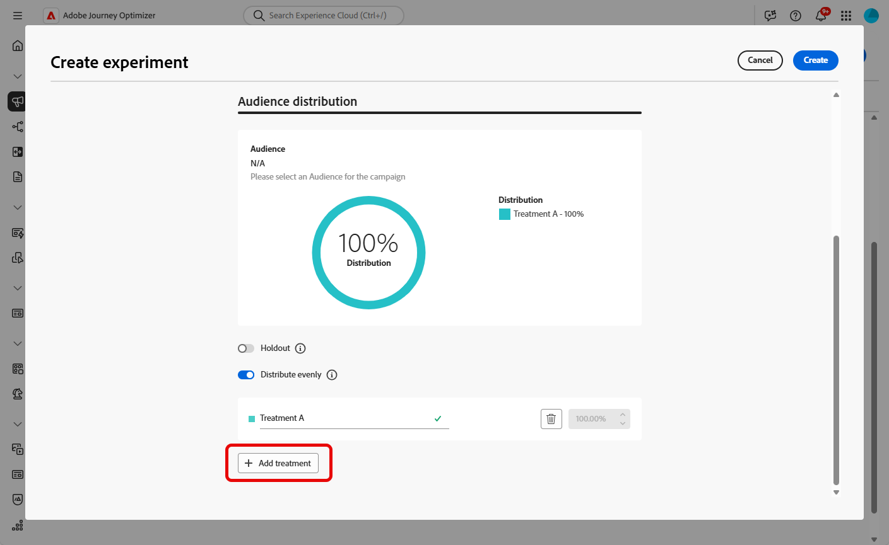

# Skapa ett innehållsexperiment {#content-experiment}

>[!CONTEXTUALHELP]
>id="ajo_campaigns_content_experiment"
>title="Innehållsexperiment"
>abstract="Du kan välja att ändra meddelandets innehåll, ämne eller avsändare för att definiera flera behandlingar och fastställa den bästa kombinationen för era målgrupper."

>[!NOTE]
>
>Innan du börjar med Content Experiment bör du kontrollera att rapportkonfigurationen är inställd för dina anpassade datauppsättningar. Läs mer i [det här avsnittet](../reports/reporting-configuration.md).

Med Journey Optimizer Content Experiment kan ni definiera flera olika leveranssätt för att mäta vilken som fungerar bäst för er målgrupp. Du kan välja att variera leveransinnehåll, ämne eller avsändare. Intressemålgruppen fördelas slumpmässigt till varje behandling för att avgöra vilken som fungerar bäst med det angivna mätvärdet.

I exemplet nedan har leveransmålet delats upp i två grupper, som var och en representerar 45 % av målpopulationen, och en slutgruppsgrupp på 10 % som inte får leveransen.

Varje person i målgruppen får en version av ett e-postmeddelande med en ämnesrad som är en av följande två:

* en som direkt marknadsför ett 10-procentigt erbjudande på den nya samlingen och en bild.
* den andra bara ger ut ett specialerbjudande utan att ange 10 % rabatt utan någon bild.

Målet här är att se om mottagarna kommer att interagera med e-postmeddelandet beroende på det mottagna experimentet. Därför kommer vi att välja **[!UICONTROL Email Opens]** som det primära målmåttet i den här innehållsexperimenten.

## Skapa innehåll {#campaign-experiment}

1. Börja med att skapa och konfigurera e-post, SMS eller push-meddelanden [kampanj](../campaigns/create-campaign.md) eller [resa](../building-journeys/journeys-message.md) enligt dina krav.

   >[!AVAILABILITY]
   >
   >Experimentation i Journey är för närvarande bara tillgängligt för en uppsättning organisationer (begränsad tillgänglighet). Kontakta din Adobe-representant för att få åtkomst.

1. Börja personalisera behandling A från fönstret **[!UICONTROL Edit content]**.

   För den här behandlingen ska vi specificera specialerbjudandet direkt i ämnesraden och lägga till personalisering.

   

1. Skapa eller importera ditt ursprungliga innehåll och anpassa det efter behov.

## Konfigurera ditt innehållsexperiment {#configure-experiment}

>[!CONTEXTUALHELP]
>id="ajo_campaigns_content_experiment_dimension"
>title="Dimension"
>abstract="Välj vilken dimension du vill spåra för din experiment, till exempel specifika klick eller vyer med specifika sidor."

>[!CONTEXTUALHELP]
>id="ajo_campaigns_content_experiment_success_metric"
>title="Resultatmått"
>abstract="Resultatmått används för att spåra och utvärdera den bästa behandlingen i ett experiment. Var noga med att konfigurera datauppsättningen för vissa mätvärden innan du använder den."

1. När ditt meddelande har anpassats kan du gå till kampanjsammanfattningssidan och klicka på **[!UICONTROL Create experiment]** för att börja konfigurera ditt innehållsexperiment.

   

1. Välj den **[!UICONTROL Success metric]** som du vill ange för ditt experiment.

   I det här exemplet väljer du **[!UICONTROL Email open]** om du vill testa om profilerna öppnar sina e-postmeddelanden om kampanjkoden finns på ämnesraden.

   

1. När du skapar ett experiment med hjälp av InApp- eller webbkanalen och väljer **[!UICONTROL Inbound Clicks]**, **[!UICONTROL Unique Inbound Clicks]** , **[!UICONTROL Page Views]** eller **[!UICONTROL Unique Page Views metrics]** kan du med hjälp av listrutan **[!UICONTROL Click Action]** spåra och övervaka klick och vyer på specifika sidor.

   

1. Klicka på **[!UICONTROL Add treatment]** för att skapa så många nya behandlingar som behövs.

   

1. Ändra **[!UICONTROL Title]** för din behandling så att du bättre kan skilja dem åt.

1. Välj att lägga till en **[!UICONTROL Holdout]**-grupp i leveransen. Den här gruppen kommer inte att få något innehåll från den här kampanjen.

   Om du aktiverar alternativfältet tar det automatiskt 10 % av din befolkning. Du kan justera procentandelen om det behövs.

   >[!IMPORTANT]
   >
   >När en utelämningsgrupp används i en åtgärd för innehållsexperimenterande gäller grupptilldelningen endast den specifika åtgärden. När åtgärden är slutförd kommer profilerna i den utelåsta gruppen att fortsätta längs vägen och kan ta emot meddelanden från andra åtgärder. Se därför till att efterföljande meddelanden inte är beroende av att ett meddelande tas emot av en profil som kan finnas i en utskicksgrupp. Om de gör det kan du behöva ta bort grupptilldelningen.

   

1. Du kan sedan välja att tilldela en exakt procentsats till varje **[!UICONTROL Treatment]** eller bara växla till **[!UICONTROL Distribute evenly]**-växlingsfältet.

   

1. Klicka på **[!UICONTROL Create]** när konfigurationen är inställd.

## Utforma dina behandlingar {#treatment-experiment}

1. I fönstret **[!UICONTROL Edit content]** väljer du din behandling B för att ändra innehållet.

   Här väljer vi att inte ange erbjudandet i **[!UICONTROL Subject line]**.

   

1. Klicka på **[!UICONTROL Edit email body]** om du vill anpassa din behandling ytterligare B.

   

1. När du har utformat dina behandlingar klickar du på **[!UICONTROL More actions]** för att komma åt alternativ som är relaterade till dina behandlingar: **[!UICONTROL Rename]**, **[!UICONTROL Duplicate]** och **[!UICONTROL Delete]**.

   

1. Om det behövs kan du gå till **[!UICONTROL Experiment settings]**-menyn och ändra din behandlingskonfiguration.

   

1. När meddelandeinnehållet har definierats klickar du på knappen **[!UICONTROL Simulate content]** för att kontrollera återgivningen av leveransen och kontrollera personaliseringsinställningarna med testprofiler. [Läs mer](../content-management/preview-test.md)

När du har konfigurerat dina experiment kan du följa resultatet av leveransen med din rapport. [Läs mer](../reports/campaign-global-report.md#experimentation-report)
