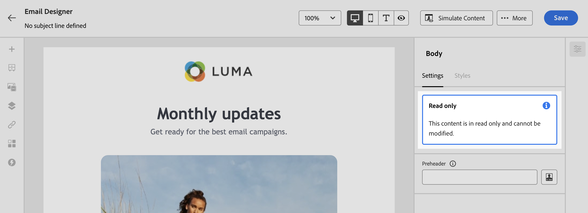

# Lås innehåll i e-postmallar {#lock-content-email-templates}

>[!CONTEXTUALHELP]
>id="ajo_locking_governance"
>title="Styrning"
>abstract="Växla till styrning om du vill låsa innehåll i mallen, antingen genom att låsa hela mallen eller specifika strukturer och komponenter. På så sätt kan ni förhindra oavsiktliga redigeringar och borttagningar, vilket ger er bättre kontroll över mallanpassning och förbättrar effektiviteten och tillförlitligheten i era e-postkampanjer."

>[!CONTEXTUALHELP]
>id="ajo_locking_mode"
>title="Läge"
>abstract="Välj önskat låsläge för mallen. **Med innehållslås** kan du låsa specifika avsnitt av innehåll i mallen. Med **Skrivskyddad** kan du låsa hela innehållet i mallen och förhindra ändringar."

>[!CONTEXTUALHELP]
>id="ajo_locking_content_addition"
>title="Aktivera tillägg av innehåll"
>abstract="Växla till det här alternativet om du vill definiera ytterligare hur användare kan interagera med mallen. Välj **Tillåt struktur- och innehållstillägg** om du vill tillåta användare att lägga till strukturer mellan befintliga och lägga till innehållskomponenter eller fragment inom redigerbara strukturer. **Tillåt endast tillägg av innehåll** tillåter användare att lägga till innehållskomponenter eller fragment i redigerbara strukturer utan att kunna lägga till eller duplicera strukturer."

>[!CONTEXTUALHELP]
>id="ajo_email_locking_activated"
>title="Styrning har aktiverats"
>abstract="Låsning av innehåll aktiveras och förhindrar ändringar."

>[!CONTEXTUALHELP]
>id="ajo_email_locking_read_only"
>title="Skrivskyddad"
>abstract="Det här innehållet är skrivskyddat och kan inte ändras."

Med Journey Optimizer kan du låsa innehåll i e-postmallar, antingen genom att låsa hela mallen eller specifika strukturer och komponenter. Detta förhindrar oavsiktliga redigeringar och borttagningar, vilket ger er bättre kontroll över mallanpassning och förbättrar effektiviteten och tillförlitligheten i era e-postkampanjer.

>[!IMPORTANT]
>
>Lås innehåll är en funktion på redigeringsnivå för författare och garanterar inte att innehållet förblir oredigerat när det importeras eller skapas via API.

Innehållslås kan användas antingen på **strukturnivå** eller på **komponentnivå**. Nedan följer de huvudprinciper som gäller på struktur- och komponentnivå när du låser innehåll i mallen:

* När en struktur är låst:

   * Allt innehåll i den strukturen är också låst som standard.
   * Inget innehåll kan läggas till i strukturen.
   * Som standard kan du inte ta bort strukturen. Du kan åsidosätta den här begränsningen genom att aktivera alternativet&quot;Tillåt borttagning&quot;.
   * Enskilda innehållskomponenter i den låsta strukturen kan anges som redigerbara.

* När en struktur är redigerbar (strukturen är inte låst):

   * Enskilda innehållskomponenter kan låsas inuti den strukturen.
   * Som standard kan du inte ta bort en komponent om den är låst eller om&quot;Endast redigerbart innehållslås&quot; är markerat. Du kan åsidosätta den här begränsningen genom att aktivera alternativet&quot;Tillåt borttagning&quot;.

>[!AVAILABILITY]
>
>Användare med behörighet att skapa innehållsmallar kan aktivera låsning av innehåll.

➡️ [Upptäck den här funktionen i en video](#video)

## Lås en e-postmall {#define}

### Aktivera låsning av innehåll {#enable}

Du kan aktivera innehållslås för en e-postmall direkt i e-postmallen Designer, oavsett om du skapar en ny mall eller redigerar en befintlig mall. Följ de här stegen:

1. Öppna eller skapa en e-postmall och gå till redigeringsskärmen i e-post-Designer.

1. Aktivera alternativet **[!UICONTROL Body]** i rutan **[!UICONTROL Governance]** till höger.

1. Välj önskat låsläge för mallen i listrutan **[!UICONTROL Mode]**:

   * **[!UICONTROL Content locking]**: Lås specifika innehållsavsnitt i mallen. Som standard går det att redigera alla strukturer och komponenter. Du kan sedan selektivt låsa enskilda element.
   * **[!UICONTROL Read only]**: Lås hela innehållet i mallen och förhindra ändringar.

   

1. Om du har valt läget **[!UICONTROL Content locking]** kan du ytterligare definiera hur användare kan interagera med mallen. Växla på alternativet **[!UICONTROL Enable content addition]** och välj något av följande:

   * **[!UICONTROL Allow structure & content addition]**: Användare kan lägga till strukturer mellan befintliga strukturer och lägga till innehållskomponenter eller fragment inom redigerbara strukturer.

   * **[!UICONTROL Allow content addition only]**: Användare kan lägga till innehållskomponenter eller fragment i redigerbara strukturer, men de kan inte lägga till eller duplicera strukturer.

1. När du har valt låsläget kan du definiera vilka strukturer och/eller komponenter som ska låsas om du har valt **[!UICONTROL Content locking]**-läget:

   * [Lär dig låsa strukturer](#lock-structures)
   * [Lär dig låsa komponenter](#lock-components)

   Om du väljer läget **[!UICONTROL Read only]** fortsätter du med att slutföra och spara mallen som vanligt.

Du kan justera inställningarna för **[!UICONTROL Governance]** när som helst när du designar mallen genom att välja mallbrödtexten. Det gör du genom att klicka på länken **[!UICONTROL Body]** i navigeringsfältet som finns högst upp i den högra rutan.

### Lås strukturer {#lock-structures}

>[!CONTEXTUALHELP]
>id="ajo_locking_structure"
>title="Låsning av innehåll i struktur"
>abstract="Om du vill låsa strukturen i mallen väljer du **Låst** i listrutan **Lås typ**. Som standard kan användare inte ta bort låsta strukturer. Du kan åsidosätta den här begränsningen genom att aktivera alternativet **[!UICONTROL Allow delete]**."

Så här låser du en struktur i mallen:

1. Välj den struktur som du vill låsa.

1. Välj **[!UICONTROL Lock type]** i listrutan **[!UICONTROL Locked]**.

   

   >[!NOTE]
   >
   >Som standard kan användare inte ta bort låsta strukturer. Du kan åsidosätta den här begränsningen genom att aktivera alternativet **[!UICONTROL Allow delete]**.

När du har låst en struktur kan inga ytterligare innehållskomponenter eller fragment dupliceras eller läggas till inuti den. Alla komponenter i en låst struktur är också låsta som standard. Så här gör du en komponent redigerbar i en låst struktur:

1. Markera den komponent som du vill låsa upp.

1. Växla på alternativet **[!UICONTROL Use specific locking]**.

1. Välj **[!UICONTROL Lock type]** i listrutan **[!UICONTROL Editable]**. Välj **[!UICONTROL Editable content only]** om du vill tillåta redigering av innehåll när du låser format. [Lär dig att låsa komponenter](#lock-components)

   

### Lås komponenter {#lock-components}

>[!CONTEXTUALHELP]
>id="ajo_locking_component"
>title="Använd specifik låsning i komponenten"
>abstract="Om du vill låsa komponenten i mallen aktiverar du alternativet **Använd specifikt låsning**. Välj önskat låsalternativ i listrutan **[!UICONTROL Lock type]**: **Endast redigerbart innehållslås** gör att du kan låsa komponentens format men tillåta innehållsredigering, medan **Låst** helt låser både komponentens innehåll och format."

Så här låser du en specifik komponent i en struktur:

1. Markera komponenten och aktivera alternativet **[!UICONTROL Use specific locking]** i den högra rutan.

1. Välj önskat låsalternativ i listrutan **[!UICONTROL Lock type]**:

   

   * **[!UICONTROL Editable content only]**: Lås komponentens format men tillåter innehållsredigering.
   * **[!UICONTROL Locked]**: Lås både komponentens innehåll och format fullständigt.

   >[!NOTE]
   >
   >Låstypen **[!UICONTROL Editable]** gör att användare kan redigera en komponent, även i en låst struktur. [Lär dig att låsa strukturer](#lock-structures)

1. Som standard kan användare inte ta bort låsta komponenter. Du kan aktivera borttagning genom att aktivera alternativet **[!UICONTROL Allow delete]**.

### Identifiera låst innehåll {#identify}

Använd **[!UICONTROL Navigation tree]** på den vänstra menyn för att enkelt identifiera låsta strukturer och komponenter i mallen. Den här menyn innehåller en visuell översikt över alla mallelement. Låsta objekt markeras med en låsikon och redigerbara objekt med en pennikon.

I exemplet nedan är styrning aktiverat för mallbrödtexten. *Struktur 2* är låst med *Komponent 1* redigerbar, medan *Struktur 3* är helt låst.

## Använd mallar med låst innehåll {#use}

>[!CONTEXTUALHELP]
>id="ajo_email_editable_areas"
>title="Markera redigerbara områden"
>abstract="Beroende på vilken typ av låsning som används för mallen kan du utföra olika åtgärder för mallens strukturer och komponenter. Om du snabbt vill identifiera alla redigerbara områden i mallen aktiverar du alternativet **[!UICONTROL Highlight editable areas]**."

När du använder en mall med låst innehåll visas ett meddelande i den högra rutan.

Beroende på vilken typ av låsning som används för mallen kan du utföra olika åtgärder för mallens strukturer och komponenter. Om du snabbt vill identifiera alla redigerbara områden i mallen aktiverar du alternativet **[!UICONTROL Highlight editable areas]**.

I mallen nedan är till exempel alla områden redigerbara förutom den översta bilden, som har låsts, vilket innebär att du inte kan redigera eller ta bort den.

Detaljerad information om olika typer av låsning som kan användas finns i följande avsnitt:

* [Lås strukturer](#lock-structures)
* [Lås komponenter](#lock-components)

Här är några exempel på e-postutgåvor och tillhörande konfigurationer för låsning av innehåll som har konfigurerats:

| Typ av låsning av innehåll | Mallkonfiguration | E-postversion |
| ------- | ------- | ------- |
| Skrivskyddad innehållsmall | {zoomable="yes"} | {zoomable="yes"} |
| Det går att redigera allt innehåll, men användarna kan inte lägga till någon struktur eller komponent | {zoomable="yes"} | {zoomable="yes"} |
| Låst struktur som inte kan tas bort | {zoomable="yes"} | {zoomable="yes"} |
| Komponent med låsta format som inte kan tas bort. Användarna kan bara ändra innehållet. | {zoomable="yes"} | {zoomable="yes"} |
| Redigerbar komponent i en låst struktur. | {zoomable="yes"} | {zoomable="yes"} |

## Instruktionsvideo {#video}

Lär dig låsa innehåll i e-postmallar.

>[!VIDEO](https://video.tv.adobe.com/v/3451611?captions=swe&quality=12)
