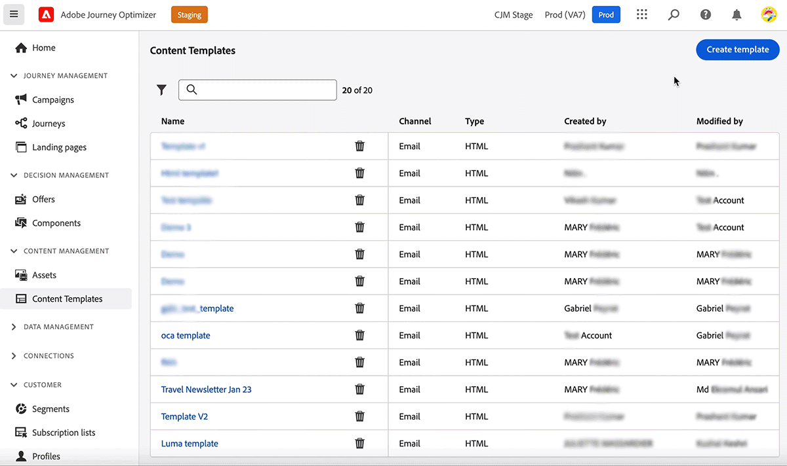

# Kom igång med innehållsmallar {#content-templates}

>[!NOTE]
>
>Från och med mars 2025 är innehållsmallar av HTML-typ föråldrade. Du kan fortfarande använda befintliga HTML-innehållsmallar som tidigare skapats i [!DNL Journey Optimizer].

Om du vill ha en snabbare och förbättrad designprocess skapar du fristående mallar för att enkelt återanvända anpassat innehåll i [!DNL Journey Optimizer] kampanjer och resor.

Med den här funktionen kan innehållsorienterade användare arbeta med mallar utanför kampanjer eller resor. Marknadsförare kan sedan återanvända och anpassa dessa fristående innehållsmallar på sina egna resor eller i sina egna kampanjer.

<!---->

En användare i företaget kan till exempel fokusera enbart på innehållet och inte ha tillgång till kampanjer eller resor. Den här användaren kan skapa en e-postmall som organisationens marknadsförare kan välja som utgångspunkt för alla e-postmeddelanden.

Du kan skapa innehållsmallar för kanalerna E-post, Push, In-App, SMS och Direct Mail.

>[!AVAILABILITY]
>
>Innehållsmallar är för närvarande inte tillgängliga för webbkanalen.

Om du vill skapa, redigera och ta bort innehållsmallar måste du ha behörigheten **[!DNL Manage library items]** som ingår i produktprofilen för **[!DNL Content Library Manager]**. [Läs mer](../administration/ootb-product-profiles.md#content-library-manager)

➡️ [Lär dig hur du skapar och använder mallar i den här videon](#video-templates)

>[!NOTE]
>
>Du kan också skapa och hantera innehållsmallar med API:er. Mer information finns i dokumentationen för [Journey Optimizer API:er](https://developer.adobe.com/journey-optimizer-apis/references/content/){target="_blank"}.

## Instruktionsvideo {#video-templates}

Lär dig hur du skapar, redigerar och använder innehållsmallar i [!DNL Journey Optimizer].

>[!VIDEO](https://video.tv.adobe.com/v/3413743/?quality=12)
