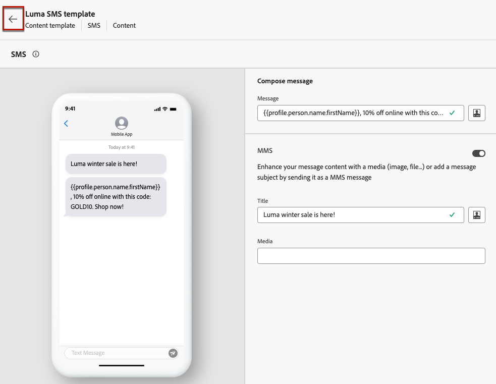

# Skapa innehållsmallar {#create-content-templates}

>[!CONTEXTUALHELP]
>id="ajo_create_template"
>title="Definiera en egen innehållsmall"
>abstract="Skapa en egen mall från scratch för att göra innehållet återanvändbart på flera resor och i flera kampanjer."

Det finns två sätt att skapa innehållsmallar:

* Skapa en innehållsmall från grunden med hjälp av menyn **[!UICONTROL Content templates]** i den vänstra listen. [Lär dig hur](#create-template-from-scratch)

* Spara innehållet som en mall när du utformar innehållet i en kampanj eller resa. [Lär dig hur](#save-as-template)

När du har sparat din innehållsmall är den tillgänglig för användning i en kampanj eller på en resa. Oavsett om du har skapat från grunden eller från tidigare innehåll kan du använda den här mallen när du skapar innehåll i [!DNL Journey Optimizer]. [Lär dig hur](#use-content-templates)

>[!NOTE]
>
>* Ändringar som görs i innehållsmallar sprids inte till kampanjer eller resor, vare sig de är live eller utkast.
>
>* När mallar används i en kampanj eller en resa påverkas inte heller den tidigare använda innehållsmallen av ändringar som gjorts i kampanj- och reseinnehållet.

## Skapa mall från grunden {#create-template-from-scratch}

>[!NOTE]
>
>Från och med mars 2025 är innehållsmallar av HTML-typ föråldrade. Befintliga HTML-innehållsmallar som tidigare skapats i [!DNL Journey Optimizer] kan fortfarande användas.

Följ stegen nedan för att skapa en innehållsmall från grunden.

1. Öppna innehållsmalllistan via den vänstra menyn **[!UICONTROL Content Management]** > **[!UICONTROL Content Templates]**.

1. Välj **[!UICONTROL Create template]**.

1. Fyll i mallinformationen och välj önskad kanal.

   

   >[!NOTE]
   >
   >För närvarande är alla kanaler tillgängliga utom webben.

1. Välj eller skapa Adobe Experience Platform-taggar från fältet **[!UICONTROL Tags]** för att kategorisera mallen för förbättrad sökning. [Läs mer](../start/search-filter-categorize.md#tags)

1. Välj **[!UICONTROL Manage access]** om du vill tilldela etiketter för anpassad eller viktig dataanvändning till mallen. [Läs mer om OLAC (Object Level Access Control)](../administration/object-based-access.md).

1. Klicka på **[!UICONTROL Create]** och utforma ditt innehåll efter behov, på samma sätt som du gör för innehåll inuti en resa eller kampanj, enligt den kanal du valt.

   

   Lär dig hur du skapar innehåll för de olika kanalerna i följande avsnitt:
   * [Definiera e-postinnehåll](../email/get-started-email-design.md)
   * [Definiera push-innehåll](../push/design-push.md)
   * [Definiera SMS-innehåll](../sms/create-sms.md#sms-content)
   * [Definiera innehåll för direktreklam](../direct-mail/create-direct-mail.md)
   * [Definiera innehåll i appen](../in-app/design-in-app.md)
   * [Definiera webbinnehåll](../web/create-web.md#edit-web-content)
   * [Definiera kodbaserat upplevelseinnehåll](../code-based/create-code-based.md)

     >[!NOTE]
     >
     >Du kan lägga till beslutsprinciper i kodbaserade innehållsmallar för upplevelser. [Läs mer](../experience-decisioning/create-decision.md#create-decision)

1. Du kan testa ditt innehåll. [Lär dig hur](#test-template)

1. När mallen är klar klickar du på **[!UICONTROL Save]**.

1. Klicka på pilen bredvid mallnamnet för att gå tillbaka till skärmen **[!UICONTROL Details]**.

   

Den här mallen kan nu användas när du skapar innehåll i [!DNL Journey Optimizer]. [Lär dig hur](#use-content-templates)

>[!NOTE]
>
>När du skapar en mall för e-postinnehåll kan du snabbt använda en viss stil som passar ert varumärke och er design genom att använda ett tema i innehållet. [Läs mer](../email/apply-email-themes.md)

## Spara innehåll som innehållsmall {#save-as-template}

När du utformar innehåll i en kampanj eller resa kan du spara det för framtida återanvändning. Följ stegen nedan för att göra detta.

1. Klicka på knappen **[!UICONTROL Edit content]** på skärmen **[!UICONTROL Content template]**.

1. Välj **[!UICONTROL Save as content template]** i listrutan.

   

   Om du befinner dig i [e-post-Designer](../email/get-started-email-design.md) kan du även välja det här alternativet i listrutan **[!UICONTROL More]** i skärmens övre högra hörn.

   

1. Lägg till ett namn och en beskrivning för mallen.

   

   >[!NOTE]
   >
   >Den aktuella kanalen fylls i automatiskt och kan inte redigeras.

1. Markera eller skapa en Adobe Experience Platform-tagg från fältet **Taggar** för att kategorisera mallen. [Läs mer](../start/search-filter-categorize.md#tags)

1. Välj **[!UICONTROL Manage access]** om du vill tilldela etiketter för anpassad eller viktig dataanvändning till mallen. [Läs mer](../administration/object-based-access.md).

1. Klicka på **[!UICONTROL Save]**.

1. Mallen sparas i listan **[!UICONTROL Content Templates]**, som du kommer åt från den dedikerade menyn [!DNL Journey Optimizer]. Det blir en fristående innehållsmall som du kan komma åt, redigera och ta bort som alla andra objekt i listan. [Läs mer](#access-manage-templates)

Du kan nu använda den här mallen när du skapar innehåll i [!DNL Journey Optimizer]. [Lär dig hur](#use-content-templates)

>[!NOTE]
>
>Ändringar i den nya mallen sprids inte till det innehåll som den kommer från. På samma sätt ändras inte den nya mallen när det ursprungliga innehållet redigeras.

