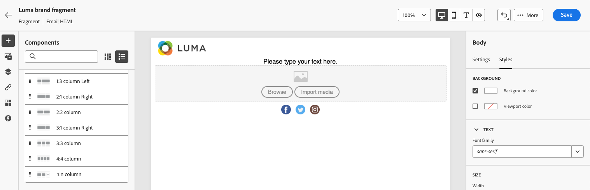

# Skapa ett fragment {#create-fragments}

>[!CONTEXTUALHELP]
>id="ajo_create_visual_fragment"
>title="Markera den visuella typen"
>abstract="Skapa ett fristående visuellt fragment för att göra innehållet återanvändbart i ett e-postmeddelande inom en resa eller kampanj, eller i en innehållsmall."
>additional-url="https://experienceleague.adobe.com/en/docs/journey-optimizer/using/channels/email/design-email/add-content/use-visual-fragments" text="Lägg till visuella fragment i e-postmeddelanden"

>[!CONTEXTUALHELP]
>id="ajo_create_expression_fragment"
>title="Välj uttryckstyp"
>abstract="Skapa ett fristående uttrycksfragment som gör att innehållet kan återanvändas på flera resor och i flera kampanjer. När du använder personaliseringsredigeraren kan du utnyttja alla uttrycksfragment som har skapats i den aktuella sandlådan."
>additional-url="https://experienceleague.adobe.com/en/docs/journey-optimizer/using/content-management/personalization/personalization-build-expressions" text="Arbeta med personaliseringsredigeraren"

Fragment kan skapas från grunden på den vänstra menyn **[!UICONTROL Fragments]**. Dessutom kan du spara en del av befintligt innehåll som fragment när du utformar innehåll. [Lär dig hur](save-fragments.md#)

När fragmentet har sparats är det tillgängligt för användning under en resa, en kampanj eller en mall. Du kan använda det här fragmentet när du skapar innehåll på resor och i kampanjer. Se [Lägg till visuella fragment](../email/use-visual-fragments.md) och [Utnyttja uttrycksfragment](../personalization/use-expression-fragments.md).

Följ stegen nedan för att skapa ett fragment.

## Definiera fragmentets egenskaper {#properties}

1. Gå till fragmentlistan via den vänstra menyn **[!UICONTROL Content Management]** > **[!UICONTROL Fragments]**.

1. Välj **[!UICONTROL Create fragment]** och fyll i fragmentnamnet och beskrivningen (om det behövs).

   

1. Välj eller skapa Adobe Experience Platform-taggar från fältet **[!UICONTROL Tags]** för att kategorisera ditt fragment för förbättrad sökning. [Lär dig arbeta med enhetliga taggar](../start/search-filter-categorize.md#tags)

1. Välj fragmenttypen: **Visual fragment** eller **Expression fragment**. [Läs mer](../content-management/fragments.md#visual-expression)

   >[!NOTE]
   >
   >För närvarande är visuella fragment bara tillgängliga för kanalen **Email**.

1. Om du skapar ett uttrycksfragment väljer du den typ av kod som du vill använda: **[!UICONTROL HTML]**, **[!UICONTROL JSON]** eller **[!UICONTROL Text]**.

   

1. Om du vill tilldela anpassade eller grundläggande dataanvändningsetiketter till fragmentet klickar du på knappen **[!UICONTROL Manage access]** i skärmens övre del. [Läs mer om OLAC (Object Level Access Control)](../administration/object-based-access.md).

1. Klicka på **[!UICONTROL Create]** för att utforma innehållet i fragmentet.

## Designa fragmentinnehållet {#content}

När du har konfigurerat fragmentets egenskaper öppnas e-post-Designer eller personaliseringsredigeraren, beroende på vilken typ av fragment du skapar.

>[!NOTE]
>
>[Sammanhangsbaserade attribut](../personalization/personalization-build-expressions.md) stöds inte i fragment.
>
>När spårning är aktiverat i en resa eller kampanj spåras länkarna, om du lägger till länkar till ett fragment och om det här fragmentet används i ett meddelande, till exempel alla andra länkar som finns i meddelandet. [Läs mer om länkar och spårning](../email/message-tracking.md)

* För visuella fragment kan du redigera ditt innehåll efter behov på samma sätt som för alla e-postmeddelanden som finns på en resa eller en kampanj. [Läs mer](../email/get-started-email-design.md)

  

  Om du snabbt vill använda en specifik formatering som passar ditt varumärke och din design kan du använda ett [tema](../email/apply-email-themes.md) för ditt fragment.

  

  >[!CAUTION]
  >
  >Fragment är inte korskompatibla mellan Använd teman och Manuell formatering. Om du vill kunna använda ett fragment i ett innehåll där du vill använda ett tema, måste det här fragmentet skapas i läget Använd teman. [Läs mer om teman](../email/apply-email-themes.md)

* Använd anpassningsredigeraren [!DNL Journey Optimizer] för uttrycksfragment med alla dess anpassnings- och redigeringsfunktioner för att skapa fragmentinnehållet. [Läs mer](../personalization/personalization-build-expressions.md)

  

När innehållet är klart klickar du på knappen **[!UICONTROL Save]**.

>[!NOTE]
>
>Visuella fragment får inte överskrida 100 kB. Uttrycksfragment får inte överskrida 200 kB.

Fragmentet skapas och läggs till i fragmentlistan med statusen **[!UICONTROL Draft]**. Ni kan förhandsgranska den och publicera den för att göra den tillgänglig på resor och i kampanjer.

## Förhandsgranska och publicera fragmentet {#publish}

>[!NOTE]
>
>Om du vill publicera ett fragment måste du ha användarbehörigheten [Publicera fragment](../administration/ootb-product-profiles.md#content-library-manager) .

Om ditt fragment är klart att publiceras kan du förhandsgranska och publicera det så att det blir tillgängligt på dina resor och i kampanjer. Följ stegen nedan för att göra det.

1. Gå tillbaka till skärmen för att skapa fragment när du har utformat dess innehåll, eller öppna den från listan med fragment.

1. En förhandsgranskning av fragmentet är tillgänglig under fältet **[!UICONTROL Tags]**, vilket gör att återgivningen kan kontrolleras. Om du behöver göra några ändringar klickar du på knappen **[!UICONTROL Edit]** i skärmens övre del för att öppna e-post-Designer eller anpassningsredigeraren, beroende på fragmenttypen. [Läs mer](manage-fragments.md#edit-fragments)

   

1. Klicka på knappen **[!UICONTROL Publish]** i det övre högra hörnet för att publicera fragmentet.

1. Om fragmentet används i en direktresa eller kampanj öppnas ett meddelande som informerar dig. Klicka på länken **[!UICONTROL See more]** om du vill visa listan över resor och/eller kampanjer där det refereras. [Lär dig hur du utforskar referenser till ett fragment](../content-management/manage-fragments.md#explore-references)

   {width="70%" align="center"}

   Klicka på **[!UICONTROL Confirm]** för att publicera fragmentet och uppdatera det i de direktresor/kampanjer som använder det.

Fragmentet är nu **[!UICONTROL Live]** och blir tillgängligt när du skapar innehåll i [!DNL Journey Optimizer] e-postredigeraren för Designer eller personalisering.

* [Lär dig använda visuella fragment](../email/use-visual-fragments.md)
* [Lär dig använda uttrycksfragment](../personalization/use-expression-fragments.md)
