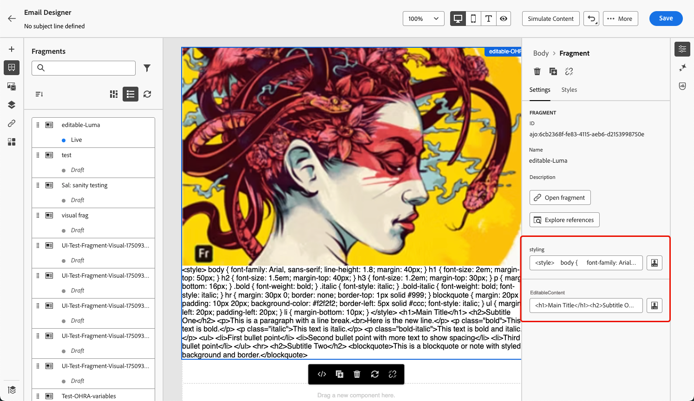
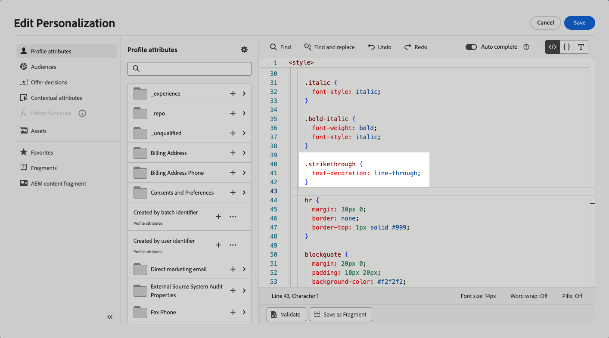

# Anpassningsbara fragment {#customizable-fragments}

När fragment används i en kampanj eller en reseåtgärd låses de som standard på grund av arv. Detta innebär att ändringar som görs i ett fragment automatiskt sprids till alla kampanjer och resor där fragmentet används.

Med **anpassningsbara fragment** kan specifika fält i ett fragment definieras som redigerbara när fragmentet läggs till i en kampanj eller en reseåtgärd. Anta att du har ett fragment med en banderoll, text och en knapp. Du kan ange att vissa fält, t.ex. bild- eller knappens mål-URL, kan redigeras. Detta gör att användarna kan ändra dessa element när de inkluderar fragmentet i kampanjen eller resan, vilket ger en skräddarsydd upplevelse utan att det ursprungliga fragmentet påverkas.

Anpassningsbara fragment eliminerar behovet av att bryta fragmentarv, vilket tidigare förhindrade centraliserade ändringar på fragmentnivå från att spridas till kampanjer och resor. Med den här metoden kan innehållets delar justeras vid användningstidpunkten, vilket ger flexibilitet att åsidosätta standardvärden med kontextspecifika detaljer.

Genom att utnyttja anpassningsbara fragment kan ni effektivt hantera och personalisera ert innehåll utan att skapa helt nya innehållsblock eller störa arvet från det ursprungliga fragmentet. Detta garanterar att ändringar som görs på fragmentnivå fortfarande sprids, samtidigt som nödvändiga anpassningar kan göras på kampanj- eller resenivå.

Både visuella fragment och uttrycksfragment kan markeras som anpassningsbara. Detaljerade instruktioner om hur du fortsätter med varje fragmenttyp finns i avsnitten nedan.

## Lägg till redigerbara fält i visuella fragment {#visual}

Gör så här för att göra delar av ett visuellt fragment redigerbara:

>[!NOTE]
>
>Redigerbara fält kan läggas till i komponenterna **image**, **text** och **button**. För **HTML**-komponenter läggs redigerbara fält till med anpassningsredigeraren, ungefär som uttrycksfragment. [Lär dig hur du lägger till redigerbara fält i HTML-komponenter och uttrycksfragment](#expression)

1. Öppna skärmen för fragmentinnehållsutgåva.

1. Markera den komponent i fragmentet där du vill konfigurera redigerbara fält.

1. Panelen Komponentegenskaper öppnas till höger. Markera fliken **Redigerbara fält** och växla sedan till alternativet **Aktivera utgåva**.

1. Alla fält som kan redigeras för den valda komponenten visas i rutan. Vilka fält som är tillgängliga för redigering beror på den valda komponenttypen.

   I exemplet nedan tillåter vi redigering av URL:en för knappen Klicka här.

   

1. Klicka på **Översikt** om du vill kontrollera alla redigerbara fält och deras standardvärden.

   I det här exemplet visas knappens URL-fält med det standardvärde som definierats i komponenten. Det här värdet kan anpassas av användare efter att de har lagt till fragmentet i innehållet.

   

1. När du är klar sparar du ändringarna för att uppdatera fragmentet.

1. När du har lagt till fragmentet i ett e-postmeddelande kan användarna anpassa alla redigerbara fält som är konfigurerade i fragmentet. [Lär dig hur du anpassar redigerbara fält i ett visuellt fragment](../email/use-visual-fragments.md#customize-fields)

>[!CAUTION]
>
>När både **label** och **URL** för en knappkomponent görs redigerbara i ett fragment visar uppföljningsrapporter URL:en i stället för knappetiketten. [Läs mer om spårning](../email/message-tracking.md)

## Lägga till redigerbara fält i HTML-komponenter och uttrycksfragment {#expression}

Om du vill göra delar av en HTML-komponent eller ett uttrycksfragment redigerbara måste du använda en specifik syntax i uttrycksredigeraren. Detta innebär att deklarera en **variabel** med ett standardvärde som användare kan åsidosätta efter att ha lagt till fragmentet i innehållet.

Anta till exempel att du vill skapa ett fragment som ska läggas till i dina e-postmeddelanden, och tillåta användare att anpassa en viss färg som används på olika platser, till exempel ramar eller knappars bakgrundsfärger. När du skapar fragmentet måste du deklarera en variabel med ett **unikt ID**, till exempel &quot;color&quot;, och anropa den på de önskade platserna i fragmentinnehållet där du vill använda den här färgen. När du lägger till fragmentet i innehållet kan användarna anpassa färgen som används där variabeln refereras.

För HTML-komponenter kan bara specifika element bli redigerbara fält. Expandera avsnittet nedan om du vill ha mer information.

+++Redigerbara element i HTML-komponenter:

Elementen nedan kan bli redigerbara fält i en HTML-komponent:

* En del av text
* En fullständig URL för länk eller bild (fungerar inte med delar av en URL)
* Hela CSS-egenskapen (fungerar inte med partiell egenskap)

I koden nedan kan till exempel varje element som är markerat med rött bli en egenskap:

{width="70%"}

+++

Så här deklarerar du en variabel och använder den i fragmentet:

1. Öppna uttrycksfragmentet och redigera sedan innehållet i personaliseringsredigeraren.

   

   För HTML-komponenter markerar du komponenten i fragmentet och klickar på knappen **Visa källkoden** .

1. Deklarera variabeln som du vill att användarna ska redigera. Navigera till menyn **Hjälpfunktioner** i den vänstra navigeringsrutan och lägg till hjälpfunktionen **inline** . Syntaxen för att deklarera och anropa variabeln läggs automatiskt till i innehållet.

   

1. Ersätt `"name"` med ett unikt ID för att identifiera det redigerbara fältet.

   >[!NOTE]
   >
   >Fält-ID:t måste vara unikt och får inte innehålla blanksteg. Detta ID bör användas överallt i ditt innehåll där du vill visa variabelns värde.

1. Anpassa syntaxen efter dina behov genom att lägga till parametrar som beskrivs i tabellen nedan:

   | Åtgärd | Parameter | Exempel |
   | ------- | ------- | ------- |
   | Deklarera ett redigerbart fält med ett **standardvärde**. När du lägger till fragmentet i ditt innehåll kommer det här standardvärdet att användas om du inte anpassar det. | Lägg till standardvärdet mellan de infogade taggarna. | `{{#inline "editableFieldID"}}default_value{{/inline}}` |
   | Definiera en **etikett** för det redigerbara fältet. Den här etiketten visas i e-post-Designer när du redigerar fragmentets fält. | `name="title"` | `{{#inline "editableFieldID" name="title"}}default_value{{/inline}}` |
   | Deklarera ett redigerbart fält som innehåller en **bildkälla** som måste publiceras. | `assetType="image"` | `{{#inline "editableFieldID" assetType="image"}}default_value{{/inline}}` |
   | Deklarera ett redigerbart fält som innehåller en **URL** som måste spåras. Observera att fördefinierade block av typen &quot;Spegelsidans URL&quot; och &quot;Avsluta länk&quot; inte kan bli redigerbara. | `assetType="url"` | `{{#inline "editableFieldID" assetType="url"}}default_value{{/inline}}` |

1. Använd syntaxen `{{{name}}}` i koden på alla ställen där du vill visa värdet för det redigerbara fältet. Ersätt `name` med det unika ID:t för fältet som definierats tidigare.

   

1. Spara och publicera fragmentet.

När du lägger till fragmentet i e-postinnehållet kan användare nu åsidosätta variabelns standardvärden med sina valda värden:

* För uttrycksfragment används en specifik syntax för att åsidosätta variabelvärden. [Lär dig hur du anpassar redigerbara fält i ett uttrycksfragment](../personalization/use-expression-fragments.md#customize-fields)

* För HTML-komponenter visas variabeln i listan med redigerbara fält i e-post-Designer. [Lär dig hur du anpassar redigerbara fält i ett visuellt fragment](../email/use-visual-fragments.md#customize-fields)

### Exempel på redigerbart uttrycksfragment {#example}

I exemplet nedan skapar vi ett uttrycksfragment med nya sportsamlingar. Som standard visar fragmentet det här innehållet: *Letar du efter mer? Missa inte vår senaste sportsamling!*

Vi vill att användarna ska kunna ersätta&quot;sport&quot; i det här innehållet med den sport de väljer. Till exempel: *Söker du mer? Missa inte vår senaste yogasamling!*

För att göra detta:

1. Deklarera en idrottsvariabel med ID &quot;sport&quot;.

   Om användare inte ändrar variabelns värde efter att ha lagt till fragmentet i innehållet, visas som standard det värde som definierats mellan taggarna `{{#inline}}` och `{{/inline}}`, dvs. &quot;sport&quot;.

1. Lägg till syntaxen ``{{{sport}}}`` i fragmentinnehållet där du vill visa variabelvärdet, d.v.s. &quot;sport&quot; som standard, eller det värde som användarna väljer.

   

1. När du lägger till uttrycksfragmentet i innehållet kan användare ändra variabelns värde genom att välja direkt från uttrycksredigeraren. [Lär dig hur du anpassar redigerbara fält i ett uttrycksfragment](../personalization/use-expression-fragments.md#customize-fields)

   

## Lägga till formaterad text i ett anpassningsbart fragment {#rich-text}

RTF, t.ex. radbrytningar, fet stil, kursiv stil, kan läggas till i ett redigerbart fragment med hjälp av HTML-komponenter. Följ stegen nedan för att göra det.
<!--
➡️ [Learn how to add and use rich text to an editable fragment in this video](#video)-->

### Skapa ett fragment med formaterad text {#add-rich-text}

1. Skapa ett visuellt [fragment](create-fragments.md) och börja lägga till komponenter.

1. Lägg till en [HTML-komponent](../email/content-components.md#HTML) och öppna HTML Editor.

1. Navigera till **[!UICONTROL Helper functions]**-menyn i den vänstra navigeringsrutan och lägg till hjälpfunktionen **inline**.

1. Ersätt `"name"` med det ID som du vill använda för ditt redigerbara innehåll, till exempel&quot;EditableContent&quot;.

1. Ersätt `render_content` med den HTML-kod som motsvarar det standardinnehåll du vill ha. Du kan lägga till fet, kursiv, radbrytningar, punktlistor osv.

   

1. I samma HTML-komponent lägger du till ytterligare en **intern**-hjälpfunktion för dina formatelement.

1. Ersätt `"name"` och `render_content` med det ID och den HTML-kod som motsvarar det standardformat som du vill använda.

   

1. Spara innehållet. De markerade redigerbara fälten visas till höger.

   

1. Spara och [publicera](create-fragments.md#publish) fragmentet.

### Använda redigerbara fragment för RTF {#use-rich-text}

När du lägger till fragmentet i e-postinnehållet kan användarna nu redigera det formaterade textinnehållet och den formatering som du skapade. Följ stegen nedan om du vill använda redigerbara fragment med text som markör.

1. [Skapa ett e-postmeddelande](../email/create-email.md) i en kampanj eller resa och lägg sedan till fragmentet med RTF-text som [skapades](#add-rich-text).

   Du kan se de två redigerbara fälten som skapades till höger.

   

1. Du kan klicka på **[!UICONTROL Simulate content]** för att se hur det redigerbara innehållet och formateringen återges. [Läs mer om att förhandsgranska innehåll](preview-test.md)

1. Markera ikonen **[!UICONTROL Add personalization]** bredvid ett av de redigerbara fälten.

1. I den anpassningsbara redigeraren som öppnas uppdaterar du <!--CSS-->formateringen och/eller innehållet efter behov genom att lägga till eller ta bort element från det redigerbara fältet.

   

<!--
## How-to video {#video}

This video shows how to make HTML components within a fragment editable, allowing for dynamic updates to both content and styling.

>[!VIDEO](https://video.tv.adobe.com/v/3464372/?captions=swe&learn=on&#x26;enablevpops)
-->