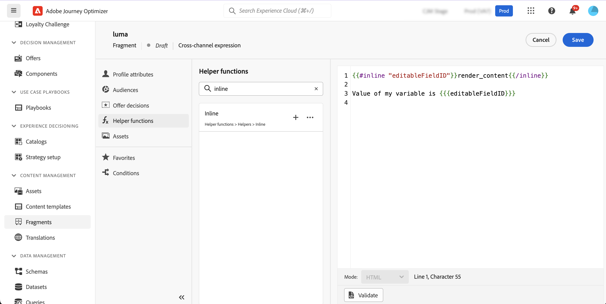

# Anpassningsbara fragment {#customizable-fragments}

När fragment används i en kampanj eller en reseåtgärd låses de som standard på grund av arv. Detta innebär att ändringar som görs i ett fragment automatiskt sprids till alla kampanjer och resor där fragmentet används. Med anpassningsbara fragment kan specifika fält i ett fragment definieras som redigerbara när fragmentet läggs till i en kampanj- eller reseåtgärd. Anta att du har ett fragment med en banderoll, text och en knapp. Du kan ange att vissa fält, t.ex. bild- eller knappens mål-URL, kan redigeras. Detta gör att användarna kan ändra dessa element när de inkluderar fragmentet i kampanjen eller resan, vilket ger en skräddarsydd upplevelse utan att det ursprungliga fragmentet påverkas.

Anpassningsbara fragment eliminerar behovet av att bryta fragmentarv, vilket tidigare förhindrade centraliserade ändringar på fragmentnivå från att spridas till kampanjer och resor. Med den här metoden kan innehållets delar justeras vid användningstidpunkten, vilket ger flexibilitet att åsidosätta standardvärden med kontextspecifika detaljer.

Genom att utnyttja anpassningsbara fragment kan ni effektivt hantera och personalisera ert innehåll utan att skapa helt nya innehållsblock eller störa arvet från det ursprungliga fragmentet. Detta garanterar att ändringar som görs på fragmentnivå fortfarande sprids, samtidigt som nödvändiga anpassningar kan göras på kampanj- eller resenivå.

Både visuella fragment och uttrycksfragment kan markeras som anpassningsbara. Detaljerade instruktioner om hur du fortsätter med varje fragmenttyp finns i avsnitten nedan.

## Lägga till redigerbara fält i visuella fragment {#visual}

Gör så här för att göra delar av ett visuellt fragment redigerbara:

>[!NOTE]
>
>Redigerbara fält kan läggas till i **image**, **text** och **knapp** -komponenter. För **HTML** -komponenter, redigerbara fält läggs till med personaliseringsredigeraren, på samma sätt som uttrycksfragment. [Lär dig hur du lägger till redigerbara fält i HTML-komponenter och uttrycksfragment](#expression)

1. Öppna skärmen för fragmentinnehållsutgåva.

1. Markera den komponent i fragmentet där du vill konfigurera redigerbara fält.

1. Panelen Komponentegenskaper öppnas till höger. Välj **Redigerbara fält** och växla sedan **Aktivera utgåva** alternativ.

1. Alla fält som kan redigeras för den valda komponenten visas i rutan. Vilka fält som är tillgängliga för redigering beror på den valda komponenttypen.

   I exemplet nedan tillåter vi redigering av URL:en för knappen Klicka här.

   

1. Klicka på **Ökning** om du vill kontrollera alla redigerbara fält och deras standardvärden.

   I det här exemplet visas knappens URL-fält med det standardvärde som definierats i komponenten. Det här värdet kan anpassas av användare efter att de har lagt till fragmentet i innehållet.

   

1. När du är klar sparar du ändringarna för att uppdatera fragmentet.

1. När du har lagt till fragmentet i ett e-postmeddelande kan användarna anpassa alla redigerbara fält som är konfigurerade i fragmentet. [Lär dig anpassa redigerbara fält i ett visuellt fragment](../email/use-visual-fragments.md#customize-fields)

## Lägga till redigerbara fält i HTML-komponenter och uttrycksfragment {#expression}

Om du vill göra delar av en HTML-komponent eller ett uttrycksfragment redigerbara måste du använda en specifik syntax i uttrycksredigeraren. Detta innebär att en **variabel** med ett standardvärde som användare kan åsidosätta efter att ha lagt till fragmentet i innehållet.

Anta till exempel att du vill skapa ett fragment som ska läggas till i dina e-postmeddelanden, och tillåta användare att anpassa en viss färg som används på olika platser, till exempel ramar eller knappars bakgrundsfärger. När du skapar fragmentet måste du deklarera en variabel med en **unikt ID**, t.ex.&quot;color&quot;, och anropa den vid de önskade platserna i fragmentinnehållet där du vill använda den här färgen. När du lägger till fragmentet i innehållet kan användarna anpassa färgen som används där variabeln refereras.

För HTML-komponenter kan bara specifika element bli redigerbara fält. Expandera avsnittet nedan om du vill ha mer information.

+++Redigerbara element i HTML-komponenter:

Elementen nedan kan bli redigerbara fält i en HTML-komponent:

* En del av text
* En fullständig URL för länk eller bild (fungerar inte med delar av en URL)
* Hela CSS-egenskapen (fungerar inte med partiell egenskap)

I koden nedan kan till exempel varje element som är markerat med rött bli en egenskap:

{width=&quot;70%}

+++

Så här deklarerar du en variabel och använder den i fragmentet:

1. Öppna uttrycksfragmentet och redigera sedan innehållet i personaliseringsredigeraren. För HTML-komponenter markerar du komponenten i fragmentet och klickar på **Visa källkoden** -knappen.

   

1. Deklarera variabeln som du vill att användarna ska redigera. Navigera till **Hjälpfunktioner** menyn i den vänstra navigeringsrutan och lägg till **inline** hjälpfunktion. Syntaxen för att deklarera och anropa variabeln läggs automatiskt till i innehållet.

   

1. Ersätt `"name"` med ett unikt ID som identifierar det redigerbara fältet.

   >[!NOTE]
   >
   >Fält-ID:t måste vara unikt och får inte innehålla blanksteg. Detta ID bör användas överallt i ditt innehåll där du vill visa variabelns värde.

1. Anpassa syntaxen efter dina behov genom att lägga till parametrar som beskrivs i tabellen nedan:

   | Åtgärd | Parameter | Exempel |
   | ------- | ------- | ------- |
   | Deklarera ett redigerbart fält med en **standardvärde**. När du lägger till fragmentet i ditt innehåll kommer det här standardvärdet att användas om du inte anpassar det. | Lägg till standardvärdet mellan de infogade taggarna. | `{{#inline "editableFieldID"}}default_value{{/inline}}` |
   | Definiera en **label** för det redigerbara fältet. Den här etiketten visas i e-post-Designer när du redigerar fragmentets fält. | `name="title"` | `{{#inline "editableFieldID" name="title"}}default_value{{/inline}}` |
   | Deklarera ett redigerbart fält som innehåller ett **Bildkälla** som måste publiceras. | `assetType="image"` | `{{#inline "editableFieldID" assetType="image"}}default_value{{/inline}}` |
   | Deklarera ett redigerbart fält som innehåller ett **URL** som behöver spåras. Observera att fördefinierade block av typen &quot;Spegelsidans URL&quot; och &quot;Avsluta länk&quot; inte kan bli redigerbara. | `assetType="url"` | `{{#inline "editableFieldID" assetType="url"}}default_value{{/inline}}` |

1. Använd `{{{name}}}` syntax i koden på alla ställen där du vill visa värdet för det redigerbara fältet. Ersätt `name` med det unika ID:t för fältet som definierats tidigare.

   

1. Spara fragmentet.

När du lägger till fragmentet i e-postinnehållet kan användare nu åsidosätta variabelns standardvärden med sina valda värden:

* För uttrycksfragment används en specifik syntax för att åsidosätta variabelvärden. [Lär dig anpassa redigerbara fält i ett uttrycksfragment](../personalization/use-expression-fragments.md#customize-fields)

* För HTML-komponenter visas variabeln i listan med redigerbara fält i e-postens Designer. [Lär dig anpassa redigerbara fält i ett visuellt fragment](../email/use-visual-fragments.md#customize-fields)

## Exempel på redigerbart uttrycksfragment {#example}

I exemplet nedan skapar vi ett uttrycksfragment med nya sportsamlingar. Som standard visar fragmentet det här innehållet: *Söker du mer? Missa inte vår senaste sportsamling!*

Vi vill att användarna ska kunna ersätta&quot;sport&quot; i det här innehållet med den sport de väljer. Till exempel: *Söker du mer? Missa inte vår senaste yogasamling!*

För att göra detta:

1. Deklarera en idrottsvariabel med ID &quot;sport&quot;.

   Om användare inte ändrar variabelns värde efter att ha lagt till fragmentet i innehållet, visas som standard det värde som definierats mellan `{{#inline}}` och `{{/inline}}` taggar, dvs. &quot;sport&quot;.

1. Lägg till ``{{{sport}}}`` i fragmentinnehållet där du vill visa variabelvärdet, d.v.s. &quot;sport&quot; som standard, eller det värde som användarna väljer.

   

1. När du lägger till uttrycksfragmentet i innehållet kan användare ändra variabelns värde genom att välja direkt från uttrycksredigeraren. [Lär dig anpassa redigerbara fält i ett uttrycksfragment](../personalization/use-expression-fragments.md#customize-fields)

   
