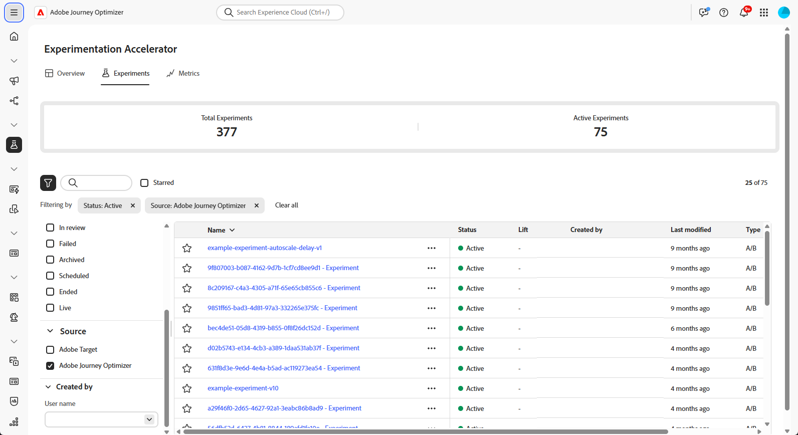
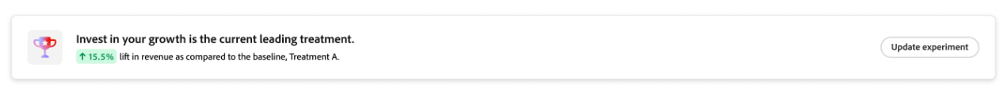
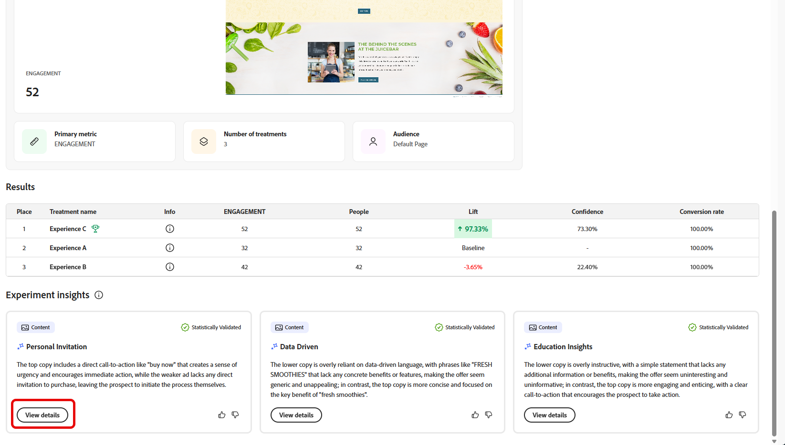

# Spåra dina experiment {#monitor}

>[!BEGINSHADEBOX]

* [Kom igång med Experimentation Accelerator](experiment-accelerator.md)
* [Dataanvändning i AI med Experimentation Accelerator](experiment-accelerator-security.md)
* [Experimentation Accelerator bästa praxis](experiment-accelerator-best-practices.md)
* **[Bildskärmsexperiment](experiment-accelerator-monitor.md)**
* [Experimentationsmått](experiment-accelerator-metrics.md)

>[!ENDSHADEBOX]

Fliken **[!UICONTROL Experiments]** centraliserar spårning och analys av tester från Adobe Journey Optimizer och Adobe Target. Du kan visa alla experiment, granska KPI:er och filtrera eller söka efter specifika tester.

## Kontrollpanel {#dashboard}

När du öppnar fliken Experimentera listas alla tillgängliga experiment från Journey Optimizer och Adobe Target i en konsoliderad vy. På så sätt kan du snabbt granska och jämföra experiment på båda plattformarna på ett och samma ställe.
Experimentlistan innehåller:

* Journey Optimizer experiment som skapats i antingen Campaigns eller Journeys.

* Adobe Target-experiment finns i Journey Optimizer standardsandlåda för produktion som är länkad till samma IMS-organisation.

KPI-avsnittet innehåller viktiga mätvärden, inklusive det totala antalet försök som skapats och det aktuella antalet, med en ögonblicksbild av den totala experimentaktiviteten

Du får åtkomst till filter genom att klicka på , som innehåller sammanhangsberoende alternativ som filtrering med **[!UICONTROL Type]**, **[!UICONTROL Starred]**, **[!UICONTROL Status]** eller **[!UICONTROL Source]**. Du kan till exempel filtrera så att endast aktiva experiment från Journey Optimizer visas.

Du kan också snabbt hitta ditt experiment genom att skriva in dess namn i sökfältet.

## Övervaka dina experiment {#monitor-page}

Om du vill få åtkomst till och övervaka dina experiment väljer du det tidigare konfigurerade experimentet i listan över experiment på fliken **[!UICONTROL Experiments]** eller använder den avancerade menyn för att **[!UICONTROL View details]** eller **[!UICONTROL Open in source]**.

Detaljsidan för experimentet delas upp i följande avsnitt:

* [Experimentera resultat](#experiment-outcome)
* [Hypotes](#hypothesis)
* [Information](#details)
* [Möjligheter](#opportunities)
* [Resultat](#results)
* [Experimenteringsinsikter](#insights)

### Experimentera {#experiment-outcome}

**[!UICONTROL Experiment outcome]** ger dig en snabb vy av den vinnande variationen i ditt experiment.

### Konfigurera {#set-up}

**[!UICONTROL Hypothesis]** fångar upp de planerade ändringarna som ska testas och dokumenterar den förväntade effekten på det primära måttet. Genom att definiera en tydlig **[!UICONTROL Hypothesis]** säkerställs att varje experiment har ett mätbart mål, vilket gör det enklare att utvärdera resultaten och avgöra om ändringarna leder till meningsfulla förbättringar.

Observera att du måste bekräfta hypotes- och behandlingsinformation samt statistisk signifikans för att [Experimentinsikter](#insights) ska kunna genereras.

1. Klicka på **[!UICONTROL Add]** om du vill skapa en **[!UICONTROL Hypothesis]** för ditt experiment.

   

1. Skriv in din **[!UICONTROL Hypothesis]** genom att ange ändringar som gjorts och hur de påverkar det primära måttet.

   Klicka på **[!UICONTROL Save]**.

1. Klicka på **[!UICONTROL Review]** för att lägga till eller ersätta bilden för varje behandling.

   

1. Behandlingsbilder genereras automatiskt, men om det behövs kan du välja **[!UICONTROL Add image]** eller **[!UICONTROL Replace image]** för att överföra en önskad skärmbild från dina lokala filer för din **[!UICONTROL Treatments]**.

   Observera att skärmbilden ska fånga hela sidan.

1. Klicka på ikonen  för att uppdatera **[!UICONTROL Hypothesis]** vid behov.

När du har konfigurerat din **[!UICONTROL Hypothesis]** får du värdefulla [insikter](#insights) och [affärsmöjligheter](#opportunities).

### Information {#details}

Widgeten **[!UICONTROL Experiment Effect]** ger en detaljerad vy över hur ditt experiment påverkade målgruppssegmenten. Här presenteras viktiga resultatindikatorer som hjälper er att bedöma engagemang och beteende, bland annat:

* **[!UICONTROL Success metric]** från Journey Optimizer eller **[!UICONTROL Primary metric]** från Adobe Target beroende på vad som konfigurerades när experimentet skapades.

* **[!UICONTROL Visitors]**: Det totala antalet unika besökare som exponerats för experimentet.

Du kan också visa en ögonblicksbild i realtid av hur den ledande behandlingen fungerar genom följande mått:

* **[!UICONTROL Current Leader]**: identifierar den behandling som för närvarande ger bäst prestanda.

* **[!UICONTROL Lift Over Baseline]**: mäter den procentuella förbättringen av den inledande behandlingen jämfört med kontrollen eller baslinjen.

* **[!UICONTROL Success metric]** från Journey Optimizer eller **[!UICONTROL Primary metric]** från Adobe Target beroende på vad som konfigurerades när experimentet skapades.

Längst ned i widgeten finns en kortfattad sammanfattning av din experimentkonfiguration, inklusive:

* **[!UICONTROL Success metric]** från Journey Optimizer eller **[!UICONTROL Primary metric]** från Adobe Target beroende på vad som konfigurerades när experimentet skapades.

* **[!UICONTROL Number of Treatments]**: Det totala antalet testade variationer.

* **[!UICONTROL Audience]**: Det eller de definierade användarsegment som användes under experimentet.

### Möjligheter {#opportunities}

>[!AVAILABILITY]
>
>Funktionen för affärsmöjligheter är begränsad till experiment med textbaserade ändringar.

Panelen **[!UICONTROL Opportunities]** visar AI-genererade rekommendationer som utformats för att förbättra testprestanda och anpassa sig till bredare affärsmål och KPI:er.

Observera att du först måste [bekräfta hypotes- och behandlingsinformation](#set-up) för att kunna skapa experimentmöjligheter.

1. Bläddra igenom den föreslagna möjligheten och klicka på **[!UICONTROL View Opportunity]**.

   

1. Om du väljer en affärsmöjlighet öppnas fönstret **Affärsinformation**, som visar en specifik behandling eller variant som föreslås av Experimentation Accelerator. Den här vyn innehåller:

   * **[!UICONTROL Hypothesis]**: En AI-genererad hypotes som förklarar det förväntade resultatet av den föreslagna behandlingen.

   * **[!UICONTROL Rationale]**: En förklaring till varför Experimentation Accelerator föreslog den här möjligheten.

   * **[!UICONTROL Opportunity evaluation]**: En dubbel utvärdering av rekommendationen baserad på:

      * **[!UICONTROL Learning potential]**: En uppskattning av hur mycket ny information affärsmöjligheten kan ge utifrån hur annorlunda den är jämfört med vad som har testats tidigare.

      * **[!UICONTROL Conversion potential]**: En uppskattning av hur sannolikt det är att affärsmöjligheten är att utföra bättre behandlingar, baserat på likheter med strategier som historiskt sett har fungerat bra.
   <!--
   * **[!UICONTROL New text treatment example]**: Words or phrases that demonstrate the style the AI recommends using.
   -->

   

1. Du kan sedan lägga till den direkt i ditt experiment genom att välja **[!UICONTROL Open Experiment]**.

1. Om det ursprungliga försöket skapades och hanterades i Adobe Journey Optimizer, kommer den här åtgärden att öppna **[!UICONTROL Content Experimentation Panel]** i den kampanjen.

   För experiment som kommer från **[!DNL Adobe Target]** läses de föreslagna ändringarna in i **[!DNL Adobe Target]** s experimenteringsarbetsflöde.

   ➡️ [Läs mer i Adobe Target-dokumentationen](https://experienceleague.adobe.com/en/docs/target/using/activities/abtest/test-ab)

1. I expertvyn är samma AI **[!UICONTROL Experimentation Opportunities]** som upplevs av Experimentation Accelerator tillgänglig.

   Välj **[!UICONTROL View]** för att öppna affärsmöjlighetsinformationen.

1. Om du väljer **[!UICONTROL Modify Experiment]** aktiveras direktredigering av det befintliga experimentet för att de föreslagna ändringarna ska tillämpas.

### Resultat {#results}

Tabellen **[!UICONTROL Results]** innehåller en detaljerad prestandabeskrivning av varje behandling i ett experiment. Dessa indikatorer hjälper till att utvärdera effektivitet, användarengagemang och övergripande effekter på viktiga affärsresultat:

* **[!UICONTROL Place]**: Behandlingens rangordningsposition baserad på prestanda som visar hur den jämförs med andra behandlingar.

* **[!UICONTROL Success metric]** från Journey Optimizer eller **[!UICONTROL Primary metric]** från Adobe Target beroende på vad som konfigurerades när experimentet skapades.

* **[!UICONTROL People]**: Antal användarprofiler som kvalificerar sig som målprofiler för dina meddelanden.

* **[!UICONTROL Lift]**: Mät den procentuella förbättringen av konverteringsgraden för en given behandling över baslinjen.

* **[!UICONTROL Confidence]**: Bevis på att en viss behandling är densamma som den initiala behandlingen. [Läs mer](../content-management/experiment-calculations.md#understand-confidence)

* **[!UICONTROL Conversion rate]**: Procentandel profiler som slutförde den önskade åtgärden (t.ex. köp, registrering) efter att behandlingen har visats.

### Experimentera {#insights}

>[!AVAILABILITY]
>
>Experimentation Insights-funktionen är begränsad till experiment med textbaserade ändringar.

**[!UICONTROL Experiment Insights]** är AI-genererade inlärningar som härleds från det här experimentet. Dessa insikter blir tillgängliga när experimentet har fått statistisk betydelse och ger en sammanhangsbaserad förståelse för vad som har bidragit till dess framgång. Panelerna sätter fokus på de viktigaste attribut som finns i den vinnande behandlingen, som skiljer sig från kontrollen, och som troligen påverkade resultatet.

Observera att för att expertinsikter ska kunna genereras måste du först [bekräfta hypotes- och behandlingsinformation](#set-up) samt statistisk signifikans som ska uppnås.

Klicka på **[!UICONTROL View details]** om du vill veta mer om de olika insikterna.

 

