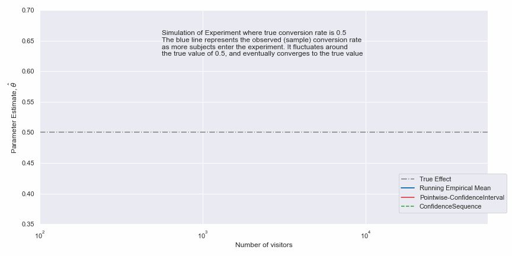
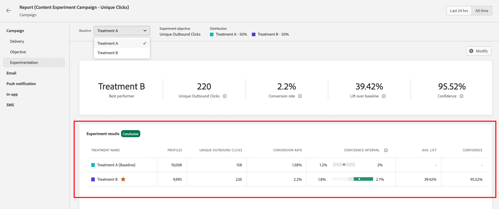

# Förstå statistiska beräkningar {#experiment-calculations}

I den här artikeln beskrivs de statistiska beräkningar som används när du kör Experiment i Adobe Journey Optimizer.

Experimentationen använder [avancerade statistiska metoder](../content-management/assets/confidence_sequence_technical_details.pdf) för att beräkna **konfidenssekvenser** och **konfidensnivå**, som gör att du kan köra dina experiment så länge som det behövs och övervaka dina resultat kontinuerligt.

Den här artikeln beskriver hur Experimentationen fungerar och ger en intuitiv introduktion till Adobe **Valfri tidsbegränsad konfidenssekvens**.

För expertanvändare beskrivs den tekniska informationen och referenserna på [den här sidan](../content-management/assets/confidence_sequence_technical_details.pdf).

## Statistisk testning och kontroll av fel {#statistical-testing}

När du kör ett experiment försöker du avgöra om det finns en skillnad mellan två populationer och sannolikheten för att skillnaden beror på en chans.

I allmänhet finns det två hypoteser:

* **Null Hypotes** betyder att behandlingen inte påverkas.
* **Alternativ hypotes**, vilket innebär att behandlingen påverkas.

I statistisk betydelse är målet att försöka bedöma styrkan hos bevisen för att avvisa nollhypotesen. En viktig punkt att notera är att statistisk signifikans används för att bedöma hur sannolikt det är att behandlingarna kommer att vara olika, inte hur sannolikt det är att de kommer att bli framgångsrika. Det är därför statistisk signifikans används i kombination med **Lyft**.

Effektiv experimenterande kräver att hänsyn tas till olika typer av fel som kan orsaka felaktiga slutsatser.

Tabellen ovan visar olika typer av fel:

* **Falska positiva (Type-I-fel)**: är ett felaktigt avvisande av nollhypotesen, när det faktiskt är sant. När det gäller online-undersökningar innebär detta att vi felaktigt drar slutsatsen att resultatmåttet är olika för varje behandling, även om det var detsamma.
   Innan vi kör experimentet väljer vi vanligtvis ett tröskelvärde `\alpha`. När experimentet har körts beräknas `p-value` och vi avvisar `null if p < \alpha`.Om du väljer `/alpha` baseras det på konsekvenserna av att få fel svar, till exempel i en klinisk prövning där någons liv kan påverkas, kan du välja att ha `\alpha = 0.005`. Ett vanligt tröskelvärde för onlineförsök är `\alpha = 0.05`, vilket innebär att vi i längden förväntar oss att 5 av 100 experiment ska vara falska positiva.

* **Falska negativ (Type-II-fel)**: betyder att vi inte kan ignorera nollhypotesen trots att den är falsk. För experiment innebär detta att vi inte avvisar nollhypotesen, när den i själva verket är annorlunda. För att kontrollera den här typen av fel måste vi vanligtvis ha tillräckligt många användare i vårt experiment för att garantera en viss ström, definierad som `1 - \beta` (dvs. ett minus sannolikheten för ett typ II-fel).

De flesta statistiska startmetoder kräver att du korrigerar din provstorlek i förväg, baserat på den effektstorlek som du vill bestämma samt din feltolerans (`\alpha` och `\beta`) i förväg. Adobe Journey Optimizer metod är dock utformad för att du kontinuerligt ska kunna se dina resultat, oavsett provstorlek.

## Adobe Statistisk metod: Valfri tidsbestämd ordningsföljd för tillförlitlighet

En **konfidenssekvens** är en sekventiell analog till ett **konfidensintervall**, t.ex. om du upprepar dina experiment etthundra gånger och beräknar en uppskattning av medelvärdet och dess associerade 95 %-konfidenssekvens för varje ny användare som deltar i experimentet. En 95-procentig konfidenssekvens inkluderar det verkliga värdet för mätvärdet i 95 av de 100 experiment du utförde. Ett 95-procentigt konfidensintervall kunde endast beräknas en gång per experiment för att ge samma 95-procentiga garanti, inte för varje enskild ny användare. Med Confidence Sequences kan du därför kontinuerligt övervaka experiment utan att öka andelen falskt positiva fel.

Skillnaden mellan konfidenssekvenser och konfidensintervall för ett enskilt experiment visas i animeringen nedan:

**Konfidenssekvenser** flyttar fokus för Experimentationer till uppskattning i stället för hypotesstestning, dvs. med fokus på en korrekt uppskattning av skillnaden i medelvärde mellan behandlingar, i stället för om en nollhypotes ska avvisas baserat på ett tröskelvärde för statistisk signifikans ska användas eller inte.

På ungefär samma sätt som för relationen mellan `p-values`, **Konfidenssekvenser** och **Konfidensintervall** finns det också en relation mellan **Konfidenssekvenser** och alla tidsperioder som är giltiga `p-values`, eller en tidsegenskap som är giltig. Med tanke på hur välkända kvantiteter är, som Konfidensen, tillhandahåller Adobe både **Konfidenssekvenser** och alla tidsperioder som är giltiga för Konfidentiellt i sina rapporter.

Den teoretiska grunden för **Confidence Sequences** kommer från studien av sekvenser med slumpmässiga variabler som kallas martingales. Nedan finns några viktiga resultat för expertläsare, men det är tydligt att yrkesutövare har gjort detta:

>[!NOTE]
>
>Konfidenssekvenser kan tolkas som säkra sekventiella analoger av konfidensintervall. Med konfidensintervall kan du bara tolka experimentet när du har nått den förinställda samplingsstorleken. Med självförtroende kan du emellertid när som helst titta på och tolka data i dina Experiment och på ett säkert sätt avbryta eller fortsätta med experimenten. Motsvarande Valfri tid-giltig konfidens, eller `p-value`, är även säker att tolka när som helst.

Det är viktigt att notera att eftersom konfidenssekvenser är&quot;när som helst giltiga&quot;, är de mer försiktiga än en metod med fast horisont som används med samma provstorlek. Konfidenssekvensens gränser är i allmänhet bredare än en beräkning av konfidensintervall, medan alla tidsperioder som är giltiga konfidensintervall är mindre än en beräkning av en fast horisont. Fördelen med denna konservatism är att du säkert kan tolka dina resultat hela tiden.

## Förklaring av en expert till slutsats

Varje gång du tittar på experimentrapporten analyserar Adobe de data som har ackumulerats i experimentet fram till den här tidpunkten och deklarerar ett experiment som &quot;semikoloniserande&quot; när det giltiga konfidensintervallet för varje tidpunkt överskrider ett tröskelvärde på 95 % för minst en av behandlingarna.

I det här skedet kommer den behandling som ger bäst resultat (baserat på konverteringsgraden eller det profilnormaliserade måttvärdet) att markeras överst på rapportskärmen och markeras med en stjärna i tabellrapporten. Endast behandlingar med ett konfidensintervall på mer än 95% tillsammans med utgångsvärdet beaktas vid denna bestämning.

När det finns mer än två behandlingar används länken för korrigering av Bonferroni för att korrigera flera jämförelseproblem, och styr den familjvisa felfrekvensen. I detta scenario är det också möjligt att det finns flera behandlingar vars konfidensgrad är större än 95 procent och vars konfidensintervall överlappar varandra. I det här fallet deklarerar Adobe Journey Optimizer den som har den högsta konverteringsgraden (eller profilnormaliserade mätvärden) som den bästa prestandan.
