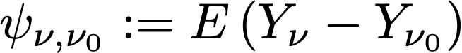
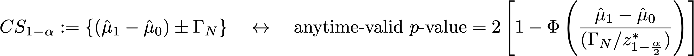

# Förstå statistiska beräkningar i experimentrapporten {#experiment-report-calculations}

På den här sidan visas detaljerade statistiska beräkningar som används i rapporten Experimentation för Campaigns i Adobe Journey Optimizer.

Observera att den här sidan är avsedd för tekniska användare.

## Konverteringsgrad

Konverteringsgraden eller **medelvärdet**, μν för varje behandling `ν` i en expert definieras som en proportion av summan av måttet och antalet profiler som tilldelats det måttet, Nν:

{width="125" align="center"}

Här är Yiν värdet på mållagret för varje profil `i` som har tilldelats en given variant *ν*. När det objektiva måttet är ett&quot;unikt&quot; mått, dvs. antalet profiler som utför en viss åtgärd, visas det som en konverteringsgrad och formateras som en procentandel. När mätvärdet är ett värde för antal eller totalt värde (t.ex. när e-post öppnas, intäkter), visas medelvärdet för uppskattningen för mätvärdet som Antal per profil eller Värde per profil.

Vid behov används samplingens standardavvikelse med uttrycket:

{width="225" align="center"}

## Lyft {#lift}

Lyftet mellan varianten *ν* och kontrollvarianten *ν0* är det relativa deltavärdet i konverteringsgrader, som definieras som beräkningen nedan där de enskilda konverteringssatserna är enligt definitionen ovan. Detta visas som ett procenttal.

{width="125" align="center"}

 

## Giltiga konfidensintervall för enskilda behandlingar

På panelen Journey Experimentation visas &quot;närsomhelst giltiga&quot; konfidensintervall (konfidenssekvenser) för enskilda behandlingar i ett experiment.

Konfidenssekvensen för en enskild variant `ν` är central för den statistiska metod som används av Adobe. Definitionen finns på [den här sidan](https://doi.org/10.48550/arXiv.2103.06476) (reproducerad från [Waudby-Smith et al.]).

Om du är intresserad av att uppskatta målparametern `ψ`, t.ex. konverteringsgraden för en variant i en expert, kan dichotomin mellan en sekvens med &#39;fast tid&#39; konfidensintervall (CI) och en tidsenhetlig konfidenssekvens (CS) sammanfattas enligt följande:

{width="500" align="center"}

För ett regelbundet konfidensintervall är den sannolika garantin för att målparametern ligger inom intervallet för värden Ċn bara giltig vid ett fast värde på `n` (där `n` är antalet samplingar). Omvänt för en konfidenssekvens garanteras vi att det &quot;sanna&quot; värdet för parametern i intresse alltid/alla värden för samplingsstorleken `t` ligger inom gränserna.

Detta har några viktiga konsekvenser som är mycket viktiga för onlinetestning:

* CS kan uppdateras när nya data blir tillgängliga.
* Experimentera kan övervakas kontinuerligt, stoppas på ett adaptivt sätt eller fortsätta.
* Type-I-felet kontrolleras vid alla stopptider, inklusive databeroende tider.

Adobe använder sekvenser med asymtomatisk konfidenssekvens, som för en enskild variant med medeluppskattningen `μ` har följande format:

{width="300" align="center"}

Var:

* `N` är antalet enheter för den varianten.
* `σ` är en exempeluppskattning av standardavvikelsen (definieras ovan).
* `α` är den önskade nivån av typ I-fel (eller sannolikhet för feltäckning). Den här inställningen är alltid 0,05.
* ρ2 är en konstant som justerar den samplingsstorlek som CS är tätast vid. Adobe har valt det universella värdet ρ2 = 10-2.8, vilket är lämpligt för de konverteringstyper som används i onlineförsök.

## Förtroende {#confidence}

Den tillförlitlighet som Adobe använder är en tillförsikt som kan erhållas när som helst genom att invertera konfidenssekvensen för den genomsnittliga behandlingseffekten.

För att vara exakt finns det i ett *t* -test för skillnaden i medelvärde mellan två varianter en :1-mappning mellan *p*-värdet för det här testet och konfidensintervallet för mellanskillnaden. Ett *p*-värde kan erhållas när som helst genom att invertera (när som helst giltig) konfidenssekvens för den genomsnittliga uppskattaren av behandlingseffekt:

{width="200" align="center"}

Här är *E* en förväntan. Den uppskattade faktor som används är en IPW-skattare (Inverse Propensity WWT). Överväg N = N0 +N1 enheter, varianttilldelningarna för varje enhet `i` som är märkt med Ai=0,1 om enheten är tilldelad till varianten `ν`=0,1. Om användarna har tilldelats en fast sannolikhet (benägenhet) π0, (1-π0) och deras resultatmått är Yi, är IPW-uppskattaren för den genomsnittliga behandlingseffekten:

{width="400" align="center"}

Observera att *f* är påverkansfunktionen, Waudiby-Smith et al. visade att tävlingssekvensen för den här uppskattaren är:

{width="500" align="center"}

Om du ersätter tilldelningens sannolikhet med dess empiriska uppskattningar: π0 = N0/N, kan varianstermen uttryckas som enskilda samplingsmedeluppskattningar μ0,1 och standardavvikelseuppskattningar, σ0,1 som:

{width="500" align="center"}

Kom sedan ihåg att det finns en korrespondens mellan  -värden och konfidensintervall för en regelbunden hypotesstest med testvärdet z = (μA-μ0/σp`p`):

{width="500" align="center"}

där `Φ` är den kumulativa fördelningen av standardnormalvärdet. För varje tid som giltiga `p`-värden, med tanke på konfidenssekvensen för den genomsnittliga behandlingseffekten som definieras ovan, kan vi invertera den här relationen:

{width="600" align="center"}

Slutligen är **anyTime-förtroendet**:

{width="200" align="center"}

## Förklaring av en expert till slutsats

För en expert med två armar visar Journey Optimizer Experimentation-panelen ett meddelande om att en Experiment är **slutlig** när den giltiga konfidensnivån överstiger 95 % (dvs. värdet för `p` är under 5 % när som helst).

När det finns fler än två varianter används Bonferonni-korrigeringen för att kontrollera den familjeselva felfrekvensen. För ett experiment med `K` behandlingar och en enstaka baslinjebehandling (kontrollbehandling) finns det `K-1` oberoende hypotesstester. Korrigeringen av Bonferonni innebär att vi avvisar den nollhypotes som kontrollen och en given variant har samma medel, om värdet `p` (definieras ovan) vid något tillfälle är lägre än tröskelvärdet `α/(K-1)`.

## Högpresterande arm

När ett försök har förklarats slutgiltigt visas den arm som har bäst prestanda. Detta är armen med bästa prestanda (högsta medelvärde eller konverteringsgrad), bland uppsättningen som innehåller kontrollen, och alla armar som har ett `p`-värde som är under Bonferonni-tröskeln.
