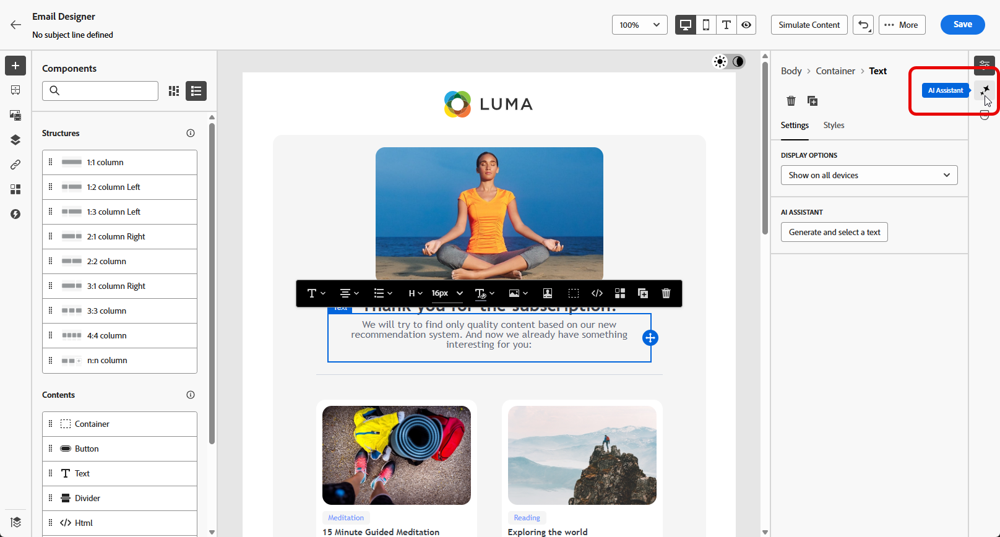
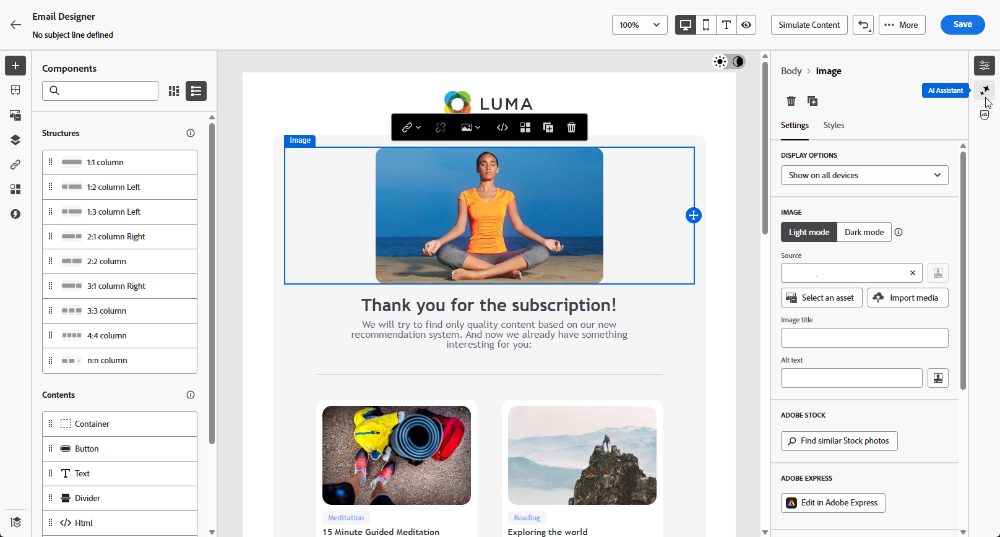

# E-postgenerering med AI-assistenten {#generative-email}

>[!BEGINSHADEBOX]

**Innehållsförteckning**

* [Kom igång med AI-assistenten](gs-generative.md)
* E-postgenerering med AI-assistenten
* [SMS-generering med AI-assistenten](generative-sms.md)
* [Push-generering med AI Assistant](generative-push.md)
* [Experimentera med AI-assistenten](generative-experimentation.md)

>[!ENDSHADEBOX]

>[!NOTE]
>
>Innan du börjar använda den här funktionen bör du läsa upp relaterade [säkerhetsutkast och begränsningar](gs-generative.md#generative-guardrails).

När du har skapat och anpassat dina e-postmeddelanden kan du utnyttja kraften i AI Assistant i Journey Optimizer, som drivs av generativ AI, för att lyfta fram ditt innehåll.

Använd AI Assistant för att effektivisera era kampanjer genom att skapa kompletta e-postmeddelanden, skräddarsydda textutdrag och anpassade bilder som talar direkt till er målgrupp, vilket ökar engagemanget och interaktionen.

Gå igenom flikarna nedan och lär dig hur du använder AI Assistant i Journey Optimizer.

>[!BEGINTABS]

>[!TAB Fullständig e-postgenerering]

I följande exempel använder vi AI-assistenten för att förfina en befintlig e-postmall.

1. När du har skapat och konfigurerat din e-postkampanj klickar du på **[!UICONTROL Edit content]**.

   Mer information om hur du konfigurerar din e-postkampanj finns på [den här sidan](../campaigns/create-campaign.md).

1. Anpassa din e-post efter behov och gå till menyn **[!UICONTROL AI Assistant]**.

   {zoomable="yes"}

1. Aktivera alternativet **[!UICONTROL Use original content]** för AI-assistenten för att anpassa nytt innehåll baserat på kampanjinnehåll, namn och vald målgrupp.

   Din fråga måste alltid vara knuten till ditt aktuella innehåll.

1. Finjustera innehållet genom att beskriva vad du vill generera i fältet **[!UICONTROL Prompt]**.

   Om du vill ha hjälp med att skapa din fråga kan du få tillgång till **[!UICONTROL Prompt Library]**, som innehåller en mängd olika tips för att förbättra dina kampanjer.

   {zoomable="yes"}

1. Du kan växla mellan alternativen **[!UICONTROL Subject line]** och **[!UICONTROL Preheader]** för att inkludera dem i variantgenereringen.

1. Klicka på **[!UICONTROL Upload brand asset]** om du vill lägga till en varumärkesresurs som innehåller innehåll som kan ge ytterligare kontext till AI-assistenten eller välja en som har överförts tidigare.

   {zoomable="yes"}

1. Skräddarsy uppmaningen med de olika alternativen:

   * **[!UICONTROL Communication strategy]**: Välj den lämpligaste kommunikationsstilen för den genererade texten.
   * **[!UICONTROL Language]**: Välj det språk som du vill att ditt innehåll ska genereras på.
   * **[!UICONTROL Tone]**: Tonen i ditt e-postmeddelande bör matcha med din publik. Vare sig du vill låta informativ, lekfull eller övertygande kan AI-assistenten anpassa meddelandet därefter.

   {zoomable="yes"}

1. Klicka på **[!UICONTROL Generate]** när din fråga är klar.

1. Bläddra igenom den genererade **[!UICONTROL Variations]** och klicka på **[!UICONTROL Preview]** för att visa en fullskärmsversion av den valda varianten.

1. Navigera till alternativet **[!UICONTROL Refine]** i fönstret **[!UICONTROL Preview]** för att få tillgång till ytterligare anpassningsfunktioner:

   * **[!UICONTROL Rephrase]**: AI-assistenten kan omformulera ditt meddelande på olika sätt, vilket håller skrivandet aktuellt och engagerande för olika målgrupper.

   * **[!UICONTROL Use simpler language]**: Utnyttja AI-assistenten för att förenkla ditt språk och säkerställa tydlighet och tillgänglighet för en större publik.

   {zoomable="yes"}

1. Klicka på **[!UICONTROL Select]** när du har hittat rätt innehåll.

   Du kan också göra det möjligt att experimentera med ditt innehåll. [Läs mer](generative-experimentation.md)

1. Infoga anpassningsfält för att anpassa ditt e-postinnehåll baserat på profildata. Klicka sedan på knappen **[!UICONTROL Simulate content]** för att kontrollera återgivningen och kontrollera personaliseringsinställningarna med testprofiler. [Läs mer](../personalization/personalize.md)

När ni har definierat ert innehåll, er målgrupp och ert schema är ni redo att förbereda er e-postkampanj. [Läs mer](../campaigns/review-activate-campaign.md)

>[!TAB Textgenerering]

I följande exempel använder vi AI-assistenten för att förbättra innehållet i vårt e-postmeddelande.

1. När du har skapat och konfigurerat din e-postkampanj klickar du på **[!UICONTROL Edit content]**.

   Mer information om hur du konfigurerar din e-postkampanj finns på [den här sidan](../email/create-email.md).

1. Välj en **[!UICONTROL Text component]** om du bara vill ha ett specifikt innehåll som mål. och gå till menyn **[!UICONTROL AI Assistant]**.

   {zoomable="yes"}

1. Aktivera alternativet **[!UICONTROL Use original content]** för AI-assistenten för att anpassa nytt innehåll baserat på kampanjinnehåll, namn och vald målgrupp.

   Din fråga måste alltid vara knuten till ditt aktuella innehåll.

1. Finjustera innehållet genom att beskriva vad du vill generera i fältet **[!UICONTROL Prompt]**.

   Om du vill ha hjälp med att skapa din fråga kan du få tillgång till **[!UICONTROL Prompt Library]**, som innehåller en mängd olika tips för att förbättra dina kampanjer.

   {zoomable="yes"}

1. Klicka på **[!UICONTROL Upload brand asset]** om du vill lägga till en varumärkesresurs som innehåller innehåll som kan ge ytterligare kontext till AI-assistenten.

   {zoomable="yes"}

1. Skräddarsy uppmaningen med de olika alternativen:

   * **[!UICONTROL Communication strategy]**: Välj önskad kommunikationsmetod för den genererade texten.
   * **[!UICONTROL Language]**: Välj språk för variantens innehåll.
   * **[!UICONTROL Tone]**: Se till att texten passar din målgrupp och ditt syfte.
   * **[!UICONTROL Length]**: Välj längden på ditt innehåll med intervallreglaget.

   {zoomable="yes"}

1. Klicka på **[!UICONTROL Generate]** när din fråga är klar.

1. Bläddra igenom den genererade **[!UICONTROL Variations]** och klicka på **[!UICONTROL Preview]** för att visa en fullskärmsversion av den valda varianten.

1. Navigera till alternativet **[!UICONTROL Refine]** i fönstret **[!UICONTROL Preview]** för att få tillgång till ytterligare anpassningsfunktioner:

   * **[!UICONTROL Use as reference content]**: Den valda varianten fungerar som referensinnehåll för att generera andra resultat.

   * **[!UICONTROL Elaborate]**: AI-assistenten kan hjälpa dig att expandera specifika ämnen och ge ytterligare information för bättre förståelse och engagemang.

   * **[!UICONTROL Summarize]**: Långvarig information kan överlagra e-postmottagare. Använd AI Assistant för att dra ihop viktiga punkter till tydliga, kortfattade sammanfattningar som får dem att läsa mer.

   * **[!UICONTROL Rephrase]**:AI-assistenten kan omformulera ditt meddelande på olika sätt, vilket håller skrivandet aktuellt och engagerande för olika målgrupper.

   * **[!UICONTROL Use simpler language]**: Utnyttja AI-assistenten för att förenkla ditt språk och säkerställa tydlighet och tillgänglighet för en större publik.

   {zoomable="yes"}

1. Klicka på **[!UICONTROL Select]** när du har hittat rätt innehåll.

   Du kan också göra det möjligt att experimentera med ditt innehåll. [Läs mer](generative-experimentation.md)

1. Infoga anpassningsfält för att anpassa ditt e-postinnehåll baserat på profildata. Klicka sedan på knappen **[!UICONTROL Simulate content]** för att kontrollera återgivningen och kontrollera personaliseringsinställningarna med testprofiler. [Läs mer](../personalization/personalize.md)

När ni har definierat ert innehåll, er målgrupp och ert schema är ni redo att förbereda er e-postkampanj. [Läs mer](../campaigns/review-activate-campaign.md)

>[!TAB Bildgenerering]

I exemplet nedan kan du lära dig hur du använder AI Assistant för att optimera och förbättra dina resurser, vilket ger en mer användarvänlig upplevelse.

1. När du har skapat och konfigurerat din e-postkampanj klickar du på **[!UICONTROL Edit content]**.

   Mer information om hur du konfigurerar din e-postkampanj finns på [den här sidan](../email/create-email.md).

1. Fyll i **[!UICONTROL Basic details]** för din kampanj. Klicka på **[!UICONTROL Edit email content]** när du är klar.

1. Markera den resurs som du vill ändra med AI-assistenten.

1. Välj **[!UICONTROL AI Assistant]** på den högra menyn.

   {zoomable="yes"}

1. Aktivera alternativet **[!UICONTROL Reference style]** för AI-assistenten för att anpassa nytt innehåll baserat på referensinnehållet. Du kan också överföra en bild för att lägga till kontext till variationen.

   Din fråga måste alltid vara knuten till ditt aktuella innehåll.

1. Finjustera innehållet genom att beskriva vad du vill generera i fältet **[!UICONTROL Prompt]**.

   Om du vill ha hjälp med att skapa din fråga kan du få tillgång till **[!UICONTROL Prompt Library]**, som innehåller en mängd olika tips för att förbättra dina kampanjer.

   {zoomable="yes"}

1. Klicka på **[!UICONTROL Upload brand asset]** om du vill lägga till en varumärkesresurs som innehåller innehåll som kan ge ytterligare kontext till AI-assistenten.

1. Skräddarsy uppmaningen med de olika alternativen:

   * **[!UICONTROL Aspect ratio]**: Detta avgör resursens bredd och höjd. Du kan välja mellan vanliga proportioner som 16:9, 4:3, 3:2 eller 1:1, eller ange en anpassad storlek.
   * **[!UICONTROL Color & tone]**: Det övergripande utseendet på färgerna i en bild och stämningen eller atmosfären som den förmedlar.
   * **[!UICONTROL Content type]**: Detta kategoriserar det visuella elementets karaktär och skiljer mellan olika former av visuell representation, t.ex. foton, grafik eller grafik.
   * **[!UICONTROL Lighting]**: Det här refererar till blixten i en bild, som formar atmosfären och markerar specifika element.
   * **[!UICONTROL Composition]**: Det här refererar till elementens placering i en bilds bildruta

   {zoomable="yes"}

1. När du är nöjd med promptkonfigurationen klickar du på **[!UICONTROL Generate]**.

1. Bläddra i **[!UICONTROL Variation suggestions]** för att hitta den önskade resursen.

   Klicka på **[!UICONTROL Preview]** om du vill visa en fullskärmsversion av den valda varianten.

   {zoomable="yes"}

1. Välj **[!UICONTROL Show Similar]** om du vill visa relaterade bilder till den här varianten.

   {zoomable="yes"}

1. Klicka på **[!UICONTROL Select]** när du har hittat rätt innehåll.

   Du kan också göra det möjligt att experimentera med ditt innehåll. [Läs mer](generative-experimentation.md)

1. När du har definierat meddelandeinnehållet klickar du på knappen **[!UICONTROL Simulate content]** för att kontrollera återgivningen och kontrollerar personaliseringsinställningarna med testprofiler. [Läs mer](../personalization/personalize.md)

1. När ni har definierat ert innehåll, er målgrupp och ert schema är ni redo att förbereda er e-postkampanj. [Läs mer](../campaigns/review-activate-campaign.md)

>[!ENDTABS]

## Instruktionsvideo {#video}

Lär dig hur du använder AI-assistenten för att generera fullständig e-post, text eller bilder.

>[!VIDEO](https://video.tv.adobe.com/v/3428341)
