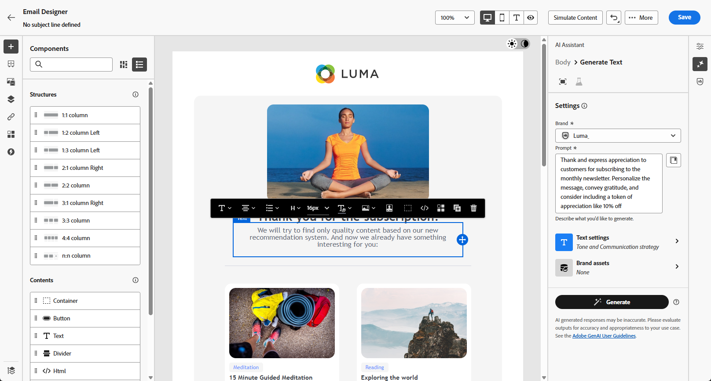

# Innehållsexperiment med AI Assistant{#generative-experimentation}

>[!IMPORTANT]
>
>Innan du börjar använda den här funktionen bör du läsa upp relaterade [säkerhetsutkast och begränsningar](gs-generative.md#generative-guardrails).
> 
>
>Du måste godkänna ett [användaravtal](https://www.adobe.com/legal/licenses-terms/adobe-dx-gen-ai-user-guidelines.html) innan du kan använda AI Assistant i Journey Optimizer. Kontakta din Adobe-representant om du vill veta mer.

När du har skapat och personaliserat dina meddelanden kan du lyfta fram ditt innehåll med AI Assistant i Adobe Journey Optimizer, som innehåller funktionen för innehållsexperiment. Med det här verktyget kan du definiera flera olika leveranssätt, med varierande innehåll, för att mäta målgruppens prestanda.

1. Skapa en kampanj och använd AI Assistant för att generera varianter.

   I det här exemplet har vi skapat ett e-postmeddelande med en kampanjkod.

   

1. Bläddra igenom den genererade **[!UICONTROL Variations]** och klicka på **[!UICONTROL Preview]** för att visa en fullskärmsversion av den valda varianten.

   

1. Välj **[!UICONTROL Enable Experiment]** om du vill börja skapa **[!UICONTROL Treatments]** för din experimentering.

1. Välj de variationer som du vill ta med i ditt experiment.

1. Klicka på **Lägg till för att experimentera**.

   

1. Från din Content Experiment kan du nu börja konfigurera dina innehållsexperiment. [Läs mer om Content Experiment](../content-management/content-experiment.md)

1. När ditt innehållsexperiment är klart kan du från kampanjsammanfattningssidan klicka på **[!UICONTROL Review to activate]** för att visa en sammanfattning av kampanjen. Varningar visas om någon parameter är felaktig eller saknas. [Läs mer](../content-management/content-experiment.md#treatment-experiment)

1. Kontrollera att alla konfigurationer är korrekta innan du startar kampanjen och klicka sedan på **[!UICONTROL Activate]**.

När ni har konfigurerat och personaliserat kampanjen kan ni spåra kampanjen i kampanjrapporten. [Läs mer](../reports/campaign-global-report-cja.md)
