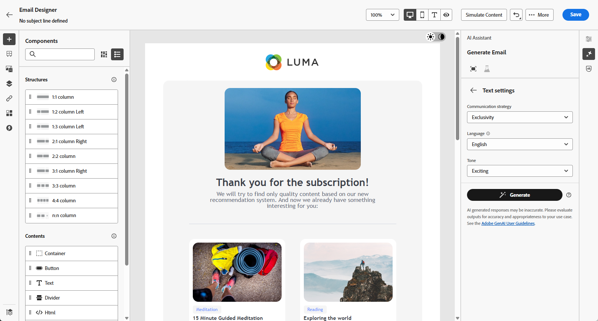

# Generera allt innehåll med AI Assistant {#generative-full-content}

>[!IMPORTANT]
>
>Innan du börjar använda den här funktionen bör du läsa upp relaterade [säkerhetsutkast och begränsningar](gs-generative.md#generative-guardrails).
> 
>
>Du måste godkänna ett [användaravtal](https://www.adobe.com/legal/licenses-terms/adobe-dx-gen-ai-user-guidelines.html) innan du kan använda AI Assistant i Journey Optimizer. Kontakta din Adobe-representant om du vill veta mer.

Använd AI Assistant i Journey Optimizer för att generera kompletta innehållsupplevelser i alla era e-post-, webb-, landnings- och push-meddelandekanaler. AI Assistant hjälper er att optimera effekten av era leveranser genom att skapa omfattande innehåll som får genklang hos er målgrupp.

## För e-post- och webbkanaler {#email-web-channels}

AI Assistant kan producera kompletta innehållsupplevelser för e-postkampanjer, webbsidor och landningssidor och både generera text och bilder. Denna robusta funktionalitet hjälper er att skapa övertygande varumärkesanpassat innehåll som kan kopplas till er målgrupp via alla digitala kontaktytor.

### Åtkomst och konfiguration {#access-configure}

Innan du börjar skapa innehåll med AI Assistant måste du konfigurera kampanjen eller resan och öppna innehållsredigeraren. Följ stegen nedan för att förbereda arbetsytan och öppna AI Assistant-panelen.

1. Skapa och konfigurera kampanj eller resa:
   * **E-post**: När du har skapat och konfigurerat din e-postkampanj klickar du på **[!UICONTROL Edit content]**. [Läs mer](../campaigns/create-campaign.md)
   * **Webb**: När du har skapat och konfigurerat webbsidan klickar du på **[!UICONTROL Edit web page]**. [Läs mer](../web/create-web.md)
   * **Landningssida**: När du har skapat och konfigurerat landningssidan klickar du på **[!UICONTROL Edit content]**. [Läs mer](../landing-pages/create-lp.md)

1. Anpassa layouten efter behov och öppna menyn **[!UICONTROL AI Assistant]**.

   {zoomable="yes"}

### Generera innehåll {#generate-content}

Med AI Assistant öppen kan du nu konfigurera genereringsinställningarna för att skapa innehåll som matchar ert varumärke och era kampanjmål. Anpassa text- och bildparametrar, lägg till varumärkesresurser och ge tips om hur AI kan generera relevanta variationer för er målgrupp.

1. Aktivera alternativet **[!UICONTROL Use original content]** för AI Assistant för att anpassa nytt innehåll baserat på det valda innehållet.

1. Välj din **[!UICONTROL Brand]** för att se till att det AI-genererade innehållet följer varumärkesspecifikationerna. [Läs mer](brands.md) om varumärken.

1. Finjustera innehållet genom att beskriva vad du vill generera i fältet **[!UICONTROL Prompt]**.

   Om du vill ha hjälp med att skapa din fråga kan du få tillgång till **[!UICONTROL Prompt Library]**, som innehåller en mängd olika tips för att förbättra dina kampanjer. [Läs mer om god praxis](ai-assistant-prompting-guide.md)

   {zoomable="yes"}

1. **För e-postmeddelanden** kan du växla mellan alternativen **[!UICONTROL Subject line]** och **[!UICONTROL Preheader]** för att inkludera dem i variantgenereringen.

1. Skräddarsy din fråga med alternativet **[!UICONTROL Text settings]**:

   * **[!UICONTROL Communication strategy]**: Välj den lämpligaste kommunikationsstilen för den genererade texten.
   * **[!UICONTROL Languages]**: Välj språk för det genererade innehållet.
   * **[!UICONTROL Tone]**: Tonen bör återges med din målgrupp. Vare sig du vill låta informativ, lekfull eller övertygande kan AI Assistant anpassa budskapet därefter.

   {zoomable="yes"}

1. Välj din **[!UICONTROL Image settings]**:

   * **[!UICONTROL Content type]**: Detta kategoriserar det visuella elementets karaktär och skiljer mellan olika former av visuell representation, t.ex. foton, grafik eller grafik.
   * **[!UICONTROL Visual intensity]**: Du kan styra bildens effekt genom att justera dess intensitet. En lägre inställning (2) ger ett mjukare och mer återhållsam utseende, medan en högre inställning (10) gör bilden mer levande och visuellt kraftfull.
   * **[!UICONTROL Color & tone]**: Det övergripande utseendet på färgerna i en bild och stämningen eller atmosfären som den förmedlar.
   * **[!UICONTROL Lighting]**: Det här refererar till blixten i en bild, som formar atmosfären och markerar specifika element.
   * **[!UICONTROL Composition]**: Det här refererar till elementens placering i en bilds bildruta

   {zoomable="yes"}

1. Klicka på **[!UICONTROL Brand assets]** på menyn **[!UICONTROL Upload brand asset]** om du vill lägga till en varumärkesresurs som innehåller innehåll som kan ge ytterligare kontext-AI Assistant eller välja en tidigare överförd.

   Tidigare överförda filer är tillgängliga i listrutan **[!UICONTROL Uploaded brand assets]**. Du behöver bara växla mellan de resurser du vill ha med i din generation.

   {zoomable="yes"}

1. Klicka på **[!UICONTROL Generate]** när din fråga är klar.

### Förfina och slutför {#refine-finalize}

När du har genererat innehållsvariationer kan du finjustera resultatet för att säkerställa att det uppfyller dina exakta krav. Granska varumärkesjusteringen, justera ton och språk och förbered innehållet för aktivering i kampanjen eller under kundresan.

1. Efter genereringen bläddrar du igenom **[!UICONTROL Variations]** och klickar på **[!UICONTROL Preview]** för att visa en fullskärmsversion av den valda varianten eller **[!UICONTROL Apply]** för att ersätta det aktuella innehållet.

1. Klicka på procentikonen för att visa din **[!UICONTROL Brand Alignment Score]** och identifiera eventuella feljusteringar av ditt varumärke.

   Läs mer om [varumärkesjusteringspoäng](brands-score.md).

   {zoomable="yes"}

1. Navigera till alternativet **[!UICONTROL Refine]** i fönstret **[!UICONTROL Preview]** för att få tillgång till ytterligare anpassningsfunktioner:

   * **[!UICONTROL Rephrase]**: Skriv om meddelandet med bibehållen betydelse. Med det här alternativet kan du generera alternativa ordalydelser, förbättra flödet eller justera fraser utan att ändra huvudbudskapet.

   * **[!UICONTROL Use simpler language]**: Använd AI Assistant för att förenkla ditt språk och säkerställa tydlighet och tillgänglighet för en större publik.

   * **[!UICONTROL Change tone]**: Justera tonen i meddelandet så att det bättre matchar din kommunikationsstil, dvs. gör det mer användarvänligt, professionellt, brådskande eller inspirerande.

   * **[!UICONTROL Change Communication strategy]**: Ändra meddelandetillvägagångssättet baserat på dina mål, till exempel skapa en tränglighet eller framhäva en spännande tilltalande upplevelse.

   {zoomable="yes"}

1. Öppna fliken **[!UICONTROL Brand Alignment]** och se hur ditt innehåll överensstämmer med [varumärkesriktlinjerna](brands.md).

1. Klicka på **[!UICONTROL Select]** när du har hittat rätt innehåll.

   Du kan också göra det möjligt att experimentera med ditt innehåll. [Läs mer](generative-experimentation.md)

1. Infoga anpassningsfält för att anpassa innehållet baserat på profildata. Klicka sedan på knappen **[!UICONTROL Simulate content]** för att kontrollera återgivningen och kontrollera personaliseringsinställningarna med testprofiler. [Läs mer](../personalization/personalize.md)

1. Granska och aktivera ditt innehåll:
   * **E-post**: När du har definierat ditt innehåll, din målgrupp och ditt schema är du redo att förbereda din e-postkampanj. [Läs mer](../campaigns/review-activate-campaign.md)
   * **Webb**: När du har definierat inställningarna för webbkampanjen och redigerat innehållet efter behov kan du granska och aktivera webbkampanjen. [Läs mer](../web/create-web.md#activate-web-campaign)
   * **Landningssida**: När landningssidan är klar kan du publicera den och göra den tillgänglig för användning i ett meddelande. [Läs mer](../landing-pages/create-lp.md#publish-landing-page)

## För mobila kanaler {#mobile-channels}

AI Assistant har även stöd för innehållsgenerering för mobila push-meddelanden, vilket gör att du kan skapa engagerande titlar, meddelanden och bilder för dina mobilappar. På så sätt kan ni upprätthålla en enhetlig och högkvalitativ kommunikation över alla kundkontaktytor, inklusive mobiler.

### Åtkomst och konfiguration {#mobile-access-configure}

Om du vill använda AI Assistant för push-meddelanden skapar du först en push-kampanj och öppnar innehållsredigeraren. Stegen nedan vägleder dig genom att förbereda kampanjen och få tillgång till AI Assistant-verktygen.

1. När du har skapat och konfigurerat din push-meddelandekampanj klickar du på **[!UICONTROL Edit content]**.

   Mer information om hur du konfigurerar din push-meddelandekampanj finns på [den här sidan](../push/create-push.md).

1. Fyll i **[!UICONTROL Basic details]** för din kampanj. Klicka på **[!UICONTROL Edit content]** när du är klar.

1. Anpassa push-meddelanden efter behov. [Läs mer](../push/design-push.md)

1. Öppna menyn **[!UICONTROL Show AI Assistant]**.

   {zoomable="yes"}

### Generera innehåll {#mobile-generate-content}

När du har använt AI Assistant för push-meddelanden kan du konfigurera genereringsinställningarna för att skapa övertygande mobilt innehåll. Definiera text- och bildinställningar, välj varumärkesresurser och använd uppmaningar för att generera varianter av push-meddelanden som engagerar mobilanvändarna.

1. Aktivera alternativet **[!UICONTROL Use original content]** för AI Assistant för att anpassa nytt innehåll baserat på det valda innehållet.

1. Välj din **[!UICONTROL Brand]** för att se till att det AI-genererade innehållet följer varumärkesspecifikationerna. [Läs mer](brands.md) om varumärken.

   Observera att funktionen Varumärke släpps som en privat betaversion och kommer att finnas tillgänglig för alla kunder i framtida versioner.

1. Finjustera innehållet genom att beskriva vad du vill generera i fältet **[!UICONTROL Prompt]**.

   Om du vill ha hjälp med att skapa din fråga kan du få tillgång till **[!UICONTROL Prompt Library]**, som innehåller en mängd olika tips för att förbättra dina kampanjer.

   {zoomable="yes"}

1. Välj vilket fält du vill generera: **[!UICONTROL Title]**, **[!UICONTROL Message]** och/eller **[!UICONTROL Image]**.

1. Skräddarsy din fråga med alternativet **[!UICONTROL Text settings]**:

   * **[!UICONTROL Communication strategy]**: Välj den lämpligaste kommunikationsstilen för den genererade texten.
   * **[!UICONTROL Languages]**: Välj språk för det genererade innehållet.
   * **[!UICONTROL Tone]**: Tonen på dina push-meddelanden ska matcha din publik. Vare sig du vill låta informativ, lekfull eller övertygande kan AI Assistant anpassa budskapet därefter.

   {zoomable="yes"}

1. Välj din **[!UICONTROL Image settings]**:

   * **[!UICONTROL Content type]**: Detta kategoriserar det visuella elementets karaktär och skiljer mellan olika former av visuell representation, t.ex. foton, grafik eller grafik.
   * **[!UICONTROL Visual intensity]**: Du kan styra bildens effekt genom att justera dess intensitet. En lägre inställning (2) ger ett mjukare och mer återhållsam utseende, medan en högre inställning (10) gör bilden mer levande och visuellt kraftfull.
   * **[!UICONTROL Color & tone]**: Det övergripande utseendet på färgerna i en bild och stämningen eller atmosfären som den förmedlar.
   * **[!UICONTROL Lighting]**: Det här refererar till blixten i en bild, som formar atmosfären och markerar specifika element.
   * **[!UICONTROL Composition]**: Det här refererar till elementens placering i en bilds bildruta

   {zoomable="yes"}

1. Klicka på **[!UICONTROL Brand assets]** på menyn **[!UICONTROL Upload brand asset]** om du vill lägga till en varumärkesresurs som innehåller innehåll som kan ge ytterligare kontext-AI Assistant eller välja en tidigare överförd.

   Tidigare överförda filer är tillgängliga i listrutan **[!UICONTROL Uploaded brand assets]**. Du behöver bara växla mellan de resurser du vill ha med i din generation.

1. Klicka på **[!UICONTROL Generate]** när din fråga är klar.

### Förfina och slutför {#mobile-refine-finalize}

När du har granskat dina genererade varianter av push-meddelanden kan du finjustera innehållet så att det blir perfekt. Använd finjusteringsverktygen för att justera språk och ton, verifiera varumärkesanpassningen och anpassa innehållet innan ni aktiverar er push-kampanj.

1. Bläddra igenom den genererade **[!UICONTROL Variations]**.

1. Klicka på procentikonen för att visa din **[!UICONTROL Brand Alignment Score]** och identifiera eventuella feljusteringar av ditt varumärke.

   Läs mer om [varumärkesjusteringspoäng](brands-score.md).

   {zoomable="yes"}

1. Klicka på **[!UICONTROL Preview]** om du vill visa en fullskärmsversion av den markerade varianten eller klicka på **[!UICONTROL Apply]** om du vill ersätta det aktuella innehållet.

1. Navigera till alternativet **[!UICONTROL Refine]** i fönstret **[!UICONTROL Preview]** för att få tillgång till ytterligare anpassningsfunktioner:

   * **[!UICONTROL Use as reference content]**: Den valda varianten fungerar som referensinnehåll för att generera andra resultat.

   * **[!UICONTROL Rephrase]**: Skriv om meddelandet med bibehållen betydelse. Med det här alternativet kan du generera alternativa ordalydelser, förbättra flödet eller justera fraser utan att ändra huvudbudskapet.

   * **[!UICONTROL Use simpler language]**: Använd AI Assistant för att förenkla ditt språk och säkerställa tydlighet och tillgänglighet för en större publik.

   * **[!UICONTROL Change tone]**: Justera tonen i meddelandet så att det bättre matchar din kommunikationsstil, dvs. gör det mer användarvänligt, professionellt, brådskande eller inspirerande.

   * **[!UICONTROL Change Communication strategy]**: Ändra meddelandetillvägagångssättet baserat på dina mål, till exempel skapa en tränglighet eller framhäva en spännande tilltalande upplevelse.

   {zoomable="yes"}

1. Öppna fliken **[!UICONTROL Brand Alignment]** och se hur ditt innehåll överensstämmer med [varumärkesriktlinjerna](brands.md).

1. Klicka på **[!UICONTROL Select]** när du har hittat rätt innehåll.

   Du kan också göra det möjligt att experimentera med ditt innehåll. [Läs mer](generative-experimentation.md)

1. Infoga personaliseringsfält för att anpassa ditt push-meddelandeinnehåll baserat på profildata. Klicka sedan på knappen **[!UICONTROL Simulate content]** för att kontrollera återgivningen och kontrollera personaliseringsinställningarna med testprofiler. [Läs mer](../personalization/personalize.md)

När ni har definierat ert innehåll, er målgrupp och ert schema är ni redo att förbereda er push-kampanj. [Läs mer](../campaigns/review-activate-campaign.md)

## Instruktionsvideo {#video}

Lär dig hur du använder AI Assistant i Journey Optimizer för att generera komplett innehåll.

>[!VIDEO](https://video.tv.adobe.com/v/3433552)
