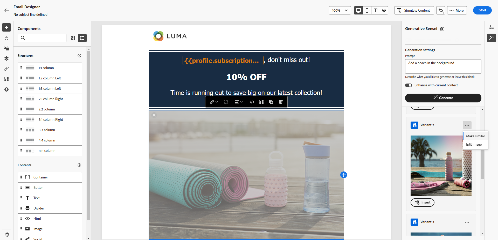
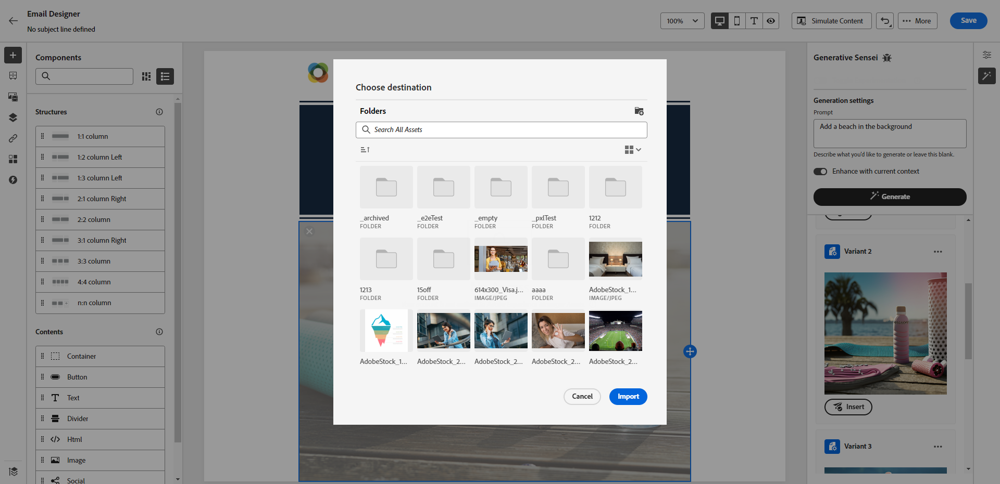

# Bildgenerering med Content Assist {#image-content-assistant}

>[!BEGINSHADEBOX]

**Innehållsförteckning**

* [Kom igång med Content Assist](gs-generative.md)
* [Generera text med Content Assist](generative-content.md)
* **[Generera bilder med Content Assist](generative-image.md)**

>[!ENDSHADEBOX]

När du har skapat och anpassat dina e-postmeddelanden eller webbsidor tar du innehållet till nästa nivå med Content Assist. Med det här kraftfulla verktyget kan du enkelt anpassa och förbättra ditt innehåll.

Läs om hur du använder innehållsassistenten till att uppdatera och förbättra dina resurser i exemplet nedan för att få en bättre användarupplevelse. Följ de här stegen:

1. När du har skapat och konfigurerat meddelandet klickar du på **[!UICONTROL Create content]** och anpassa det efter behov.

1. Markera den resurs som du vill ändra med Content Assistent.

1. Välj **[!UICONTROL Experience generation]**.

   

1. Lägg till en uppmaning för att finjustera resultatet bättre och klicka på **[!UICONTROL Generate]**.

   Aktivera **[!UICONTROL Enhance with current content]** för innehållsassistenten att anpassa nya resurser baserat på ditt budskap, kampanjens namn och vald målgrupp.

   

1. Sök i **[!UICONTROL Variation suggestions]** för att hitta den önskade resursen.

1. När du valt **[!UICONTROL Variant]**&#x200B;öppnar du den avancerade menyn för den valda resursen.

   

1. Du kan **[!UICONTROL Make similar]** om du vill generera fler varianter baserat på den valda varianten.

1. Klicka **[!UICONTROL Edit image]** för att komma åt **[!UICONTROL Select New Image]** -menyn.

1. På den här menyn kan du generera en ny resurs eller välja att använda en befintlig resurs från resursmapparna.

   

1. Klicka **[!UICONTROL Insert]** om du vill lägga till den genererade resursen i ditt innehåll.

   

1. Välj i vilken mapp du vill spara den genererade resursen och klicka på **[!UICONTROL Import]**.

   

1. När du har definierat meddelandeinnehållet klickar du på **[!UICONTROL Simulate content]** för att styra återgivningen och kontrollera personaliseringsinställningarna med testprofiler. [Läs mer](../email/preview.md)

1. När meddelandet är klart kan du klicka på **[!UICONTROL Review to activate]** för att visa en sammanfattning av kampanjen. Varningar visas om någon parameter är felaktig eller saknas.

1. Kontrollera att alla konfigurationer är korrekta innan du startar kampanjen och klicka sedan på **[!UICONTROL Activate]**.

När du har konfigurerat dina experiment och kampanjer korrekt kan du spåra din kampanj i kampanjrapporten. [Läs mer](../reports/campaign-global-report.md#experimentation-report)
