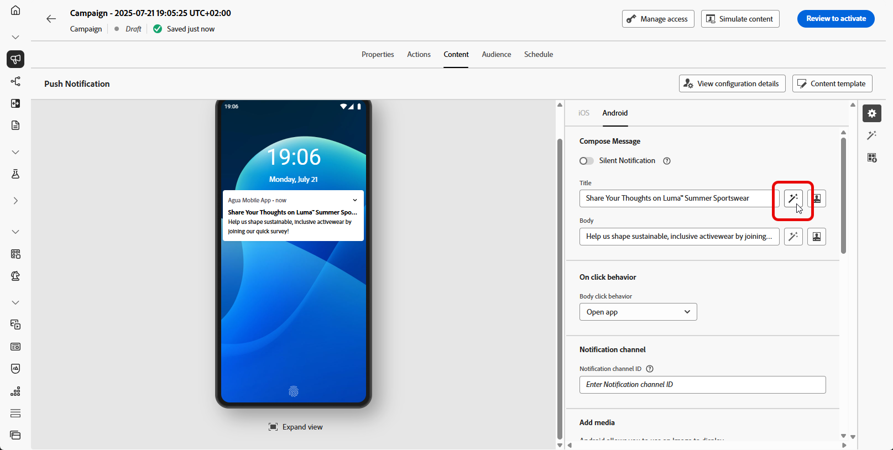

# Generera bilder med AI Assistant {#generative-image}

>[!IMPORTANT]
>
>Innan du börjar använda den här funktionen bör du läsa upp relaterade [säkerhetsutkast och begränsningar](gs-generative.md#generative-guardrails).
> 
>
>Du måste godkänna ett [användaravtal](https://www.adobe.com/legal/licenses-terms/adobe-dx-gen-ai-user-guidelines.html) innan du kan använda AI Assistant i Journey Optimizer. Kontakta din Adobe-representant om du vill veta mer.

Använd AI Assistant i Journey Optimizer för att generera övertygande visuellt innehåll som förbättrar dina meddelanden via e-post, webben, landningssidor och push-meddelanden. AI Assistant hjälper er att optimera och förbättra era resurser och skapa en mer användarvänlig och engagerande upplevelse för er målgrupp.

## För e-post- och webbkanaler {#email-web-channels}

AI Assistant kan generera kompletta visuella upplevelser för e-postkampanjer, webbupplevelser och landningssidor. Tack vare den här funktionen kan ni producera varumärkesanpassade och spännande bilder som får er att lyfta fram era målgrupper över alla digitala kontaktytor.

### Åtkomst och konfiguration {#access-configure}

Om du vill börja generera bilder med AI Assistant skapar du först en kampanj eller resa och öppnar innehållsredigeraren. Följ stegen nedan för att förbereda arbetsytan och öppna AI Assistant-panelen.

1. Skapa och konfigurera kampanj eller resa:
   * **E-post**: När du har skapat och konfigurerat din e-postkampanj klickar du på **[!UICONTROL Edit content]**. [Läs mer](../email/create-email.md)
   * **Webb**: När du har skapat och konfigurerat webbsidan klickar du på **[!UICONTROL Edit web page]**. [Läs mer](../web/create-web.md)
   * **Landningssida**: När du har skapat och konfigurerat landningssidan klickar du på **[!UICONTROL Open designer]**. [Läs mer](../landing-pages/create-lp.md)

1. Markera den resurs som du vill ändra med AI Assistant.

1. Välj **[!UICONTROL AI Assistant]** (eller **[!UICONTROL Show Content Assistant]** för webben) på den högra menyn.

   {zoomable="yes"}

### Generera innehåll {#generate-content}

Lär dig skapa effektiva uppmaningar och konfigurera bildinställningar för att generera visuellt övertygande bilder med AI Assistant. Anpassa parametrar som proportioner, visuell intensitet och belysning för att skapa bilder som är anpassade efter ert varumärke och era kampanjmål.

1. Aktivera alternativet **[!UICONTROL Reference style]** för AI Assistant för att anpassa nytt innehåll baserat på referensinnehållet. Du kan också överföra en bild för att lägga till kontext till variationen.

1. Välj din **[!UICONTROL Brand]** för att se till att det AI-genererade innehållet följer varumärkesspecifikationerna. [Läs mer](brands.md) om varumärken.

1. Finjustera innehållet genom att beskriva vad du vill generera i fältet **[!UICONTROL Prompt]**.

   Om du vill ha hjälp med att skapa din fråga kan du få tillgång till **[!UICONTROL Prompt Library]**, som innehåller en mängd olika tips för att förbättra dina kampanjer.

   {zoomable="yes"}

1. Skräddarsy din fråga med alternativet **[!UICONTROL Image settings]**:

   * **[!UICONTROL Aspect ratio]**: Detta avgör resursens bredd och höjd. Du kan välja bland vanliga proportioner som 16:9, 4:3, 3:2 eller 1:1, eller så kan du ange en anpassad storlek.
   * **[!UICONTROL Content type]**: Detta kategoriserar det visuella elementets karaktär och skiljer mellan olika former av visuell representation, t.ex. foton, grafik eller grafik.
   * **[!UICONTROL Visual intensity]**: Du kan styra bildens effekt genom att justera dess intensitet. En lägre inställning (2) ger ett mjukare och mer återhållsam utseende, medan en högre inställning (10) gör bilden mer levande och visuellt kraftfull.
   * **[!UICONTROL Color & tone]**: Det övergripande utseendet på färgerna i en bild och stämningen eller atmosfären som den förmedlar.
   * **[!UICONTROL Lighting]**: Det här refererar till blixten i en bild, som formar atmosfären och markerar specifika element.
   * **[!UICONTROL Composition]**: Det här refererar till elementens placering i en bilds bildruta

     {zoomable="yes"}

1. Klicka på **[!UICONTROL Reference content]** på menyn **[!UICONTROL Upload file]** om du vill lägga till en varumärkesresurs som innehåller innehåll som kan ge ytterligare kontext-AI Assistant eller välja en tidigare överförd.

   Tidigare överförda filer är tillgängliga i listrutan **[!UICONTROL Uploaded reference content]**. Du behöver bara växla mellan de resurser du vill ha med i din generation.

1. När du är nöjd med promptkonfigurationen klickar du på **[!UICONTROL Generate]**.

### Förfina och slutför {#refine-finalize}

När du har genererat bildvariationer kan du granska resultatet, kontrollera varumärkesjusteringen, redigera i Adobe Express och välja det bästa alternativet för ditt innehåll.

1. Bläddra i **[!UICONTROL Variation suggestions]** för att hitta den önskade resursen.

1. Klicka på procentikonen för att visa din **[!UICONTROL Brand Alignment Score]** och identifiera eventuella feljusteringar av ditt varumärke.

   Läs mer om [varumärkesjusteringspoäng](brands-score.md).

   {zoomable="yes"}

1. Klicka på **[!UICONTROL Preview]** om du vill visa en fullskärmsversion av den markerade varianten eller på **[!UICONTROL Apply]** om du vill ersätta det aktuella innehållet.

1. Navigera till alternativet **[!UICONTROL Refine]** i fönstret **[!UICONTROL Preview]** för att få tillgång till ytterligare anpassningsfunktioner:

   * **[!UICONTROL Generate Similar]** om du vill visa relaterade bilder till den här varianten.
   * **[!UICONTROL Edit in Adobe Express]** om du vill anpassa resursen ytterligare.

[Läs mer om Adobe Express-integrering](../integrations/express.md)

   * **[!UICONTROL Save]** om du vill lagra resurserna för senare åtkomst.

     {zoomable="yes"}

1. Klicka på **[!UICONTROL Select]** när du har hittat rätt innehåll.

   Du kan också göra det möjligt att experimentera med ditt innehåll. [Läs mer](generative-experimentation.md)

1. När du har definierat meddelandeinnehållet klickar du på knappen **[!UICONTROL Simulate content]** för att kontrollera återgivningen och kontrollerar personaliseringsinställningarna med testprofiler. [Läs mer](../personalization/personalize.md)

1. Granska och aktivera ditt innehåll:
   * **E-post**: När du har definierat ditt innehåll, din målgrupp och ditt schema är du redo att förbereda din e-postkampanj. [Läs mer](../campaigns/review-activate-campaign.md)
   * **Webb**: När du har definierat inställningarna för webbkampanjen och redigerat innehållet efter behov kan du granska och aktivera webbkampanjen. [Läs mer](../web/create-web.md#activate-web-campaign)
   * **Landningssida**: När landningssidan är klar kan du publicera den och göra den tillgänglig för användning i ett meddelande. [Läs mer](../landing-pages/create-lp.md#publish-landing-page)

## För mobila kanaler {#mobile-channels}

Med AI Assistant kan du generera engagerande bilder för push-meddelanden, vilket hjälper dig att skapa visuellt övertygande mobilkommunikation som fångar uppmärksamheten och får genklang hos publiken.

### Åtkomst och konfiguration {#mobile-access-configure}

Om du vill använda AI Assistant för push-meddelanden måste du konfigurera din push-leverans och navigera till innehållsredigeraren. De här stegen hjälper dig att skapa leveransen och komma åt AI Assistant-funktionerna.

1. När du har skapat och konfigurerat leveransen av push-meddelanden klickar du på **[!UICONTROL Edit content]**.

   Mer information om hur du konfigurerar din push-leverans finns på [den här sidan](../push/create-push.md).

1. Anpassa push-meddelanden efter behov. [Läs mer](../push/design-push.md)

1. Öppna menyn **[!UICONTROL Show AI Assistant]**.

   {zoomable="yes"}

### Generera innehåll {#mobile-generate-content}

När du har öppnat AI Assistant kan du justera genereringsinställningarna för att skapa bilder som är anpassade efter ditt varumärke och stöder dina mål för push-meddelanden. Konfigurera prompten och bildparametrarna för att generera bilder som är optimerade för mobila skärmar.

1. Välj din **[!UICONTROL Brand]** för att se till att det AI-genererade innehållet följer varumärkesspecifikationerna. [Läs mer](brands.md) om varumärken.

   Observera att funktionen Varumärke släpps som en privat betaversion och kommer att finnas tillgänglig för alla kunder i framtida versioner.

1. Finjustera innehållet genom att beskriva vad du vill generera i fältet **[!UICONTROL Prompt]**.

   Om du vill ha hjälp med att skapa din fråga kan du få tillgång till **[!UICONTROL Prompt Library]**, som innehåller en mängd olika tips för att förbättra dina kampanjer.

   {zoomable="yes"}

1. Välj **[!UICONTROL Image]** som fält att generera.

1. Välj din **[!UICONTROL Image settings]**:

   * **[!UICONTROL Content type]**: Detta kategoriserar det visuella elementets karaktär och skiljer mellan olika former av visuell representation, t.ex. foton, grafik eller grafik.
   * **[!UICONTROL Visual intensity]**: Du kan styra bildens effekt genom att justera dess intensitet. En lägre inställning (2) ger ett mjukare och mer återhållsam utseende, medan en högre inställning (10) gör bilden mer levande och visuellt kraftfull.
   * **[!UICONTROL Color & tone]**: Det övergripande utseendet på färgerna i en bild och stämningen eller atmosfären som den förmedlar.
   * **[!UICONTROL Lighting]**: Det här refererar till blixten i en bild, som formar atmosfären och markerar specifika element.
   * **[!UICONTROL Composition]**: Det här refererar till elementens placering i en bilds bildruta

     {zoomable="yes"}

1. Klicka på **[!UICONTROL Reference content]** på menyn **[!UICONTROL Upload file]** om du vill lägga till en varumärkesresurs som innehåller innehåll som kan ge ytterligare kontext-AI Assistant eller välja en tidigare överförd.

   Tidigare överförda filer är tillgängliga i listrutan **[!UICONTROL Uploaded reference content]**. Du behöver bara växla mellan de resurser du vill ha med i din generation.

1. Klicka på **[!UICONTROL Generate]** när din fråga är klar.

### Förfina och slutför {#mobile-refine-finalize}

När du har genererat bildvariationer för dina push-meddelanden kan du finjustera resultatet för att säkerställa att de uppfyller dina exakta krav. Granska varumärkesjusteringen, redigera i Adobe Express vid behov och välj den bästa bilden för er mobilkampanj.

1. Bläddra igenom den genererade **[!UICONTROL Variations]**.

1. Klicka på procentikonen för att visa din **[!UICONTROL Brand Alignment Score]** och identifiera eventuella feljusteringar av ditt varumärke.

   Läs mer om [varumärkesjusteringspoäng](brands-score.md).

   {zoomable="yes"}

1. Klicka på **[!UICONTROL Preview]** om du vill visa en fullskärmsversion av den markerade varianten eller på **[!UICONTROL Apply]** om du vill ersätta det aktuella innehållet.

1. Öppna fliken **[!UICONTROL Brand Alignment]** och se hur ditt innehåll överensstämmer med [varumärkesriktlinjerna](brands.md).

1. Klicka på **[!UICONTROL Select]** när du har hittat rätt innehåll.

   Du kan också göra det möjligt att experimentera med ditt innehåll. [Läs mer](generative-experimentation.md)

När ni har definierat ert innehåll, er målgrupp och ert schema är ni redo att förbereda er push-kampanj. [Läs mer](../campaigns/review-activate-campaign.md)

