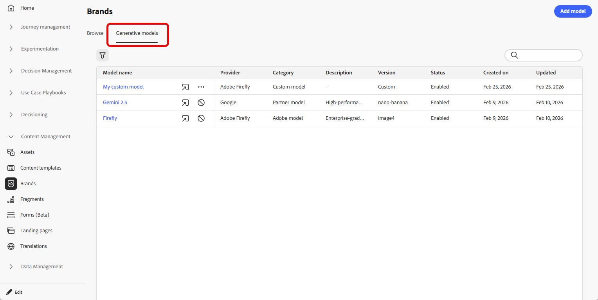

# Skapa och hantera generativa modeller {#generative-models}

Utöka era funktioner för att skapa AI-bilder med inbyggda modeller, anpassade Firefly-modeller och tredjepartsleverantörer av bildgenerering som uppfyller just era behov och förbättrar varumärkesjusteringen.

Välj rätt modell för dina behov:

- **[!UICONTROL Adobe model]**, som drivs av Firefly Image Model 4, levereras direkt från kartongen och kan användas för att generera bilder direkt utan ytterligare konfiguration.
- **[!UICONTROL Partner model]**, som drivs av Gemini 2.5 Flash, erbjuder specialfunktioner för specifika användningsområden.
- **[!UICONTROL Custom models]** är varumärkesspecifika modeller som har utbildats på dina egna resurser och lagts till av din organisation.

  Läs mer om **[!UICONTROL Custom models]** i [Adobe Firefly-dokumentationen](https://helpx.adobe.com/se/firefly/web/work-with-enterprise-features/train-custom-models/custom-models-overview.html)

När konfigurationen är klar kan du välja någon av dina generativa modeller när du skapar bilder i innehållet. [Läs mer om att generera bilder](generative-image.md).

## Hantera generativa modeller

Hantera era generativa modeller från en central plats. Visa alla tillgängliga modeller, filtrera och sök efter specifika modeller och konfigurera deras inställningar för dina varumärken.

1. Välj fliken **[!UICONTROL Brands]** på menyn **[!UICONTROL Generative models]**.

   {zoomable="yes"}

1. Klicka på ikonen  för att öppna filtermenyn. Filtrera modeller efter **[!UICONTROL Type]** eller **[!UICONTROL Status]**.

   {zoomable="yes"}

1. Använd sökfältet för att hitta en specifik generativ modell efter namn.

1. Klicka på ikonen  för att komma åt den avancerade menyn, där du kan aktivera eller inaktivera modellen eller ta bort den.

   Observera att endast **[!UICONTROL Custom models]** kan tas bort.

   {zoomable="yes"}

1. Klicka på **[!UICONTROL Add model]** om du vill skapa en ny generativ modell från grunden.

Nu kan du välja någon av dina generativa modeller när du skapar bilder i ditt innehåll. [Läs mer om att generera bilder](generative-image.md).

## Lägg till en generativ modell

>[!IMPORTANT]
>
>För att kunna skapa anpassade Firefly-modeller krävs ett Firefly ETLA-avtal.

Anpassade Firefly-modeller är varumärkesspecifika AI-modeller som är utbildade på era egna resurser, vilket gör att ni kan generera bilder som exakt motsvarar er varumärkesidentitet, stil och visuella riktlinjer.

Genom att skapa anpassade leverantörer av Firefly-modeller kan ni utöka era AI-funktioner utöver standardmodellerna och säkerställa att det genererade innehållet konsekvent återspeglar varumärkets unika estetik och krav.

➡️ [Lär dig att träna din anpassade modell](https://helpx.adobe.com/se/firefly/web/work-with-enterprise-features/train-custom-models/train-firefly-custom-models.html)

1. Gå till fliken **[!UICONTROL Brands]** på menyn **[!UICONTROL Generative Models]** och klicka på **[!UICONTROL Add model]**.

   {zoomable="yes"}

1. Ange **[!UICONTROL Name]** som modell.

1. Ange din **[!UICONTROL Model ID]**.

   +++ Hitta ditt Firefly-modell-ID

   1. Gå till Firefly webbplats och navigera till dina tränade modeller.
   1. Öppna menyn [Förhandsgranska och testa](https://helpx.adobe.com/se/firefly/web/work-with-enterprise-features/train-custom-models/train-firefly-custom-models.html#preview-and-test).
   1. Leta reda på värdet efter `customModelId=` i URL:en. Kopiera det här värdet för att använda som modell-ID.

   Mer information finns i [dokumentationen för anpassade Firefly-modeller](https://helpx.adobe.com/se/firefly/web/work-with-enterprise-features/train-custom-models/manage-custom-models.html).

   {zoomable="yes"}

   +++

    

   {zoomable="yes"}

1. Du kan också ange en **[!UICONTROL Description]** för att hjälpa till att identifiera modellen.

1. Klicka på **[!UICONTROL Test connection]** för att verifiera modellkonfigurationen.

1. När anslutningstestet har slutförts klickar du på **[!UICONTROL Save]** för att spara modellkonfigurationen.

   {zoomable="yes"}

1. När du har sparat läggs din anpassade modell till i din modelllista. Du kan när som helst inaktivera eller ta bort den.

   {zoomable="yes"}

<!--
1. Once the connection test is successful, choose whether to enable the model for selected brands.

1. Enable or disable the option to connect the model to all brands.

    If disabled, select which brands this model should be applied to.
-->

När konfigurationen är klar kan du välja någon av dina egna generativa modeller när du skapar bilder i innehållet. [Läs mer om att generera bilder](generative-image.md).

{zoomable="yes"}
