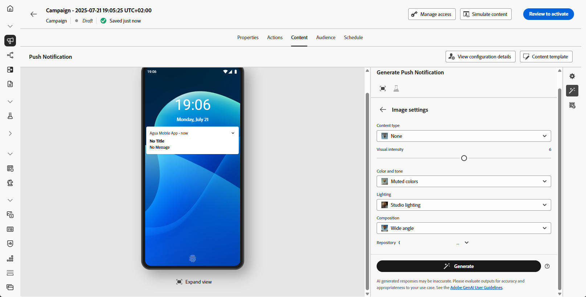

# Push-generering med AI Assistant {#generative-push}

>[!IMPORTANT]
>
>Innan du börjar använda den här funktionen bör du läsa upp relaterade [säkerhetsutkast och begränsningar](gs-generative.md#generative-guardrails).
> 
>
>Du måste godkänna ett [användaravtal](https://www.adobe.com/legal/licenses-terms/adobe-dx-gen-ai-user-guidelines.html) innan du kan använda AI Assistant i Journey Optimizer. Kontakta din Adobe-representant om du vill veta mer.

När du har skapat och personaliserat dina meddelanden tar du ditt push-meddelandeinnehåll till nästa nivå med AI Assistant i Journey Optimizer.

Gå igenom flikarna nedan och lär dig hur du använder AI Assistant i Journey Optimizer.

>[!BEGINTABS]

>[!TAB Fullständig push-generering]

I det här exemplet får du lära dig hur du skickar ett engagerande push-meddelande med hjälp av AI Assistant i Journey Optimizer.

Följ de här stegen:

1. När du har skapat och konfigurerat din push-meddelandekampanj klickar du på **[!UICONTROL Edit content]**.

   Mer information om hur du konfigurerar din push-meddelandekampanj finns på [den här sidan](../push/create-push.md).

1. Fyll i **[!UICONTROL Basic details]** för din kampanj. Klicka på **[!UICONTROL Edit content]** när du är klar.

1. Anpassa push-meddelanden efter behov. [Läs mer](../push/design-push.md)

1. Öppna menyn **[!UICONTROL Show AI Assistant]**.

   {zoomable="yes"}

1. Aktivera alternativet **[!UICONTROL Use original content]** för AI Assistant för att anpassa det nya innehållsalternativet baserat på det valda innehållet.

1. Välj din **[!UICONTROL Brand]** för att se till att det AI-genererade innehållet följer varumärkesspecifikationerna. [Läs mer](brands.md) om varumärken.

   Observera att funktionen Varumärke släpps som en privat betaversion och kommer att finnas tillgänglig för alla kunder i framtida versioner.

1. Finjustera innehållet genom att beskriva vad du vill generera i fältet **[!UICONTROL Prompt]**.

   Om du vill ha hjälp med att skapa din fråga kan du få tillgång till **[!UICONTROL Prompt Library]**, som innehåller en mängd olika tips för att förbättra dina kampanjer.

   {zoomable="yes"}

1. Välj vilket fält du vill generera: **[!UICONTROL Title]**, **[!UICONTROL Message]** och/eller **[!UICONTROL Image]**.

1. Skräddarsy din fråga med alternativet **[!UICONTROL Text settings]**:

   * **[!UICONTROL Communication strategy]**: Välj den lämpligaste kommunikationsstilen för den genererade texten.
   * **[!UICONTROL Languages]**: Välj språk för det genererade innehållet.
   * **[!UICONTROL Tone]**: Tonen på dina push-meddelanden ska matcha din publik. Vare sig du vill låta informativ, lekfull eller övertygande kan AI Assistant anpassa budskapet därefter.

   {zoomable="yes"}

1. Välj din **[!UICONTROL Image settings]**:

   * **[!UICONTROL Content type]**: Detta kategoriserar det visuella elementets karaktär och skiljer mellan olika former av visuell representation, t.ex. foton, grafik eller grafik.
   * **[!UICONTROL Visual intensity]**: Du kan styra bildens effekt genom att justera dess intensitet. En lägre inställning (2) ger ett mjukare och mer återhållsam utseende, medan en högre inställning (10) gör bilden mer levande och visuellt kraftfull.
   * **[!UICONTROL Color & tone]**: Det övergripande utseendet på färgerna i en bild och stämningen eller atmosfären som den förmedlar.
   * **[!UICONTROL Lighting]**: Det här refererar till blixten i en bild, som formar atmosfären och markerar specifika element.
   * **[!UICONTROL Composition]**: Det här refererar till elementens placering i en bilds bildruta

   {zoomable="yes"}

1. Klicka på **[!UICONTROL Brand assets]** på menyn **[!UICONTROL Upload brand asset]** om du vill lägga till en varumärkesresurs som innehåller innehåll som kan ge ytterligare kontext-AI Assistant eller välja en tidigare överförd.

   Tidigare överförda filer är tillgängliga i listrutan **[!UICONTROL Uploaded brand assets]**. Du behöver bara växla mellan de resurser du vill ha med i din generation.

1. Klicka på **[!UICONTROL Generate]** när din fråga är klar.

1. Bläddra igenom den genererade **[!UICONTROL Variations]**.

   Klicka på **[!UICONTROL Preview]** om du vill visa en fullskärmsversion av den markerade varianten eller klicka på **[!UICONTROL Apply]** om du vill ersätta det aktuella innehållet.

1. Klicka på procentikonen för att visa din **[!UICONTROL Brand Alignment Score]** och identifiera eventuella feljusteringar av ditt varumärke.

   Läs mer om [varumärkesjusteringspoäng](brands-score.md).

   {zoomable="yes"}

1. Navigera till alternativet **[!UICONTROL Refine]** i fönstret **[!UICONTROL Preview]** för att få tillgång till ytterligare anpassningsfunktioner:

   * **[!UICONTROL Use as reference content]**: Den valda varianten fungerar som referensinnehåll för att generera andra resultat.

   * **[!UICONTROL Rephrase]**: AI-assistenten kan omformulera ditt meddelande på olika sätt, vilket håller skrivandet aktuellt och engagerande för olika målgrupper.

   * **[!UICONTROL Use simpler language]**: Använd AI Assistant för att förenkla ditt språk och säkerställa tydlighet och tillgänglighet för en större publik.

   Du kan också ändra **[!UICONTROL Tone]** och **[!UICONTROL Communication strategy]** för texten.

   {zoomable="yes"}

1. Öppna fliken **[!UICONTROL Brand Alignment]** och se hur ditt innehåll överensstämmer med [varumärkesriktlinjerna](brands.md).

1. Klicka på **[!UICONTROL Select]** när du har hittat rätt innehåll.

   Du kan också göra det möjligt att experimentera med ditt innehåll. [Läs mer](generative-experimentation.md)

1. Infoga personaliseringsfält för att anpassa ditt push-meddelandeinnehåll baserat på profildata. Klicka sedan på knappen **[!UICONTROL Simulate content]** för att kontrollera återgivningen och kontrollera personaliseringsinställningarna med testprofiler. [Läs mer](../personalization/personalize.md)

När ni har definierat ert innehåll, er målgrupp och ert schema är ni redo att förbereda er push-kampanj. [Läs mer](../campaigns/review-activate-campaign.md)

>[!TAB Generering av endast text]

I just det här exemplet får du lära dig hur du använder AI Assistant i Journey Optimizer för specifikt innehåll. Följ de här stegen:

1. När du har skapat och konfigurerat din push-meddelandekampanj klickar du på **[!UICONTROL Edit content]**.

   Mer information om hur du konfigurerar din push-kampanj finns på [den här sidan](../push/create-push.md).

1. Fyll i **[!UICONTROL Basic details]** för din kampanj. Klicka på **[!UICONTROL Edit content]** när du är klar.

1. Anpassa push-meddelanden efter behov. [Läs mer](../push/design-push.md)

1. Gå till menyn **[!UICONTROL Edit text with AI Assistant]** bredvid dina **[!UICONTROL Title]**- eller **[!UICONTROL Message]**-fält.

   {zoomable="yes"}

1. Aktivera alternativet **[!UICONTROL Use reference content]** för AI Assistant för att anpassa nytt innehåll baserat på det valda innehållet.

1. Välj din **[!UICONTROL Brand]** för att se till att det AI-genererade innehållet följer varumärkesspecifikationerna. [Läs mer](brands.md) om varumärken.

   Observera att funktionen Varumärke släpps som en privat betaversion och kommer att finnas tillgänglig för alla kunder i framtida versioner.

1. Finjustera innehållet genom att beskriva vad du vill generera i fältet **[!UICONTROL Prompt]**.

   Om du vill ha hjälp med att skapa din fråga kan du få tillgång till **[!UICONTROL Prompt Library]**, som innehåller en mängd olika tips för att förbättra dina kampanjer.

   {zoomable="yes"}

1. Skräddarsy din fråga med alternativet **[!UICONTROL Text settings]**:

   * **[!UICONTROL Communication strategy]**: Välj den lämpligaste kommunikationsstilen för den genererade texten.
   * **[!UICONTROL Languages]**: Välj språk för det genererade innehållet.
   * **[!UICONTROL Tone]**: Tonen i ditt push-meddelande bör motsvara målgruppen. Vare sig du vill låta informativ, lekfull eller övertygande kan AI Assistant anpassa budskapet därefter.
   * **[!UICONTROL Length]**: Välj längden på ditt innehåll med intervallreglaget.

   {zoomable="yes"}

1. Klicka på **[!UICONTROL Brand assets]** på menyn **[!UICONTROL Upload brand asset]** om du vill lägga till en varumärkesresurs som innehåller innehåll som kan ge ytterligare kontext-AI Assistant eller välja en tidigare överförd.

   Tidigare överförda filer är tillgängliga i listrutan **[!UICONTROL Uploaded brand assets]**. Du behöver bara växla mellan de resurser du vill ha med i din generation.

1. Klicka på **[!UICONTROL Generate]** när din fråga är klar.

1. Bläddra igenom den genererade **[!UICONTROL Variations]**.

1. Klicka på procentikonen för att visa din **[!UICONTROL Brand Alignment Score]** och identifiera eventuella feljusteringar av ditt varumärke.

   Läs mer om [varumärkesjusteringspoäng](brands-score.md).

   {zoomable="yes"}

1. Navigera till alternativet **[!UICONTROL Refine]** i fönstret **[!UICONTROL Preview]** för att få tillgång till ytterligare anpassningsfunktioner:

   * **[!UICONTROL Use as reference content]**: Den valda varianten fungerar som referensinnehåll för att generera andra resultat.

   * **[!UICONTROL Elaborate]**: AI-assistenten kan hjälpa dig att expandera specifika ämnen och ge ytterligare information för bättre förståelse och engagemang.

   * **[!UICONTROL Summarize]**: Långvarig information kan överlagra mottagare. Använd AI Assistant för att komprimera viktiga punkter till tydliga, kortfattade sammanfattningar som får dem att lyssna och uppmuntrar dem att läsa vidare.

   * **[!UICONTROL Rephrase]**:TheAI Assistant kan omformulera ditt meddelande på olika sätt, vilket håller skrivandet aktuellt och engagerande för olika målgrupper.

   * **[!UICONTROL Use simpler language]**: Använd AI Assistant för att förenkla ditt språk och säkerställa tydlighet och tillgänglighet för en större publik.

   Du kan också ändra **[!UICONTROL Tone]** och **[!UICONTROL Communication strategy]** för texten.

   {zoomable="yes"}

1. Öppna fliken **[!UICONTROL Brand Alignment]** och se hur ditt innehåll överensstämmer med [varumärkesriktlinjerna](brands.md).

1. Klicka på **[!UICONTROL Select]** när du har hittat rätt innehåll.

   Du kan också göra det möjligt att experimentera med ditt innehåll. [Läs mer](generative-experimentation.md)

1. Infoga personaliseringsfält för att anpassa ditt push-meddelandeinnehåll baserat på profildata. Klicka sedan på knappen **[!UICONTROL Simulate content]** för att kontrollera återgivningen och kontrollera personaliseringsinställningarna med testprofiler. [Läs mer](../personalization/personalize.md)

När ni har definierat ert innehåll, er målgrupp och ert schema är ni redo att förbereda er push-kampanj. [Läs mer](../campaigns/review-activate-campaign.md)

>[!TAB Generering av endast bild]

1. När du har skapat och konfigurerat din push-meddelandekampanj klickar du på **[!UICONTROL Edit content]**.

   Mer information om hur du konfigurerar din push-meddelandekampanj finns på [den här sidan](../push/create-push.md).

1. Fyll i **[!UICONTROL Basic details]** för din kampanj. Klicka på **[!UICONTROL Edit content]** när du är klar.

1. Anpassa push-meddelanden efter behov. [Läs mer](../push/design-push.md)

1. Öppna menyn **[!UICONTROL Add media]**.

   {zoomable="yes"}

1. Aktivera alternativet **[!UICONTROL Reference style]** för AI Assistant för att anpassa nytt innehåll baserat på referensinnehållet. Du kan också överföra en bild för att lägga till kontext till variationen.

1. Välj din **[!UICONTROL Brand]** för att se till att det AI-genererade innehållet följer varumärkesspecifikationerna. [Läs mer](brands.md) om varumärken.

   Observera att funktionen Varumärke släpps som en privat betaversion och kommer att finnas tillgänglig för alla kunder i framtida versioner.

1. Finjustera innehållet genom att beskriva vad du vill generera i fältet **[!UICONTROL Prompt]**.

   Om du vill ha hjälp med att skapa din fråga kan du få tillgång till **[!UICONTROL Prompt Library]**, som innehåller en mängd olika tips för att förbättra dina kampanjer.

   {zoomable="yes"}

1. Välj din **[!UICONTROL Image settings]**:

   * **[!UICONTROL Content type]**: Detta kategoriserar det visuella elementets karaktär och skiljer mellan olika former av visuell representation, t.ex. foton, grafik eller grafik.
   * **[!UICONTROL Visual intensity]**: Du kan styra bildens effekt genom att justera dess intensitet. En lägre inställning (2) ger ett mjukare och mer återhållsam utseende, medan en högre inställning (10) gör bilden mer levande och visuellt kraftfull.
   * **[!UICONTROL Color & tone]**: Det övergripande utseendet på färgerna i en bild och stämningen eller atmosfären som den förmedlar.
   * **[!UICONTROL Lighting]**: Det här refererar till blixten i en bild, som formar atmosfären och markerar specifika element.
   * **[!UICONTROL Composition]**: Det här refererar till elementens placering i en bilds bildruta

1. Klicka på **[!UICONTROL Brand assets]** på menyn **[!UICONTROL Upload brand asset]** om du vill lägga till en varumärkesresurs som innehåller innehåll som kan ge ytterligare kontext-AI Assistant eller välja en tidigare överförd.

   Tidigare överförda filer är tillgängliga i listrutan **[!UICONTROL Uploaded brand assets]**. Du behöver bara växla mellan de resurser du vill ha med i din generation.

1. Klicka på **[!UICONTROL Generate]** när din fråga är klar.

1. Bläddra igenom den genererade **[!UICONTROL Variations]**.

1. Klicka på procentikonen för att visa din **[!UICONTROL Brand Alignment Score]** och identifiera eventuella feljusteringar av ditt varumärke.

   Läs mer om [varumärkesjusteringspoäng](brands-score.md).

1. Navigera till alternativet **[!UICONTROL Refine]** i fönstret **[!UICONTROL Preview]** för att få tillgång till ytterligare anpassningsfunktioner:

   * **[!UICONTROL Generate Similar]** om du vill visa relaterade bilder till den här varianten.
   * **[!UICONTROL Edit in Adobe Express]** om du vill anpassa resursen ytterligare.

[Läs mer om Adobe Express-integrering](../integrations/express.md)

   * **[!UICONTROL Save]** om du vill lagra resurserna för senare åtkomst.

   {zoomable="yes"}

1. Öppna fliken **[!UICONTROL Brand Alignment]** och se hur ditt innehåll överensstämmer med [varumärkesriktlinjerna](brands.md).

1. Klicka på **[!UICONTROL Select]** när du har hittat rätt innehåll.

   Du kan också göra det möjligt att experimentera med ditt innehåll. [Läs mer](generative-experimentation.md)

När ni har definierat ert innehåll, er målgrupp och ert schema är ni redo att förbereda er push-kampanj. [Läs mer](../campaigns/review-activate-campaign.md)

>[!ENDTABS]
