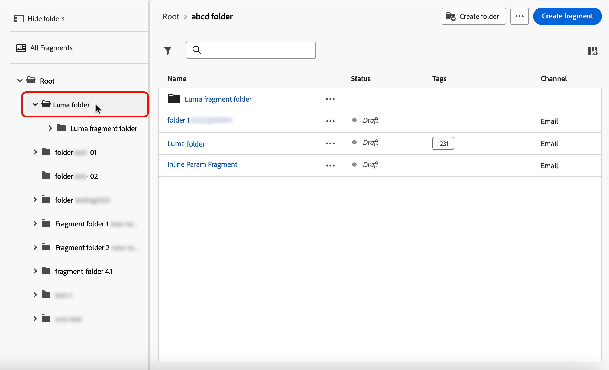

# Hantera fragment {#manage-fragments}

## Åtkomst till fragment {#access-fragments}

Om du vill hantera dina fragment kan du komma åt fragmentlistan från den vänstra menyn **[!UICONTROL Content Management]** > **[!UICONTROL Fragments]**.

Alla fragment som skapades i den aktuella sandlådan - antingen [ från **[!UICONTROL Fragments]**-menyn](create-fragments.md#create-fragments), antingen med alternativet [Spara som fragment](save-fragments.md) - visas.

I rutan till vänster kan du ordna fragment i mappar. Som standard visas alla fragment. När du väljer en mapp visas endast de fragment och mappar som finns i den valda mappen. [Läs mer](#folders)

Om du vill söka efter ett visst objekt börjar du skriva ett namn i sökfältet. När en [mapp](#folders) är markerad tillämpas sökningen på alla fragment eller mappar på den första nivån i hierarkin i den mappen<!--(not nested items)-->.

Du kan filtrera fragment på deras:

* Status (utkast eller Live)
* Typ (visuellt eller uttryck)
* Skapad eller ändrad den
* Delstat (arkiverad eller ej)
* Taggar

{width="90%" align="left"}

Du kan också välja att visa alla fragment eller bara de objekt som den aktuella användaren har skapat eller ändrat.

Från knappen **[!UICONTROL More actions]** bredvid varje fragment kan du:

* Lägg till den i ett paket för export. [Läs mer](#export)
* Om ett live-fragment redigeras, öppnar du utkastversionen av det här fragmentet. [Läs mer](#edit-fragments)
* Duplicera fragmentet.
* Använd alternativet **[!UICONTROL Explore references]** om du vill visa de resor, kampanjer eller mallar där det används. [Läs mer](#explore-references)
* Arkivera fragmentet. [Läs mer](#archive-fragments)
* Redigera fragmentets taggar. [Lär dig arbeta med enhetliga taggar](../start/search-filter-categorize.md#tags)
* Flytta fragmentet till en mapp. [Läs mer](#folders)

## Använd mappar för att hantera fragment {#folders}

>[!CONTEXTUALHELP]
>id="ajo_fragments_folders"
>title="Ordna dina fragment i mappar"
>abstract="Använd mappar för att kategorisera och hantera dina fragment efter organisationens behov."

Om du enkelt vill navigera bland dina fragment kan du använda mappar för att ordna dem mer effektivt i en strukturerad hierarki. På så sätt kan du kategorisera och hantera objekten efter organisationens behov.

1. Klicka på knappen **[!UICONTROL All Fragments]** om du vill visa alla objekt som tidigare skapats utan mappgruppering.

1. Klicka på mappen **[!UICONTROL Root]** för att visa alla mappar som skapats.

   >[!NOTE]
   >
   >Om du inte har skapat mappar än visas alla fragment.

1. Klicka på en mapp i mappen **[!UICONTROL Root]** för att visa dess innehåll.

1. När du klickar på mappen **[!UICONTROL Root]** eller någon annan mapp visas knappen **[!DNL Create folder]** . Markera den.

   

1. Ange ett namn för den nya mappen och klicka på **[!UICONTROL Save]**. Den nya mappen visas ovanpå fragmentlistan i mappen **[!UICONTROL Root]** eller inuti den markerade mappen.

1. Du kan klicka på knappen **[!UICONTROL More actions]** om du vill byta namn på eller ta bort mappen.

   

1. Med knappen **[!UICONTROL More actions]** kan du också flytta fragmentet till en annan befintlig mapp.

   <!---->

1. Nu kan du navigera till mappen som du nyss skapade. Varje nytt fragment som du [skapar](create-fragments.md) från här sparas i den aktuella mappen.

   

## Fragmentstatus {#fragments-statuses}

>[!CONTEXTUALHELP]
>id="ajo_fragment_statuses"
>title="Nya fragmentstatusar"
>abstract="Sedan statusvärdena **Utkast** och **Live** introducerades i Journey Optimizer Juniversion har alla fragment som skapats före den här versionen statusen **Utkast**, även om de används under en resa eller kampanj. Om du ändrar något i dessa fragment måste du publicera dem för att göra dem **Live** och sprida ändringarna till associerade kampanjer och resor. Ni måste också skapa en ny resa/kampanjversion och publicera den.  Publicering kräver användarbehörighet för <a href="https://experienceleague.adobe.com/en/docs/journey-optimizer/using/access-control/ootb-product-profiles#content-library-manage">Publiceringsfragment</a>."
>additional-url="https://experienceleague.adobe.com/en/docs/journey-optimizer/using/access-control/ootb-product-profiles#content-library-manager" text="Läs mer om behörigheter för innehållsfragment"

Fragment kan ha flera statusar:

* **[!UICONTROL Draft]**: Fragmentet redigeras och har inte godkänts.

* **[!UICONTROL Live]**: Fragmentet har godkänts och är direktsänt. [Lär dig publicera ett fragment](../content-management/create-fragments.md#publish)

  När ett live-fragment redigeras visas en specifik ikon bredvid dess status. Klicka på den här ikonen för att öppna utkastet av fragmentet.

* **[!UICONTROL Publishing]**: Fragmentet har godkänts och publiceras.
* **[!UICONTROL Archived]**: Fragmentet har arkiverats. [Lär dig arkivera fragment](#archive-fragments)

>[!CAUTION]
>
>Sedan statusvärdena **Utkast** och **Live** introducerades i Journey Optimizer-versionen från juni 2024 har alla fragment som skapats före den här versionen statusen **Utkast**, även om de används under en resa eller kampanj. Om du ändrar något i dessa fragment måste du publicera dem för att göra dem **Live** och sprida ändringarna till associerade kampanjer och resor. Ni måste också skapa en ny resa/kampanjversion och publicera den. Publicering kräver användarbehörighet för [Publish Fragment](../administration/ootb-product-profiles.md#content-library-manager).

## Redigera ett fragment {#edit-fragments}

>[!CONTEXTUALHELP]
>id="ajo_fragments_update_campaigns"
>title="Fragment uppdateras i kampanjer"
>abstract="Den här kampanjen uppdateras inte om du publicerar ändringar i fragmentet. Den kräver att en ny version publiceras så att fragmentuppdateringsfunktionen kan användas."

>[!CONTEXTUALHELP]
>id="ajo_fragments_update_journeys"
>title="Fragmentuppdatering i resor"
>abstract="Den här resan uppdateras inte om du publicerar ändringar i fragmentet. Den kräver att en ny version publiceras så att fragmentuppdateringsfunktionen kan användas."

Om du vill redigera ett fragment följer du stegen nedan.

1. Klicka på önskat fragment i listan **[!UICONTROL Fragments]**. Skärmen för fragmentegenskaper öppnas och innehållet förhandsgranskas.

1. Du kan kontrollera listan över resor, kampanjer och innehållsmallar där fragmentet används. Om du vill göra det väljer du alternativet **[!UICONTROL Explore references]** från åtgärdsknappen Mer. [Läs mer](#explore-references)

1. Om fragmentet som redigeras har statusen **[!UICONTROL Live]** klickar du på knappen **[!UICONTROL Modify]** för att skapa ett utkast av fragmentet. Klicka på **[!UICONTROL Confirm]**.

   {width="70%" align="left"}

   >[!NOTE]
   >
   >Den aktuella versionen av fragmentet fortsätter att vara aktiv tills du publicerar den nya uppdaterade versionen.

1. Gör önskade ändringar av fragmentinformationen om det behövs.

1. Om du vill ändra fragmentets innehåll klickar du på knappen **[!UICONTROL Edit]** och uppdaterar ditt innehåll på samma sätt som när du skapar ett fragment från början. [Lär dig skapa ett fragment](create-fragments.md#content)

   {width="70%" align="left"}

   >[!NOTE]
   >
   >När du redigerar ett publicerat fragment kan du ta bort alla anpassningsfält, men du kan inte lägga till nya i fragmentinnehållet. Om du vill lägga till anpassade attribut måste du duplicera fragmentet. [Läs mer](#adding-new-attributes)

1. När ändringarna är klara sparar du dem och klickar på knappen **[!UICONTROL Publish]** för att göra ändringarna aktuella. [Läs mer](create-fragments.md#publish)

När du redigerar ett fragment sprids ändringarna automatiskt till allt innehåll som använder det fragmentet, inklusive direktresor och kampanjer - förutom innehåll där du har brutet arv från det ursprungliga fragmentet.

>[!NOTE]
>
>Lär dig hur du bryter arv i avsnitten [Lägg till visuella fragment i e-postmeddelanden](../email/use-visual-fragments.md#break-inheritance) och [Utnyttja uttrycksfragment](../personalization/use-expression-fragments.md#break-inheritance).

### Lägga till nya attribut i ett live-fragment {#adding-new-attributes}

>[!WARNING]
>
>Det går inte att lägga till nya [anpassade attribut](../personalization/personalization-build-expressions.md) i ett live-fragment.

När ett fragment har publicerats låses uppsättningen med anpassade eller kontextuella attribut för alla kampanjer och resor som refererar till det.

Följ stegen nedan om du vill lägga till ytterligare attribut till ett live-fragment.

1. Duplicera det befintliga fragmentet med knappen **[!UICONTROL More actions]**.

   {width="70%" align="left"}

1. Markera det duplicerade fragmentet för att öppna det och klicka på knappen **[!UICONTROL Edit]**.

1. [Lägg till de nya önskade attributen](../personalization/personalization-build-expressions.md#add) i det duplicerade fragmentet, till exempel anpassningsfält.

   {width="70%" align="left"}

1. Spara ändringarna och publicera det nya fragmentet. [Lär dig hur](create-fragments.md#publish)

1. Uppdatera kampanjer eller resor för att referera till det uppdaterade fragmentet där de nya attributen lades till.

   * [Lär dig använda visuella fragment](../email/use-visual-fragments.md)
   * [Lär dig använda uttrycksfragment](../personalization/use-expression-fragments.md)

## Utforska referenser {#explore-references}

Du kan visa en lista över de resor, kampanjer och innehållsmallar som för närvarande använder ett fragment. Om du vill göra det väljer du **[!UICONTROL Explore references]** på menyn **[!UICONTROL More actions]** antingen i fragmentlistan eller i skärpan för fragmentegenskaper.

{width="70%" align="left"}

Välj en flik för att växla mellan resor, kampanjer, mallar och fragment. Du kan se deras status och klicka på ett namn som ska omdirigeras till motsvarande objekt där fragmentet refereras.

{width="70%" align="left"}

>[!NOTE]
>
>Om fragmentet används i en resa, kampanj eller mall som har en etikett som hindrar dig från att komma åt det, visas ett varningsmeddelande ovanför den valda fliken. [Läs mer om OLAC (Object Level Access Control)](../administration/object-based-access.md)

## Arkivera fragment {#archive-fragments}

Du kan rensa fragmentlistan från objekt som inte längre är relevanta för ert varumärke.

Om du vill göra det klickar du på knappen **[!UICONTROL More actions]** bredvid det önskade fragmentet och väljer **[!UICONTROL Archive]**. Den försvinner från fragmentlistan, vilket förhindrar att den används i framtida e-postmeddelanden eller mallar.

{width="70%" align="left"}

>[!NOTE]
>
>Om du arkiverar ett fragment som används i ett innehåll, <!--it will remain in the email or template, but you won't be able to select it from the fragment list to edit it--> påverkas inte innehållet.

Om du vill arkivera ett fragment, filtrerar du på **[!UICONTROL Archived]**-objekten och väljer **[!UICONTROL Unarchive]** på **[!UICONTROL More actions]**-menyn. Det är nu igen tillgängligt från fragmentlistan och kan användas i alla e-postmeddelanden och mallar.

{width="70%" align="left"}

## Exportera fragment till en annan sandlåda {#export}

Med Journey Optimizer kan du kopiera ett fragment från en sandlåda till en annan. Du kan t.ex. kopiera ett fragment från sandlådemiljön på scenen till produktionssandlådan.

Kopieringsprocessen utförs via en **paketexport och import** mellan käll- och målsandlådorna. Detaljerad information om hur du exporterar objekt och importerar dem till en målsandlåda finns i det här avsnittet: [Kopiera objekt till en annan sandlåda](../configuration/copy-objects-to-sandbox.md).
