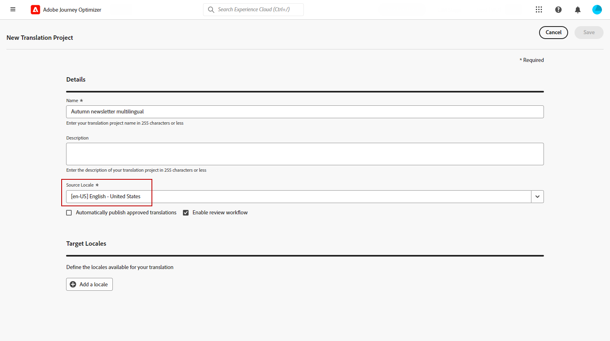
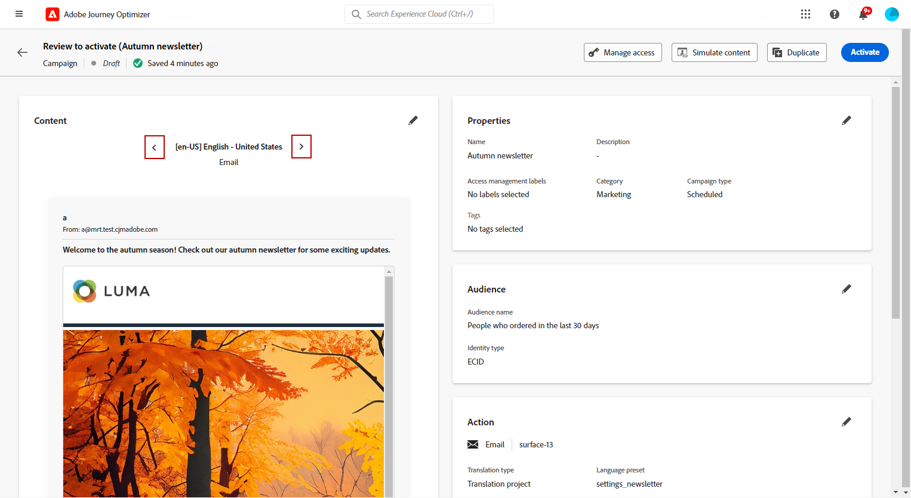

# Skapa flerspråkigt innehåll med automatiserad översättning {#multilingual-automated}

>[!CONTEXTUALHELP]
>id="ajo_multi_add_provider"
>title="Lägg till provider"
>abstract="Lägg till översättningsleverantörer och språkområden efter behov. På så sätt kan ni hantera vilka leverantörer och språkområden som är aktiva i projektet, vilket ger er flexibilitet att justera resurser och inrikta er på målgrupper baserat på era aktuella krav och projektomfattning."

>[!CONTEXTUALHELP]
>id="ajo_multi_edit_provider"
>title="Redigera provider"
>abstract="Ändra befintliga översättningsleverantörer och lägg till språkområden efter behov. Med den här funktionen kan du styra vilka leverantörer och språkområden som är aktiva i ditt projekt, vilket ger dig flexibilitet att justera resurser och inrikta dig på specifika målgrupper utifrån dina aktuella behov och projektmål."

>[!IMPORTANT]
>
>För automatiserat flöde behöver användare behörigheter som är relaterade till funktionen **[!UICONTROL Translation Service]**. [Läs mer om behörigheter](../administration/permissions.md)

Med hjälp av det automatiserade flödet kan du helt enkelt välja målspråk och språkleverantör. Ditt innehåll skickas sedan direkt till översättningen, klart för slutgranskning när det är klart.

Följ de här stegen för att skapa flerspråkigt innehåll med hjälp av automatiserad översättning:

1. [Lägg till din leverantör](multilingual-provider.md)

1. [Lägg till nationella inställningar (valfritt)](multilingual-locale.md)

1. [Skapa ett språkprojekt](#create-translation-project)

1. [Skapa språkinställningar](#create-language-settings)

1. [Skapa flerspråkigt innehåll](#create-a-multilingual-campaign)

1. [Granska din översättningsuppgift (valfritt)](#review-translation-project)

## Skapa översättningsprojekt {#translation-project}

>[!CONTEXTUALHELP]
>id="ajo_multi_create_project"
>title="Skapa projekt"
>abstract="Om du vill börja skapa flerspråkigt innehåll börjar du med att identifiera målspråkinställningen och väljer språk eller regional dialekt för målgruppen. Därefter väljer du en översättningsleverantör som passar ditt projekts behov."

>[!CONTEXTUALHELP]
>id="ajo_multi_edit_project"
>title="Redigera projekt"
>abstract="Uppdatera översättningsprojektet så att det innehåller fler språkområden, så att innehållet kan nå en större publik."

Starta översättningsprojektet genom att ange språkområdet som mål, vilket anger det specifika språket eller den specifika regionen för innehållet. Du kan sedan välja översättningsleverantör.

1. Klicka på **[!UICONTROL Translation]** på fliken **[!UICONTROL Content management]** på menyn **[!UICONTROL Create project]** under **[!UICONTROL Projects]**.

   

1. Ange ett **[!UICONTROL Name]** och **[!UICONTROL Description]**.

1. Markera **[!UICONTROL Source locale]**.

   

1. Välj om du vill aktivera följande alternativ:

   * **[!UICONTROL Automatically publish approved translations]**: När översättningar har godkänts integreras de automatiskt i kampanjen utan att något manuellt behöver göras.
   * **[!UICONTROL Enable Review workflow]**: Gäller endast för översatta språkinställningar. På så sätt kan en intern granskare effektivt utvärdera och antingen godkänna eller avvisa översatt innehåll. [Läs mer](#review-translation-project)

1. Klicka på **[!UICONTROL Add locale]** för att komma åt menyn och definiera språken för översättningsprojektet.

   Om **[!UICONTROL Locale]** saknas kan du skapa den manuellt på menyn **[!UICONTROL Translation]** eller via API. Se [Skapa en ny språkinställning](#create-locale).

   

1. Välj i listan din **[!UICONTROL Target locale(s)]** och välj vilken **[!UICONTROL Translation provider]** du vill använda för varje språkinställning.

   **[!UICONTROL Translation provider]**-inställningar kan nås från menyn **[!UICONTROL Translation]** i menyavsnittet **[!UICONTROL Administration]**.

   >[!NOTE]
   >
   >Kontraktshantering med översättningsprovidern ligger utanför den här funktionens räckvidd. Kontrollera att du har ett giltigt och aktivt kontrakt med den utsedda översättningspartnern.
   >
   ></br>Översättningsprovidern äger det översatta innehållets kvalitet.

1. Klicka på **[!UICONTROL Add a locale]** när du har länkat målspråket till rätt översättningsleverantör. Klicka sedan på **[!UICONTROL Save]**.

   Observera, att om en provider är nedtonad för ett målland innebär det att providern inte stöder det aktuella språkområdet.

   

1. Klicka på **[!UICONTROL Save]** när ditt översättningsprojekt har konfigurerats.

Ditt översättningsprojekt har skapats och kan användas i en flerspråkig kampanj.

## Skapa språkinställningar {#language-settings}

>[!CONTEXTUALHELP]
>id="ajo_multi_custom_conditional"
>title="Anpassade villkorsinställningar"
>abstract="Anpassade villkorliga inställningar är regeluppsättningar som avgör vilka språk som innehållet ska visas i, baserat på specifika villkor. De här inställningarna ger dig kontroll över hur innehållet visas baserat på faktorer som användarplats, språkinställningar eller andra sammanhangsberoende element."

>[!CONTEXTUALHELP]
>id="ajo_multi_fallback"
>title="Inställningar för reserv"
>abstract="Det är viktigt att du väljer en reservinställning för att förbättra användarupplevelsen. Om ingen reservalternativ har valts och en profil inte uppfyller de nödvändiga kraven levereras inte innehållet. Genom att välja en lämplig reserv säkerställer du att innehållet levereras på ett konsekvent sätt, även när profilerna inte matchar de ursprungliga villkoren."

I det här avsnittet kan du ange olika språkområden för hantering av ditt flerspråkiga innehåll. Du kan också välja det attribut som du vill använda för att söka efter information om profilspråket.

1. Gå till **[!UICONTROL Administration]** > **[!UICONTROL Channel]** på menyn **[!UICONTROL General settings]**.

1. Klicka på **[!UICONTROL Language settings]** på menyn **[!UICONTROL Create language settings]**.

   

1. Ange namnet på din **[!UICONTROL Language settings]** och välj **[!UICONTROL Translation project]**.

1. Klicka på **[!UICONTROL Translation project]** i fältet **[!UICONTROL Edit]** och välj den **[!UICONTROL Translation project]** som du skapade tidigare.

   Din tidigare konfigurerade **[!UICONTROL Locales]** importeras automatiskt.

1. Välj en **[!UICONTROL Fallback preferences]** som du vill definiera ett säkerhetskopieringsalternativ för när en profil inte uppfyller de nödvändiga villkoren för innehållsleverans.

   Observera att kampanjen eller resan inte skickas om inget reservalternativ väljs.

   

1. Välj sändningsinställning bland följande alternativ:

   * **[!UICONTROL Select profile language preference attributes]**
   * **[!UICONTROL Create custom conditional rules]**

1. Om du väljer **[!UICONTROL Select profile language preference attributes]** väljer du det relevanta attributet på menyn **[!UICONTROL Profile language preference attributes]** för att söka efter profilspråksinformation.

   

1. Om du väljer **[!UICONTROL Create custom conditional rules]** väljer du den språkinställning som du vill skapa villkor för. Bygg sedan regler baserat på faktorer som användarplats, språkinställningar eller andra sammanhangsberoende element.

   

1. Börja skapa villkor genom att lägga till ett attribut, en händelse eller en målgrupp för att definiera målgruppen.

   >[!IMPORTANT]
   >
   >Sammanhangsbaserade data är tillgängliga exklusivt för kanalerna Web, In-App, Code-based Experience och Content Card. Om den används för e-post, SMS, push-meddelanden eller direktreklam, utan ytterligare attribut, skickas kampanjen eller resan på det språk som används för det första alternativet i listan.

   

   +++Förutsättningar för att använda sammanhangsberoende händelser i dina förhållanden

   När användarna visar ditt innehåll skickas en personaliseringsbegäran tillsammans med upplevelsehändelsen. Om du vill utnyttja sammanhangsbaserade data i dina villkor måste du bifoga ytterligare data till nyttolasten för personaliseringsbegäran. För att göra detta måste du skapa en regel i Adobe Experience Platform Data Collection som anger: Om en personaliseringsbegäran skickas, bifogar SEDAN extra data till begäran och definierar vilket attribut som ska matcha språkfältet i ditt schema.

   >[!NOTE]
   >
   >Dessa krav är endast obligatoriska för kanalerna In-App och Content Card.

   1. Gå till taggegenskaper i Adobe Experience Platform Data Collection.

   1. Öppna menyn **[!UICONTROL Rules]** och skapa en ny regel. Detaljerad information om hur du skapar regler finns i [!DNL Adobe Experience Platform] [dokumentationen för datainsamling](https://experienceleague.adobe.com/en/docs/experience-platform/collection/e2e#create-a-rule){target="_blank"}

   1. Lägg till en händelse som konfigurerats enligt nedan i regelns **[!UICONTROL IF]**-avsnitt:

      

      * Välj den **[!UICONTROL Extension]** du arbetar med.
      * I fältet **[!UICONTROL Event type]** väljer du&quot;AEP Request Event&quot;.
      * Välj &quot;XDM Event Type equals personalization.request&quot; i den högra rutan
      * Bekräfta genom att klicka på knappen **[!UICONTROL Keep changes]**.

   1. Lägg till en åtgärd som konfigurerats enligt nedan i regelns **[!UICONTROL THEN]**-avsnitt:

      

      * Välj den **[!UICONTROL Extension]** du arbetar med.
      * Välj Bifoga data i fältet **[!UICONTROL Action Type]**.
      * I avsnittet JSON-nyttolast kontrollerar du att attributet som används för att hämta språket som ska användas (i exemplet nedan &quot;språk&quot;) matchar namnet på attributet som anges i schemat där datainsamlingsdataströmmen flödar in.

        ```JSON
        {
            "xdm":{
                "application":{
                    "_dc":{
                        "language":"{%%Language%%}"
                    }
                }
            }
        }
        ```

      * Klicka på knappen **[!UICONTROL Keep changes]** för att bekräfta och spara regeln.

   +++

1. Dra och släpp språkinställningarna för att ordna om dem och hantera deras prioritet i listan.

1. Klicka på **[!UICONTROL Submit]** för att skapa din **[!UICONTROL Language settings]**.

Observera att när du har konfigurerat språkinställningarna kan du inte längre redigera dem.

<!--
1. Access the **[!UICONTROL channel configurations]** menu and create a new channel configuration or select an existing one.

1. In the **[!UICONTROL Header parameters]** section, select the **[!UICONTROL Enable multilingual]** option.


1. Select your **[!UICONTROL Locales dictionary]** and add as many as needed.
-->

## Skapa flerspråkigt innehåll {#create-multilingual-campaign}

>[!AVAILABILITY]
>
> Förhandsgranskning för kodbaserade upplevelser och innehåll på innehållskort är för närvarande inte tillgängligt med det automatiserade flödet.

När du har konfigurerat översättningsprojektet och språkinställningarna är du redo att skapa en kampanj eller resa och anpassa innehållet för olika språkområden.

1. Börja med att skapa och konfigurera e-post, SMS eller push-meddelanden [kampanj](../campaigns/create-campaign.md) eller [resa](../building-journeys/journey-action.md) enligt dina krav.

1. När det primära innehållet har skapats klickar du på **[!UICONTROL Save]** och går tillbaka till kampanjkonfigurationsskärmen.

1. Klicka på **[!UICONTROL Add languages]**.  [Läs mer](#create-language-settings)

   

1. Välj den **[!UICONTROL Language settings]** som du skapade tidigare.

   

1. Nu när språkinställningarna har importerats klickar du på **[!UICONTROL Send to translate]** för att vidarebefordra innehållet till den tidigare valda översättningsleverantören.

   

1. När innehållet har skickats för översättning går det inte längre att redigera. Klicka på låsikonen om du vill ändra det ursprungliga innehållet.

   Observera att om du vill göra några ändringar i det här innehållet måste du skapa ett nytt översättningsprojekt och skicka om det för översättning.

   

1. Klicka på **[!UICONTROL Open translation]** för att komma åt översättningsprojektet och granska det.

   

1. På den här sidan följer du översättningsprojektets status:

   * **[!UICONTROL Translation in progress]**: Din tjänstleverantör arbetar aktivt med översättningen.

     Om du valde **Insourcing** när du konfigurerade dina **språkinställningar** kan du översätta ditt innehåll direkt i översättningsprojektet. [Läs mer](#manage-ht-project)

   * **[!UICONTROL Ready for review]**: Granskningsprocessen är klar att börja, vilket ger dig möjlighet att komma åt översättningen och antingen avvisa eller godkänna den.

     Om du har markerat **[!UICONTROL Enable review worflow]** i din **[!UICONTROL Translation project]** kan du granska översättningen direkt i Journey Optimizer när den har slutförts av den valda översättningsleverantören. [Läs mer](#review-translation-project)

   * **[!UICONTROL Reviewed]**: Översättningen har godkänts och kan skickas till kampanjen.

   * **[!UICONTROL Ready to publish]**: Maskinöversättning har slutförts och kan nu skickas till din kampanj.

   * **[!UICONTROL Completed]**: Översättning är nu tillgänglig i din kampanj.

   

1. När översättningen är klar kan det flerspråkiga innehållet skickas.

   

1. Klicka på **[!UICONTROL Review to activate]** om du vill visa en sammanfattning av kampanjen.

   Sammanfattningen gör att du kan ändra kampanjen om det behövs och kontrollera om någon parameter är felaktig eller saknas.

1. Bläddra igenom det flerspråkiga innehållet för att se återgivningen på varje språk.

   

1. Kontrollera att kampanjen är korrekt konfigurerad och klicka sedan på **[!UICONTROL Activate]**.

   >[!IMPORTANT]
   >
   > Om din kampanj omfattas av en policy för godkännande måste du begära godkännande för att kunna skicka din flerspråkiga kampanj. [Läs mer](../test-approve/gs-approval.md)

Nu kan ni aktivera kampanjen eller resan. När ni har skickat dem kan ni mäta effekten av er flerspråkiga resa eller kampanj i rapporter.

## Hantera Insourcing översättningsprojekt {#manage-ht-project}

>[!CONTEXTUALHELP]
>id="ajo_multi_insourcing_project"
>title="Insourcing översättningsprojekt"
>abstract="Med Insourcing översättningsprojekt kan du hantera och utföra översättningar direkt i översättningsprojektet, effektivisera processen och behålla större kontroll över översättningskvalitet och konsekvens."

Om du valde Insourcing när du konfigurerade språkinställningarna kan du översätta ditt innehåll direkt i översättningsprojektet.

1. Gå till menyn **[!UICONTROL Translation project]** från din **[!UICONTROL More actions]** och välj **[!UICONTROL Insourcing]**.

   

1. Du kan exportera din CSV-fil för översättning med hjälp av ett externt översättningsprogram. Du kan också importera CSV-filen tillbaka till ditt översättningsprojekt genom att klicka på knappen **[!UICONTROL Import CSV]**.

   

1. Klicka på **[!UICONTROL Edit]** om du vill lägga till översättningsinnehållet.

   

1. Om du är redo att publicera den översatta texten klickar du på **[!UICONTROL Finalize]**.

## Granska ditt översättningsprojekt {#review-translation-project}

>[!CONTEXTUALHELP]
>id="ajo_multi_review_project"
>title="Granska ditt översättningsprojekt"
>abstract="När översättningsleverantören är klar med översättningen kan du granska resultatet direkt i Journey Optimizer. På så sätt kan du bedöma översättningens exakthet och kvalitet och säkerställa att den överensstämmer med dina förväntningar och projektkrav innan du slutför den."

>[!CONTEXTUALHELP]
>id="ajo_multi_preview_project"
>title="Förhandsgranska översättningsprojektet"
>abstract="I förhandsgranskningsfönstret kan du visa hur det översatta innehållet visas på varje språk. Med den här funktionen kan du granska återgivningen och se till att innehållet visas korrekt och effektivt på alla valda språk."

Om du har markerat **[!UICONTROL Enable review worflow]** i din **[!UICONTROL Translation project]** kan du granska översättningen direkt i Journey Optimizer när den har slutförts av den valda översättningsleverantören.

Observera att om det här alternativet är inaktiverat, när översättningen är klar av din leverantör, ställs översättningsaktivitetens status automatiskt in på **[!UICONTROL Reviewed]**, vilket gör att du snabbt kan fortsätta genom att klicka på **[!UICONTROL Publish]**.

1. När översättningen har slutförts från tjänsteleverantören kan du komma åt översättningen för granskning från **[!UICONTROL Translation project]** eller direkt från **[!UICONTROL Campaign]**.

   Klicka på **[!UICONTROL More actions]** på menyn **[!UICONTROL Review]**.

   

1. I granskningsfönstret bläddrar du igenom det översatta innehållet och godkänner eller avvisar alla översättningssträngar.

   

1. Klicka på **[!UICONTROL Edit]** om du vill ändra innehållet i översättningssträngen.

   

1. Ange den uppdaterade översättningen och klicka på **[!UICONTROL Confirm]** när du är klar.

   

1. Du kan också välja att **[!UICONTROL Reject all]** eller **[!UICONTROL Approve all]** direkt.

   När du väljer **[!UICONTROL Reject all]** lägger du till en kommentar och klickar på **[!UICONTROL Reject]**.

1. Klicka på **[!UICONTROL Preview]** för att kontrollera återgivningen av det översatta innehållet på varje språk.

1. Om du är redo att publicera den översatta texten klickar du på **[!UICONTROL Finalize]**.

   

1. Välj ett av dina projekt i **[!UICONTROL Translation project]** om du vill ha mer information. Om du avvisade översättningen kan du välja att skicka tillbaka den till översättningen.

   

1. När din **[!UICONTROL Translation project]**-status har angetts till Granskad kan du skicka den till din kampanj.

   Klicka på **[!UICONTROL More actions]** på menyn **[!UICONTROL Publish]**.

   

1. Kontrollera att din översättningsstatus har ändrats till **[!UICONTROL Translation complete]** i din kampanj. Du kan nu skicka ditt flerspråkiga innehåll, se steg 10 i [det här avsnittet](#create-multilingual-campaign).

   

<!--
# Create a multilingual journey {#create-multilingual-journey}

1. Create your journey with a Delivery and personalize your content as needed.
1. From your delivery action, click Edit content.
1. Click Add languages.


-->
