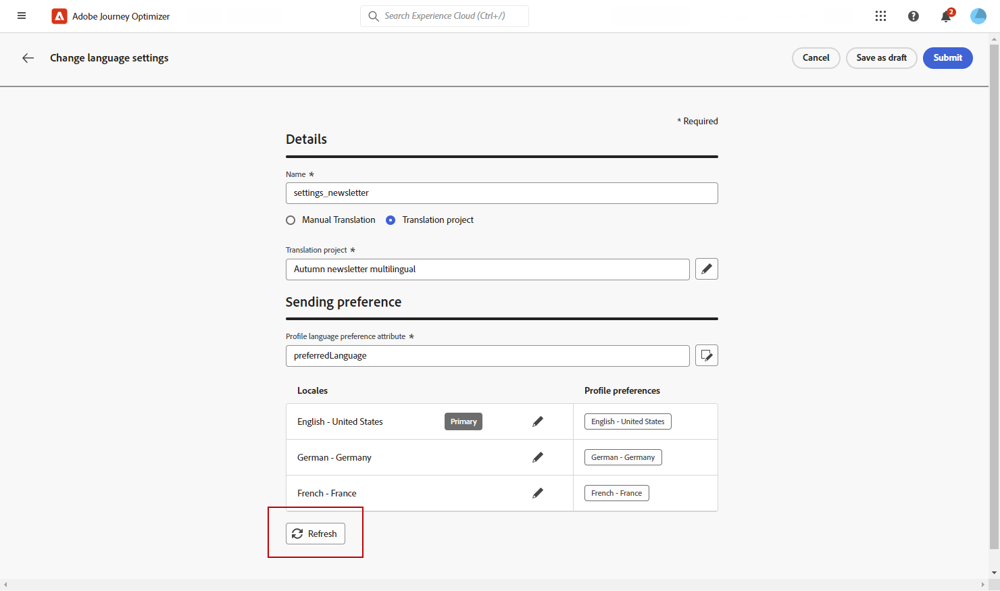

# Skapa flerspråkigt innehåll med automatiserad översättning {#multilingual-automated}

>[!BEGINSHADEBOX]

**Innehållsförteckning**

* [Kom igång med flerspråkigt innehåll](multilingual-gs.md)
* [Skapa flerspråkigt innehåll med manuell översättning](multilingual-manual.md)
* Skapa flerspråkigt innehåll med automatiserad översättning
* [Flerspråkig kampanjrapport](multilingual-report.md)

>[!ENDSHADEBOX]

Med hjälp av det automatiserade flödet kan du helt enkelt välja målspråk och språkleverantör. Ditt innehåll skickas sedan direkt till översättningen, klart för slutgranskning när det är klart.

Följ de här stegen för att skapa flerspråkigt innehåll med hjälp av automatiserad översättning:

1. [Skapa din språkinställning](#create-locale).

1. [Skapa ett språkprojekt](#create-translation-project).

1. [Skapa språkinställningar](#create-language-settings).

1. [Skapa en flerspråkig kampanj](#create-a-multilingual-campaign).

1. [Granska din översättningsuppgift (valfritt)](#review-translation-project).

## Skapa nationella inställningar {#create-locale}

När du konfigurerar språkinställningarna enligt beskrivningen i [Skapa språkinställningar](#language-settings) om det inte finns någon specifik språkinställning för ditt flerspråkiga innehåll kan du skapa så många nya språkinställningar som behövs med **[!UICONTROL Translation]** -menyn.

1. Från **[!UICONTROL Administration]** meny, åtkomst **[!UICONTROL Channel]**.

   På översättningsmenyn får du tillgång till listan över aktiverade språkområden.

1. Klicka på **[!UICONTROL Add locale]** på fliken **[!UICONTROL Locale dictionary]**.

   

1. Välj din språkinställningskod på menyn **[!UICONTROL Language]** lista och associerade **[!UICONTROL Region]**.

1. Klicka **[!UICONTROL Save]** för att skapa din språkinställning.

   

## Skapa översättningsprojekt {#translation-project}

Starta översättningsprojektet genom att ange språkområdet som mål, vilket anger det specifika språket eller den specifika regionen för innehållet. Du kan sedan välja översättningsleverantör.

1. Från **[!UICONTROL Translation projects]** meny under **[!UICONTROL Content management]**, klicka **[!UICONTROL Create project]**.

   

1. Type-in a **[!UICONTROL Name]** och **[!UICONTROL Description]**.

1. Markera **[!UICONTROL Source locale]**.

   

1. Välj om du vill aktivera följande alternativ:

   * **[!UICONTROL Automatically publish approved translations]**: När översättningarna har godkänts integreras de automatiskt i kampanjen utan att något manuellt ingripande behövs.
   * **[!UICONTROL Enable Review workflow]**: Gäller endast för översatta språkområden. På så sätt kan en intern granskare effektivt utvärdera och antingen godkänna eller avvisa översatt innehåll. [Läs mer](#review-translation-project)

1. Klicka **[!UICONTROL Add locale]** för att öppna menyn och definiera språk för översättningsprojektet.

   Om en **[!UICONTROL Locale]** saknas kan du skapa den manuellt i förväg från **[!UICONTROL Translation]** eller av API. Se [Skapa en ny språkinställning](#create-locale).

   

1. Välj i listan **[!UICONTROL Target locale(s)]** och välja vilken **[!UICONTROL Translation provider]** som du vill använda för varje språkområde.

   **[!UICONTROL Translation provider]** du kommer åt inställningarna via **[!UICONTROL Translation]** i **[!UICONTROL Administration]** menyavsnitt.

   >[!NOTE]
   >
   >Kontraktshantering med översättningsprovidern ligger utanför den här funktionens räckvidd. Kontrollera att du har ett giltigt och aktivt kontrakt med den utsedda översättningspartnern.
   >
   > Översättningsprovidern äger det översatta innehållets kvalitet.

1. Klicka **[!UICONTROL Add a locale]** när du har länkat målspråket till rätt översättningsleverantör. Klicka sedan på **[!UICONTROL Save]**.

   Observera, att om en provider är nedtonad för ett målland innebär det att providern inte stöder det aktuella språkområdet.

   

1. Klicka **[!UICONTROL Save]** när ditt översättningsprojekt är konfigurerat.

Ditt översättningsprojekt har skapats och kan användas i en flerspråkig kampanj.

## Skapa språkinställningar {#language-settings}

I det här avsnittet kan du ange ditt primära språk och tillhörande språk för hantering av ditt flerspråkiga innehåll. Du kan också välja det attribut som du vill använda för att söka efter information om profilspråket.

1. Från **[!UICONTROL Administration]** meny, åtkomst **[!UICONTROL Channel]**.

1. I **[!UICONTROL Language settings]** meny, klicka **[!UICONTROL Create language settings]**.

   

1. Ange ditt namn **[!UICONTROL Language settings]**.

1. Välj alternativet **[!UICONTROL Translation project]**.

1. Från **[!UICONTROL Translation project]** fält, klicka **[!UICONTROL Edit]** och välj det du skapat tidigare **[!UICONTROL Translation project]**.

   De tidigare konfigurerade språkinställningarna importeras automatiskt.

   

1. Från **[!UICONTROL Sending preference]** väljer du det attribut du vill söka efter för att hitta information om profilspråk.

1. Klicka **[!UICONTROL Edit]** bredvid **[!UICONTROL Locale]** för att ytterligare personalisera den och lägga till **[!UICONTROL Profile preferences]**.

   

1. Om **[!UICONTROL Translation project]** uppdateras, klicka **[!UICONTROL Refresh]** för att spegla dessa ändringar i **[!UICONTROL Language settings]**.

   

1. Klicka **[!UICONTROL Submit]** för att skapa **[!UICONTROL Language settings]**.

<!--
1. Access the **[!UICONTROL Channel surfaces]** menu and create a new channel surface or select an existing one.

1. In the **[!UICONTROL Header parameters]** section, select the **[!UICONTROL Enable multilingual]** option.

1. Select your **[!UICONTROL Locales dictionary]** and add as many as needed.
-->

## Skapa en flerspråkig kampanj {#create-multilingual-campaign}

När du har konfigurerat översättningsprojektet och språkinställningarna är du redo att skapa en kampanj och anpassa innehållet för olika språkområden.

1. Börja med att skapa och konfigurera din e-post-, SMS- eller push-meddelandekampanj enligt dina krav. [Läs mer](../campaigns/create-campaign.md)

1. När det primära innehållet har skapats klickar du på **[!UICONTROL Save]** och gå tillbaka till kampanjkonfigurationsskärmen.

1. Klicka **[!UICONTROL Add languages]**.  [Läs mer](#create-language-settings)

   

1. Välj dina tidigare skapade **[!UICONTROL Language settings]**.

   

1. Nu när språkinställningarna har importerats klickar du på **[!UICONTROL Send to translate]** om du vill vidarebefordra innehållet till den tidigare valda översättningsleverantören.

   

1. När innehållet har skickats för översättning går det inte längre att redigera. Klicka på låsikonen om du vill ändra det ursprungliga innehållet.

   Observera att om du vill göra några ändringar i det här innehållet måste du skapa ett nytt översättningsprojekt och skicka om det för översättning.

   

1. Klicka **[!UICONTROL Open translation]** för att få tillgång till ditt översättningsprojekt och granska det.

   

1. På den här sidan följer du översättningsprojektets status:

   * **[!UICONTROL Translation in progress]**: Din tjänsteleverantör arbetar aktivt med översättningen.

     Om du valde **Intern översättning** när du konfigurerar **Språkinställningar** kan du översätta innehållet direkt i översättningsprojektet. [Läs mer](#manage-ht-project)

   * **[!UICONTROL Ready for review]**: Granskningsprocessen är klar att börja, vilket ger dig möjlighet att komma åt översättningen och antingen avvisa eller godkänna den.

     Om du valde **[!UICONTROL Enable review worflow]** i **[!UICONTROL Translation project]** kan du granska översättningen direkt i Journey Optimizer när du är klar av den valda översättningsleverantören. [Läs mer](#review-translation-project)

   * **[!UICONTROL Reviewed]**: Översättningen har godkänts och är klar att skickas till kampanjen.

   * **[!UICONTROL Ready to publish]**: Maskinöversättning har slutförts och kan nu skickas till din kampanj.

   * **[!UICONTROL Completed]**: Översättning är nu tillgänglig i din kampanj.

   

1. När översättningen är klar kan det flerspråkiga innehållet skickas.

   

1. Klicka **[!UICONTROL Review to activate]** för att visa en sammanfattning av kampanjen.

   Sammanfattningen gör att du kan ändra kampanjen om det behövs och kontrollera om någon parameter är felaktig eller saknas.

1. Bläddra igenom det flerspråkiga innehållet för att se återgivningen på varje språk.

   

1. Kontrollera att kampanjen är korrekt konfigurerad och klicka sedan på **[!UICONTROL Activate]**.

Din kampanj är nu aktiverad. Meddelandet som konfigurerats i kampanjen skickas omedelbart, eller på det angivna datumet. Observera att så fort Campaign är klar kan den inte ändras. Om du vill återanvända innehåll kan du duplicera din kampanj.

När ni har skickat dem kan ni mäta effekten av era kampanjer i kampanjrapporterna.

## Hantera internt översättningsprojekt {#manage-ht-project}

Om du valde den interna översättningen när du konfigurerade språkinställningarna kan du översätta innehållet direkt i översättningsprojektet.

1. Från **[!UICONTROL Translation project]**, få åtkomst till **[!UICONTROL More actions]** meny och välj **[!UICONTROL In-house translation]**.

   

1. Du kan exportera din CSV-fil för översättning med hjälp av ett externt översättningsprogram. Du kan även importera CSV-filen tillbaka till översättningsprojektet genom att klicka på **[!UICONTROL Import CSV]** -knappen.

   

1. Klicka **[!UICONTROL Edit]** för att lägga till översättningsinnehåll.

   

1. Om du vill publicera den översatta texten klickar du på **[!UICONTROL Finalize]**.

## Granska ditt översättningsprojekt {#review-translation-project}

Om du valde **[!UICONTROL Enable review worflow]** i **[!UICONTROL Translation project]** kan du granska översättningen direkt i Journey Optimizer när du är klar av den valda översättningsleverantören.

Observera att om det här alternativet är inaktiverat, när översättningen är klar av din leverantör, ställs översättningsuppgiftens status automatiskt in på **[!UICONTROL Reviewed]** så att du snabbt kan fortsätta genom att klicka **[!UICONTROL Publish]**.

1. När översättningen är klar från din tjänsteleverantör kan du få åtkomst till översättningen för granskning från din **[!UICONTROL Translation project]** eller direkt från **[!UICONTROL Campaign]**.

   Från **[!UICONTROL More actions]** meny, klicka **[!UICONTROL Review]**.

   

1. I granskningsfönstret bläddrar du igenom det översatta innehållet och godkänner eller avvisar alla översättningssträngar.

   

1. Klicka **[!UICONTROL Edit]** om du vill ändra innehållet i översättningssträngen.

   

1. Ange den uppdaterade översättningen och klicka på **[!UICONTROL Confirm]** när du är klar.

   

1. Du kan också välja att **[!UICONTROL Reject all]** eller **[!UICONTROL Approve all]** direkt.

   Vid val **[!UICONTROL Reject all]**, lägga till en kommentar och klicka på **[!UICONTROL Reject]**.

1. Klicka **[!UICONTROL Preview]** för att kontrollera återgivningen av det översatta innehållet på varje språk.

1. Om du vill publicera den översatta texten klickar du på **[!UICONTROL Finalize]**.

   

1. Från **[!UICONTROL Translation project]**, väljer du ett av dina projekt för att få mer information. Om du avvisade översättningen kan du välja att skicka tillbaka den till översättningen.

   

1. När du **[!UICONTROL Translation project]** statusen är Granskad, du kan skicka den till din kampanj.

   Från **[!UICONTROL More actions]** meny, klicka **[!UICONTROL Publish]**.

   

1. Kontrollera att din översättningsstatus har ändrats till **[!UICONTROL Translation complete]**. Nu kan du skicka ditt flerspråkiga innehåll, se steg 10 i [det här avsnittet](#create-multilingual-campaign).

   

<!--
# Create a multilingual journey {#create-multilingual-journey}

1. Create your journey with a Delivery and personalize your content as needed.
1. From your delivery action, click Edit content.
1. Click Add languages.

-->
