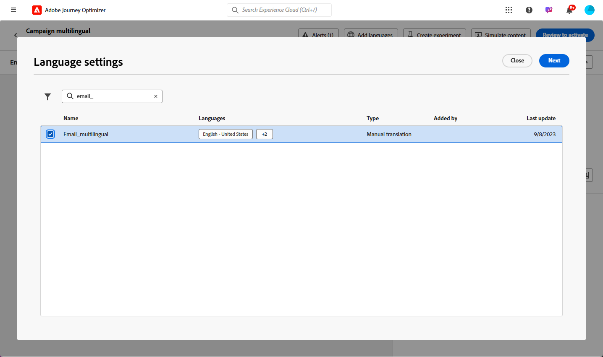

# Skapa flerspråkigt innehåll med manuell översättning {#multilingual-manual}

>[!BEGINSHADEBOX]

**Innehållsförteckning**

* [Kom igång med flerspråkigt innehåll](multilingual-gs.md)
* **[Skapa flerspråkigt innehåll med manuell översättning](multilingual-manual.md)**
* [Skapa flerspråkigt innehåll med automatiserad översättning](multilingual-automated.md)
* [Flerspråkig kampanjrapport](multilingual-report.md)

>[!ENDSHADEBOX]

Med det manuella flödet kan ni enkelt översätta ert innehåll direkt i kampanjen för e-post, push-meddelanden eller SMS, vilket ger er precis kontroll och anpassningsbara alternativ för flerspråkiga meddelanden. Dessutom kan du enkelt importera redan befintligt flerspråkigt innehåll med alternativet Importera HTML.

Följ de här stegen för att skapa flerspråkigt innehåll med hjälp av manuell översättning:

1. [Skapa din språkinställning](#create-locale).

1. [Skapa språkinställningar](#create-language-settings).

1. [Skapa en flerspråkig kampanj](#create-a-multilingual-campaign).

## Skapa nationella inställningar {#create-locale}

När du konfigurerar språkinställningarna enligt beskrivningen i [Skapa språkinställningar](#language-settings) om det inte finns någon specifik språkinställning för ditt flerspråkiga innehåll kan du skapa så många nya språkinställningar som behövs med **[!UICONTROL Translation]** -menyn.

1. Från **[!UICONTROL Administration]** meny, åtkomst **[!UICONTROL Channel]**.

   På översättningsmenyn får du tillgång till listan över aktiverade språkområden.

1. Klicka på **[!UICONTROL Add locale]** på fliken **[!UICONTROL Locale dictionary]**.

   

1. Välj din språkinställningskod på menyn **[!UICONTROL Language]** lista och associerade **[!UICONTROL Region]**.

1. Klicka **[!UICONTROL Save]** för att skapa din språkinställning.

   

## Skapa språkinställningar {#language-settings}

I det här avsnittet kan du ange ditt primära språk och tillhörande språk för hantering av ditt flerspråkiga innehåll. Du kan också välja det attribut som du vill använda för att söka efter information om profilspråket

1. Från **[!UICONTROL Administration]** meny, åtkomst **[!UICONTROL Channel]**.

1. I **[!UICONTROL Language settings]** meny, klicka **[!UICONTROL Create language settings]**.

   

1. Ange ditt namn **[!UICONTROL Language settings]**.

1. Välj **[!UICONTROL Locales]** som är kopplade till dessa inställningar. Du kan lägga till högst 50 språkområden.

   Om en **[!UICONTROL Locale]** saknas kan du skapa den manuellt i förväg från **[!UICONTROL Translation]** eller av API. Se [Skapa en ny språkinställning](#create-locale).

   

1. Från **[!UICONTROL Sending preference]** väljer du det attribut du vill söka efter för att hitta information om profilspråk.

   

1. Klicka **[!UICONTROL Edit]** bredvid **[!UICONTROL Locale]** för att ytterligare personalisera den och lägga till **[!UICONTROL Profile preferences]**.

   

1. Välj andra **[!UICONTROL Locales]** från listrutan Profilinställningar och klicka på **[!UICONTROL Add profiles]**.

1. Gå till den avancerade menyn i **[!UICONTROL Locale]** för att definiera **[!UICONTROL Primary locale]**, dvs. standardspråket om profilattributet inte anges.

   Du kan även ta bort språkområdet från den här avancerade menyn.

   

1. Klicka **[!UICONTROL Submit]** för att skapa **[!UICONTROL Language settings]**.

<!--
1. Access the **[!UICONTROL Channel surfaces]** menu and create a new channel surface or select an existing one.

1. In the **[!UICONTROL Header parameters]** section, select the **[!UICONTROL Enable multilingual]** option.

1. Select your **[!UICONTROL Locales dictionary]** and add as many as needed.
-->

## Skapa en flerspråkig kampanj {#create-multilingual-campaign}

När du har konfigurerat ditt flerspråkiga innehåll är du redo att skapa en kampanj och anpassa innehållet för alla valda språkområden.

1. Börja med att skapa och konfigurera din e-post-, SMS- eller push-meddelandekampanj enligt dina krav. [Läs mer](../campaigns/create-campaign.md)

1. Navigera till **[!UICONTROL Actions]** och väljer **[!UICONTROL Edit content]**.

   

1. Skapa eller importera ditt ursprungliga innehåll och anpassa det efter behov.

1. När det primära innehållet har skapats klickar du på **[!UICONTROL Save]** och gå tillbaka till kampanjkonfigurationsskärmen.

   

1. Klicka **[!UICONTROL Add languages]** och markera dina tidigare skapade **[!UICONTROL Language settings]**. [Läs mer](#create-language-settings)

   

1. Få åtkomst till de avancerade inställningarna i **[!UICONTROL Locales]** meny och välj **[!UICONTROL Copy primary to all locales]**.

   

1. Nu när det primära innehållet dupliceras i hela det markerade  **[!UICONTROL Locales]**, komma åt de olika språkinställningarna och klicka **[!UICONTROL Edit email body]** att översätta innehållet.

   

1. Du kan välja att inaktivera eller aktivera språkområden med **[!UICONTROL More action]** menyn för det valda språkområdet.

   

1. Om du vill inaktivera flerspråkig konfiguration klickar du på **[!UICONTROL Add languages]** och välj det språk du vill behålla som lokalt språk.

   

1. Klicka **[!UICONTROL Review to activate]** för att visa en sammanfattning av kampanjen.

   Sammanfattningen gör att du kan ändra kampanjen om det behövs och kontrollera om någon parameter är felaktig eller saknas.

1. Bläddra igenom det flerspråkiga innehållet för att se återgivningen på varje språk.

   

1. Kontrollera att kampanjen är korrekt konfigurerad och klicka sedan på **[!UICONTROL Activate]**.

Din kampanj är nu aktiverad. Meddelandet som konfigurerats i kampanjen skickas omedelbart, eller på det angivna datumet. Observera att så fort Campaign är klar kan den inte ändras. Om du vill återanvända innehåll kan du duplicera din kampanj.

När ni har skickat dem kan ni mäta effekten av era kampanjer i kampanjrapporterna.

<!--
# Create a multilingual journey {#create-multilingual-journey}

1. Create your journey with a Delivery and personalize your content as needed.
1. From your delivery action, click Edit content.
1. Click Add languages.

-->
