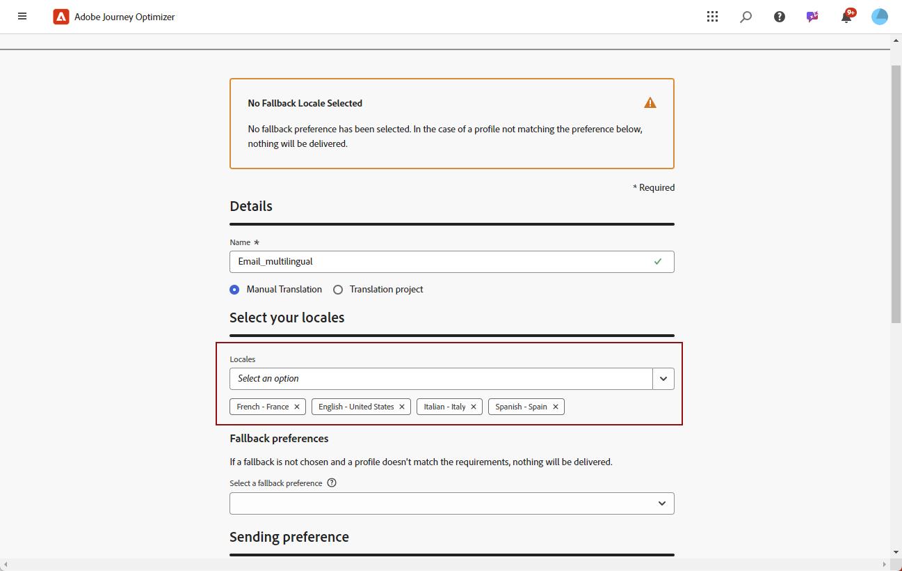

# Skapa flerspråkigt innehåll med manuell översättning {#multilingual-manual}

>[!AVAILABILITY]
>
>Flerspråkigt innehåll är för närvarande endast tillgängligt för en uppsättning organisationer (begränsad tillgänglighet). Kontakta din Adobe-representant för att få åtkomst.

Med det manuella flödet kan ni enkelt översätta ert innehåll direkt i kampanjen och resan för e-post, push-meddelanden eller SMS, vilket ger er precis kontroll och anpassningsbara alternativ för flerspråkiga meddelanden. Dessutom kan du enkelt importera redan befintligt flerspråkigt innehåll med alternativet Importera HTML.

Följ de här stegen för att skapa flerspråkigt innehåll med hjälp av manuell översättning:

1. [Skapa din språkinställning](#create-locale).

1. [Skapa språkinställningar](#create-language-settings).

1. [Skapa ett flerspråkigt innehåll](#create-a-multilingual-campaign).

## Skapa nationella inställningar {#create-locale}

När du konfigurerar språkinställningarna, enligt beskrivningen i avsnittet [Skapa språkinställningar](#language-settings) , kan du skapa så många nya språkinställningar som behövs på menyn **[!UICONTROL Translation]** om det inte finns någon tillgänglig språkinställning för det flerspråkiga innehållet.

1. Gå till **[!UICONTROL Translation]** på menyn **[!UICONTROL Content management]**.

1. Klicka på **[!UICONTROL Add locale]** på fliken **[!UICONTROL Locale dictionary]**.

   

1. Välj din språkkod i listan **[!UICONTROL Language]** och tillhörande **[!UICONTROL Region]**.

1. Klicka på **[!UICONTROL Save]** för att skapa din språkinställning.

   

## Skapa språkinställningar {#language-settings}

I det här avsnittet kan du ange ditt primära språk och tillhörande språk för hantering av ditt flerspråkiga innehåll. Du kan också välja det attribut som du vill använda för att söka efter information om profilspråket

1. Gå till **[!UICONTROL Channel]** > **[!UICONTROL General settings]** på menyn **[!UICONTROL Administration]**.

1. Klicka på **[!UICONTROL Create language settings]** på menyn **[!UICONTROL Language settings]**.

   

1. Ange namnet på din **[!UICONTROL Language settings]**.

1. Välj **[!UICONTROL Locales]** som är associerad med de här inställningarna. Du kan lägga till högst 50 språkområden.

   Om **[!UICONTROL Locale]** saknas kan du skapa den manuellt på menyn **[!UICONTROL Translation]** eller via API. Se [Skapa en ny språkinställning](#create-locale).

   

1. På menyn **[!UICONTROL Sending preference]** väljer du det attribut du vill söka efter för att hitta information om profilspråk.

   

1. Klicka på **[!UICONTROL Edit]** bredvid din **[!UICONTROL Locale]** om du vill anpassa den ytterligare och lägga till **[!UICONTROL Profile preferences]**.

   

1. Välj andra **[!UICONTROL Locales]** i listrutan Profilinställningar och klicka på **[!UICONTROL Add profiles]**.

1. Gå till den avancerade menyn i **[!UICONTROL Locale]** för att definiera din **[!UICONTROL Primary locale]**, d.v.s. standardspråket om profilattributet inte har angetts.

   Du kan även ta bort språkområdet från den här avancerade menyn.

   

1. Klicka på **[!UICONTROL Submit]** för att skapa din **[!UICONTROL Language settings]**.

<!--
1. Access the **[!UICONTROL channel configurations]** menu and create a new channel configuration or select an existing one.

1. In the **[!UICONTROL Header parameters]** section, select the **[!UICONTROL Enable multilingual]** option.

1. Select your **[!UICONTROL Locales dictionary]** and add as many as needed.
-->

## Skapa flerspråkigt innehåll {#create-multilingual-campaign}

När du har konfigurerat ditt flerspråkiga innehåll är du redo att skapa en kampanj eller resa och anpassa innehållet för alla valda språkområden.

1. Börja med att skapa och konfigurera e-post, SMS eller push-meddelanden [kampanj](../campaigns/create-campaign.md) eller [resa](../building-journeys/journeys-message.md) enligt dina krav.

   >[!AVAILABILITY]
   >
   >Vi rekommenderar att du endast inkluderar ett översättningsprojekt per resa.

1. Skapa eller importera ditt ursprungliga innehåll och anpassa det efter behov.

1. När det primära innehållet har skapats klickar du på **[!UICONTROL Save]** och går tillbaka till kampanjkonfigurationsskärmen.

   

1. Klicka på **[!UICONTROL Add languages]** och markera **[!UICONTROL Language settings]** som du skapat tidigare. [Läs mer](#create-language-settings)

   

1. Gå till de avancerade inställningarna på menyn **[!UICONTROL Locales]** och välj **[!UICONTROL Copy primary to all locales]**.

   

1. Nu när ditt primära innehåll har duplicerats genom hela den valda **[!UICONTROL Locales]** kan du komma åt varje språkinställning och klicka på **[!UICONTROL Edit email body]** för att översätta ditt innehåll.

   

1. Du kan välja att inaktivera eller aktivera språkinställningar med menyn **[!UICONTROL More action]** för den valda språkinställningen.

   

1. Om du vill inaktivera den flerspråkiga konfigurationen klickar du på **[!UICONTROL Add languages]** och väljer det språk som du vill behålla som lokalt språk.

   

1. Klicka på **[!UICONTROL Review to activate]** om du vill visa en sammanfattning av kampanjen.

   Sammanfattningen gör att du kan ändra kampanjen om det behövs och kontrollera om någon parameter är felaktig eller saknas.

1. Bläddra igenom det flerspråkiga innehållet för att se återgivningen på varje språk.

   

Nu kan ni aktivera kampanjen eller resan. När ni har skickat dem kan ni mäta effekten av er flerspråkiga resa eller kampanj i rapporter.

<!--
# Create a multilingual journey {#create-multilingual-journey}

1. Create your journey with a Delivery and personalize your content as needed.
1. From your delivery action, click Edit content.
1. Click Add languages.

-->
