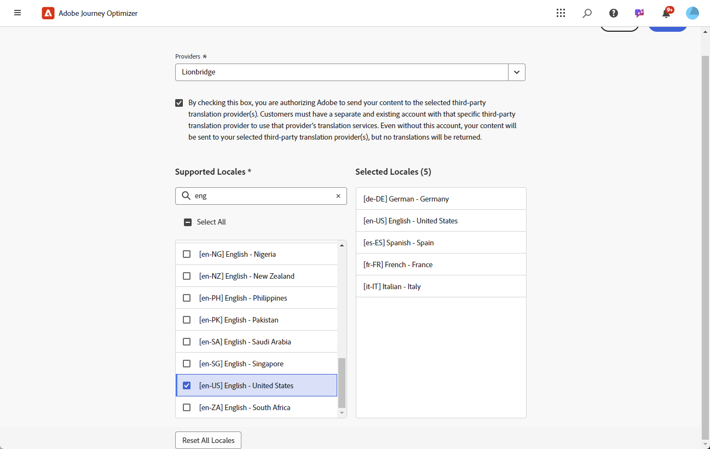

# Lägg till språkleverantörer {#multilingual-provider}

>[!IMPORTANT]
>
> Användningen av en översättningsleverantörs översättningstjänster regleras av ytterligare villkor från den aktuella leverantören. Som tredjepartslösningar är översättningstjänster tillgängliga för Adobe Journey Optimizer-användare via integrering. Adobe kontrollerar inte och ansvarar inte för tredjepartsprodukter.

Adobe Journey Optimizer kan integreras med översättningsleverantörer från tredje part som erbjuder både maskinöversättning och översättningstjänster, oberoende av Adobe Journey Optimizer.

Kontrollera att du har skapat ett konto hos respektive leverantör innan du lägger till den valda översättningsprovidern.

1. Navigera till **[!UICONTROL Content Management]** på menyn **[!UICONTROL Translation]**.

1. Gå till fliken **[!UICONTROL Providers]** och klicka på **[!UICONTROL Add Provider]**.

   

1. Välj önskad leverantör i listrutan **[!UICONTROL Providers]**.

   >[!NOTE]
   >
   >Om du vill lägga till en ny **Provider** i listan kan du be din **Provider** att följa instruktionerna i [det här dokumentet](https://developer.adobe.com/gcs/partner/) för att slutföra introduktionsprocessen.

   

1. Om du använder Microsoft Translator som provider anger du **[!UICONTROL Subscription Key]** och **[!UICONTROL Endpoint URL]**.

   Klicka på **[!UICONTROL Validate Credentials]** för att testa anslutningen.

   

1. Välj tillämpliga **Språk som stöds**.

   

1. När du har slutfört konfigurationen klickar du på **[!UICONTROL Save]** för att slutföra konfigurationen.
