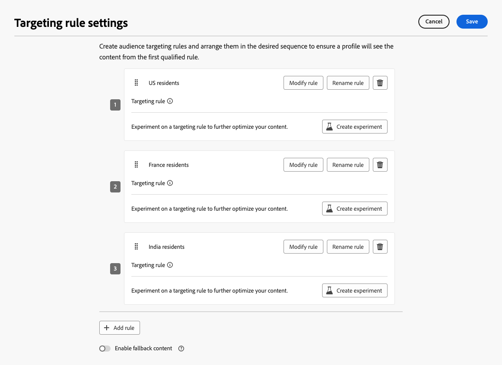

# Kombinera målinriktning och experimenterande {#combination}

Med Journey Optimizer kan ni också kombinera målgruppsanpassning och experiment i en enda resa eller kampanj för att skapa mer sofistikerade strategier.

Ni kan faktiskt använda målinriktning för att skapa flera olika varianter, och för varje variant kan ni använda experiment för att optimera varje innehåll ytterligare. Detta garanterar att experimenten är specifika för varje målinriktningsregel och inte sträcker sig över flera varianter.

Du kan till exempel testa&quot;50 % rabatt&quot; jämfört med ett presentkort på&quot;$50&quot; för kunder i USA och göra ett annat test för kunder i Europa, till exempel&quot;fri frakt på beställningar över €&quot; jämfört med&quot;20 % rabatt på nästa köp&quot;.

Följ stegen nedan om du vill kombinera både målinriktning och experiment i en resa eller kampanj.

1. Skapa en resa eller en kampanj där ni definierar flera målinriktningsregler. [Lär dig hur](optimization-targeting.md)

   {width=85%}

1. Skapa ett experiment för den första målinriktningsregeln.

1. Designa och konfigurera ditt innehållsexperiment som du vill. [Lär dig hur](../content-management/content-experiment.md)

   {width=85%}

   När experimentet har definierats gäller det bara den första målgruppsregeln.

1. Gå tillbaka till fliken **[!UICONTROL Actions]** och välj **[!UICONTROL Edit content]**.

1. För den grupp som definieras av din första målinriktningsregel kan du definiera ett specifikt innehåll för varje variant av ditt experiment.

   Om ni har lagt till mer än en inkommande åtgärd till er resa eller kampanj gäller samma kombination av målinriktning och experiment för varje åtgärd. Du måste dock definiera ett specifikt innehåll för varje variant av varje åtgärd.

   {width=85%}

1. Fortsätt på samma sätt med de andra målinriktningsreglerna och utforma motsvarande innehåll för varje variant.

1. Spara ändringarna och [aktivera](review-activate-campaign.md) din resa eller kampanj.

När resan/kampanjen är live tilldelas användare från varje målgrupp slumpvis de olika innehållsvariationerna som definierats för den grupp de tillhör.

<!--
## Reporting on Message optimization

E.g. explaining how a marketer can look at the report to determine which treatment (e.g. which message content) is performing the best for the targeting audience
-->

