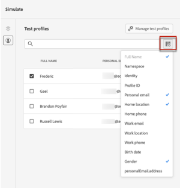

# Förhandsgranska ditt innehåll {#preview}

En gång [testprofiler](test-profiles.md) om du har valt det här alternativet kan du förhandsgranska innehållet. Följ stegen nedan:

1. I fönstret Redigera innehåll i meddelandet eller i e-postdesignern klickar du på **[!UICONTROL Simulate content]** -knappen.

1. Välj en testprofil. Du kan kontrollera de värden som är tillgängliga i kolumnerna. Använd höger-/vänsterpilarna för att bläddra bland data.

   

   >[!NOTE]
   >
   >Om du vill lägga till fler testprofiler väljer du **[!UICONTROL Manage test profiles]**. [Läs mer](test-profiles.md)

1. Klicka på **[!UICONTROL Select data]** -ikonen ovanför listan för att lägga till eller ta bort kolumner.

   I slutet av listan visas personaliseringsfält som är specifika för det aktuella meddelandet. I det här exemplet är profilens ort, förnamn och efternamn. Markera de fälten och se till att dessa värden är ifyllda i testprofilerna.

   

1. I meddelandeförhandsgranskningen ersätts anpassade element med de valda testprofildata. För det här meddelandet är till exempel både e-postinnehåll och e-postämne personliga:

   

1. Välj andra testprofiler om du vill förhandsgranska din e-post för varje variant av meddelandet.
