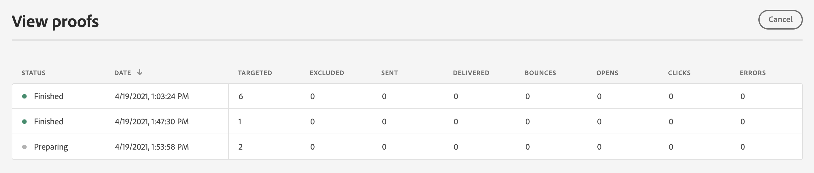

# Skicka korrektur med testprofildata {#send-proofs}

Ett korrektur är ett specifikt meddelande som gör att du kan testa ett meddelande innan det skickas till huvudmålgruppen. Mottagarna av beviset ansvarar för att godkänna meddelandet: rendering, innehåll, personaliseringsinställningar, konfiguration.

>[!NOTE]
>
>I [!DNL Journey optimizer] kan du också testa olika varianter av ditt innehåll genom att förhandsgranska det och skicka korrektur med exempelindata som har överförts från en CSV-/JSON-fil, eller lagts till manuellt. [Lär dig hur du simulerar innehållsvariationer](../test-approve/simulate-sample-input.md)

Om du vill skicka e-postkorrektur med testprofildata måste du först välja [testprofiler](test-profiles.md). Följ sedan dessa steg:

1. Klicka på knappen **[!UICONTROL Simulate]** på skärmen **[!UICONTROL Send proof]**.

   

1. I fönstret **[!UICONTROL Send proof]** skriver du in mottagarens e-postadress och klickar på **[!UICONTROL Add]** för att skicka korrekturet till dig själv eller medlemmar i din organisation.

   Observera att du kan lägga till upp till tio mottagare för korrekturleveransen.

   

1. Välj de **Testprofiler** som ska användas för att anpassa meddelandeinnehållet.

   Varje mottagare av korrekturet får lika många meddelanden som antalet valda testprofiler. Om du till exempel har lagt till fem e-postmeddelanden till mottagare och valt tio testprofiler, skickar du femtio korrekturmeddelanden och varje mottagare får tio av dem.

1. Du kan vid behov lägga till ett prefix till korrekturens ämnesrad. Endast alfanumeriska tecken och specialtecken som . - _ ( ) [ ] tillåts som prefix till ämnesraden.

1. Klicka på **[!UICONTROL Send proof]**.

   

1. Klicka på knappen **[!UICONTROL Simulate]** på skärmen **[!UICONTROL View proofs]** för att kontrollera status.

   

Vi rekommenderar att du skickar korrektur efter varje ändring av meddelandeinnehållet.

>[!NOTE]
>
>I det skickade korrekturet är länken till spegelsidan inte aktiv. Den aktiveras endast i de slutliga meddelandena.
