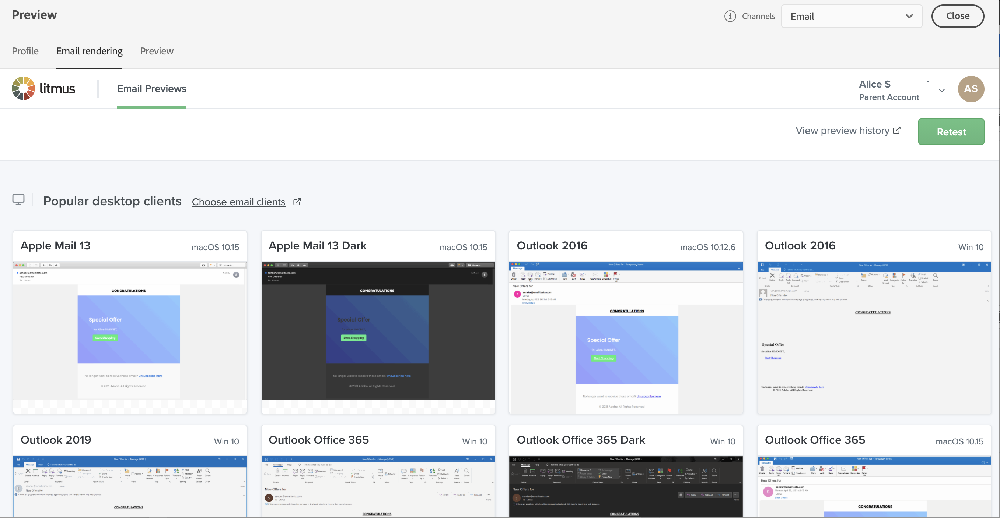

# Testa e-poståtergivning {#email-rendering}

Du kan använda ditt **Litmus**-konto i [!DNL Journey Optimizer] för att omedelbart förhandsgranska din **e-poståtergivning** i vanliga e-postklienter. Sedan kan ni se till att e-postinnehållet ser bra ut och fungerar som det ska i alla inkorgar.

Följ de här stegen för att kontrollera e-poståtergivning:

1. Klicka på knappen **[!UICONTROL Simulate content]** på skärmen Redigera innehåll i ditt meddelande eller i e-post-Designer.

1. Markera knappen **[!UICONTROL Render email]**.

   

1. Klicka på **Anslut ditt Litmus-konto** i det övre högra avsnittet.

   

1. Ange dina inloggningsuppgifter och logga in.

   

1. Klicka på knappen **Kör test** om du vill generera förhandsgranskningar via e-post.

1. Kontrollera e-postinnehållet i vanliga dator-, mobil- och webbaserade klienter.

   

>[!CAUTION]
>
>När du ansluter ditt **Litmus**-konto till [!DNL Journey Optimizer] samtycker du till att testmeddelanden skickas till Litmus: när de väl har skickats hanteras dessa e-postmeddelanden inte längre av Adobe. Följaktligen gäller Litmus-principen för datalagring i dessa e-postmeddelanden, inklusive personaliseringsdata som kan inkluderas i dessa testmeddelanden.
