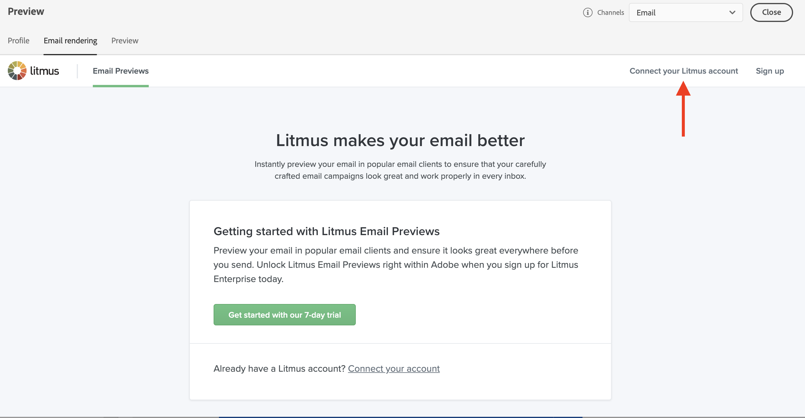

# Testa e-poståtergivning {#email-rendering}

Du kan använda **Litmus** konto till [!DNL Journey Optimizer] för att omedelbart förhandsgranska **e-poståtergivning** i vanliga e-postklienter. Sedan kan ni se till att e-postinnehållet ser bra ut och fungerar som det ska i alla inkorgar.

Följ de här stegen för att kontrollera e-poståtergivning:

1. I fönstret Redigera innehåll i meddelandet eller i e-postdesignern klickar du på **[!UICONTROL Simulate content]** -knappen.

1. Markera knappen **[!UICONTROL Render email]**.

   

1. Klicka **Anslut ditt Litmus-konto** i det övre högra avsnittet.

   

1. Ange dina inloggningsuppgifter och logga in.

   

1. Klicka på **Kör test** om du vill generera förhandsgranskningar via e-post.

1. Kontrollera e-postinnehållet i vanliga dator-, mobil- och webbaserade klienter.

   

>[!CAUTION]
>
>När du ansluter **Litmus** konto med [!DNL Journey Optimizer]godkänner du att testmeddelanden skickas till Litmus: när de väl har skickats hanteras dessa e-postmeddelanden inte längre av Adobe. Följaktligen gäller Litmus-principen för datalagring i dessa e-postmeddelanden, inklusive personaliseringsdata som kan inkluderas i dessa testmeddelanden.
