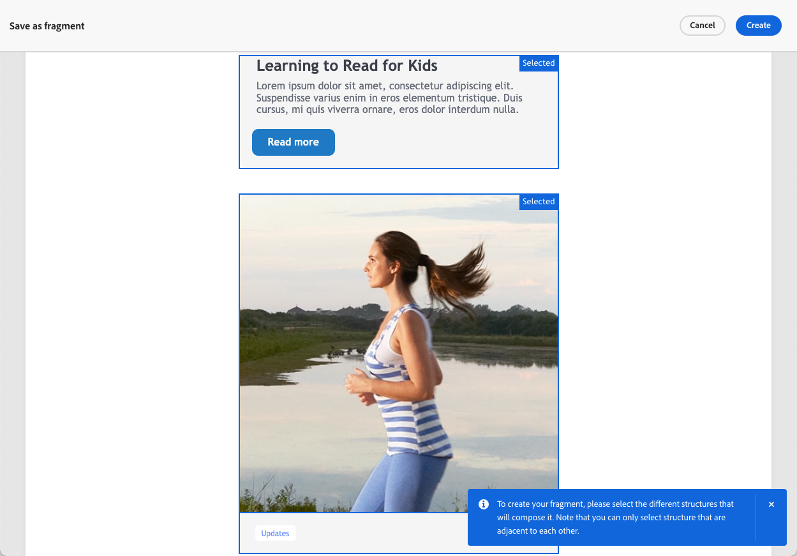

# Spara innehåll som fragment {#save-as-fragment}

När du redigerar innehåll i [!DNL Journey Optimizer] kan du spara hela eller delar av innehållet som fragment för framtida återanvändning. Du kan spara innehåll som fragment antingen [&#x200B; från e-post-Designer](#save-as-visual-fragment) eller [&#x200B; från uttrycksredigeraren](#save-as-expression-fragment).

>[!NOTE]
>
>[Sammanhangsbaserade attribut](../personalization/personalization-build-expressions.md) stöds inte i fragment.
>
>När spårning är aktiverat i en resa eller kampanj spåras länkarna, om det finns länkar i ett sparat fragment och om det här fragmentet används i ett meddelande, som alla andra länkar i meddelandet. [Läs mer om länkar och spårning](../email/message-tracking.md)

## Spara som visuellt fragment {#save-as-visual-fragment}

Så här sparar du innehåll från e-post-Designer som fragment:

1. Klicka på ellipsen längst upp till höger på skärmen i [e-postmeddelandet för Designer](../email/get-started-email-design.md).

1. Välj **[!UICONTROL Save as fragment]** i listrutan.

   

   >[!NOTE]
   >
   >Visuella fragment får inte överskrida 100 kB.

1. Skärmen **[!UICONTROL Save as fragment]** visas. Här väljer du de element som du vill inkludera i fragmentet, inklusive anpassningsfält och dynamiskt innehåll.

   

   >[!CAUTION]
   >
   >Du kan bara markera intilliggande avsnitt. Du kan inte markera en tom struktur eller ett annat fragment.

1. Klicka på **[!UICONTROL Create]** och fyll i fragmentnamnet och beskrivningen (om det behövs).

1. Om du vill tilldela anpassade eller grundläggande dataanvändningsetiketter till fragmentet klickar du på knappen **[!UICONTROL Manage access]** i skärmens övre del. [Läs mer om OLAC (Object Level Access Control)](../administration/object-based-access.md).

1. Välj eller skapa Adobe Experience Platform-taggar från fältet **Taggar** för att kategorisera mallen för förbättrad sökning. [Läs mer](../start/search-filter-categorize.md#tags)

1. Klicka på **[!UICONTROL Create]**. Fragmentet läggs till i [fragmentlistan](#access-manage-fragments) med statusen **Utkast**. Det blir ett fristående fragment som kan användas som vilket annat visuellt fragment som helst från den listan.

   >[!NOTE]
   >
   >Ändringar i det nya fragmentet sprids inte till e-postmeddelandet eller mallen som det kommer från. På samma sätt ändras inte det nya fragmentet när det ursprungliga innehållet redigeras i e-postmeddelandet eller mallen.

1. För att kunna använda fragmentet i era resor och kampanjer måste ni göra det levande. [Lär dig hur du förhandsgranskar och publicerar ett fragment](../content-management/create-fragments.md#publish)

## Spara som uttrycksfragment {#save-as-expression-fragment}

>[!CONTEXTUALHELP]
>id="ajo_perso_library"
>title="Spara som uttrycksfragment"
>abstract="Med personaliseringsredigeraren [!DNL Journey Optimizer] kan du spara innehåll som uttrycksfragment. Uttrycken är sedan tillgängliga för att skapa personaliserat innehåll."

Med personaliseringsredigeraren [!DNL Journey Optimizer] kan du spara innehåll som uttrycksfragment. Uttrycken är sedan tillgängliga för att skapa personaliserat innehåll.

Följ stegen nedan om du vill spara innehåll som ett uttrycksfragment.

1. Bygg ett uttryck i [personaliseringsredigerarens](../personalization/personalization-build-expressions.md)-gränssnitt och klicka sedan på **[!UICONTROL Save as fragment]**.

   >[!NOTE]
   >
   >Uttryck får inte överskrida 200 kB.

1. I den högra rutan anger du ett namn och en beskrivning för uttrycket så att användarna enklare kan hitta det.

   

1. Klicka på **[!UICONTROL Save fragment]**.

   <!--An expression fragment cannot be nested inside another fragment.-->

1. Fragmentet läggs till i [fragmentlistan](#access-manage-fragments) med statusen **Utkast**. Det blir ett fristående fragment som kan användas som andra uttrycksfragment från den listan.

1. För att kunna använda fragmentet i era resor och kampanjer måste ni göra det levande. [Lär dig hur du förhandsgranskar och publicerar ett fragment](../content-management/create-fragments.md#publish)
