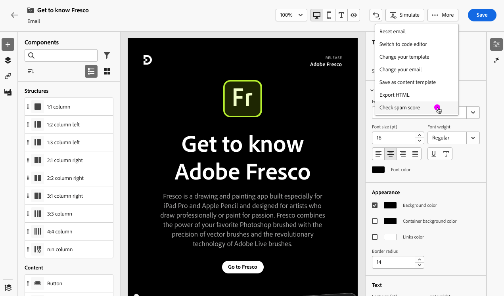

# Rapport om skräppost {#spam-report}

>[!CONTEXTUALHELP]
>id="ajo_simulate_spam_report"
>title="Rapport om skräppost"
>abstract="Med skräppostrapporten kan du kontrollera hur ditt e-postinnehåll beter sig. Det här poängtalet anger om Internet-leverantörer eller postlådeleverantörer kommer att betrakta ditt meddelande som skräppost eller inte. Ju lägre poäng, desto bättre. Om e-postinnehållets poäng är högre än 2 bör du överväga att åtgärda problem som gör att testerna misslyckas."

Du kan kontrollera hur ditt e-postinnehåll beter sig i en dedikerad skräppostrapport. Med [SpamAssassin](https://spamassassin.apache.org/){target="_blank"} kan Adobe Journey Optimizer testa ditt e-postinnehåll och ge det en poäng som anger om Internet-leverantörer eller postlådeleverantörer kommer att betrakta det som skräppost eller inte.

När du redigerar eller förhandsgranskar ditt e-postinnehåll ger knappen **[!UICONTROL Spam report]** en poäng och råd för att förbättra poängen för varje enskilt objekt i listan.

Med den här funktionen kan du avgöra om ett meddelande kan betraktas som skräppost av de antispam-verktyg som används vid mottagande och vidta åtgärder om så är fallet. Många e-postinkorgsleverantörer använder verktyg som en del av sin process för skräppostfiltrering. Att skicka e-postmeddelanden med dåligt resultat kan få stor effekt på leveransförmågan.

Följ stegen nedan för att få åtkomst till **[!UICONTROL Spam report]**.

1. Klicka på knappen **[!UICONTROL Simulate]** på skärmen **[!UICONTROL Spam report]**.

   

<!--
    You can also open the [Email Designer](../email/content-from-scratch.md), click the **[!UICONTROL More]** button and select **[!UICONTROL Check spam score]** from the menu.

    
-->

1. En skräppostkontroll utförs automatiskt och resultatet visas i fönstret **[!UICONTROL Spam report]**. Det visar hur ditt innehåll fungerar i fråga om brödlayout, struktur, bildstorlek, utlösarord för skräppost, om sådana finns, osv.

   

1. Kontrollera poängen och beskrivningarna för varje objekt.

   Ju lägre poäng, desto bättre. Om poängen är högre än 5 visas en varning: den anger att vissa meddelanden kan blockeras eller markeras som skräppost när de tas emot. Det bästa är att ha en poäng som är lägre än 2.

   >[!NOTE]
   >
   >Spam score härleds via [SpamAssassin](https://spamassassin.apache.org/){target="_blank"} och reglerna ägs inte av Adobe. Mer information om de här reglerna finns i SpamAssassin-dokumentationen.
   >

1. Om du anser att vissa element kan förbättras baserat på den poängsättningen kan du redigera ditt innehåll i [e-postmeddelandet för Designer](../email/content-from-scratch.md) och göra nödvändiga uppdateringar.

1. När du har gjort ändringarna går du tillbaka till skärmen **[!UICONTROL Spam report]** för att kontrollera att poängen har förbättrats.

   

<!--You can also check the message's alerts for warnings on potential risk of spam detection. Follow the steps below.

1. Click the **[!UICONTROL Alerts]** button on top right of the screen. [Learn more about email alerts](../email/create-email.md#check-email-alerts)

1. If **[!UICONTROL Spam checker alert]** is displayed, you should check your content for a potential risk of spam using the **[!UICONTROL Spam report]** feature as detailed above.

    
-->
