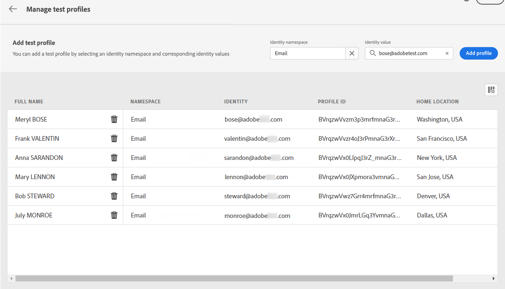

# Välj testprofiler {#select-test-profiles}

Innan du förhandsgranskar eller testar innehållet måste du först välja testprofiler, som är ytterligare mottagare som inte matchar de definierade målinriktningsvillkoren. [Lär dig skapa testprofiler](../audience/creating-test-profiles.md)

Så här väljer du testprofiler:

1. I fönstret Redigera innehåll i meddelandet eller i e-postdesignern klickar du på **[!UICONTROL Simulate content]** -knappen.

1. Klicka på **[!UICONTROL Manage test profiles]** och sedan markera det namnutrymme som ska användas för att identifiera testprofiler genom att klicka på **[!UICONTROL Identity namespace]** markeringsikon. [Läs mer om Adobe Experience Platform identitetsnamnutrymmen](../audience/get-started-identity.md).

   I exemplet nedan använder vi **E-post** namnutrymme.

   

1. Använd sökfältet för att hitta namnutrymmet, markera det och klicka på **[!UICONTROL Select]**

   

1. I **[!UICONTROL Identity value]** anger du värdet (här är e-postadressen) för att identifiera testprofilen och klickar på **[!UICONTROL Add profile]**.

   <!---->

1. Om du har lagt till personalisering i ditt meddelande lägger du till andra profiler så att du kan testa olika varianter av meddelandet beroende på profildata. När du har lagt till profiler visas de under de valda fälten.

   

   Baserat på elementen för meddelandeanpassning visar den här listan data för varje testprofil i de relaterade kolumnerna.
