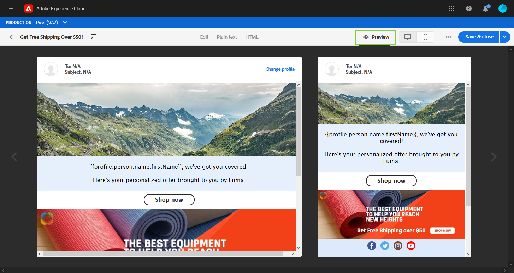
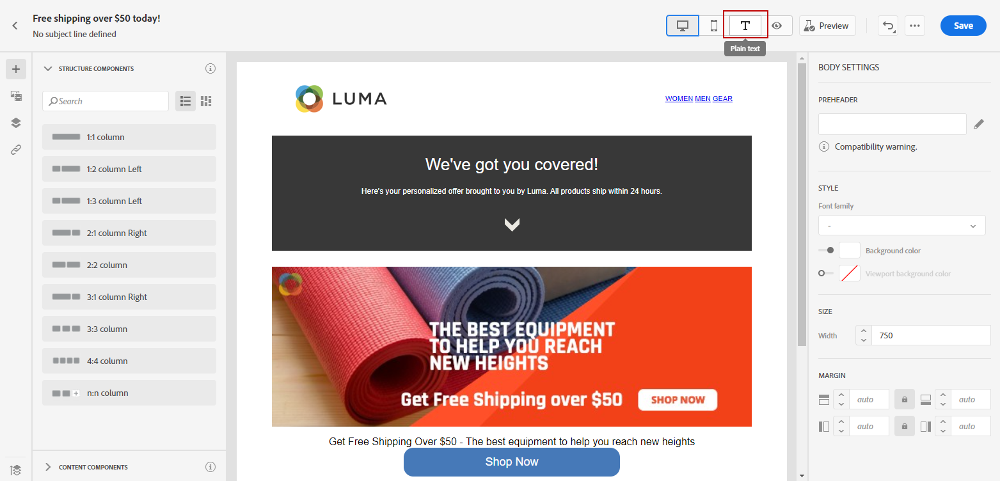

# Designa ditt e-postinnehåll i användargränssnittet {#create-email-content}

När du har [skapade ditt meddelande](create-message.md)kan du börja skapa ditt e-postinnehåll.

1. Välj **[!UICONTROL Email designer]** i **[!UICONTROL Body]** -avsnitt.

   

1. På hemsidan för e-postdesignern väljer du hur du vill utforma e-postmeddelandet bland följande alternativ:

   * Välj **[!UICONTROL Design from scratch]** för att använda e-postdesignerfunktionerna för att skapa e-postinnehåll. [Läs mer](#design-scratch)

   * Välj **[!UICONTROL Start from template]** för att skapa e-post från en inbyggd lista med mallar. Observera att du inte kan skapa andra mallar.

   * Välj **[!UICONTROL Code your own]** för att ange eller klistra in HTML raw-kod. [Läs mer](existing-content.md#import-raw-html-code).

   * Välj **[!UICONTROL Import HTML]** om du vill importera en HTML-fil eller en ZIP-mapp. [Läs mer](existing-content.md#import-html-content-from-file).

   

## Designa från grunden {#design-scratch}

>[!CONTEXTUALHELP]
>id="ac_structure_components"
>title="Om strukturkomponenter"
>abstract="Strukturkomponenter definierar layouten för e-postmeddelandet."

>[!CONTEXTUALHELP]
>id="ac_edition_columns"
>title="Definiera e-postkolumner"
>abstract="Med e-postdesignern kan du enkelt definiera layouten för e-postmeddelandet genom att definiera kolumnstrukturen."

Med e-postdesignern kan du enkelt definiera e-postens struktur. Genom att lägga till och flytta strukturella element med enkla dra-och-släpp-åtgärder kan du designa formen på e-postmeddelandet på några sekunder.

Följ stegen nedan för att börja skapa e-postinnehåll med e-postdesignern:

1. När du har valt **[!UICONTROL Design from scratch]** kan du börja designa ditt e-postinnehåll genom att dra och släppa **[!UICONTROL Structure components]** för att definiera layouten för e-postmeddelandet.

   >[!NOTE]
   >
   >Observera att stapeln med kolumner inte är kompatibel med alla e-postprogram. Om det inte finns stöd för det här alternativet staplas inte kolumner.
   >
   >När du har placerat i e-postmeddelandet kan du inte flytta eller ta bort dina komponenter om det inte redan finns en innehållskomponent eller ett fragment inuti.

   

1. Lägg till så många **[!UICONTROL Structure components]** efter behov.

   Välj **[!UICONTROL n:n column]** -komponent för att definiera hur många kolumner du vill ha (mellan 3 och 10). Du kan också definiera bredden på varje kolumn genom att flytta pilarna längst ned i varje kolumn.

   >[!NOTE]
   >
   >Varje kolumnstorlek får inte vara mindre än 10 % av strukturkomponentens totala bredd. Du kan inte ta bort en kolumn som inte är tom.

1. Från **[!UICONTROL Content components]** nedrullningsbar meny, du kan lägga till så många **[!UICONTROL Content components]** som du behöver i strukturkomponenten. [Läs mer om innehållskomponenter](content-components.md).

   

1. Varje komponent kan anpassas ytterligare med **[!UICONTROL Component settings]** -avsnitt. Du kan till exempel ändra textstil, utfyllnad eller marginal för komponenten. [Läs mer om justering och utfyllnad](#adjusting-vertical-alignment-and-padding).

   

1. Från **[!UICONTROL Assets picker]** kan du lägga till resurser som lagras i **[!UICONTROL Assets library]** till din e-postadress. [Läs mer om resurshantering](assets-essentials.md).

   Dubbelklicka på den mapp som innehåller dina resurser och dra och släpp den resurs som du vill lägga till i e-postmeddelandet.

   

1. Lägg till anpassningsfält för att anpassa innehållet utifrån dina profildata. [Läs mer om innehållspersonalisering](personalization/personalize.md).

   

1. I **[!UICONTROL Links]** i den vänstra rutan kontrollerar du listan med alla URL:er för ditt innehåll som ska spåras. Du kan ändra deras **[!UICONTROL Tracking Type]**, **[!UICONTROL Label]** och **[!UICONTROL Tags]** vid behov.

   

   >[!NOTE]
   >
   >Läs mer om länkar och meddelandespårning i [den här sidan](message-tracking.md).

1. Om det behövs kan du växla till kodredigeraren för att anpassa e-postmeddelandet ytterligare genom att klicka på **[!UICONTROL Switch to code editor]** på den avancerade menyn. Mer information om kodredigeraren finns i [page](existing-content.md#import-raw-html-code).

   >[!NOTE]
   >
   >Du kommer inte att kunna använda den visuella designern för det här e-postmeddelandet när du har växlat till kodredigeraren.

   

1. Klicka **[!UICONTROL Show preview]** för att kontrollera din e-poståtergivning. Du kan välja skrivbordsvy eller mobilvy.

   Mer information om hur du förhandsgranskar ditt e-postmeddelande finns i [Förhandsgranska och testa dina meddelanden](preview.md).

   

1. När e-postmeddelandet är klart klickar du på **[!UICONTROL Save & Close]**.

Ditt e-postinnehåll kan nu användas i ett meddelande. [Lär dig hur du skickar ett meddelande](publish-manage-message.md).

## Skapa textversionen av ett e-postmeddelande {#generate-text-version}

Vi rekommenderar att du skapar en textversion av e-postbrödtexten, som används när HTML inte kan visas.

Som standard skapar e-postdesignern en **[!UICONTROL Plain text]** version av e-postmeddelandet, inklusive personaliseringsfält. Den här versionen genereras och synkroniseras automatiskt med HTML-versionen av ditt innehåll.

Om du föredrar att använda ett annat innehåll för den oformaterade textversionen följer du stegen nedan:

1. I ditt e-postmeddelande väljer du **[!UICONTROL Plain text]** -fliken.

   

1. Använd **[!UICONTROL Sync with HTML]** om du vill inaktivera synkronisering.

   

1. Bekräfta ditt val genom att klicka på bockmarkeringen.

   

1. Du kan sedan redigera den oformaterade textversionen efter behov.

>[!CAUTION]
>
>* Ändringar gjorda i **[!UICONTROL Plain text]** vyn inte visas i HTML.
>
>* Om du aktiverar **[!UICONTROL Sync with HTML]** när du har uppdaterat oformaterad text kommer ändringarna att gå förlorade och ersättas med textinnehåll som genererats från HTML-versionen.

## Använda en förrubrik {#preheader}

>[!CONTEXTUALHELP]
>id="ac_edition_preheader"
>title="Använda en förrubrik"
>abstract="Med preheader kan du konfigurera en kort sammanfattningstext som hjälper dig att spåra och anpassa e-postmeddelanden."

>[!NOTE]
>
>Observera att sidhuvuden inte är kompatibla med alla e-postklienter. Om det inte stöds visas inte prerubriken.

En preheader är en kort sammanfattningstext som följer efter ämnesraden när du visar ett e-postmeddelande från din e-postklient. Förrubriken kan hjälpa dig att spåra och anpassa dina e-postmeddelanden bättre.

1. Lägg till en **[!UICONTROL Structure components]** för att börja designa din e-post.

   

1. Från **[!UICONTROL Body settings]** höger ruta, klicka **Redigera** bredvid **[!UICONTROL Preheader]** fält för att lägga till innehåll.

   

1. Lägg till din förrubrik. Du kan anpassa den ytterligare genom att klicka på **[!UICONTROL Add personalization]** ikon.

   

1. Från **[!UICONTROL Edit Personalization]** fönster, du kan lägga till **[!UICONTROL Content block]**, **[!UICONTROL Dynamic content]** eller **[!UICONTROL Personalization fields]**.

1. Klicka **[!UICONTROL Validate]** för att kontrollera din personaliseringssyntax.

   

1. Klicka på **[!UICONTROL Save]**.

Din förrubrik har nu konfigurerats för din e-post.

## Bakgrundsinställningar {#about-backgrounds}

>[!CONTEXTUALHELP]
>id="ac_edition_backgroundimage"
>title="Bakgrundsinställningar"
>abstract="Med e-postdesignern kan du anpassa bakgrundsfärg eller bakgrundsbild för innehållet.Observera att bakgrundsbilden inte stöds av alla e-postklienter."
>additional-url="https://docs.google.com/spreadsheets/d/1TLo62YKm3tThUWDOIliCQFWs3dpNjpDfw6DdTr1oGOw/edit#gid=0" text="Ytterligare information"

När det gäller att ange bakgrunder med e-postdesignern rekommenderar Adobe följande:

1. Använd en bakgrundsfärg på e-postmeddelandets brödtext om det behövs i designen.
1. I de flesta fall anger du bakgrundsfärger på kolumnnivå.
1. Försök att inte använda bakgrundsfärger i bild- eller textkomponenter eftersom de är svåra att hantera.

Nedan visas de tillgängliga bakgrundsinställningarna som du kan använda.

* Ange en **[!UICONTROL Background color]** för hela e-postmeddelandet. Se till att du väljer brödtextinställningarna i navigeringsträdet som du kommer åt från den vänstra paletten.

* Ange samma bakgrundsfärg för alla strukturkomponenter genom att markera **[!UICONTROL Viewport background color]**. Med det här alternativet kan du välja en annan inställning från bakgrundsfärgen.

* Ange olika bakgrundsfärger för varje strukturelement. Välj en struktur i navigeringsträdet som du kommer åt från den vänstra paletten om du bara vill använda en viss bakgrundsfärg på den strukturen.

   Se till att du inte anger någon bakgrundsfärg för visningsrutan eftersom den kan dölja strukturens bakgrundsfärger.

* Ange en **[!UICONTROL Background image]** för innehållet i en strukturkomponent.

   >[!NOTE]
   >
   >Vissa e-postprogram stöder inte bakgrundsbilder. Om alternativet inte stöds används radens bakgrundsfärg i stället. Se till att du väljer en lämplig bakgrundsfärg om bilden inte kan visas.

* Ange en bakgrundsfärg på kolumnnivå.

   >[!NOTE]
   >
   >Detta är det vanligaste användningsfallet. Adobe rekommenderar att du ställer in bakgrundsfärger på kolumnnivå eftersom detta ger större flexibilitet när du redigerar hela e-postinnehållet.

   Du kan också ange en bakgrundsbild på kolumnnivå, men den används sällan.

## Justera lodrät justering och utfyllnad {#adjusting-vertical-alignment-and-padding}

I det här exemplet justerar vi utfyllnad och lodrät justering inuti en strukturkomponent som består av tre kolumner.

1. Markera strukturkomponenten direkt i e-postmeddelandet eller med **[!UICONTROL Navigation tree]** finns i den vänstra menyn.

   

1. I verktygsfältet klickar du på **[!UICONTROL Select a column]** och välj den som du vill redigera. Du kan också välja det i strukturträdet.

   De redigerbara parametrarna för den kolumnen visas i **[!UICONTROL Column settings]** -menyn.

   

1. Under **[!UICONTROL Vertical alignment]** väljer du **[!UICONTROL Bottom]**.

   Innehållskomponenten flyttas längst ned i kolumnen.

   

1. Under **[!UICONTROL Padding]** definierar du den översta utfyllnaden i kolumnen. Klicka på låsikonen om du vill bryta synkroniseringen med den nedre utfyllnaden.

   Definiera vänster och höger utfyllnad för den kolumnen.

   

1. Gör på samma sätt om du vill justera justeringen och utfyllnaden för de andra kolumnerna.

1. Spara ändringarna.

## Definiera ett format för länkar {#about-styling-links}

Du kan stryka under en länk och välja dess färg och mål i e-postdesignern.

1. I en text **[!UICONTROL Content component]** där en länk infogas, markerar du länken.

1. I **[!UICONTROL Component settings]** meny, kontrollera **[!UICONTROL Underline link]** om du vill stryka under etikettexten för länken.

   

1. Välj hur er målgrupp ska omdirigeras med **[!UICONTROL Target]** nedrullningsbar meny:

   * **[!UICONTROL None]**: öppnar länken i samma ram som den klickades på (standard).
   * **[!UICONTROL Blank]**: öppnar länken i ett nytt fönster eller på en ny flik.
   * **[!UICONTROL Self]**: öppnar länken i samma ram som den klickades på.
   * **[!UICONTROL Parent]**: öppnar länken i den överordnade ramen.
   * **[!UICONTROL Top]**: öppnar länken i hela fönstret.

   

1. Om du vill ändra färg på länken klickar du på **[!UICONTROL Link color]**.

   

1. Välj den färg du behöver.

1. Spara ändringarna.

## Lägg till textbundna formatattribut {#adding-inline-styling-attributes}

När du markerar ett element och visar dess inställningar på sidopanelen i gränssnittet för e-postdesignern kan du anpassa infogade attribut och deras värde för det specifika elementet.

1. Markera ett element i innehållet.
1. På sidopanelen letar du efter **[!UICONTROL Styles Inline]** inställningar.

1. Ändra värdena för de befintliga attributen eller lägg till nya med **+** -knappen. Du kan lägga till alla attribut och värden som är CSS-kompatibla.

Formateringen används sedan på det markerade elementet. Om de underordnade elementen inte har några definierade formatattribut ärvs det överordnade elementets formatering.
