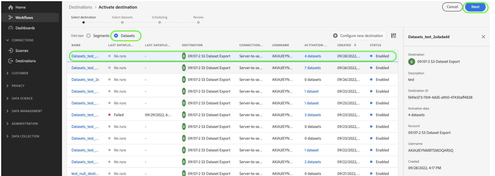

# Exportera datauppsättningar till molnlagringsplatser {#export-datasets}

Med Journey Optimizer kan du upprätta en direktanslutning till molnlagringsplatser för att exportera innehållet i dina datauppsättningar.

Genom att exportera dina data regelbundet kan ni säkerställa att ni har en fullständig och aktuell förteckning över era kundinteraktioner, så att de blir tillgängliga för rapportering, arkivering eller dataanalys.

## Tillgängliga molnlagringsdestinationer {#destinations}

Du kan exportera datauppsättningar till sex molnlagringsmål som är tillgängliga på menyn **[!UICONTROL Destinations]** på fliken **[!UICONTROL Catalog]**.

Mer information om respektive mål finns i Adobe Experience Platform-dokumentationen:

* [Amazon S3](https://experienceleague.adobe.com/docs/experience-platform/destinations/catalog/cloud-storage/amazon-s3.html?lang=sv-SE){target="_blank"}
* [Azure-blob](https://experienceleague.adobe.com/docs/experience-platform/destinations/catalog/cloud-storage/azure-blob.html?lang=sv-SE){target="_blank"}
* [Azure Data Lake Gen 2](https://experienceleague.adobe.com/docs/experience-platform/destinations/catalog/cloud-storage/adls-gen2.html?lang=sv-SE){target="_blank"}
* [Datalandningszon](https://experienceleague.adobe.com/docs/experience-platform/destinations/catalog/cloud-storage/data-landing-zone.html?lang=sv-SE){target="_blank"}
* [Google Cloud-lagring](https://experienceleague.adobe.com/docs/experience-platform/destinations/catalog/cloud-storage/google-cloud-storage.html?lang=sv-SE){target="_blank"}
* [SFTP](https://experienceleague.adobe.com/docs/experience-platform/destinations/catalog/cloud-storage/sftp.html?lang=sv-SE){target="_blank"}.

## Förhandskrav {#prerequisites}

Om du vill exportera datauppsättningar behöver du de [åtkomstkontrollsbehörigheter](https://experienceleague.adobe.com/docs/experience-platform/access-control/home.html?lang=sv-SE#permissions){target="_blank"} som anges nedan. Läs [åtkomstkontrollsöversikten](https://experienceleague.adobe.com/docs/experience-platform/access-control/ui/overview.html?lang=sv-SE){target="_blank"} eller kontakta produktadministratören för att få den behörighet som krävs.

| Kategori | Behörighet |
|--|--|
| Mål | Hantera och aktivera datauppsättningsmål |
| Datahantering | Visa datauppsättningar |
| Mål | Visa mål |

## Viktiga steg för att exportera datauppsättningar {#main-steps}

De viktigaste stegen för att exportera en datauppsättning till en molnlagringsplats är följande:

Detaljerad information om varje steg finns i [Adobe Experience Platform-dokumentationen](https://experienceleague.adobe.com/docs/experience-platform/destinations/ui/activate/export-datasets.html?lang=sv-SE){target="_blank"}.

1. **Konfigurera molnlagringsmålet**. Om du inte redan har gjort det ansluter du till ett molnlagringsmål från målkatalogen. Lär dig hur du skapar en ny målanslutning i [Adobe Experience Platform-dokumentationen](https://experienceleague.adobe.com/docs/experience-platform/destinations/ui/connect-destination.html?lang=sv-SE#setup){target="_blank"}.

   <!---->

1. **Välj molnlagringsmålet** där du vill exportera datauppsättningarna. Klicka på knappen **[!UICONTROL Export datasets]** på det önskade kortet i målkatalogen och välj den anslutning som ska användas.

   <!---->

   >[!NOTE]
   >
   >Om du använder Adobe Journey Optimizer tillsammans med kundprofiler i realtid, kommer målkorten att visa en **Aktivera**-knapp, så att du kan både exportera datauppsättningar och aktivera målgrupper för det här målet, beroende på vilka behörigheter du har aktiverat.

1. **Markera de datauppsättningar** som du vill exportera till det valda målet. [Läs mer om Journey Optimizer datauppsättningar som kan exporteras](#datasets)

   <!---->

1. **Schemalägg export** av datauppsättningen. Ange när exporten ska börja och med vilken frekvens den ska ske.

   <!---->

1. **Granska och bekräfta exporten** genom att kontrollera sammanfattningen som visas i slutet av konfigurationen.

   <!---->

När exporten är klar, lagras innehållet i datauppsättningen på din molnlagringsplats enligt det schema som du har konfigurerat. [Lär dig verifiera datauppsättningsexporten](https://experienceleague.adobe.com/docs/experience-platform/destinations/ui/activate/export-datasets.html?lang=sv-SE#verify){target="_blank"}.

## Tillgängliga datauppsättningar för export {#datasets}

Förstå vilka Journey Optimizer-datauppsättningar du kan exportera från tabellen nedan.

| Datauppsättning | Beskrivning |
| ------- | ------- | 
| AJO BCC Feedback Event Dataset | AJO BCC Feedback Event Dataset |
| AJO Klassificeringsdatauppsättning | Datauppsättning för inmatning av e-post och push-meddelanden från Journey Optimizer. Skapat via SDK. |
| Datamängd för tjänsten AJO Consent | Lagrar information om samtycke för en profil. |
| AJO Experience Event-datauppsättning för e-postspårning | Interaktionsloggar för e-postkanal som används för att skapa rapporter och målgrupper.  |
| AJO Entity Dataset | Datauppsättning som lagrar entitetsmetadata för meddelanden som skickas till slutanvändaren.  |
| Inkommande aktivitetshändelsedatauppsättning för AJO | Datauppsättning för Journey Optimizer web- och inApp-kanaler för leverans- och interaktionshändelser. |
| AJO Interactive Messaging Profile - datauppsättning | Lagrar profiler som skapats för stöd för API-utlösta kampanjer |
| AJO Message Feedback Event Dataset | Meddelandeleveransloggar. Information om alla mejl från Journey Optimizer för rapportering och målgruppsframställning. Feedback från e-postleverantörer om studsar registreras också i den här datauppsättningen. Den här datauppsättningen innehåller händelser för alla kanaler: e-post, SMS/MMS, direktreklam osv. |
| AJO Profile Counters Extension | Innehåller en karta över objekt som innehåller counter_value och expirationDate, transparenta av counter_id |
| AJO Push Profile DataSet | Lagrar push-tokens för en profil. |
| AJO Push Tracking Experience, händelsedatauppsättning | Interaktionsloggar för push-kanal som används för att skapa rapporter och målgrupper.  |
| AJO Surfaces Dataset | Tom datamängd som är relaterad till schemat för inkommande Journey Optimizer-ytor |
| AOOutputForUPSDataset | Innehåller alla AO-målgruppsmedlemskap som ska skrivas tillbaka till tjänsten för enhetlig profil |
| Profildatauppsättning för målgruppssamordning | Genereras efter målgruppssammansättning för målgrupper med målgruppssammansättning. Innehåller alla målgrupper, deras attribut och berikande data |
| Repositionen för beslutsobjekt - aktiviteter | kallas även beslut i användargränssnittet. Men det här är de objekt en användare skapar som sammanför alla byggstenar, inklusive beslutslogiken. Exempel: för en viss placering (plats), som erbjudanden ska beaktas (erbjudandesamling) och vilken rangordningsmetod som ska användas för dessa erbjudanden. |
| Beslutsobjektarkiv - reserverbjudanden | detta är databasen för den andra typen av erbjudande som en användare skapar. I synnerhet om de inte är berättigade att se ett personaliserat erbjudande och behöver se något, kommer de åtminstone att se reserverbjudandet. Den här datauppsättningen innehåller attributen för den här typen av erbjudande |
| Repository - Personalized offers | Databas för en typ av erbjudande som en användare skapar. Den här datauppsättningen innehåller attribut om den här typen av erbjudande. |
| Beslutsobjektsdatabas - placeringar | Databasera objekt som definierar var ett erbjudande ska visas. |
| Objektarkiv för Experience Decision - personaliserade erbjudanden | Lagrar alla erbjudandeartiklar, inklusive alla attribut och livscykelstatus som stöd för kanalövergripande personalisering och rapportering.   När nya anpassade attributfält har lagts till i erbjudandeobjektschemat kan det uppstå en fördröjning på upp till en timme innan dessa nya attribut visas i datauppsättningen. För att undvika eventuella dataförluster eller inkonsekvenser bör du vänta minst en timme innan du gör några ändringar eller uppdateringar som är beroende av de nya attributen. |
| Resestegshändelser | Hämtar alla händelser av typen&quot;Journey Step Experience&quot; som genererats från Journey Optimizer och som ska användas av tjänster som Reporting. |
| Resor | Inhysningsinformation för metadatadatauppsättning för varje steg i en resa |
| ODE-beslutHändelser - preliminär beslut | När vi fattar ett beslut baserat på en begäran räknar vi det som en beslutshändelse |